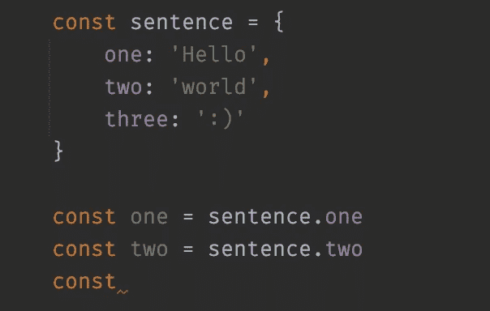
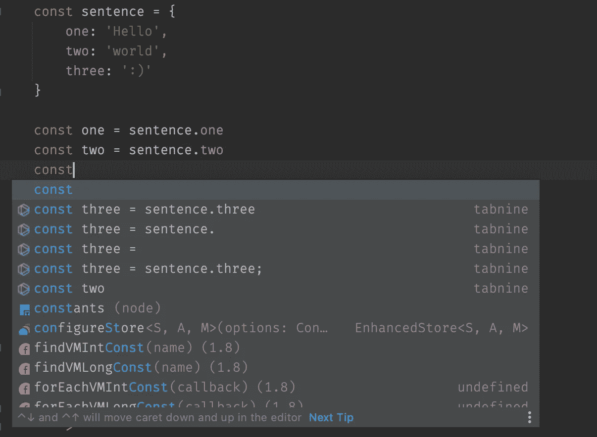
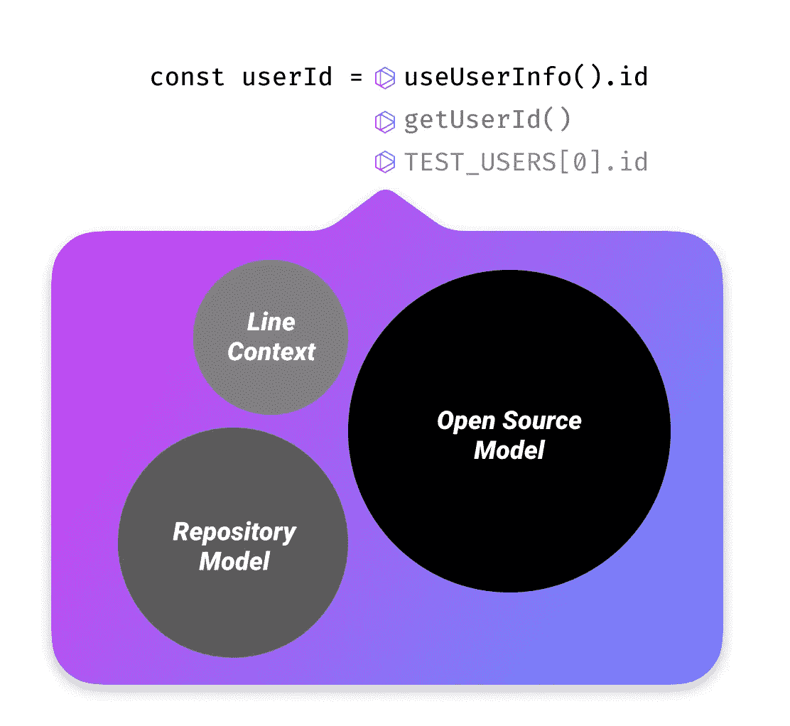
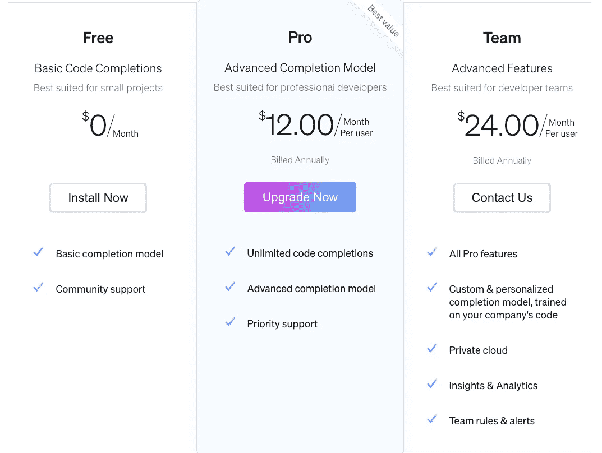

# 我在训练一个人工智能来写我的代码

> 原文：<https://levelup.gitconnected.com/im-training-an-ai-to-write-my-code-1e27c17e1471>

[https://giphy.com/xponentialdesign](https://giphy.com/xponentialdesign)

软件开发很难。程序员应该理解他们正在开发的平台，记住并遵守语法规则，尽可能创建可重用的功能，并响应复杂和不断变化的业务需求。

因此，许多程序员投入时间来优化他们的工具和环境是有道理的。有如此多的技术细节需要管理，任何减少不必要的复杂性或提供更即时的信息访问的东西都可以提高你保持高效*流动状态的机会，所有最好的工作都在这里*。

我对这些小小的优化非常着迷。单独来看，每个键盘快捷键或 IDE 扩展都很小，但是当您将您的设置作为一个整体来看时，其价值是显而易见的。培养一个严密的环境有巨大的价值，在这个环境中，你会感到有能力解决任何问题；电脑和大脑摩擦最小的地方。从这种环境中获得最佳性能有点像是一种爱好，所以我一直在尝试新的工具，淘汰不使用的或无效的工具。

这就是我如何发现 [**Tabnine**](https://www.tabnine.com/) **，**一个编辑器插件，它承诺给你的编码工作流带来人工智能的力量。通过阅读你的代码，学习你的开发风格并分析大量开源代码，Tabnine 声称将代码自动完成的智能提升到了一个新的水平，这(理论上)使你的工作变得更加简单。在过去的一个月里，我一直在测试 Tabnine Pro，所以让我们看看它是否符合宣传。

# 明智的建议

大多数 ide 在编码时会提供建议。这些系统遵循导入和引用来理解哪些属性和方法是可用的。这已经是一个杀手级的特性了，但是它有一些基本的限制。

如果让你猜一猜，你会怎么完成这一行？



接下来会发生什么？

就算你不是开发者，你大概也猜到:
`const three = sentence.three`。我们可以看到一个模式，但是 IDE 看不到。

让我们看看用 Tabnine 会是什么样子。



它知道。

塔布宁认出了这个模式，并给出了一个明智的建议。那么它是如何工作的呢？

# 在后台

Tabnine 告诉我们，人工智能的知识来自三个主要来源:开源代码、对项目的了解以及当前生产线的环境。



引擎盖下的标签

我们之前的例子很简单，只需要 Tabnine 知道这行代码的上下文。然而，因为它也知道关于你的库的一切，它能够从所有的代码库中挑选模式。即使我们知道好的代码具有低重复和尽可能抽象的逻辑，所有的软件都有模式，而这些模式就是 Tabnine 所看到的。

React 钩子就是一个很好的例子。假设我们的应用程序有一个钩子`useCheckout`,它返回结账页面的状态。
按照惯例，你应该这样调用它:`const checkout = useCheckout()`，尽管这不是语言、框架或代码库强制的，但你每次都是这样调用它的。在这种情况下，你一写`const checkout`，Tabnine 就会提出一个`= useCheckout()`的建议。它擅长这样的建议，因为它能看到你项目中的使用模式。

另一个很好的用例是我喜欢称之为“魔术弦”。它们没有被赋值给常量，也不能被导入；你只需要知道什么字符串是有效的。Vuex 的`mapGetters`就是一个很好的例子:

```
...mapGetters([
    'doneTodosCount',
    'anotherGetter',
    // ...
])
```

您的 IDE 不能提供任何自动完成功能，但是只要您打开数组，Tabnine 就会给您一些很好的建议。对于 Redux 的一些更简单的实现也是如此。如果您没有遵循将字符串映射到常量(`const ADD_USER = 'add_user'`)的经典模式，并且没有使用 [Redux Toolkit](https://redux-toolkit.js.org/) ，您可能会像这样分派操作:

```
store.dispatch({ type: 'todo/complete' })
```

同样，您的 IDE 无法推断这些字符串可能是什么。在所有这些情况下，您都可以(也许应该)创建常量，但是在一个大型代码库中按照既定的约定工作的现实通常意味着您需要遵循已经存在的模式，而不是进行一些大范围的重构。

# 另一个月订阅

生活中需要更多包月吗？大概不会，可惜 Tabnine 是商业产品。



拿出你的信用卡

有一个免费层，但该模型将只扫描 100 个源文件，并一次只提出 2 个建议。在我的测试中，我用的是每月 12 美元的专业版，它可以扫描你所有的源文件，一次最多可以给出 5 条建议。

当比较免费版和专业版的体验时，专业版遥遥领先。在自由模式下，这些建议让人觉得很烦，也很不明智，但是专业版的建议不断给我带来惊喜，帮助我在我们庞大的代码库中发现新的功能。

Pro 的另一个主要功能是云完成:一种让你的系统接触专业的深度学习 GPU 以改进建议的服务。默认情况下，这是关闭的，并且有一些很好的理由来解释为什么您可能希望保持这种状态。

有了云完成，你的代码片段被一个远程的、闭源的服务器作为明文读取；一个令人不安的想法。该公司确实做出了所有通常的行业标准安全声明，并承诺立即删除片段，但想象 API 密钥和其他秘密可能会以这种方式泄露也不是不合理的。

因此，在处理商业代码库时，您应该始终禁用云完成，并在自己的工作中谨慎使用它。请记住，代码不一定要在 Git 中才能发送到服务器，所以点文件和密码也可以通过无线方式发送。尽管如此，我并没有注意到在使用这个特性时，建议的质量有明显的提高。也许它可以帮助减轻功能不太强大的机器的负载，但在我的最新型号 MacBook Pro 16 上，它似乎没有明显的效果。

# 生产力升级，还是新的消遣？

[https://giphy.com/goldenwolf/](https://giphy.com/goldenwolf/)

开发人员一直在与噪音作斗争。松散的信息，会议，人们拍你的肩膀，GIFS 嵌入媒体文章；这些事情会妨碍你完成大部分工作。

这是我对在 IDE 中添加 Tabnine 的最大保留:更多的噪音。幸运的是，我没有发现这是一个问题。尽管比平常多了一些建议，但这并不比 IDE 默认情况下所做的更具侵扰性。

因为禁忌建议来自人工智能，它们有时会有点“创造性”。尽管这些建议在语法上总是有效的，但是它们可能包含不存在的函数，或者不在对象上的属性。这总是被你的 linter 捕捉到，但是如果能看到系统在建议到达用户之前做更多的林挺，那就更好了。

另一个恼人的怪癖是，接受 Tabnine 建议并不像 IDE 那样运行自动导入。我想这是因为你的 IDE 一次只会建议和导入一个东西，但是 Tabnine 可能会提供给你一整行需要导入的东西。如果你擅长使用快捷方式，以后自动导入它们并不太难，但是我希望他们将来能解决这个问题。

# 我的 AI 替代品？

训练一个人工智能来做你的工作有点奇怪。显然，它不会理解业务规则，与利益相关者交谈或对范围蔓延做出反应，但是是什么阻碍了人工智能的实现呢？没什么。

开放人工智能已经向我们展示了它能走多远，尽管这只是一个演示，但它似乎是对人工智能增强成为 ide 标准功能的未来的一个很好的了解。

这样看提醒我们代码没什么特别的。这只是我们需要编写的文本，以使其他事情发生，所以为什么不获得一些额外的帮助呢？大多数时候，开发人员的实际工作是理解和设计系统，所以我非常欢迎任何关于繁琐实现的帮助。

就我目前所见，Tabnine 是一个让我的生活变得更容易的工具，并且具有巨大的价值。到目前为止，这些结果让我感到惊讶，因为它们提出了一些“触手可及”的建议，并且经常让我不用进行全局字符串搜索。尽管我不喜欢按月订阅的模式，但我认为 12 美元/月是值得的，尤其是如果你全职编写代码的话。

如果它真的变得有知觉，我，就个人而言，欢迎我们新的人工智能霸主。

