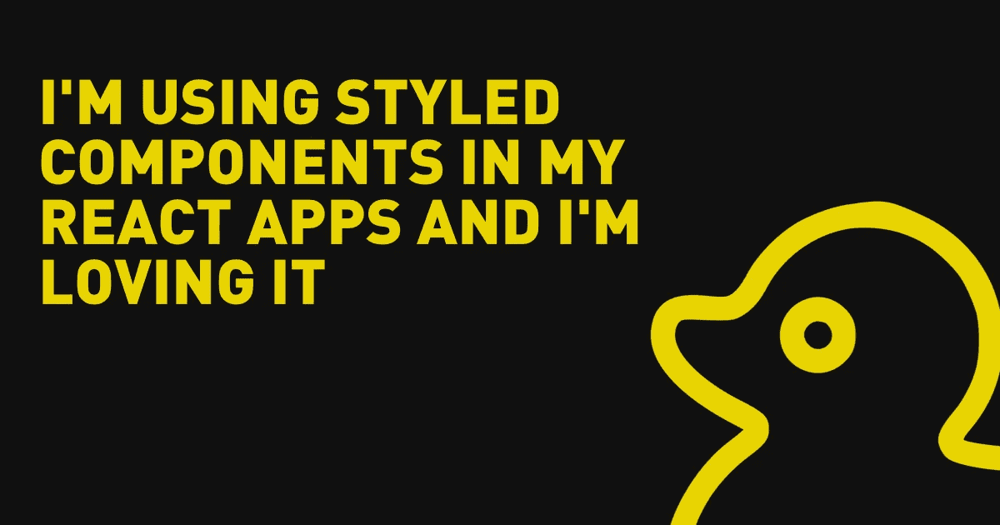

# 我在我的 React 应用中使用了风格化的组件，我很喜欢它

> 原文：<https://levelup.gitconnected.com/im-using-styled-components-in-my-react-apps-and-i-m-loving-it-fbf0cd68abba>



样式组件是 React 应用程序中处理样式的一种流行而强大的方式。使用样式化组件，您可以在组件中创建和重用样式，使您的代码更加模块化和可维护。在这篇博文中，我们将看看如何在 React 应用中使用样式化的组件，并探索一些示例，向您展示它们如何改进您的工作流程。

要在 React 应用程序中使用样式化的组件，首先需要从 npm 安装`styled-components`包。一旦安装好了，就可以从包中导入`styled`函数，并使用它来创建一个样式化的组件。这里有一个例子:

```
import styled from 'styled-components';

const Button = styled.button`
  background-color: red;
  color: white;
  font-size: 16px;
  padding: 8px 12px;
  border-radius: 4px;
  cursor: pointer;

  &:hover {
    background-color: darkred;
  }
`;
```

在这个例子中，我们使用`styled.button`语法创建了一个`Button`组件。这创建了一个新的组件，该组件使用我们在模板文本中定义的样式来呈现一个`button`元素。我们已经在样式中包含了一个`&:hover`伪类来改变按钮悬停时的背景颜色。

使用样式化组件的一个主要优势是它们会自动确定范围，这意味着你不必担心与应用程序中的其他样式发生命名冲突。这使得在你的应用程序中创建和使用多个样式的组件变得容易，而不用担心样式冲突或互相覆盖。

样式化组件的另一个强大特性是可以在样式中使用 JavaScript 表达式和函数。这使您可以创建动态和通用的样式，这些样式可以根据组件中的属性或状态进行更改。这里有一个例子:

```
const Button = styled.button`
  background-color: ${props => (props.primary ? 'blue' : 'red')};
  color: white;
  font-size: 16px;
  padding: 8px 12px;
  border-radius: 4px;
  cursor: pointer;

  &:hover {
    background-color: ${props => (props.primary ? 'darkblue' : 'darkred')};
  }
`;
```

在这个例子中，我们已经添加了一个`primary`道具到我们的`Button`组件中，我们用它来控制按钮的背景颜色。如果`primary`道具是`true`，按钮会有蓝色背景，如果是`false`，按钮会有红色背景。这使得我们可以轻松地创建不同风格的`Button`组件的不同变体。

要在 React 应用程序中使用我们的`Button`组件，我们可以简单地导入它并像其他组件一样呈现它:

```
import Button from './Button';

function App() {
  return (
    <div>
      <Button>Click me!</Button>
      <Button primary>Primary button</Button>
    </div>
  );
}
```

在这个例子中，我们已经导入了我们的`Button`组件，并在我们的`App`组件中渲染了两次。第一个按钮将有一个红色背景和文本“点击我！”，第二个按钮将具有蓝色背景和文本“主按钮”。

总之，[样式化组件](https://styled-components.com/)允许您在组件中创建和重用样式，使您的代码更加模块化和可维护。有了自动作用域，你就不用担心与应用中其他样式的命名冲突了。在您的样式中使用 JavaScript 表达式和函数的能力使它们变得动态和通用。通过在 React 应用程序中使用样式化的组件，您可以改进您的工作流程，并创建更加专业和精致的用户界面。

*要了解我最新的博客文章，请务必在 Twitter 上关注我，地址为*[*@*](https://twitter.com/RubberDuckyTim)*R*[*ubberDuckyTim*](https://twitter.com/RubberDuckyTim)*。我定期分享关于我的新博客帖子的更新，以及有趣的文章和其他与前端开发相关的内容。*

*我也喜欢与我的粉丝互动，倾听他们的想法，所以不要犹豫，伸出手去打招呼吧！我期待在 Twitter 上与您联系。*