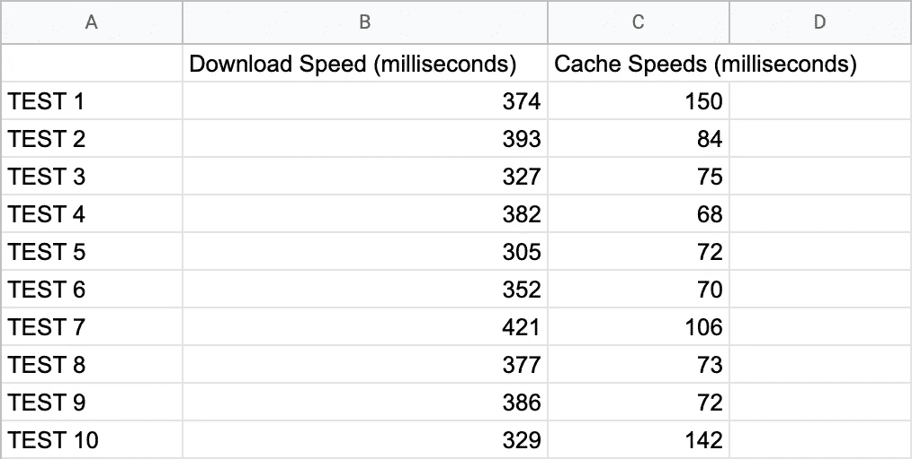

# 使用 URLCache 进行图像缓存

> 原文：<https://levelup.gitconnected.com/image-caching-with-urlcache-4eca5afb543a>

## 使用 URLCache 将图像和其他媒体文件存储到内存或存储中，这是 NSCache 的替代方案。

# 使用 URLCache 进行图像缓存和持久化

令人惊讶的是，关于 URLCache 及其简洁的用例的内容并不多，所以我写了一篇短文介绍它以及它同时处理网络调用和缓存二进制对象的能力。

我将向您展示我如何将图像加载速度提高了 4 倍，并减少了我的应用程序创建的网络调用数量。

我还有点忘乎所以，在本文中写了一点关于区分内存和磁盘存储的内容，供可能不熟悉这个主题的人参考。

然而，您可能不需要太担心，因为 URLCache 会处理这两个位置的缓存！

在本文结束时，您将:

*   将学习如何使用 URLCache 来缓存和持久化二进制对象(如图像、音频文件等。)来自网络通话。
*   (可选)可以深入了解内存与存储以及它们在移动开发中各自的角色。

我试图从一个 API 中缓存背景图片，这样我就不用每次启动应用程序时都下载它们了。如果应用程序被重新打开，如果图像仍然与我的应用程序中写的条件相关，那么它将从缓存中加载。例如，在我正在编写的一个天气应用程序中，如果图像不再符合某个地方的天气条件，它就必须改变。

构建这个功能使我走上了一条(错误地，但愉快地)学习 NSCache 的道路，学习内存、存储、RAM 和 HDD，然后找到我的 URLCache 解决方案(然后在意识到关于它的写作是多么稀缺之后写这篇文章)。

# NSCache 带来的有趣意外

我相信我们大多数人都曾在某个时候接触过 NSCache。这是一个字典式的集合结构，存储键值对来排列数据。然而，一旦资源变得有限，它就引导出数据。你可以告诉我这绝对不是我使用的最理想的工具。

点击阅读更多关于 NSCache [的信息。](https://developer.apple.com/documentation/foundation/nscache)

虽然它的使用可能看起来很脆弱或有限，但它实际上非常适合处理 iOS 应用程序的基本功能——ui table views 和 UICollectionViews。

NSCache 非常适合需要快速缓存和重用单元格内容的 UITableViews 和 UICollectionViews。为这些单元存储的数据由 NSCache 保存，ns cache 将数据存储在内存中，因此 RAM 很容易访问这些数据。如果你的用户在你的应用中上下滚动，这就很方便了。你可以从这个[这里](https://medium.com/flawless-app-stories/reusable-image-cache-in-swift-9b90eb338e8d)阅读更多关于 NSCache 及其在图像缓存中的使用案例。

这对速度来说是理想的，但它缺乏持久性，因为 RAM 中的内容在关闭设备或关闭应用程序时会终止。

我需要提供磁盘缓存的东西，这样我就可以持久保存这些图像。

***内存中与磁盘上***

应用程序存储在手机的随机存储器中。需要持久保存的数据，以及在应用程序和手机重启后仍然存在的数据，需要保存在磁盘空间中。磁盘空间又被称为*存储*和*硬盘*。

驱动器的优点是，与内存相比，它们可以存储更多的数据，是二进制对象(图像、音频文件等)等大文件的理想选择。缺点是它们比 RAM 慢得多。

相比之下，RAM 比驱动器更快，但相比之下存储容量更少。

RAM 是在 UICollectionView 或 UITableView 中存储图像等资产的理想选择，这样就可以重用它们，而不必在应用程序中进行几十次网络调用。

该驱动器最适合存储单个用户会话之外的图像。这对于用户将图像保存到图库或保存语音备忘录这样的用例来说是很好的。

这应该是理解手头问题的足够的上下文，并且知道这一点很好，因为 URLCache 缓存了这两者！

## 代码！

这个教程项目的核心在于 ImageRepository。下面的协议声明了 ImageRepository 的核心功能。协议是为一个类奠定主要功能和基础的好方法。

**图像库**的主要功能描述如下:

**图像库**负责处理与图像相关的动作。

如果' *Promise* 看起来很陌生——不要担心。它只是我在这里使用的一个异步库。如果你想要的是与 Combine 或 Rx 相比中等重量的东西，我强烈建议你看看 [PromiseKit](https://github.com/mxcl/PromiseKit) 。它保养得很好，很可靠。

这是完整的图像库。

让我一点一点地把它分解。

**getImage** 将决定我们是否应该从网络调用或缓存中获取图像。

**downloadImage** 提供了一个 UIImage，它必须根据我们从 dataTask 收到的数据进行初始化。

dataTask 确保有数据，然后以一个 [CachedURLResponse](https://developer.apple.com/documentation/foundation/cachedurlresponse) 的格式存储它。CachedURLResponse 对象存储在内存和存储缓存中，为了满足该函数的需要，我们提供了一个 UIImage，它必须根据我们收到的数据进行初始化。

在第 9 行，我们保存 cachedData 并将其对应到一个 url 请求。

**loadImageFromCache** 主要返回与指定 url 请求相对应的缓存 URL 响应。

我们通过请求找出数据，然后用检索到的数据初始化一个 UIImage。

## 缓存到驱动器时出现警告

苹果确实警告说，如果你的设备存储空间不足，URLCache 可能会清除你的数据——与 NSCache 相同。

此外，要小心保存敏感信息(如用户信息、地址等。)到磁盘上，因为它不安全。

我对加密还不是很了解，所以我不会在这篇文章的范围内讨论它。

# 奖金！内存和存储之间的速度检查。

在完整的教程项目中，ViewController 保存了一些代码，打印出 downloadImage 和 loadImageFromCache 完成所需的毫秒数。

当我运行 10 个测试来比较平均值时，我发现从内存中检索数据比从存储器中检索数据快 4 倍。

我们都知道会是这种情况，但我认为这将是有趣的。

平均下载速度:364 毫秒

平均缓存速度:91 毫秒

**平均快 4 倍。**

以下是完整项目的链接:[https://github.com/baruma/CacheImageToDisk-Tutorial](https://github.com/baruma/CacheImageToDisk-Tutorial)

# 结论！

我希望这篇文章能提供一些信息，或者至少对 URLCache 进行了一些扩展，让更多不熟悉它的人了解它！

# **我在学习中使用的内容:**

*   [https://medium . com/@ master 13 ust/to-ns cache-or-not-to-ns cache-what-the-URL cache-35 A0 C3 b 02598](https://medium.com/@master13sust/to-nscache-or-not-to-nscache-what-is-the-urlcache-35a0c3b02598)
*   [https://medium . com/flashly-app-stories/reusable-image-cache-in-swift-9b 90 EB 338 E8 d](https://medium.com/flawless-app-stories/reusable-image-cache-in-swift-9b90eb338e8d)
*   [https://medium . com/swift 2 go/swift bits-caching-images-9de 11d 034924](https://medium.com/swift2go/swiftbits-caching-images-9de11d034924)
*   [https://www.backblaze.com/blog/whats-diff-ram-vs-storage/](https://www.backblaze.com/blog/whats-diff-ram-vs-storage/)