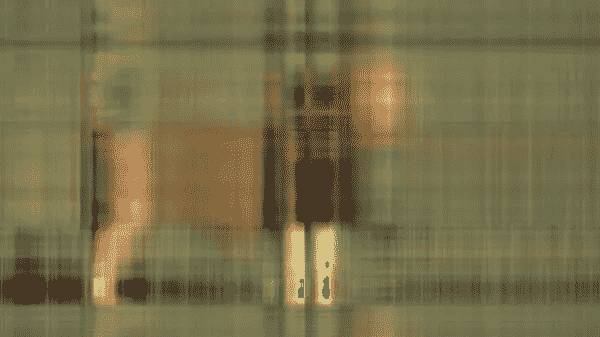
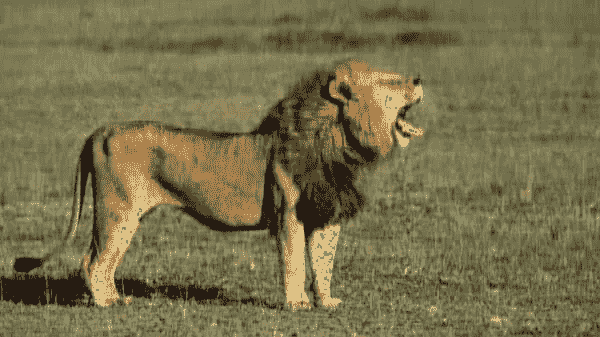
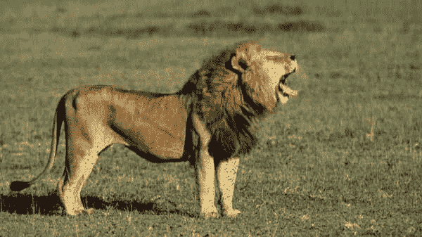
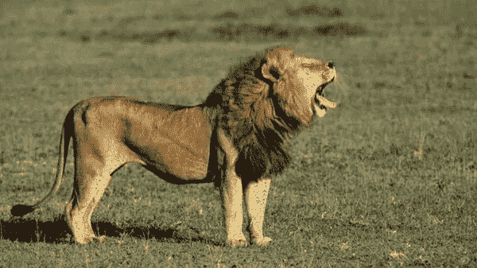
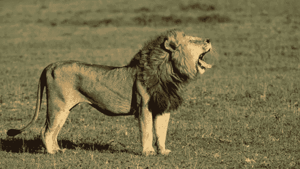
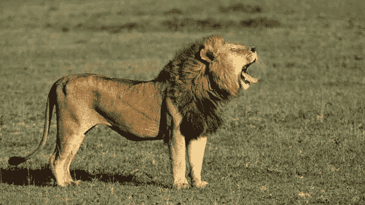
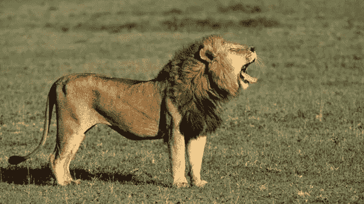

# 基于奇异值分解和 R 的图像压缩

> 原文：<https://levelup.gitconnected.com/image-compression-with-singular-value-decomposition-545e14626509>


利用奇异值分解的图像压缩方法基于这样的思想，即如果 SVD 已知，则一些奇异值σ是重要的，而其他奇异值较小且不重要。因此，如果保留有效值而丢弃小值，则仅使用对应于奇异值的列`U`和`V`。我们将在下面的例子中看到，随着越来越多的奇异值被保留，与原始图像相比，质量和表示得到了改善。

利用[奇异值分解](https://aaronschlegel.me/singular-value-decomposition-r.html)的图像压缩是该方法经常出现的应用。图像被视为具有相应颜色值的像素矩阵，并被分解成仅保留组成图像的基本信息的较小等级。在这个例子中，我们感兴趣的是将下面 600x337 的狮子图像压缩成图片的实值表示，这将产生更小的图像文件大小。

# 基于奇异值分解的图像压缩

jpeg 包[提供了方便的读写功能。jpeg 文件，我们将需要把狮子的形象变成一个矩阵。](https://cran.r-project.org/web/packages/jpeg/jpeg.pdf)

```
library(jpeg)
```

`readJPEG`函数用于将图像转换成矩阵表示。

```
lion <- readJPEG('lion.jpg')
ncol(lion)## [1] 600nrow(lion)## [1] 337
```

该函数的输出给我们一个 337 行 600 列的三个矩阵的数组，大小与图像相同。每个矩阵代表一个包括 RGB 色标的颜色值。要对这些矩阵执行 SVD，请将数组分成单独的对象。

```
r <- lion[,,1]
g <- lion[,,2]
b <- lion[,,3]
```

然后，对代表各个 RGB 颜色值的提取矩阵执行 SVD。

```
lion.r.svd <- svd(r)
lion.g.svd <- svd(g)
lion.b.svd <- svd(b)
```

将结果收集到一个列表中，我们将使用它来重建原始图像。

```
rgb.svds <- list(lion.r.svd, lion.g.svd, lion.b.svd)
```

利用为 RGB 颜色值矩阵计算的奇异值分解，我们可以得到结果矩阵分解并重建原始矩阵(图像)。

正如本文开头提到的，我们保留的更重要的奇异值会导致原始矩阵的更精确的近似。我们可以在下面的实践中看到这一点。下面的代码获取每个分解的颜色值矩阵，并重新构建颜色值数组，该数组包含原始的 lion 图像，并且等级递增。该循环将使用从等级 3 到等级 300 的八个不同等级值来近似原始图像。`jpeg`包中的`writeJPEG()`函数获取近似的颜色值数组，并将其写入. jpeg 文件

```
for (j in seq.int(3, round(nrow(lion), -2), length.out = 8)) {
  a <- sapply(rgb.svds, function(i) {
    lion.compress <- i$u[,1:j] %*% diag(i$d[1:j]) %*% t(i$v[,1:j])
  }, simplify = 'array')

  writeJPEG(a, paste('compressed/lion_compressed', '_svd_rank_', round(j,0), '.jpg', sep=''))
}
```

排名 3



由于只剩下三个奇异值，结果图像保留了非常少的原始图像的特征。

排名 45



仅在第 45 级，结果图像更能代表原始图像。

排名 88



排名 130



排名 173


排名 215



排名 258



在等级 300 时，产生的压缩图像与原始图像相比几乎无法辨认(至少对我来说)。

排名 300



然后，我们可以通过找到压缩图像和原始图像的百分比差来了解 SVD 对图像的压缩程度。

```
original <- file.info('lion.jpg')$size / 1000
imgs <- dir('compressed/')

for (i in imgs) {
  full.path <- paste('compressed/', i, sep='')
  print(paste(i, ' size: ', file.info(full.path)$size / 1000, ' original: ', original, ' % diff: ', round((file.info(full.path)$size / 1000 - original) / original, 2) * 100, '%', sep = ''))
}## [1] "lion_compressed_svd_rank_130.jpg size: 36.608 original: 52.05 % diff: -30%"
## [1] "lion_compressed_svd_rank_173.jpg size: 37.144 original: 52.05 % diff: -29%"
## [1] "lion_compressed_svd_rank_215.jpg size: 37.559 original: 52.05 % diff: -28%"
## [1] "lion_compressed_svd_rank_258.jpg size: 37.613 original: 52.05 % diff: -28%"
## [1] "lion_compressed_svd_rank_3.jpg size: 15.732 original: 52.05 % diff: -70%"
## [1] "lion_compressed_svd_rank_300.jpg size: 37.621 original: 52.05 % diff: -28%"
## [1] "lion_compressed_svd_rank_45.jpg size: 31.422 original: 52.05 % diff: -40%"
## [1] "lion_compressed_svd_rank_88.jpg size: 35.266 original: 52.05 % diff: -32%"
```

与 52.05KB 的原始图像大小相比，rank 300 图像的文件大小为 37.62KB，文件大小减小了 28%。我们可以看到文件大小的差异很快收敛到-28%左右，这可能表明进一步的排序不会导致更有效的压缩比。

# 摘要

下面的帖子是一个奇异值分解图像压缩的例子，这是该方法在现实世界中的典型应用。商业图像压缩解决方案使用比这里描述的更健壮的方法；然而，我希望它能作为幂矩阵分解方法的一个很好的例子，比如奇异值分解在现实世界中的应用。