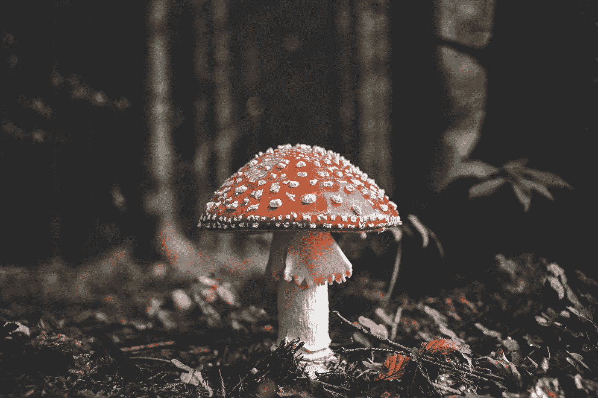
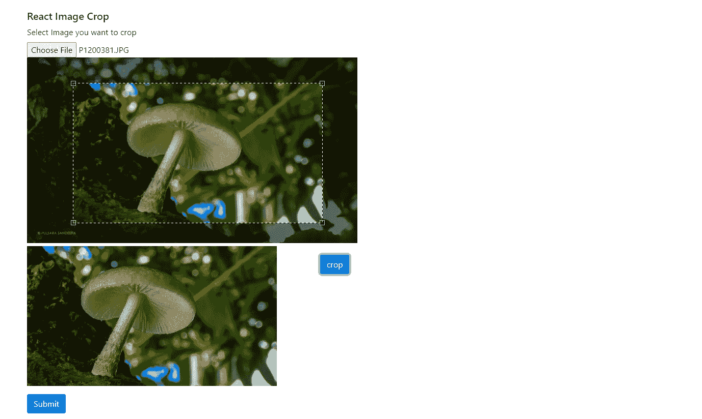

# 使用 ReactJS 进行图像裁剪

> 原文：<https://levelup.gitconnected.com/image-crop-using-react-js-37e10208c572>



照片由 [Florian van Duyn](https://unsplash.com/@flovayn?utm_source=medium&utm_medium=referral) 在 [Unsplash](https://unsplash.com?utm_source=medium&utm_medium=referral) 上拍摄

构建 web 应用程序时，最具挑战性的事情之一是使用输入框插入图像，并根据给定的纵横比裁剪它们。所以通过阅读这篇文章，你可以在开发一个 web 项目时解决上面提到的这些麻烦。让我们开始吧。🎊

# 步骤 1:创建一个 React JS 应用程序

您需要在您的机器上安装`Node >= 10.16`和 `npm >= 5.6`来创建一个 react 项目。

使用以下命令在您最喜欢的 IDE 中创建一个 react 应用程序并运行。

选择您喜欢的应用程序名称。`npx create-react-app <application-name>`

```
npx create-react-app image-crop
cd image-crop
npm start
```

我在这个项目中使用了 react-bootstrap，所以我安装了 react-bootstrap，

`npm i bootstrap react-bootstrap`

# **步骤 2:从输入选择中添加图像**

让我们为此创建一个表单。取一个输入标签，将类型指定为 file，并接受如下所有图像文件类型。

文件 01:初始设置

我在下面添加了一些`css`，你可以根据自己的喜好设计你的应用程序。

文件 02:初始设置样式

然后，当用户选择图像时，我们必须通过处理 on-change 事件来保存图像的 URL。

```
const *[srcImg*, setSrcImg*]* = useState*(*null*)*;

const handleImage = async *(*event*)* => *{* setSrcImg*(****URL***.createObjectURL*(*event.target.files*[*0*]))*;
    ***console***.log*(*event.target.files*[*0*])*;
*}*;

return *(
.
.
.
<*input
    type="file"
    accept="image/*"
    onChange=*{*handleImage*}
/>
.
.
.*
```

## `**URL.createObjectURL()**`

静态方法`**URL.createObjectURL()**`创建一个`[DOMString](https://developer.mozilla.org/en-US/docs/Web/API/DOMString)`，其中包含一个 URL，表示参数中给定的对象。简单地说，它为给定的对象创建一个 URL。

来源:[URL . createobjecturl()—Web API | MDN(mozilla.org)](https://developer.mozilla.org/en-US/docs/Web/API/URL/createObjectURL)

# 步骤 3:裁剪图像

这是本文的主要任务。为此，我使用了[反应-图像-裁剪-NPM(npmjs.com)](https://www.npmjs.com/package/react-image-crop)软件包。它易于使用，并启用了许多功能。

## 包装的特点

*   响应性(可以使用像素或百分比)。
*   触摸启用。
*   自由形态或固定形态作物。
*   支持轻推选择的键盘。
*   无依赖性/占用空间小(5KB gzip)。
*   最小/最大作物尺寸。

## 让我们继续前进🎉

首先安装`npm`包。

```
npm i react-image-crop
```

安装后从包中导入 ReactCrop 组件。

```
import ReactCrop from 'react-image-crop';
```

不要忘记包括`dist/ReactCrop.css`或`ReactCrop.scss`。如果您忘记包含此文件，裁剪工具将不起作用。

```
import 'react-image-crop/dist/ReactCrop.css';
//or
import 'react-image-crop/lib/ReactCrop.scss';
```

之后，您可以创建另外三个状态用于裁剪。

```
//save the image that used to be crop
const *[*image, setImage*]* = useState*(*null*)*;//change the aspect ratio of crop tool as you preferred
const *[*crop, setCrop*]* = useState*({*aspect:16/9*})*;//save the resulted image
const *[*result,setResult*]* = useState*(*null*)*;
```

然后你可以把道具传入导入的`ReactCrop` 组件，如下图。

```
 *<*div*>
  <*input
      type="file"
      accept="image/*"
      onChange=*{*handleImage*}
  />
</*div*>**<*div*>
    {s*rcImg && *(
        <*div*>
            <*ReactCrop
                style=*{{* maxWidth: "50%" *}}* src=*{s*rcImg*}* onImageLoaded=*{*setImage*}* crop=*{*crop*}* onChange=*{*setCrop*}
            />
            <*Button
            *>* crop
            *</*Button*>
        </*div*>
    )}
</*div*>*
```

## onImageLoaded(图像)(可选)

这是一个当图像被加载时触发的回调。
处理像素时，根据尺寸裁剪图像的理想选择。

## 让我们实现裁剪功能:

```
const getCroppedImg = async *()* => *{* try *{* const canvas = ***document***.createElement*(*"canvas"*)*;
        const scaleX = image.naturalWidth / image.width;
        const scaleY = image.naturalHeight / image.height;
        canvas.width = crop.width;
        canvas.height = crop.height;
        const ctx = canvas.getContext*(*"2d"*)*;
        ctx.drawImage*(* image,
            crop.x * scaleX,
            crop.y * scaleY,
            crop.width * scaleX,
            crop.height * scaleY,
            0,
            0,
            crop.width,
            crop.height
        *)*;

        const base64Image = canvas.toDataURL*(*"image/jpeg", 1*)*;

        setResult*(*base64Image*)*;

    *}* catch *(*e*) {* ***console***.log*(*"crop the image"*)*;
    *}
}*;return *(
.
.
.
<*Button onClick=*{*getCroppedImg*}>* crop
*</*Button*>
.
.
.*
```

我们正在使用`toDataURL('image/jpeg')`，否则它将默认为`image/png`，转换将明显变慢。

图像被成功裁剪。现在我们可以在提交表单时将它保存在服务器上。🎉

下面是最终的`App.js`的样子，

文件 03:最终图像裁剪应用

文件 04:最终样式表



图 01:结果应用

# 结论

React Image Crop 是一个优秀的软件包，可用于多种媒体转换。也实践这些转换，这样它们会对你未来的项目有所帮助。我希望这篇文章能帮助你理解图像裁剪。让我们很快见到另一篇有趣的文章。

谢谢你看了我的文章，祝你学习愉快🙌😊

# 资源

[URL . createobjecturl()—Web API | MDN(mozilla.org)](https://developer.mozilla.org/en-US/docs/Web/API/URL/createObjectURL)

[创建一个新的 React 应用程序—React(reactjs.org)](https://reactjs.org/docs/create-a-new-react-app.html)

## 了解更多信息

[反应-图像-裁剪-国家预防机制(npmjs.com)](https://www.npmjs.com/package/react-image-crop)