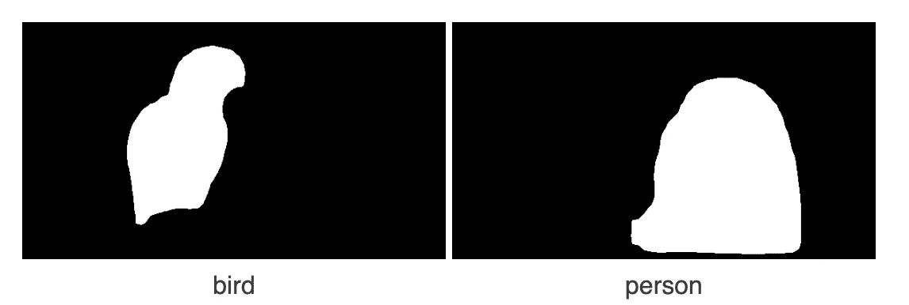

# 基于 Python 和深度学习的图像提取

> 原文：<https://levelup.gitconnected.com/image-extraction-via-python-and-deep-learning-27b928830955>

你想要一种简单的方法从照片中提取感兴趣的区域吗？例如，给出这样一张照片:


如果有一个人工智能工具可以自动识别鹦鹉和灵长类动物，然后提取如下的个人图像，那就太酷了:


如果这个工具能够以合理的速度批量提取，那就更酷了。有了这样的技术，浏览大型图像目录、自动对其内容进行分类并提取匹配的图像片段将是一件简单的事情。

在这个简短的教程中，我将演示如何构建这个工具。它会在一幅图像中找到多达 80 个不同类别的对象，然后有选择地提取它们。

几年前，这还只是科幻小说。但是，正如您将看到的，现在构建它非常简单。鉴于现代人工智能的能力，我们需要的只是一个合适的深度神经网络和 100 行 python 代码。

然后，我们将在该工具上添加一个基本的 web UI，这样任何人都可以尝试一下。

我们开始吧！

对于这个项目，我们将应用 [Mask R-CNN](https://www.analyticsvidhya.com/blog/2019/07/computer-vision-implementing-mask-r-cnn-image-segmentation/%22) 神经网络。截至 2020 年初，该网络在图像识别和分类方面达到了最先进的水平。我们的特定网络是针对 [COCO 数据集](http://cocodataset.org/#home)进行预训练的，这是人工智能图像研究的标准参考数据库。

用技术术语来说，*片段*指的是图像内部感兴趣的区域。Mask R-CNN 被训练来标记它在给定图片中发现的所有片段。例如，在我们的例子中，它返回“鸟”和“人”。然而，我们也可以把网络转过来，提取这个标签中的像素位图。通过这种方式，我们检索了原始图像中组成“鸟”和“人”的所有像素的坐标。

当我们这样做时，这是我们实际上从网络中获取的内容:



这些图像是区域遮罩。在这种情况下，它们定义了一个人和一只鸟的区域。有了这些数据，提取实际的图像片段本身就很简单了。

让我们看看这是如何工作的。这个项目中有两个文件: *segment.py* 和 *extract.py* 。Segment.py 使用遮罩 R-CNN 来生成遮罩位图。然后 Extract.py 使用这些位图实际提取线段。这两个程序可以结合起来，从任意数量的图像中自动提取任意数量的对象。

Segment.py 将遮罩位图存储到临时转换目录中。每个位图有一个文件。每个文件名被格式化以显示根文件名、置信度得分、标签和边界矩形。

例如，下面是编码我们的鹦鹉的掩码文件:

**testimage . 99 . bird . 144 _ 28 _ 172 _ 258 . png**

这意味着对于一只鸟来说，这是一个高置信度(99%)的区域，其边界矩形的原点为 144，28，尺寸为 172x258。

现在我们来看看细节。首先，下面是 segment.py 的主要代码部分:

```
PATH_INPUT_IMAGE = sys.argv[1]
PATH_CONVERSION_DIR = sys.argv[2]

file_name =  os.path.basename(PATH_INPUT_IMAGE).split('.')[0]

# create an inference instance of DNN config object
class InferenceConfig(coco.CocoConfig):
    GPU_COUNT = 1
    IMAGES_PER_GPU = 1
config = InferenceConfig()

# Create model object in inference mode, fold in weights
model=modellib.MaskRCNN(mode="inference", model_dir=MODEL_PATH, config=config)
model.load_weights(MODEL_WEIGHTS_PATH, by_name=True)

# run the model on the input image
image_input = skimage.io.imread(PATH_INPUT_IMAGE)
results = model.detect([image_input], verbose=1)

# unpack all results
result = results[0]
class_ids = result['class_ids']
masks = result['masks'].astype(np.uint8)
scores = result['scores']
rois = result['rois']

#
# for each region identified, 
# get the score, label, dimensions and mask
# modify the mask so that all active pixels are 
# white, with background black
# save the bitmap to the conversion directory
#
regionFileList = []
for index, class_id in enumerate(class_ids):

    region_label=COCO_CLASS_NAMES[class_id].replace(' ', '_')
    score=int(scores[index] * 100)
    (y1, x1, y2, x2)=rois[index] # bounding box for the max
    width=x2 - x1
    height=y2 - y1

    # slice off the bitmap for this object
    bitmap=masks[:,:,index]   

    # make positive mask pixels white
    bitmap[bitmap > 0]=255    

    path_output_image=f'{PATH_CONVERSION_DIR}/m{file_name}.{score}.{region_label}.{x1}_{y1}_{width}_{height}.png'
    image_region=Image.fromarray(bitmap, 'L')
    image_region.save(path_output_image, 'PNG')
    print(path_output_image)

    regionFileList.append(path_output_image)

# lastly, compute the background region 
# (negative of all other regions)
computeBackgroundRegion(file_name, regionFileList)
```

算法很简单。首先，我们用 COCO 权重初始化我们的神经网络。然后，我们将输入图像位图以推理模式输入到网络中。结果是一个标签及其对应位图的数组。这些可以识别神经网络看到的每个图像片段。根据这些数据，我们生成掩模图像并将它们作为文件存储到转换目录中。

一旦这个过程完成，extract.py 就拥有了进行段提取所需的所有信息。

下面是 extract.py 的完整代码清单:

```
import os
import sys
import numpy as np
import cv2# return origin coordinates and dimensions of image 
# (these are encoded in image name)
def getRegionAttributes(image_region): image_region = os.path.basename(image_region)
    (x, y, w, h)  = image_region.split('.')[3].split('_');
    return (int(x), int(y), int(w), int(h)) # extract specified region within image
def extract_region(image, region): extracted_image = np.copy(region)
    rows = region.shape[0]
    cols = region.shape[1]
    for row in range(rows):
        for col in range(cols):
            if region[row, col][0] == 255:
                extracted_image[row, col] = image[row, col]
            else:
                extracted_image[row, col] = (255, 255, 255) return extracted_image if __name__ == '__main__': if len(sys.argv) != 4:
        print('usage: python extract.py path_input_image path_region path_output_image')
        exit() PATH_INPUT_IMAGE = sys.argv[1]
    PATH_REGION = sys.argv[2]
    PATH_OUTPUT_IMAGE = sys.argv[3] image_input = cv2.imread(PATH_INPUT_IMAGE)
    region_input = cv2.imread(PATH_REGION) # extract region, crop it match the region mask 
    (x, y, w, h)=getRegionAttributes(PATH_REGION)
    extracted_image=extract_region(image_input, region_input)
    cropped_extracted_image=extracted_image[y:y+h, x:x+w]
    result_image= v2.resize(cropped_extracted_image, (w, h)) cv2.imwrite(PATH_OUTPUT_IMAGE, result_image);
    print(PATH_OUTPUT_IMAGE)
```

我们将图像的路径、我们希望提取的片段的掩码文件以及输出的路径作为输入。接下来，我们收集掩码的所有属性(如前所述，编码在掩码文件名中)。然后，我们通过有效地将其位图与原始图像进行 and 运算来提取分割区域。最后，我们使用数组切片来裁剪结果，并将其调整到原始尺寸。

这就是:一个提取的图像。

点击这里查看完整的 github 列表。

这段代码即使在速度很慢的计算机上也能很好地运行。例如，在低端市场的 t2.large ec2 实例(无 GPU)上，从典型图像中识别和提取所有片段大约需要 20 秒。

作为最后的奖励，我为这个工具构建了一个简单的 web UI。你可以在这里找到。现在，经过很少的工作，我们有了一个通用的网站，它可以神奇地从图像中识别和提取片段。这就是机器学习的奇迹！