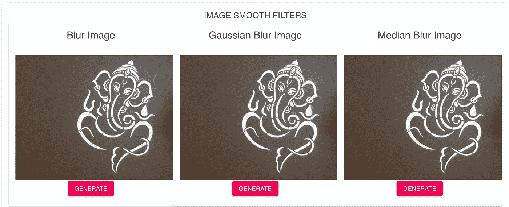
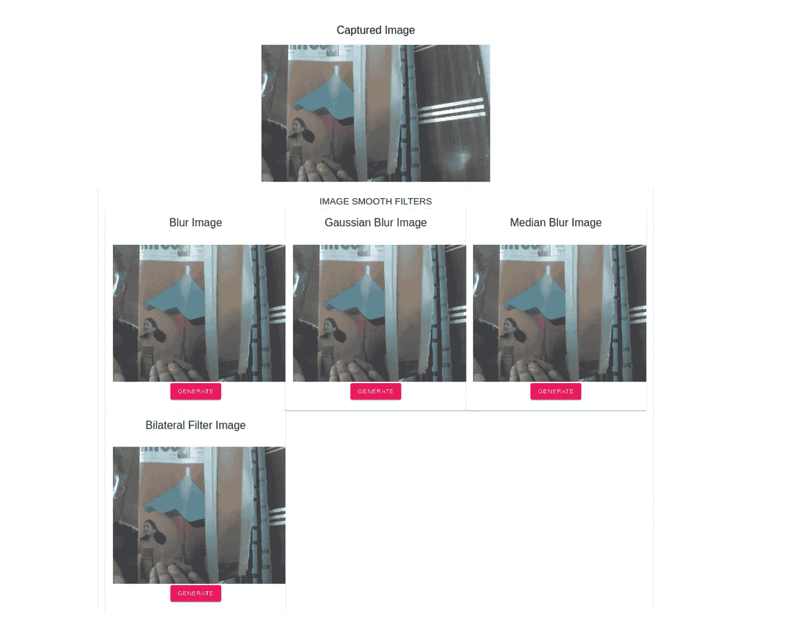
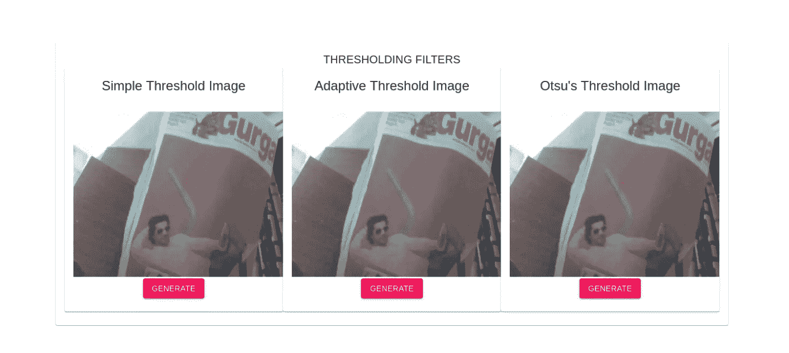
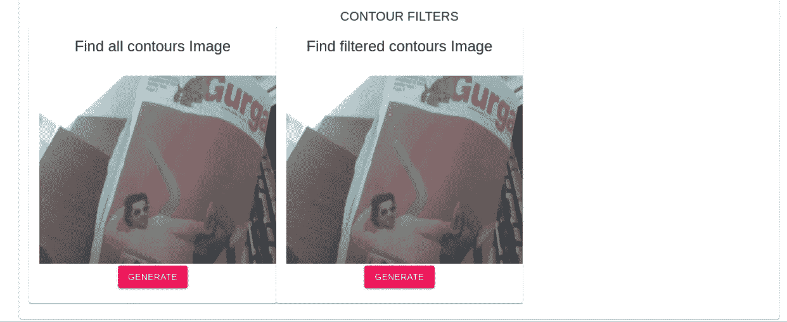
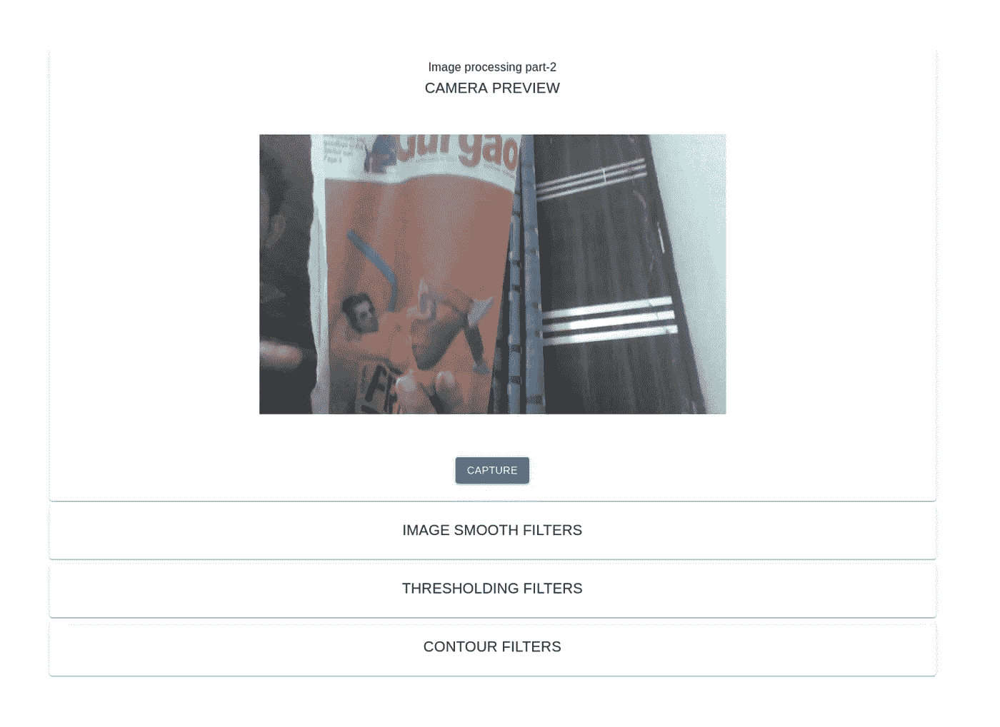

# 图像处理-在 React.js 中制作自定义图像滤镜

> 原文：<https://levelup.gitconnected.com/image-processing-making-custom-image-filters-react-js-part-2-ee2787f56b0d>

感谢阅读我的[第一部](https://overflowjs.com/posts/Image-Processing-In-Reactjs-Part-1.html)。现在准备开始另一个实现。



> *注意:第 1 部分讲述了图像处理的基本原理，然后使用 Cloudniary API 创建了一个小的过滤器应用程序。查看直播 app 点击这里—*[](https://cryptic-sierra-27182.herokuapp.com/)**，阅读博文* [*点击这里*](https://overflowjs.com/posts/Image-Processing-In-Reactjs-Part-1.html) *了解更多。**

*编程中最有趣的事情之一就是用不同的方法解决同一个问题。但是一切都是有代价的。正如我们在本系列的第一部分中使用 Cloudniary 进行图像处理一样，这是一个付费的解决方案，尽管它是一个很好的库。*

*今天，我们将在处理图像时实现一些重要的概念:*

1.  *平滑滤波器(一些滤波器和算法)*
2.  *阈值过滤器*
3.  *在图像中寻找轮廓*

*最后，我们将使用直播摄像机从网络摄像头直播流中捕捉一些图像。*

> **注:这里是 UI 的直播 app 链接(第一次加载可能需要时间)——*[*https://peaceful-reef-69295.herokuapp.com/*](https://peaceful-reef-69295.herokuapp.com/)*和 Github 代码链接——*[*https://Github . com/overflow js-com/image _ app _ image _ processing _ opencvviaweb cam _ part _ 2*](https://github.com/overflowjs-com/image_app_image_processing_opencvviawebcam_part_2)*，欢迎随时查看。**

## *图书馆*

*OpenCV:[https://www.npmjs.com/package/opencv4nodejs](https://www.npmjs.com/package/opencv4nodejs)*

*   *如果你是初学者，这需要时间。建立第三方系统是需要学习的。*

*节点 js:[https://www.npmjs.com/package/opencv4nodejs](https://www.npmjs.com/package/opencv4nodejs)*

*网络摄像头连接器:[https://www.npmjs.com/package/react-webcam](https://www.npmjs.com/package/react-webcam)*

*   *使用网络摄像头包装器的直接实现*

*API 调用库*

*   *我们使用来自 NPM 的同构读取从 React 调用 API*

*前端:反应和材质 UI。要获得更多帮助，请参阅上一篇文章*

*   *[https://material-ui.com/](https://material-ui.com/)*

*API:用 ES6 编写的 Nodejs Express.js 代码，用于 API 和服务器端处理。*

## ***让我们先从用户界面开始***

*我们的目标是从网络摄像头捕捉图像，然后通过我们自己的 API 调用应用过滤器。*

1.  *创建新的 react 应用程序:*

```
*create-react-app image_app_opencvwebcam*
```

*2.进入项目内部并安装依赖项:*

```
*cd image_app_opencvwebcam
npm install @material-ui/core — save
npm install react-webcam — save
npm install — save isomorphic-fetch es6-promise*
```

*3.让我们在`src`文件夹中创建一个`containers, components, utlis`文件夹。容器将包含作为我们主要入口点的`ImageOps.jsx`，组件将包含作为我们可重用组件的`Imagefilter.jsx`和`WebCamCapture.jsx`。`Utils`将使用我们的`Api.js` API 包装器来访问 Node.js 服务器。*

*该目录将如下所示*

```
*image_app_opencvwebcam
├── README.md
├── node_modules
├── package.json
├── .gitignore
├── public
│   ├── favicon.ico
│   ├── index.html
│   └── manifest.json
└── src
    ├── containers
        ├── ImageOps.jsx
    ├── components
        ├── Imagefilter.jsx
        ├── WebCamCapture.jsx
    ├── utils
        ├── Api.js
    ├── App.css
    ├── App.js
    ├── App.test.js
    ├── index.css
    ├── index.js
    ├── logo.svg
    └── serviceWorker.js*
```

*如果你读过我们的第一篇文章，你就会知道我们的 App.js 代码是什么:)*

*让我们检查一下`ImageOps.jsx`渲染代码:*

```
*import React from 'react';import Container from '@material-ui/core/Container';
import Grid from '@material-ui/core/Grid';
import Card from '@material-ui/core/Card';
import CardHeader from '@material-ui/core/CardHeader';
import CardContent from '@material-ui/core/CardContent';
import Typography from '@material-ui/core/Typography';
import WebCamCapture from './Components/WebCamCapture';export default class ImageOpsContainer extends React.Component {

 constructor(props) {
   super(props); this.state ={
     image_data: null
   };
 }saveCapturedImage(data) {
  this.setState({ image_data: data });
}render() {
  return (
    <Container maxWidth="md">
      <Grid container spacing={2}>
        <Grid item xs={12}>
          <Card>
            <CardContent>
               <Typography variant="body" color="textPrimary"   component="p">
                  Image processing part-2
               </Typography>
               <Typography variant="h6" color="textPrimary" component="h6">
                  CAMERA PREVIEW
               </Typography>
               <WebCamCapture saveCapturedImage={(data) =>
               this.saveCapturedImage(data)}/>
            </CardContent>
           </Card>
        </Grid>
      </Grid>
    </Container>
  );
}*
```

*注意:我们已经从@material-ui 模块导入了容器、网格、卡片、卡片内容、版式，并从我们自己的组件`WebCamCapture.jsx`导入了 WebCamCapture*

*顾名思义，WebCamCapture 是用来从相机中捕获图像的，我们还通过`saveCapturedImage`函数作为道具，当我们单击`WebCamCapture`组件中的捕获按钮时，get 会调用这个函数。`saveCapturedImage`功能只是用图像数据设置容器状态。*

```
*saveCapturedImage(data) {
  this.setState({ image_data: data });
}*
```

*现在让我们看看 WebCamCapture 组件，以便更好地了解该组件的工作原理:*

```
*import React from 'react';
import Webcam from 'react-webcam';
import Grid from '[@material](http://twitter.com/material)-ui/core/Grid';
import Button from '[@material](http://twitter.com/material)-ui/core/Button';export default class WebCamCaptureContainer extends React.Component {
    constructor(props) {
        super(props);
        this.state = {
            videoConstants: {
                width: 1200,
                height: 720,
                facingMode: 'user'
            }
        }
    }
    captureImage() {
          this.props.saveCapturedImage(this.refs.webcam.getScreenshot());
    }
    render() {
   return (
     <div>
      <Grid container spacing={1}>
        <Grid item xs={12}>
          <Webcam
            ref="webcam"
            audio={false}
            // height={350}
            screenshotFormat="image/jpeg"
            // width={350}
            videoConstraints={this.state.videoConstants}
            />

        </Grid>
        <Grid item xs={12}>
          <Button variant="contained" align="center" color="primary" onClick={() =>  this.captureImage()} >
            Capture
          </Button>
        </Grid>
      </Grid>
     </div>
   );
    }
}*
```

*这里，我们添加了网络摄像头组件和按钮来捕捉当前图像。两者都在 12 个空格的网格中，这意味着一行中只有一个组件。*

*点击按钮时，我们从网络摄像头捕捉当前图像作为截图，并将其传递给从`ImageOps.jsx`传递来的道具函数`saveCapturedImage`*

> *注意:如果您在理解该材料代码时有困难，请转到—[https://material-ui.com/components/](https://material-ui.com/components/)*

*让我们运行这个项目，通过`npm start`看看到目前为止我们已经构建了什么*

**

*让我们继续过滤和编码他们的用户界面。*

# *平滑过滤器:*

*平滑图像或者我们可以说模糊图像在许多图像操作中非常有用。最大的一个问题是减少图像中的噪声，如果我们创建一个遮罩或进行对象检测/面部检测或处理任何类型的图像，这将非常有用。*

*注:如需了解更多信息，请访问—[https://docs . opencv . org/2.4/doc/tutorials/imgproc/Gaussian _ median _ blur _ bias _ filter/Gaussian _ median _ blur _ bias _ filter . html](https://docs.opencv.org/2.4/doc/tutorials/imgproc/gausian_median_blur_bilateral_filter/gausian_median_blur_bilateral_filter.html)*

*现在在组件内部，我们将创建另一个组件`Imagefilter.jsx`*

```
*import React from 'react';import Grid from '[@material](http://twitter.com/material)-ui/core/Grid';
import Button from '[@material](http://twitter.com/material)-ui/core/Button';
import Typography from '[@material](http://twitter.com/material)-ui/core/Typography';import Card from '[@material](http://twitter.com/material)-ui/core/Card';
import CardContent from '[@material](http://twitter.com/material)-ui/core/CardContent';
import { Divider, CardHeader } from '[@material](http://twitter.com/material)-ui/core';
import {api} from '../Utils/Api';export default class ImageFilters extends React.Component { constructor(props) {
        super(props);

        this.state = {
            smoothing_effects: [
                {label: "Blur", key: "blur"},
                {label: "Gaussian Blur", key: "gaussian_blur"},
                {label: "Median Blur", key: "median_blur"},
                {label: "Bilateral Filter", key: "median_filter"},
            ],
            render: {}
        }
    } applyEffect(effect) {
    api("apply_filter", {
      type: effect,
      data: this.props.image_data
    }).then((data) => {
       const render = this.state.render;
       render[effect] = data;
       this.setState({render});
     });
   } getFilterData(effect) {
     if(this.state.render[effect]) {
       return this.state.render[effect];
     }
     return this.props.image_data;
   } render() { if (!this.props.image_data) {
      return (
        <div/>;
      )
    } return (
            <Grid container>
                {this.state[this.props.type].map((effect, i) => {
                    return (
                        <Grid item md={4} key={i}>
                            <Card>
                              <CardHeader title={`${effect.label}   Image`}>
                                </CardHeader>
                                <CardContent>
                                    
                                    <Button variant="contained" align="center" color="secondary" onClick={() => this.applyEffect(effect.key)} >
                                        Generate
                                    </Button>
                                </CardContent>
                            </Card>
                            <Divider />
                        </Grid>
                     )
                })}
            </Grid>
        )
    }
}*
```

*让我们了解一下代码是怎么回事。*

*这个组件非常简单。我们已经启动了一个网格容器，然后根据道具类型(smoothing _ effects/threshold _ effects/contour _ effects)迭代状态场效应，以生成每个效果卡。*

*对于中型设备来说，卡容器是一个 4 列的网格，而对于较小的设备来说，卡容器占据整个 12 列的空间。现在对于较大的器件，4 列每行将产生 3 列。*

*在渲染时，我们检查捕捉的图像是否可用，如果可用，那么显示要应用的过滤器。*

```
*<Card>
    <CardHeader title={`${effect.label} Image`}>
    </CardHeader>
    <CardContent>
        
        <Button variant="contained" align="center" color="secondary" onClick={() => this.applyEffect(effect.key)} >
            Generate
        </Button>
    </CardContent>
</Card>*
```

*现在我们有了一个图像作为内容和一个按钮来应用过滤器。图像内容来自下面的函数。*

```
*getFilterData(effect) {
    if(this.state.render[effect]) {
        return this.state.render[effect];
    }
  return this.props.data;
}*
```

*如你所见，我们正在检查天气效果是否保存在状态对象中。如果是，那么渲染它，否则只返回原始图像。同样，在点击按钮时，我们从 Api.js 文件中调用一个 API 对象。在 API 对象中，我们传递端点名称和一些必需的参数。成功执行后，我们将设置状态渲染对象，并使用相应的过滤器显示图像:*

```
*applyEffect(effect) {
    api("apply_filter", {
        type: effect,
        data: this.props.image_data
    }).then((data) => {
        const render = this.state.render;
        render[effect] = data;
        this.setState({render});
    });
}*
```

*让我们看看 utils 中的 Api.js 文件*

```
*import fetch from  'isomorphic-fetch';
const BASE_API_URL = "[http://localhost:4000/](http://localhost:4000/)"
return fetch(BASE_API_URL+api_end_point,
    {
        method: 'POST',
        headers: {
            'Content-Type': 'application/json'
        },
        body:JSON.stringify(data)
    }).then((response) => {
        return response.json();
    });
}*
```

*在这里，我们使用来自同构获取模块的获取 API 来调用我们的自定义 API。*

*注意:要阅读更多关于这个模块的内容，请查看[https://github.com/matthew-andrews/isomorphic-fetch](https://github.com/matthew-andrews/isomorphic-fetch)*

*在`ImageOps.jsx`中，我们创建了两个网格*

```
*{this.state.image_data && 
 <Grid item md={12}>
        <CardHeader title={`Captured Image`}>
    </CardHeader>
    
</Grid>}
<Grid item xs={12}>
    <Card>
        <CardContent>
            <Typography variant="h6" color="textPrimary" component="h6">
                IMAGE SMOOTH FILTERS
            </Typography>
            <ImageFilters image_data={this.state.image_data} type="smoothing_effects" />
        </CardContent>
    </Card>
</Grid>*
```

*第一个网格用于显示在我们的状态下对应于 image_data 的捕获图像。第二个网格是 12 列网格，包含 ImageFilters 组件，在 ImageFilters 中，我们传递两个属性数据 image_data 和效果类型。*

**

*我们现在完成了平滑过滤器，让我们为另外两个编写 UI 代码。*

# *阈值过滤器:*

*阈值滤波用于图像分割，可用于信息提取。许多过程使用它来产生和分析二进制过滤器。它赋予每个像素白色或黑色。并且哪个像素将是白色或黑色的决定因素取决于算法。我们将在这里使用其中的一些。*

*对于像从图像中读取数字、识别物体或从图像中读取文本这样的信息提取，所有这些都使用阈值作为一个过程。*

*UI 代码大部分都是相同的，只是有一些状态更新。*

*在我们的`Imagefilter.jsx`组件中，我们将为状态添加阈值效果。*

```
*this.state = {
    smoothing_effects: [
        {label: "Blur", key: "blur"},
        {label: "Gaussian Blur", key: "gaussian_blur"},
        {label: "Median Blur", key: "median_blur"},
        {label: "Bilateral Filter", key: "median_filter"},
    ],
    threshold_effects: [
        {label: "Simple Threshold", key: "simple_threshold"},
        {label: "Adaptive Threshold", key: "adaptive_threshold"},
        {label: "Otsu's Threshold", key: "otasu_threshold"},
    ],
    render: {}
}*
```

*在`ImageOps.jsx`中，我们将为阈值过滤器添加一个新的网格。*

```
*<Grid item xs={12}>
    <Card>
        <CardContent>
            <Typography variant="h6" color="textPrimary" component="h6">
                THRESHOLDING FILTERS
            </Typography>
            <ImageFilters image_data={this.state.image_data} type="threshold_effects" />
        </CardContent>
    </Card>
</Grid>*
```

**

# *查找轮廓:*

*轮廓是在图像中遵循相同颜色或强度的形状上创建边界。我们将创建一个二进制阈值图像生成器，并尝试绘制轮廓(物体周围的边界)，然后在图像上绘制这些边界。它可用于各种过程计数。Ting object 就是其中之一，还有更多。它有助于从一组多个对象中过滤出所需的对象。所以让我们检查一下它的能力。*

*在用户界面层面上，这与我们对阈值过滤器所做的相同，即首先在`Imagefilter.jsx`中添加轮廓的状态*

```
*this.state = {
    smoothing_effects: [
        {label: "Blur", key: "blur"},
        {label: "Gaussian Blur", key: "gaussian_blur"},
        {label: "Median Blur", key: "median_blur"},
        {label: "Bilateral Filter", key: "median_filter"},
    ],
    threshold_effects: [
        {label: "Simple Threshold", key: "simple_threshold"},
        {label: "Adaptive Threshold", key: "adaptive_threshold"},
        {label: "Otsu's Threshold", key: "otasu_threshold"},
    ],
    contour_effects: [
        {label: "Find all contours", key: "find_all_contours"},
        {label: "Find filtered contours", key: "find_filtered_contours"},
    ],
    render: {}
}*
```

*然后在`ImageOps.jsx`中添加网格*

```
*<Grid item xs={12}>
    <Card>
        <CardContent>
            <Typography variant="h6" color="textPrimary" component="h6">
                CONTOUR FILTERS
            </Typography>
            <ImageFilters image_data={this.state.image_data} type="contour_effects" />
        </CardContent>
    </Card>
</Grid>*
```

*这是它看起来的样子*

**

*完整的用户界面，因为该项目将有如下初始外观*

**

*现在我们已经为过滤器实现了整个 UI。现在我们所需要的是应用过滤器的工作 API 端点，看看它的神奇之处。*

*由于这篇文章太长，我们将在图像处理系列的第 3 部分中实现它。我们将在 Node.js 中加入 OpenCV，最后看看一切是如何端到端工作的。所以，g *et yourself 在 https://overflowjs.com/*加入了我们 2500 多人的订阅家庭，请点击本文的分享按钮，与你的同事、朋友和其他人分享。***

*如果您想加入我的电子邮件列表，请考虑在这里输入您的电子邮件地址 和**关注我的**[**medium**](https://medium.com/@ideepak.jsd)**阅读更多关于 javascript 和**[**github**](https://github.com/dg92)**的文章，查看我的疯狂代码**。如果有什么不清楚或者你想指出什么，请在下面评论。*

*你可能也会喜欢我的其他文章*

1.  *[Javascript 执行上下文和提升](/javascript-execution-context-and-hoisting-c2cc4993e37d)*
2.  *[Javascript —生成器-产出/下一个&异步-等待🤔](https://medium.com/datadriveninvestor/javascript-generator-yield-next-async-await-8442d2c77185)*
3.  *[理解 Javascript‘this’关键字(上下文)](https://medium.com/datadriveninvestor/javascript-context-this-keyword-9a78a19d5786)。*
4.  *[带有映射、归约、过滤的 Javascript 数据结构](/write-beautiful-javascript-with-λ-fp-es6-350cd64ab5bf)*
5.  *[Javascript- Currying VS 部分应用](https://medium.com/datadriveninvestor/javascript-currying-vs-partial-application-4db5b2442be8)*
6.  *[Javascript ES6 —可迭代程序和迭代器](https://medium.com/datadriveninvestor/javascript-es6-iterables-and-iterators-de18b54f4d4)*
7.  *[Javascript 性能测试—针对 vs 针对每个 vs (map、reduce、filter、find)。](https://codeburst.io/write-beautiful-javascript-with-%CE%BB-fp-es6-350cd64ab5bf)*
8.  *[Javascript —代理](https://medium.com/datadriveninvestor/why-to-use-javascript-proxy-5cdc69d943e3)*
9.  *[Javascript —作用域](https://medium.com/datadriveninvestor/still-confused-in-js-scopes-f7dae62c16ee)*
10.  *[用 Tensorflow-js 进行图像目标检测🤔](/image-object-detection-with-tensorflow-js-b8861119ed46)*
11.  *[Nodejs app 结构——构建高可扩展性架构。](https://codeburst.io/fractal-a-nodejs-app-structure-for-infinite-scale-d74dda57ee11)*
12.  *[Node.js 10.0.0，作为后端开发者/安全爱好者有什么期待？](https://codeburst.io/node-js-10-0-0-what-to-expect-as-a-backend-developer-security-enthusiast-f8680f132320)*
13.  *[图像处理——在 React.js 中制作自定义图像滤镜](/image-processing-making-custom-image-filters-react-js-part-2-ee2787f56b0d)*
14.  *[谷歌印度面试问题](https://medium.com/@ideepak.jsd/google-india-phone-call-interview-question-software-developer-5a164e97ddeb)*

*查看 [Angular](https://overflowjs.com/tags/angular/posts) 、 [Node.js](https://overflowjs.com/tags/nodejs/posts) 、 [Vue.js](https://overflowjs.com/tags/Vuejs/posts) 上的文章。*

*谢谢大家！*