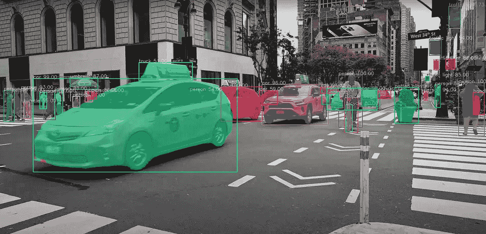
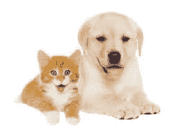
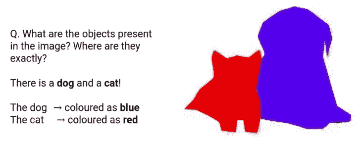
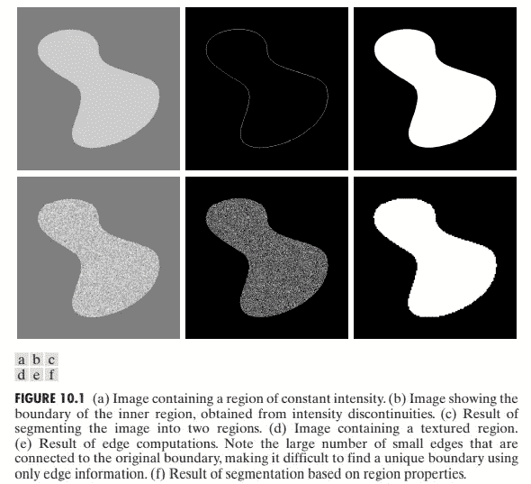
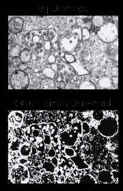
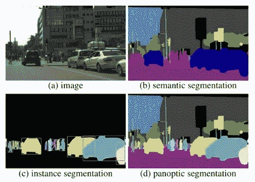

# 图像分割——概述其算法如何识别图像中的对象

> 原文：<https://levelup.gitconnected.com/image-segmentation-an-overview-on-how-its-algorithms-identify-objects-in-an-image-925cdf6bd03>



**目录**

*   介绍
*   图像分割的应用
*   图像分割算法(用 Python 语言实现 Otsu 算法的示例)
*   图像分割的类型
*   尾注

本文将广泛讨论计算机视觉如何使用图像分割来识别图像上的对象。

# 介绍

答几周前，我发现了这个很酷的过滤器，它能把我的嘴放大到实际大小的三倍！我还发现了其他很酷的滤镜——一个给我太阳镜，另一个让我看起来像个蹒跚学步的孩子！这款应用的人工智能如何以非常高的精度定位我身体不同部位在视频中的位置，以相应地替换、添加、编辑或放大它，这难道不神奇吗？这并不神奇——该算法处理了你的实时照片，并成功地将其分割成它可以识别的不同部分/对象。
图像分割是数字图像处理中的一种技术。它包括根据图像像素的特征将图像分割成多个部分或区域的过程。
像素的特征包括它们的值(取决于光线强度，范围从 0 到 255)和颜色。通过寻找相邻像素值中的突然不连续来完成分割，并且该过程由为此目的编写的算法自动执行。存在的分割区域被称为图像对象。和上面的例子一样，我的眼睛，鼻子，嘴巴等等。是图像对象。我们可以说算法的输入是图像，而输出是对象属性。

> 计算机视觉的成败取决于分割时算法的准确性。一旦检测到图像中的感兴趣的对象/区域(无论应用什么都需要),任何算法都应该停止分割。

例如，我们之前讨论的过滤器对面部的物体感兴趣，因此它尽可能多地检测这些物体，而不是检测面部以外的物体。



源图像与分割图像(注意猫的所有像素是如何通过给它们分配不同于狗的像素值来识别的)

# 图像分割的应用

图像分割广泛应用于各种领域，以执行以下任务:

*   计算机/机器视觉
*   医学成像，例如:
    1。定位肿瘤和其他病变
    2。测量组织体积
    3。诊断、解剖结构的研究
    4。手术规划
    5。虚拟手术模拟
    6。手术内导航
*   识别任务，如:
    1。人脸识别
    2。指纹识别
    3。虹膜识别
*   目标检测
*   交通管理系统
*   视频监控
*   自动驾驶系统
*   卫星成像和遥感

# 图像分割算法

图像分割过程由算法执行。多年来已经开发了各种算法，每种算法都使用不同的方法来分割图像。该算法在任务中的性能取决于它分割图像所遵循的过程/路径。因此，某些算法在特定任务中的表现可能比其他算法好得多，反之亦然。以下是基本图像分割算法及其工作原理的列表；

## 基于边缘的图像分割算法

该算法使用的主要方法包括将图像的像素分类为边缘或非边缘像素。基于整个图像中像素值的突然不连续性来检测边缘/边界像素。



图 10.1 (a)、(b)、(c)说明了基于边缘的分割。图 10.1 (a)显示了叠加在较暗背景上的恒定强度区域的图像，也是恒定强度。这两个区域构成了整个图像区域。图 10.1(b)显示了根据强度不连续性计算内部区域边界的结果。边界内侧和外侧的点是黑色的(零)，因为在那些区域中没有不连续的强度。为了分割图像，我们为边界上或边界内部的像素指定一个级别(比如白色)，为边界外部的所有点指定另一个级别(比如黑色)。图 10.1(c)显示了这种程序的结果。我们看到，这一结果满足了本节开头所述的条件(a)至(c)。

## 基于区域的图像分割算法

这种分割是基于一组预定义的标准来完成的。图 10.1 (d)、(e)和(f)说明了基于区域的分割。图 10.1 (d)显示了另一幅图像，一个纹理区域叠加在一个恒定强度的较暗背景上。将基于边缘的方法应用于图像，由于强度的大量虚假(纹理)变化，使得难以识别原始图像的唯一边界，因为许多非零强度变化与边界相关，所以基于边缘的分割不是合适的方法。然而，纹理区域的像素可以聚集在一起，因为它们的值相似，如图 10.1 (f)所示。

基于区域和基于边缘的分割是图像分析中点、线和边缘检测的基础。

## 大津图像分割算法

该算法使用阈值方法来分割图像中的对象。阈值处理过程包括绘制图像上像素分布的直方图，然后根据峰值计算阈值。然后将阈值与图像像素进行比较。如果像素值小于阈值，则像素值被设置为 0(黑色)；如果大于，像素值将设置为 255(白色)。多重阈值处理包括计算一个以上的阈值，然后将每个值与
Otsu 的图像分割进行比较，这是一种自动阈值处理的形式，不适合分析有噪声的图像。这个原理被用于扫描文档、指纹和识别模式。

```
# Otsu's image segmentation in python programming language # importing filesfrom google.colab import filesimport numpy as npimport cv2from matplotlib import pyplot as plt #reading files#The image to be imported is the PHIL ID #23354 (Transmission electron microscopic image of an isolate from the first U.S. case of COVID-19, formerly known as 2019-nCoV. The spherical viral particles, colorized blue, contain cross-section through the viral genome, seen as black dots)img = cv2.imread(r'covid.png')plt.imshow(img)b,g,r = cv2.split(img)rgb_img = cv2.merge([r,g,b])gray = cv2.cvtColor(img,cv2.COLOR_BGR2GRAY)ret, thresh = cv2.threshold(gray,0,255,cv2.THRESH_BINARY_INV+cv2.THRESH_OTSU)# noise removalkernel = np.ones((2,2),np.uint8)# opening = cv2.morphologyEx(thresh,cv2.MORPH_OPEN,kernel, iterations = 2)closing = cv2.morphologyEx(thresh,cv2.MORPH_CLOSE,kernel, iterations = 2)
# sure background areasure_bg = cv2.dilate(closing,kernel,iterations=3)# Finding sure foreground areadist_transform = cv2.distanceTransform(sure_bg,cv2.DIST_L2,3)# Thresholdret, sure_fg = cv2.threshold(dist_transform,0.1*dist_transform.max(),255,0)# Finding unknown regionsure_fg = np.uint8(sure_fg)unknown = cv2.subtract(sure_bg,sure_fg)# Marker labellingret, markers = cv2.connectedComponents(sure_fg)# Add one to all labels so that sure background is not 0, but 1markers = markers+1# Now, mark the region of unknown with zeromarkers[unknown==255] = 0markers = cv2.watershed(img,markers)img[markers == -1] = [255,0,0]plt.subplot(211),plt.imshow(rgb_img)plt.title('Input Image'), plt.xticks([]), plt.yticks([])plt.subplot(212),plt.imshow(thresh, 'gray')plt.imsave(r'thresh.png',thresh)plt.title("Otsu's binary threshold"), plt.xticks([]), plt.yticks([])plt.tight_layout()plt.show()
```

输出:



[菲尔 ID #23354](https://phil.cdc.gov/details.aspx?pid=23354) —病毒是蓝色的小圆环，但在阈值图像中似乎是主要的白点

## 基于聚类的图像分割算法

这种方法使用 K-均值、模糊 C-均值、改进的 K-均值 ML 算法等方法。对图像进行分区。
当使用 K-means 算法时，选择几个 K-点(这可以手动或通过算法自动完成)并分配聚类中心(质心)。然后，计算每个图像像素到质心的距离，并将每个像素分配给距离其最近的质心。然后，通过对聚类中的所有像素进行平均来重新选择新的质心，然后重复将图像像素分配给聚类的过程，直到没有像素改变聚类的点。医学成像使用这种技术来识别图像中的组织类型。

## 可训练的分割算法

上述算法使用像素信息(如颜色和值)来分割不够的图像。然而，像**神经网络**这样的可训练算法可以从标记像素的数据集对基本分割知识进行建模，即它们是从图像中先前识别的对象数据集进行训练的。图像分割神经网络可以处理图像的小区域，以提取简单的特征，如边缘、点、线等。

人工可训练分割算法的例子是掩蔽 R-CNN、脉冲耦合神经网络(PCNN)和更快的 R-CNN。CNN 是一种很好的图像分割方法，但如果数据集很大，它会在训练过程中花费更多时间。基于聚类的分割需要大量的计算时间。基于边缘的分割适用于对象之间具有更好对比度的图像。

# 图像分割的类型

既然我们知道了算法如何分析像素来识别对象，我们可能还需要讨论这些算法处理的不同形式。各种类型包括，

## 语义分割

这个过程将每个像素关联到一个类别，例如，花、道路、汽车等。因此，图像中出现的汽车的所有像素都被分配给类别“汽车”，即公共表示。自动驾驶使用这种类型的图像分割。

## 实例分割

这更进一步，将每个像素表示为图像上的一个实例对象。因此，每个对象都是唯一的对象。实时路标是自动驾驶系统中的分段实例。



在(b)中，所有人都用红色像素标识，所有汽车都用蓝色像素标识。在(c .)中，每个人和汽车具有唯一的像素值表示。(d)是(b)和(c)的组合

## 全景分割

实例和语义分割的结合给出了更多的细节。

## 尾注

简而言之，从智能手机的面部解锁属性开始，到自动驾驶的特斯拉，图像分割技术已经成为我们世界的一部分，因为我们现在在日常生活中广泛使用它来增强自动化和提高智能。本文刚刚讨论了图像分割，这是一种广泛使用的数字图像处理技术。