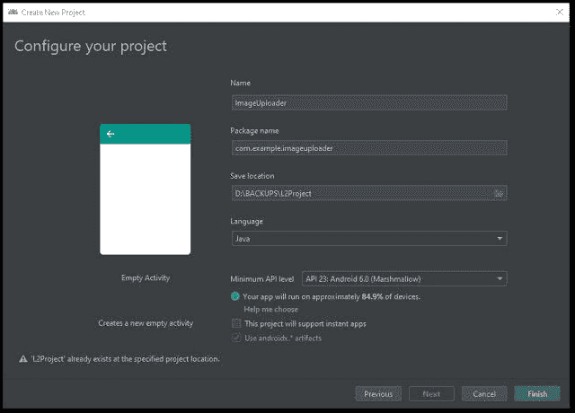
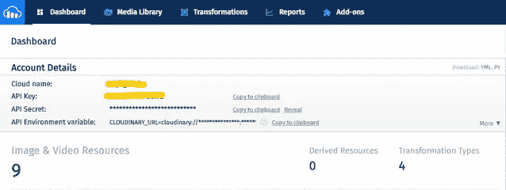

# 使用 Android SDK 将图像上传到 Cloudinary

> 原文：<https://levelup.gitconnected.com/image-upload-to-cloudinary-using-android-sdk-7bbe60204b44>

## 使用 Android SDK 将图像上传到 Cloudinary 的快速指南。


在本文中，我将实现一个示例 android (Java)项目，使用 android SDK 将图像上传到 Cloudinary。

## **什么是云？**

Cloudinary 是一个基于云的图像和视频管理解决方案，用于 web 和移动应用程序，具有图像和视频上传、存储、操作、优化交付的能力。此外，Cloudinary 提供了全面的 API 和管理功能，您可以轻松地将其与您的 web 和移动应用程序集成。

> “Cloudinary 是提供全面的基于云的映像管理解决方案的市场领导者。从小型创业公司到大型企业，世界各地成千上万的 web 和移动应用程序开发人员都在使用 Cloudinary。我们将满足您所有与图像相关的需求。”[来源](https://cloudinary.com/about)

您可以在这里设置一个云账户[。Cloudinary SDK 文档可以在](https://cloudinary.com/users/register/free)[这里](https://cloudinary.com/documentation/android_integration)找到。

## 你会学到什么？

*   从图片库中提取到移动应用程序的图像。
*   请求运行时应用程序权限。
*   上传图片到 Cloudinary。
*   从 Cloudinary 回调图像 URL。

本文介绍了如何从设备图库中获取图像并上传到 Cloudinary。项目的完整代码可以从[这里的](https://github.com/KuWathsala/ImageUploader)中获取。让我们一步一步开始。

**步骤 1。开始一个新的 Android 项目**

项目名称为`*ImageUploader*` *。*



**第二步。添加依赖关系**

需要将 Cloudinary 和 Circle 图像视图库添加到项目`build.gradle`文件中。

```
implementation ‘com.cloudinary:cloudinary-android:1.24.0’implementation ‘de.hdodenhof:circleimageview:3.1.0’
```

**第三步。访问权限**
当应用程序安装到设备上时，它会请求访问您的敏感数据的权限。因此，启用`*AndroidManifest.xml*` 文件中的权限。

```
<uses-permission android:name=”android.permission.INTERNET”/>
<uses-permission android:name=”android.permission.READ_EXTERNAL_STORAGE”/>
```

**第四步。构建布局 activity_main.xml.**

这里，我在 res > drawable 中添加了名为`ic_accout`和`ic_image`的向量资产。

activity_main.xml

**5。ActivityMain.java**

**5.1 Cloudinary 配置**
Cloudinary 必须至少配置您的`*cloud_name*`。此外，还可以定义可选的配置参数。Cloudinary 管理控制台的仪表板中有配置凭据。在这里，我向 HashMap 添加了云名称、API 键和 API 秘密。



云计算管理控制台

在使用 Android 库之前，每个应用程序生命周期调用一次`*MediaManager.init()*`方法，最好是在`*onCreate()*`中。这里使用`*configCloudinary()*`方法来云化二进制配置。

```
public class MainActivity extends AppCompatActivity { private ImageView mProfile;
 private ImageView mImageAdd;
 private Button mBtnUpload;
 private TextView mText; private static final int PERMISSION_CODE = 1;
 private static final int PICK_IMAGE = 1; String filePath;
 Map config = new HashMap(); private void configCloudinary() {
  config.put(“cloud_name”, “cloud_name”);
  config.put(“api_key”, “api_key”);
  config.put(“api_secret”, “api_secret”);
  MediaManager.init(MainActivity.this, config);
 }
}
```

**5.2 从图库中选取一幅图像。**
外部存储的权限是危险权限。因此，当您单击`*imageAdd*`时，设备需要请求访问外部存储器的权限。

```
mImageAdd.setOnClickListener(new View.OnClickListener() {
 [@Override](http://twitter.com/Override)
 public void onClick(View view) {
  //request permission to access external storage
  requestPermission();
 }
});
```

`*ContextCompat.checkSelfPermission()*`在`*requestPermission()*` 方法中，检查 app 是否已经授予权限。

```
private void requestPermission(){
 if(ContextCompat.checkSelfPermission
 (MainActivity.this,
 Manifest.permission.READ_EXTERNAL_STORAGE
 ) == PackageManager.PERMISSION_GRANTED
 ){
  accessTheGallery();
 } else {
  ActivityCompat.requestPermissions(
  MainActivity.this,
  new String[]{Manifest.permission.READ_EXTERNAL_STORAGE},
  PERMISSION_CODE
 );
 }
}[@Override](http://twitter.com/Override)
public void onRequestPermissionsResult(int requestCode, [@NonNull](http://twitter.com/NonNull) String[] permissions, [@NonNull](http://twitter.com/NonNull) int[] grantResults) {
 if(requestCode== PERMISSION_CODE){
 if(grantResults.length>0 && grantResults[0] == PackageManager.PERMISSION_GRANTED) {
 accessTheGallery();
 }else {
 Toast.makeText(MainActivity.this, “permission denied”, Toast.LENGTH_SHORT).show();
 }
 }
}
```

授予权限后，调用`*accessTheGallery()*`。然后将您从图库中选择的图像设置为位图图像。方法`*getRealPathFromUri()*` 采用`*imageUri*` 并返回图像的文件路径(位置)。然后分配给 `*filePath*`。现在，`*filePath*` 有了图像的位置。

```
public void accessTheGallery(){
 Intent i = new Intent(
 Intent.ACTION_PICK,
 android.provider.MediaStore.Images.Media.EXTERNAL_CONTENT_URI
 );
 i.setType(“image/*”);
 startActivityForResult(i, PICK_IMAGE);
}[@Override](http://twitter.com/Override)
protected void onActivityResult(int requestCode, int resultCode, [@Nullable](http://twitter.com/Nullable) Intent data) {
 super.onActivityResult(requestCode, resultCode, data); //get the image’s file location
 filePath = getRealPathFromUri(data.getData(), MainActivity.this); if(requestCode==PICK_IMAGE && resultCode==RESULT_OK){
  try {
   //set picked image to the mProfile
   Bitmap bitmap = MediaStore.Images.Media.getBitmap(
    getContentResolver(),
    data.getData());
   mProfile.setImageBitmap(bitmap);
  } catch (IOException e) {
   e.printStackTrace();
  }
 }
}private String getRealPathFromUri(Uri imageUri, Activity activity){
 Cursor cursor = activity.getContentResolver().query(imageUri, null,  null, null, null); if(cursor==null) {
  return imageUri.getPath();
 }else{
  cursor.moveToFirst();
  int idx =  cursor.getColumnIndex(MediaStore.Images.ImageColumns.DATA);
  return cursor.getString(idx);
 }
}
```

**5.3 上传图片到 Cloudinary**
点击上传按钮后，`*uploadToCloudinary(filePath)*`被调用。

```
mBtnUpload.setOnClickListener(new View.OnClickListener() {
 [@Override](http://twitter.com/Override)
 public void onClick(View view) {
  uploadToCloudinary(filePath);
 }
});
```

MediaManager 的回调方法提供了一种简单的方法来挂钩上传的进程，并提供了在上传的每个阶段运行的特定代码。

```
private void uploadToCloudinary(String filePath) {

 MediaManager.get().upload(filePath).callback(new UploadCallback() {
 [@Override](http://twitter.com/Override)
 public void onStart(String requestId) {
 mText.setText(“start”);
 }[@Override](http://twitter.com/Override)
 public void onProgress(String requestId, long bytes, long totalBytes) {
 mText.setText(“Uploading… “);
 }[@Override](http://twitter.com/Override)
 public void onSuccess(String requestId, Map resultData) {
 mText.setText(“image URL: “+resultData.get(“url”).toString());
 }[@Override](http://twitter.com/Override)
 public void onError(String requestId, ErrorInfo error) {
 mText.setText(“error “+ error.getDescription());
 }[@Override](http://twitter.com/Override)
 public void onReschedule(String requestId, ErrorInfo error) {
 mText.setText(“Reshedule “+error.getDescription());
 }
 }).dispatch();
}
```

完整代码`MainActivity.java.`

MainActivity.java


项目的完整代码可以从[这里](https://github.com/KuWathsala/ImageUploader)取。

**参考**

[](https://cloudinary.com/documentation/android_integration) [## Android SDK

### Cloudinary 的 Android SDK 提供简单而全面的图像和视频上传、转换、优化和…

cloudinary.com](https://cloudinary.com/documentation/android_integration) [](https://developer.android.com/guide) [## 开发者指南| Android 开发者

### 欢迎来到 Android 开发者指南。这些文档教你如何使用 Android 中的 API 构建 Android 应用程序…

developer.android.com](https://developer.android.com/guide)