# Flutter 中的 ImageColorSwitcher:第 1 部分光栅图像着色

> 原文：<https://levelup.gitconnected.com/imagecolorswitcher-in-flutter-part-1-raster-image-coloring-90f2cd0c8788>

***从光栅到矢量图像着色的经验教训。***

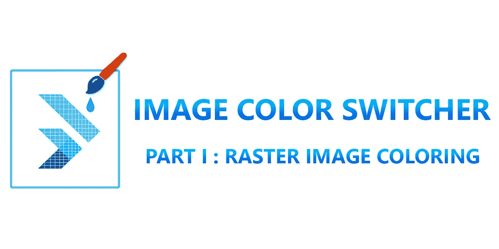

**颤振中的 ImageColorSwitcher:第一部分——光栅图像着色**

[概述](#1014)
[挑战](#980d)
[混合滑块](#68ba)
[并非所有人都是数学家！](#afb4)
[试一试再试](#3edc)
[打散图像](#dd81)
[各就各位，准备好，开始设定代码！](#9af9)
∘ [先决条件](#637b)
∘ [图像颜色切换器](#735b)
∘ [颜色滑块](#c864)
∘ [最终结果](#a166)
[游戏没有结束！](#bd7a)
[那么接下来是什么？](#8eef)
[参考文献](#e4a8)

# 概观

您希望通过 dart 代码给图像着色吗？随着时间的推移，你是否面临失败？你感到失落吗？嗯，先不要放弃希望！

在这个系列中，我们将探索使用 flutter 增强图像着色概念的技术。不仅仅是理论上的阐述，我们还将关注定制小部件的开发和可视化，更不用说不时打磨编码技能的失败。

# 挑战

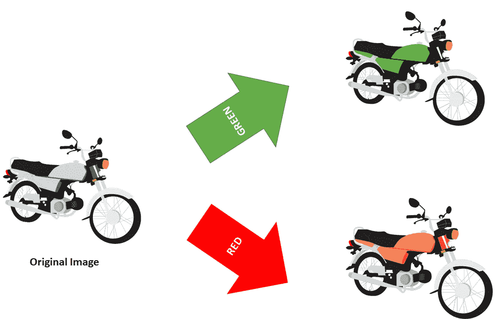

**图 1:图像如何根据输入改变颜色的图示。**

作为一名 flutter 开发人员，我被分配创建一个定制的小部件，它将获取一个简单的图像并根据输入的颜色改变图像颜色，如图 ***图* 1** 所示。

你可能会奇怪为什么我没有使用[**color filtered**](https://api.flutter.dev/flutter/widgets/ColorFiltered-class.html)**小工具并在上面尝试不同的混合模式！**

# 混合滑块

我还以为这只是小菜一碟，但遗憾的是，事实并非如此。我通过定义一个 ***混合滑块*** 来应用不同的混合模式。点击后，我可以看到每种模式如何改变图像；看下面的片段，明白我的意思。

混合滑块源代码

在 main.dart 文件中，我将 ***BlendingSlider*** 包装在一个 ***列*** 小部件中；请参见下面的片段。

演示页面(main.dart)

***图 2*** 说明了根本不希望的结果。

**图 2:不同图像混合模式的演示。**

# 我们并不都是数学家！

下一个方法是将构造函数从***color filter . mode***改为***color filter . matrix*。**在继续之前，我必须直观地看到应用滤色矩阵后会发生的变化。于是我打开浏览器，访问了 [**SVG 滤色游乐场**](https://kazzkiq.github.io/svg-color-filter/) 网站，使用了[**Claudio Holanda**](http://github.com/kazzkiq)**制作的在线工具。**不幸的是，我还是没能得到满意的结果；见下图 ***图 3*** 。

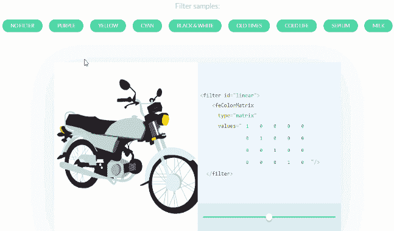

**图 3:不同颜色过滤效果示意图。**

# 试着再试一次

照片由[在](https://unsplash.com/@theblowup?utm_source=medium&utm_medium=referral) [Unsplash](https://unsplash.com?utm_source=medium&utm_medium=referral) 上放大

正如 [**森平**](https://www.brainyquote.com/authors/morihei-ueshiba-quotes) 所说

> 失败是成功的关键；每个错误都教会我们一些东西。

我开始在谷歌上搜索关于这个话题的任何提示、帖子或教程，但运气不佳。我也把这个问题作为问题贴在了 [StackOverflow](https://stackoverflow.com/questions/65633869/how-to-switch-specific-colors-of-an-image-in-flutter) 上。在我的研究过程中，我发现了作者托马斯·gallinari⁴.写的《从图像中去除颜色》中的文章* ***我仔细阅读了文章，按照步骤进行了不同的编码实验。****

# ***打破形象***

***在放大自行车图片时，我注意到只有图片的两个属性在变化，而其余的属性保持不变，一个是蓝色，另一个是暗蓝色。经过深入观察，我总结出以下理论:***

***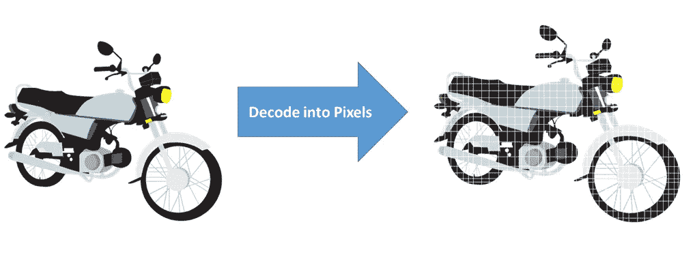***

*****图 3:图像解码成像素的图示。*****

*   ***如 ***图 3****所示，图像需要解码成像素化格式。****

***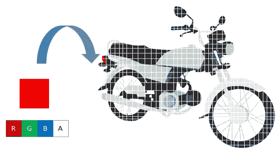***

*****图 4:RGBA 滤波器示意图。*****

*   ***定制的 RGBA(红、绿、蓝和阿尔法)滤镜会在每个像素上滑动，检测所需的 RGB 值，并将其切换为所需的输入颜色的 RGB 值，如图 ***图 4*** 所示。***

**为了澄清概念，我记下了我需要检测的 RGB 值，如图 ***图 5*** 所示。**

**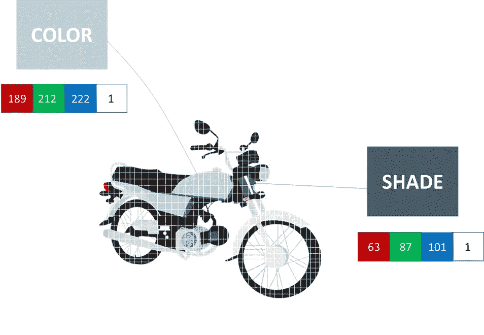**

****图 5:图像颜色示意图&阴影 RGBA 值。****

# **各就各位，准备，获取设定代码！**

****

**詹姆斯·哈里森在 [Unsplash](https://unsplash.com?utm_source=medium&utm_medium=referral) 上拍摄的照片**

**保持冷静，继续阅读并遵循以下步骤。**

## **先决条件**

*   **我在项目的根目录下创建了一个文件夹**“asset”**，并把图片放在里面；见下图**中的*图 6* 中的**。**

**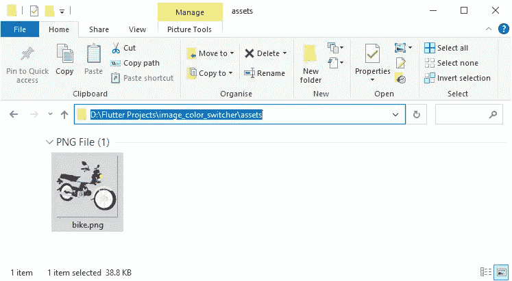**

****图 6:将图像放入资产文件夹****

*   **接下来，我在 dependencies 部分添加了[图像](https://pub.dev/packages/image) **⁵** 包，并将图像的根路径放在 pubspec.yaml 文件内的 assets 部分，如下面的代码片段所示。**

**Pubspec.yaml**

## **图像颜色切换器**

**以下步骤总结了编写代码的本质:**

*   **我创建了一个自定义小部件，***ImageColorSwitcher****，* ，一个有状态的小部件，它使用构造函数获取图像路径和所需的颜色。**
*   **在 ***initState*** 方法中，我加载了图像，并使用***setState****函数将原始字节赋给了 ***imageBytes*** 变量。***
*   **接下来，我创建了一个名为 ***switchColor*** 的自定义异步函数，它将把***uint 8 list**bytes***作为参数，检测 RGB 值，用所需的颜色进行切换，并返回一个编码的 png 图像。**
*   **在 ***构建*** 方法内部，万一 ***imageBytes*** 没有准备好，我会显示一个 ***圆形 progression indicator***否则，一个***future builder***会调用 ***switchColor*** 函数并返回一个容器化的图像(如图 ***图 7 所示)*****

**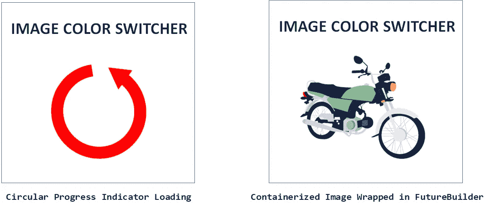**

****图 7:图像颜色切换器的基本概念。****

*   **使用 ***Image.memory*** 构造函数的主要好处是，它使用原始字节加速了图像渲染过程。**

**ImageColorSwitcher 小部件代码**

## **颜色滑块**

**为了让用户选择一种颜色，我开发了一个自定义的滑块来显示颜色和它们的名称，如图 8 所示。**

**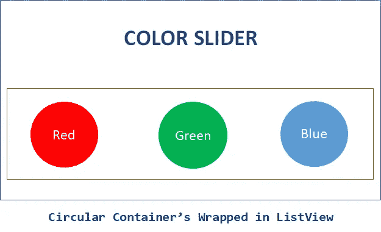**

****图 8:颜色滑块概念的图示****

*   **我首先定义了一个自定义的 Map 变量 ***_colorMap*** ，它将保存颜色名称和颜色值。**
*   **在 ***构建*** 的方法中，我基于 ***_colorMap*** 的条目创建了一个 ***ListView*** 。**
*   **我使用***box shape . circle***将每个 ***colorEntry*** 包装在一个圆形容器中。**
*   **为了点击每种颜色，我将每个容器都包装在**油墨池** 小部件中。**
*   **在 ***onTap*** 函数中，我返回了选中的地图条目，即颜色值。**

**ColorSlider 小部件代码**

## **决赛成绩**

**为了将 ***ColorSlider*** 与 ***ImageColorSwitcher、*** 集成在一起，我声明了一个颜色变量 ***ColorCode*** ，并将来自 ***ColorSlider 的 onColorSelected****回调函数的值赋给它。为了避免空值，我将红色设置为默认颜色。最后，我将这两个定制小部件包装在一个 ***列*** 小部件中；请参见下面的片段。参考 ***图 9*** 查看最终结果。***

**图像颜色切换器的完整源代码**

**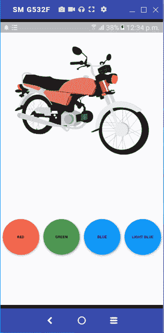**

****图 9: *最终结果图*****

# **游戏没有结束！**

**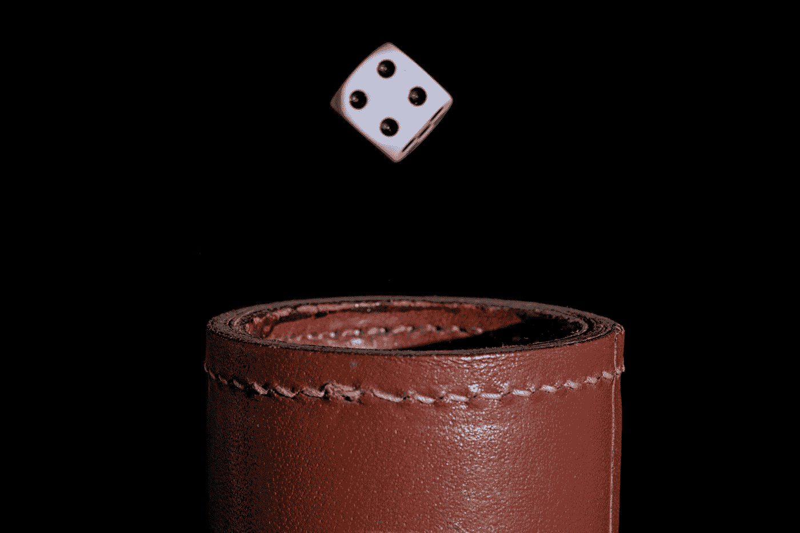**

**照片由[汤森·沃尔顿](https://unsplash.com/@twalton?utm_source=medium&utm_medium=referral)在 [Unsplash](https://unsplash.com?utm_source=medium&utm_medium=referral) 上拍摄**

**我以为对我来说已经结束了，但是将结果与 Illustrator 的源图像文件进行比较，我震惊了，因为它仍然不完美。
我不会说这是一个彻底的失败，因为这个解决方案为我提供了足够的知识和学习经验。我曾经用十六进制颜色替换了默认颜色，但这还不够；仍然缺少一些东西。**

# **那么下一步是什么？**

**请不要把鞋子放在汽车刹车上；我们还有很长的路要走。在下一部分，我将详细解释:**

*   **为什么我决定改变我的代码？**
*   **缺失的部分是什么？**
*   **我被困在代码里了。**

**我将在下一部分回答所有这些问题。一如既往，代码对你开放；拉请求是最受欢迎的；访问 [Github 库](https://github.com/Zujaj/image_color_switcher)。**

** [## 颤振中的 ImageColorSwitcher:第 2 部分-矢量图像着色

### 从光栅到矢量图像着色的经验教训。

levelup.gitconnected.com](/imagecolorswitcher-in-flutter-part-2-vector-image-coloring-97509fd6a90a) 

# 参考

**【1】:*color filtered 类— widgets 库—Dart API*** [https://API . flutter . dev/flutter/widgets/color filtered-class . html](https://api.flutter.dev/flutter/widgets/ColorFiltered-class.html)

**【2】:*SVG 滤色游乐场*** [https://kazzkiq.github.io/svg-color-filter/](https://kazzkiq.github.io/svg-color-filter/)

**【3】:*如何在 Flutter 中切换图像的特定颜色—堆栈溢出*** [https://Stack Overflow . com/questions/65633869/How-to-Switch-Specific-Colors-of-an-a-Image-in-Flutter](https://stackoverflow.com/questions/65633869/how-to-switch-specific-colors-of-an-image-in-flutter)

**【4】:*从抖动的图像中移除颜色|作者 Thomas Gallinari*** [https://Thomas Gallinari . medium . com/Remove-a-color-from-an-a-image-in-Flutter-36770 AC 42669](https://thomasgallinari.medium.com/remove-a-color-from-an-image-in-flutter-36770ac42669)

**【5】:**[***图片|镖包(pub . dev)***](https://pub.dev/packages/image)[https://pub.dev/packages/image](https://pub.dev/packages/image)

**【6】:*图像颜色切换器 Github Repo*** [https://github.com/Zujaj/image_color_switcher](https://github.com/Zujaj/image_color_switcher)**