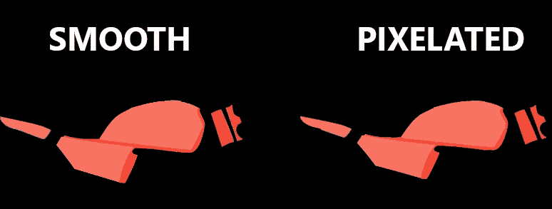
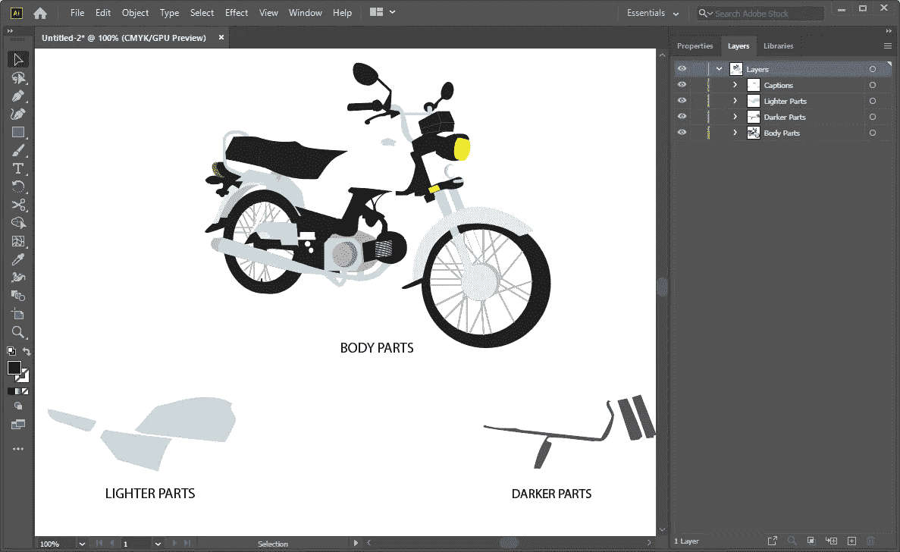

# 颤振中的 ImageColorSwitcher:第 2 部分-矢量图像着色

> 原文：<https://levelup.gitconnected.com/imagecolorswitcher-in-flutter-part-2-vector-image-coloring-97509fd6a90a>

***从光栅到矢量图像着色的经验教训。***

**I*magecolor switcher in Flutter:第二部——矢量图像着色***

[回顾往昔](#2bfa)
[缺失部分](#f45c)
[光栅 VS 矢量图像](#ca05)
[画布绘画策略](#d54e)
[其时间代码](#706d)
[最后一个镜头](#caff)
∘ [步骤 1:添加颤振 _SVG 包](#5f3f)
∘ [步骤 2:从 ILLUSTRATOR](#198a) 中导出 SVG 屏幕
∘ [第五步:运行代码](#1d58)
[结论](#28df)
[引用](#7916)

# 回顾过去的一瞥

欢迎进入第二部分；我希望你喜欢第一部。之前，我们发现了使用 Flutter 在图像上应用特定颜色的不同技术。虽然我们讨论了功能，但由于图像的光栅性质，它看起来并不太好。

从现在开始，我们将重点放在使用矢量格式着色相同的图像。我们将探索编写高效代码和减少大量样板代码的方法。最后，我们将通过比较以前的结果和当前的结果来看差异。

***友情提示:如果你不清楚上下文，我建议你阅读文章的第一部分。***

 [## Flutter 中的 ImageColorSwitcher:第 1 部分光栅图像着色

### 从光栅到矢量图像着色的经验教训。

levelup.gitconnected.com](/imagecolorswitcher-in-flutter-part-1-raster-image-coloring-90f2cd0c8788) 

# 缺失的部分

请记住，我提到过，即使代码是一个工作解决方案，仍然缺少一些东西。好了，现在是时候揭开即将到来的悬念了。我在 Illustrator 中打开了源图像文件，并将其与结果图像进行了比较。我注意到图像的某些部分模糊不清；为什么是**？**

**图 1:平滑和像素化图像的比较**

在 ***图 1*** 中，平滑的图片取自 Illustrator，而像素化的图片是使用***ImageColorSwitcher***生成的。仔细看看平滑的图像；你可以看到阴影部分有锐利的边缘，而像素化的图像有一些模糊的效果。

# 光栅与矢量图像

那么这些术语**【光栅】****【矢量】**是什么呢？

> 光栅图形是位图。位图是由单个像素组成的网格，这些像素共同构成一幅图像。光栅图形将图像渲染为无数小方块的集合。每个方块或像素都用特定的色调或阴影编码。单个来看，这些像素毫无价值。合在一起，它们胜过千言万语。
> 
> 与基于像素的光栅图像不同，矢量图形基于定义几何图元(如多边形、直线、曲线、圆和矩形)的数学公式。因为矢量图形是由真正的几何图元组成的，所以它们最适合用来表示更结构化的图像，例如具有平坦、统一颜色的艺术线条图形。大多数创建的图像(与自然图像相反)都符合这些规范，包括徽标、信头和字体。
> 
> [光栅图像与矢量图形|打印连接](https://www.printcnx.com/resources-and-support/addiational-resources/raster-images-vs-vector-graphics/)

***图 2:光栅和矢量图像的描绘(来源:***[**print cnx**](https://www.printcnx.com/resources-and-support/addiational-resources/raster-images-vs-vector-graphics/)**)。com)**

简单来说，Illustrator 以 SVG(可缩放矢量图形)格式制作高质量的图像。相比之下，在 PNG(可移植网络图形)格式中，矢量被转换为光栅图像(像素)。

# 画布绘画策略

所以现在我想，与其用. png 文件，不如用. svg 文件。我的第一个策略是将图像分成三个主要层；参见 ***图 3*** 。

感谢[穆斯塔法·艾哈迈德](https://dribbble.com/mustafa616) 这位平面设计师帮助我进行插画的工作。

1.  ***身体部位:*** 在这一层里面，[穆斯塔法](https://dribbble.com/mustafa616)将切换图像颜色后不会产生影响的图像成分全部分组。
2.  ***较轻的部分:*** 在这一层里面，他把所有柔和的颜色放在一起。
3.  ***较暗的部分:*** 在这一层里面，他综合了所有的暗色调；

***图 3*** 描绘了将图像分割成单独图层的想法。

**图 3:图像分解成多个图层**

之后，我使用这些图层手动放置图像的各个部分，如图 ***图 4*** 所示。

**图 4:组装图像组件**

你可能想知道为什么我要把零件组装回来，因为我需要把图像导出为 SVG 格式。保持冷静和耐心；这个谜很快就会解开。

**图 5:图像颜色切换演示**

如 ***图 5*** 所示，我应用了颜色切换来观察将要发生的变化；这些观察被证明是成功的步骤。

# **该编码了**

照片由[替代码](https://unsplash.com/@altumcode?utm_source=medium&utm_medium=referral)在 [Unsplash](https://unsplash.com?utm_source=medium&utm_medium=referral) 上拍摄

最初，我想到使用普通的 Dart 代码在画布上呈现 SVG。为此，我找到了一个在线工具， **"** [**SVG 到颤振路径转换器**](https://www.flutterclutter.dev/tools/svg-to-flutter-path-converter/) **"，**由 ***马克·gerken⁴开发，*** 将 SVG 文件转换成颤振路径，一个简写代码生成器。

我很高兴节省了时间，但是，唉，所有的希望都落空了。该工具生成了一长串样板代码，对我来说还不够处理。下面的代码片段只是显示一些图像组件的一个小片段。

庞大的样板代码

绘制路径、将它们层层叠加、将它们链接在一起并控制颜色切换机制将是一项非常繁琐的工作；参见 ***图 6*** 。

**图 6:呈现在画布上的图像部分的图示**

# 最后一枪

我还不打算放弃，所以经过一番研究，我找到了解决办法。我深入研究了基于 XML(可扩展标记语言) **⁵** 的 SVG 代码结构。

记住，我说过这个谜很快就会解开；现在是时候了。
就编程而言，我的方法是加载 SVG 资产文件，并通过用可变的颜色和阴影替换恒定的十六进制值来切换颜色。

你想知道我是怎么做到的吗？嗯，按照下面的步骤:

## 步骤 1:添加 FLUTTER_SVG 包

目前，flutter 不直接支持 SVG 我们需要在 pubspec.yaml 文件中添加***flutter _ SVGpackage⁶***；参见下面的片段。

在 pubspec.yaml 文件中增加了 flutter_svg

## 步骤 2:从 ILLUSTRATOR 导出 SVG

我告诉[穆斯塔法](https://dribbble.com/mustafa616)按照包文档指南以 SVG 格式导出自行车图像；参见 ***图 7*** 。

**图 7:推荐 Adobe Illustrator SVG 配置(来源:**[**flutter _ SVG**](https://pub.dev/packages/flutter_svg)**)**

## 步骤 3:创建一个新的颜色滑块

我注意到 SVG 有一个非常独特的颜色命名约定 **⁷** 。因此，我必须创建一个遵循 SVG 颜色命名法的新颜色滑块。我不再键入样板代码，而是专注于使用速记符号。

**图 8:主题、颜色、色调概念示意图**

*   我创建了一个 map***_ colorMap***来保存一个字符串&一个颜色值。
*   在 map key 内部，我定义了一个编码字符串“Theme.color:shade”(如图 ***图 8*** )同样:
    ★ ***Theme*** :主题的名称。
    ★ ***颜色*** :颜色的名称或十六进制值。**★ *阴影:*** 阴影的名称或十六进制值。
*   在贴图值内部，我使用了***color . from argb***构造函数。

SVGColorSlider 小部件代码

*   在 ***构建*** 方法中，我将 ***_colorMap*** 条目转换成圆形容器，包裹在 ***ListView*** 中。
*   为了显示容器的背景颜色，我使用了 ***mapEntry*** 值。
*   点击 ***onTap*** 函数后，我返回了选中的 ***mapEntry*** 键(编码字符串)而不是颜色值。

## 步骤 4:在屏幕上加载图像

flutter_svg 有一个***svg picture . string***构造函数，它接受 SVG 代码并返回一个可缩放的矢量图形。我已经知道需要替换的十六进制值，

*   我创建了一个名为 ***Bike_Painter 的自定义无状态小部件。***
*   我创建了两个字符串变量， ***【颜色】*** & ***【阴影】*** ，并将它们传递给 ***Bike_Painter 的*** 构造函数。
*   在 ***build*** 方法中，我声明了一个私有变量 _ ***bytes*** 来保存 SVG 代码。
*   点击 ***ctrl+H*** 搜索十六进制值并用变量 ***颜色*** & ***阴影*** 如图 ***图 9*** 所示。

***图 9:vs code***中颜色和阴影替换的图示

*   最后，我将 ***_bytes*** 变量传递给***SVG picture . string***构造函数；参见下面的片段。

自行车画家小部件代码

**代码缩放矢量图像**

## **步骤 5:运行代码**

**最后，我在 main.dart 文件中集成了***bike painter***&***SVGColorSlider***小部件；参见下面的片段。**

**矢量图像着色代码**

*****图 10*** 说明了结果。**

# **结论**

****

****图 10:最终结果示意图****

**与光栅着色相比，矢量是一种理想的解决方案。它不仅减少了样板代码，而且工作速度更快。请参见下图，图中显示了光栅和矢量图像颜色的对比。**

****

****光栅的特写图&矢量图像****

******

**红色&绿色彩色图像比较**** ****

****蓝色图像比较****

****

****光栅图&矢量差****

**我希望你今天能学到新东西。我已经更新了[***github repo***](https://github.com/Zujaj/image_color_switcher)***⁸***上的代码，所以你可以看到两种颜色切换技术以及混合滑块。**

# **参考**

****【1】:*ImageColorSwitcher in Flutter:Part 1 光栅图像着色***[https://level up . git connected . com/ImageColorSwitcher-in-Flutter-Part-1-Raster-Image-Coloring-90 F2 CD 0 c 8788](/imagecolorswitcher-in-flutter-part-1-raster-image-coloring-90f2cd0c8788)**

****【2】:*光栅图像 vs 矢量图形|打印连接*** [https://www . print cnx . com/resources-and-support/additional-resources/Raster-Images-vs-Vector-Graphics/](https://www.printcnx.com/resources-and-support/addiational-resources/raster-images-vs-vector-graphics/)**

****【3】:*穆斯塔法艾哈迈德|德里布尔*** [https://dribbble.com/mustafa616](https://dribbble.com/mustafa616)**

****【4】:*****SVG 到颤振路径转换器***
[https://www . Flutter clutter . dev/tools/SVG-to-Flutter-path-converter/](https://www.flutterclutter.dev/tools/svg-to-flutter-path-converter/)**

****【5】:*什么是 SVG 文件用于&为什么开发者应该使用它们*** [https://deliciousbrains.com/svg-advantages-developers/](https://deliciousbrains.com/svg-advantages-developers/)**

****【6】:【https://pub.dev/packages/flutter_svg】颤振 _svg |颤振包**** 

****【7】:*基础数据类型和接口— SVG 1.1(第二版)*** [https://www.w3.org/TR/SVG11/types.html#ColorKeywords](https://www.w3.org/TR/SVG11/types.html#ColorKeywords)**

****【8】:*图像颜色切换器 Github Repo*** [https://github.com/Zujaj/image_color_switcher](https://github.com/Zujaj/image_color_switcher)**