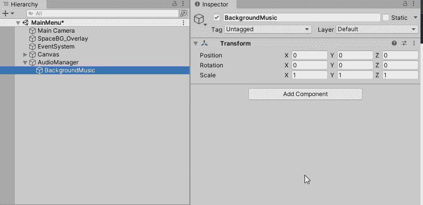

# 沉浸从声音开始

> 原文：<https://levelup.gitconnected.com/immersion-starts-with-sound-d2ea446eab50>

创建音频管理器并为 Unity 添加背景音乐


照片由[丹尼斯·莱昂](https://unsplash.com/@denisseleon?utm_source=medium&utm_medium=referral)在 [Unsplash](https://unsplash.com?utm_source=medium&utm_medium=referral) 上拍摄

当你第一次学习制作视频游戏时，你首先注意到的一件事是，没有声音，游戏就失去了一些魅力。是配乐和 SFX 把我们带入了我们正在创造的世界。你们中有多少人能哼出塞尔达或殊死搏斗的主题曲？当我需要集中注意力的时候，我喜欢播放一些 Nobuo Uematsu(最终幻想和其他 Squaresoft/SquareEnix 游戏)的音乐。比如“过来！”，“是我，马里奥！”和“Shoryuken！”仍然住在我的头免租金，几十年后各自的来源出来了。

如果声音这么重要，为什么我的游戏没有声音呢？我们大多数人担心版权和版税，因为我们不能自己制作音乐。因此，首先，几个地方获得不同程度的使用权免费游戏声音。

[**搜索艺术| OpenGameArt.org**](https://opengameart.org/art-search-advanced?keys=&field_art_type_tid%5B%5D=12&sort_by=count&sort_order=DESC)

[**帕特里克·德·阿尔蒂加的电子游戏音乐**](https://patrickdearteaga.com/)

其他的存在，但是这些应该让你开始。挑选一些东西，下载下来，让我们播放一些背景音乐。


检查器中的摄像机对象。

当你创建新场景时，每一个带有主摄像机**的 Unity 场景都会添加一个**音频监听器**组件。它在检查器**中没有属性，只有一个任务。它只是坐在那里，等待一些声音播放，以便它可以传递给玩家。所以我们已经完成了一半的工作。

为了让音频监听器工作，我们需要在游戏中播放一些声音。这意味着我们需要添加一个可以播放声音的**音频源**和一个将要播放的**音频剪辑**。我们将在层次结构中添加一个空的游戏对象，并将其命名为**音频管理器**，这样，如果我们需要按需播放声音效果，我们可以稍后使用它，但我们也希望在游戏活动时播放背景音乐，并且不想被其他声音剪辑打断。因此，为了解决这个问题，我们将添加一个**子对象**到新的音频管理器中，并将其命名为背景音乐。


添加音频管理器

在未来，我们可以创建脚本添加到这些将允许我们控制游戏中的音频。不过现在，我们将为我们创建的每个对象添加一个**音频源**组件。之后，我们可以将我们的音乐添加到背景对象的源中，并将其设置为在 awake 上播放。请注意，我们将禁用我们构建的音频管理器的**唤醒播放**。**唤醒时播放**告诉 Unity 立即开始播放那个声音。我们的音频管理器会根据需要播放其他声音，但它没有任何东西可以播放，除非被告知。



添加音频源

好了，现在只需拖动你之前下载的音乐，并将其应用到源。


添加音频剪辑

随着剪辑的应用，我们现在将有一些身临其境的背景音乐准备播放，一旦我们启动游戏。一旦游戏运行，音乐将开始无限播放，直到游戏停止或直到我们用代码停止它。

之前我提到过我们可以用脚本来控制背景音乐。在一个脚本中，我们可以创建一个背景音乐剪辑的**数组**,并根据新浪潮、新关卡、危险敌人等创建在它们之间交换的方法。让我们看看我们的**音频管理器**和**背景音乐**对象**的样本脚本可能是什么样子。**

```
using System.Collections;
using System.Collections.Generic;
using UnityEngine;\\AudioManger.cs
public class AudioManager: [MonoBehaviour](https://docs.unity3d.com/ScriptReference/MonoBehaviour.html)
{
    [SerializeField] private AudioSource audioManager;   

    void Awake()
    {
        DontDestroyOnLoad(this.gameObject);
    } void Start()
    {
       audioManager = this.GetComponent<AudioSource>();
       if (audioManager== null)
       {
          Debug.LogError("Audio Manger: Audio Source is NULL");
       }
    } public class PlayAudioClip(AudioClip clip)
    {
        musicManger.clip = clip;
        audioManager.Play();
    }
}
```

以上只是 AudioManager 脚本的一个非常快速而肮脏的示例。让它成为一个静态类可能更有意义，我们也想扩展它的特性。

现在让我们来看看背景音乐的样本脚本。

```
using System.Collections;
using System.Collections.Generic;
using UnityEngine;\\MusicManager.cs
public class MusicManager: [MonoBehaviour](https://docs.unity3d.com/ScriptReference/MonoBehaviour.html)
{
    [SerializeField] private AudioSource musicManager;        void Start()
    {
       musicManager = this.GetComponent<AudioSource>();
       if (musicManager== null)
       {
          Debug.LogError("Music Manger: Audio Source is NULL");
       }
    } public class SetBackgroundMusicByLevel(int level)
    {
        musicManager.clip = _backgroundMusic[level];
        musicManager.Play();
    }
}
```

同样，这是一个非常基本的示例，我们可能想要添加更多的选项。也许我们想让背景音乐由一个代表和级别改变时发生的事件来控制。我们可能想添加一个选项，玩家可以按下一个键，改变当前的背景音乐。这些都是我们可以做的事情，通过使用控制音频源的脚本还可以做更多的事情。

我们还可以将音频源直接应用到我们的其他游戏对象，以便它们可以播放自己独特的声音效果。明天我们将学习如何使用类似的方法来添加背景音乐，以创建当我们做激光射击、受到伤害、爆炸、收集能量等事情时播放的声音效果。使用所有这些小小的声音效果和背景音乐将会给我们的游戏增加更多的生命，给他们一个更专业的吸引力。