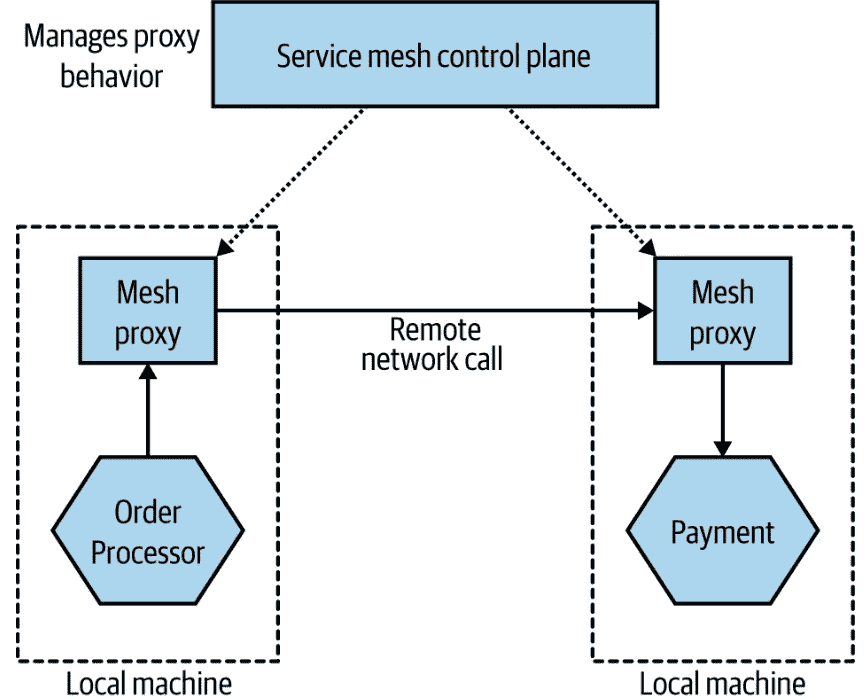
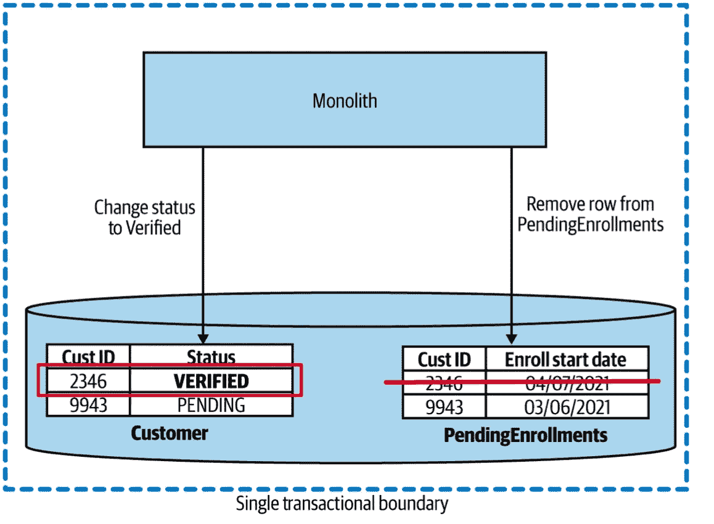
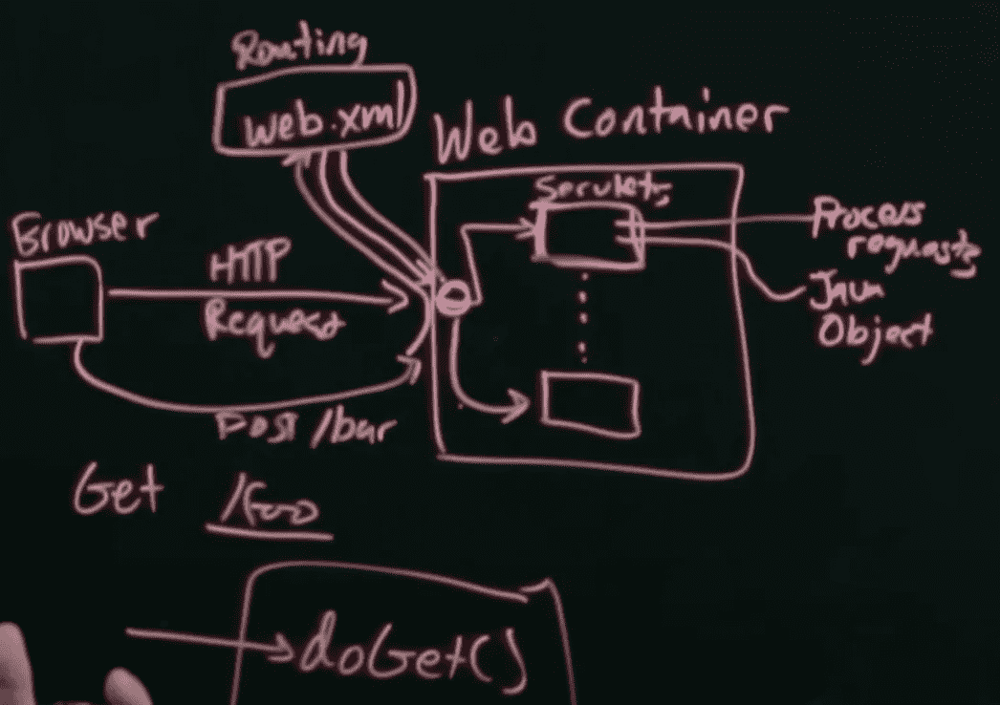

# 微服务沉浸式指南

> 原文：<https://levelup.gitconnected.com/immersive-guide-to-microservices-f646a691d219>

亲爱的学习者！让我向您介绍一下关于微服务架构(简称:MSA)的主要观点，这是我在工作中以及从这本宣传书中学到的:

[](https://www.oreilly.com/library/view/building-microservices-2nd/9781492034018/) [## 构建微服务，第二版

### 随着组织从单一应用程序转向更小的独立微服务，分布式系统已经…

www.oreilly.com](https://www.oreilly.com/library/view/building-microservices-2nd/9781492034018/) 

这篇文章不是一本学习书籍，而是一个带有参考资料的快照(虽然很大)+大量的文章，可以用来收集更多的知识。

这个领域太大了，也很有争议，不可能在一篇文章中囊括所有内容(T2 甚至是 600 多页的书，如上图)。

**这是一个巨大的目录:**

*   [主要概念](#0f1d)
*   [独石](#6c3f)
*   [快速了解微服务使用的技术](#a2ba)
    -微服务的痛点
*   [微服务因素](#b844)
    -联轴器类型
*   [DDD——领域驱动设计](#be92)
    ——映射聚合和有界上下文
*   [分割巨石](#42dc)
    -先分解什么
    -分解模式
    -数据问题
*   [MSA 通信方式](#20df)
    -性能
    -变更
    -错误处理
    -进程间通信技术选择
*   [实现微服务通信](#2d8e)
    -规则
    -技术选择
    -模式
    -避免微服务中的突发变更
    -管理突发变更
    -微服务中的干燥
    -服务发现
    -简要介绍服务网格和 API 网关
*   [工作流程:微服务](#840f) 中的数据库素材- 2PC
    - Sagas
*   [Build: CI/CD 及其周围的一切](#9270)
    -工件创建规则
    -将源代码和构建映射到微服务
*   [部署](#1b0f)
    -环境
    -微服务原则部署
    -部署选项
    -关于 servlets 的回避
    -关于 K8S 的几句话
    -渐进交付
*   [测试](#cc85)
    -合同测试和消费者驱动的合同
    -生产中测试
    - MTBF vs MTTR
*   [从监控到可观察性](#e04f)
    -日志
    -度量
    -分布式跟踪
    -SLA、SLO、SLI 等
*   [安全](#933a)
    -核心原则
    -应用安全基础
    -隐性信任对零信任
    -保护数据
    -单点登录
    -困惑的代理问题
*   [弹性](#322d)
    -降级功能
    -稳定性模式(超时、隔板、断路器)
    -微服务的隔离
    -等幂
    -上限定理
*   [缩放](#913b)
    -缩放轴(垂直、水平、数据分区、功能分解)
    -缓存+缓存失效
*   [用户界面](#10b8)
    -单片前端
    -微前端模式(基于页面，基于小部件)
    -用于在前端过滤数据的模式(聚合网关，BFF)
*   [Outro](#7f92)


[Jexo](https://unsplash.com/@jexo?utm_source=medium&utm_medium=referral) 在 [Unsplash](https://unsplash.com?utm_source=medium&utm_medium=referral) 上拍摄的照片

# 主要概念

首先，让我们深入了解定义微服务的概念:

*   面向服务的方法。这是一种企业级的方法，其中相同的概念被重用。它支持无代码复制，使用接口，有 ESB(企业服务总线)。阅读更多信息:

[](https://www.ibm.com/cloud/blog/soa-vs-microservices) [## SOA 与微服务:有什么区别？

### 在本文中，我们将解释面向服务的架构(SOA)和微服务的基础知识，触及它们的关键…

www.ibm.com](https://www.ibm.com/cloud/blog/soa-vs-microservices) 

*   **独立部署能力** —微服务的主要特性，可以独立于其他服务部署微服务，即不需要重新部署其他 n 个微服务。它的先决条件:
    - *松散耦合的*代码，也就是微服务之间的*稳定契约*
*   围绕业务领域建模( **DDD** 将进一步提及)，而不是传统的 **MVC** 。我们有端到端的团队，他们可以为特定的业务领域(如卡处理)提供前端、后端和数据库相关的功能。这样的团队构建了整个组织。在传统的 MVC 方法中，我们有前端开发团队来处理大量的任务，后端和数据库开发团队也是如此。因此，**否** **改变为多个微服务，由不同的团队拥有，由一个团队拥有。**
*   没有针对多个微服务的**共享数据库**(从微服务到数据库的直接访问)。有一个完整的服务，它决定哪些微服务提供什么数据(它将请求传送到数据库或拒绝它)。我们将在**耦合部分对此进行探讨。**
*   规模—有争议，但没关系，因为每个服务都是独一无二的，每个组织都有自己的特点。

# 庞然大物

接下来，让我们来看一下 **monolith** :一种所有东西都在一个应用程序中的架构。它有传统的 **MVC** 方法。简而言之:monolith 并不坏，它只是另一种类型的建筑。

> 在我的文章中阅读关于 **MVC** 的内容:[https://medium . com/git connected/how-I-implemented-design-patterns-in-production-186 aa 306 ca6a](https://medium.com/gitconnected/how-i-implemented-design-patterns-in-production-186aa306ca6a)

优点:

*   容易测试。一切都在一个大的过程中，你可以编写测试，记住我们的应用程序将保持原样。
*   代码重用也更容易。我们可以使用传统的 GoF 模式或面向对象的设计来分离代码，并创建用于类似目的的类/系统。

缺点:

*   更难扩展。
    -即使您可以将整个应用程序塞进一个容器中(这有时非常困难，因为 WildFly 等应用程序服务器很重)，如果 pod 关闭→所有内容都要重新调整(因为 monolith 很重，这可能需要很多时间)
    -如果应用程序的一部分关闭，则更难微调系统

整体材料的类型:

1.  单进程整体——典型的“一个大生物”系统
2.  模块化整体——有许多模块，但为了部署，它们将被组合在一起。 **Shopify** 就是一个例子。
3.  分布式整体结构——罕见的东西。

# 快速了解微服务中使用的技术

简要介绍微服务中使用的技术/方法:

1.  *日志和跟踪*:与 monolith 相比，它们需要另一种方法，因为存在一个实体跨越多个服务的情况。我们需要追踪它。
2.  *流式*用于发送数据，不通过批处理，因为它要慢得多。
3.  每个微服务可能包括*不同的语言*和*数据库。*
4.  *健壮性* —系统处理错误的能力。阅读关于这个问题的 monolith 部分。
5.  *扩展*更简单——每个微服务都可以单独扩展，并且可以唯一地受到资源的限制。
6.  *易于部署* —与将系统部署在多台服务器上的 monolith 相比，每个部分都可以轻松重新部署，这需要花费大量时间，而且风险很高
7.  *可组合性* —一段代码可以通过*单独的微服务*或*客户端库*在多个服务中使用。

## 微服务的痛点:

1.  借助微服务，我们有了*分布式数据库*。这增加了分析整个数据的难度。因此，我们需要使用流，数据湖等。而在 **monolith** 中，一个数据库→一个副本更容易让报告工具从中获取数据。


读取副本示例

2.技术超载

3.第一阶段的成本:更多用于计算、联网和存储的机器

4.开发经验:有时不可能让一台机器上的所有服务都保持运行。

# 微服务因素

1.  **微服务内的信息隐藏**导致:
    -改进的开发时间
    -可理解性(每个微服务可以单独查看)
    -灵活性(每个微服务可以单独更改，不影响其他系统)
2.  高**凝聚力**。“一起更改的代码将保持不变”——这是我们的奋斗目标。该术语与**内部微服务**通信相关。
3.  低**联轴器**。该术语与**跨微服务**通信相关。我们需要使它们尽可能独立，以支持独立的可部署性。

因此，这里的 ***不应该有任何假设*** 之间的服务才是真正独立的系统。

## 联轴器类型:

1.  **域**:一个微服务器调用另一个微服务器，因为它需要它提供的功能。如果明智地使用，这一点也不坏——分成更细粒度的服务来分散逻辑，并且您只需要共享最少量的数据来保持尽可能低的耦合。因此，如果保持最小化并利用**信息隐藏**是没问题的


**2。穿越**:部分数据通过某个微服务传输，因为第二个服务与第一个服务需要的服务有连接。

解决方案:

*   直接调用下游微服务
*   让第二个服务只接受下一次调用所需的信息(也称为创建**合同** ) — **图片见**
*   仍然坚持这种耦合，但是隐藏信息，并使传递服务将它视为 blob。


**3。公共耦合** : 2+服务使用共享**数据**

解决方案:使用单独的服务，该服务接受所有请求并决定接受/转到数据库还是拒绝

但是这会导致**资源争夺**，这就是为什么要小心的原因

**错误的变体:**


**好的变体:**


**4。内容耦合**:上游服务到下游，改变其内部状态。即可以直接访问数据库。


# DDD —领域驱动设计

这是一个很有争议的话题，我将从这本书的角度来写它，并增加阅读资源。

什么是**域**？这是我们的系统负责的一个领域。例如，银行系统具有为最终用户提供端到端支付功能的领域。它非常广泛，因此它被划分为子域，在子域中会发生更细粒度的专门化。

与 **DDD** 相关的三个主要概念:

*   **无处不在的语言**——商业世界和开发者之间的共同语言。在代码库中开发这样的语言，以便将来的开发人员能够容易地理解它。它还包括设计 API 的类似概念。
*   **聚合**—订单、应用程序等真实业务对象的表示。通常，聚合与一个微服务相关，但是一个微服务可以有多个聚合。它有状态、生命周期，通常应该禁止外部世界对其进行更改。此外，一个聚合也可能与其他聚合有关系，其中这种关系可以是一个微服务内的*或跨越多个*的*。*


*   **有界上下文** —其背后有一些逻辑完成的上下文。例如，3 个微服务可以围绕特定的业务需求执行逻辑。因此，它们在逻辑上可以放在同一个有界的上下文中。此外，一个具有多个微服务的有界上下文可以向外部世界展示一个端点，其中仅呈现**集合**中的特定数据(并非来自该微服务的所有字段都向外部世界显示)。这里的重点是*信息隐藏*。此外，我们可以从模型中暴露各种东西。如果相似的概念出现在不同的有界上下文中，用不同的名称命名它们(客户和接收者),以免混淆。

如果你感兴趣，你可以深入 MDE，因为它使用了 DDD 的概念，但是有点不同。 **Eclipse EMF** 是一个使用这个概念的工具。

[](https://modeling-languages.com/comparing-domain-driven-design-model-driven-engineering/) [## 领域驱动设计与模型驱动工程的比较

### 在这篇评论中，David 询问了领域驱动设计(在这本开创性的书中首次提出)…

modeling-languages.com](https://modeling-languages.com/comparing-domain-driven-design-model-driven-engineering/) 

## 映射聚合和有界上下文

内部有*聚合*的*有界上下文*的例子:


外部的一个微服务可以触发另一个微服务，但是第二个微服务可以公开一个 API，然后该 API 被分成多个服务。此外，请记住，每个聚合最好由一个微服务来处理— **信息隐藏**。


**事件风暴** —与所有利益相关者(技术和非技术)一起设计 MSA 系统的过程。它由多个步骤组成:

*   *域事件*标识:下单
*   从上面触发事件的*命令*的识别
*   定义*聚合*

= >因此，确定**有界上下文**

MSA 的其他概念:

*   **易失性** —将相似代码/常用部分提取到另一个微服务或客户端库中。
*   **数据** —分离处理隐私数据的服务和不处理隐私数据的服务。


*   **组织** —垂直滑动(按领域划分的团队)比水平滑动(传统的 MVC 方法)更好

# 劈开整块石头

> **Monolith** 还不错，你不需要把所有东西从它分解到 **MSA** 。即使你决定这样做，也要分小部分来做。

最好的方法之一是将 *monolith* 与 *MSA* 结合起来。例如，您开始将您的 monolith 分解为微服务，并看到某些部分很难分开，于是决定让它们保持原样。 ***扼杀者无花果图案*** 见下面几段。

> **决定是否将某些功能拆分到 MSA 的规则**:提取的难易程度与提取微服务的好处

## 先分解什么

*代码优先*是一种更受欢迎的方法，在这种方法中，你将围绕业务逻辑的整体的一部分提取到单独的服务中。*数据第一*人气较低。这是您将 monolith 数据库分成多个独立服务的地方。

## 分解模式

1.  *扼杀者 Fig 模式* —一个面向外部世界的粗粒度 API，然后内部请求被路由到新的*微服务*或 *monolith* 。


2.*并行运行* —向两个部分发送请求的技术:旧的整体和新的 MSA。并将它们进行比较。

3.*功能切换* —允许在两个功能版本之间切换的开关。

## 数据问题

1.  **性能**:当我们将 monolith db 拆分成服务时——在单个数据库中不再可能进行真正的连接操作。现在我们将这个功能转移到*应用层*。因此，*延迟*现在要高得多。


2.*数据完整性*:忘掉**酸**。我们不再有我们所依赖的真正的数据库事务。因此，我们从数据没有完整性的角度来操作。注意 ***复印图案*** 。

3.*报告数据库*:例如，我们仍然需要允许我们的业务部门对数据进行高效的查询。为此，每个微服务都有责任向一个*报告数据库*发送数据。通常，只有数据子集被发送到这个具有报告数据库的微服务。在这个数据库中，所有进一步的聚合都以结构化的方式呈现数据(是的，这个*报告数据库*本身就是一个微服务)。

# MSA 沟通风格

*   **进程间**跨网络
*   **进程内**在单个进程内

## 表演

当*进程内*发生时，我们只需在内存中传递指针，编译器就会为我们完成所有需要的优化。

当*进程间*发生时，数据包通过网络发送，其中数据被**串行化**和**解串行化**。在这种情况下:

1.  选择更优化的序列化机制
2.  如果可能的话，**将数据卸载到文件系统**并传递对它的引用

## 变化

例如，当你改变微服务时，你需要记住*进程内*驻留在单一代码库和服务中→改变它没有太大的区别。

但是，说到*进程间*，我们处理的是 2+微服务，它们应该具有**独立的可部署性。**

所以，我们应该避免**亦步亦趋的部署**。这是一种阻止用户使用我们的应用程序的方式，除非安装了更新。

## 错误处理

*   进程内通信:错误是确定性的，存在于一个服务中。因此，我们可以跟踪错误
*   *进程间*:错误不在我们的控制范围内，因为网络问题、容器被杀死等原因可能会导致短期错误。为此，尝试采用**丰富的错误语义**(就像 HTTP 中的 400，500 个代码)。它给予下游服务(在我们的例子中是客户机)更多的控制来处理某些错误情况→允许您构建更健壮的系统。

## 进程间通信技术选择


1.  ***同步阻塞*** 是最容易实现的一个，但是它引入了 2 个服务之间的耦合。
2.  ***异步无阻塞*** 在无法重构的长时间运行的流程或链中实现。

异步非阻塞方法:

1.  **公共数据:**一个微服务创建文件，其他微服务对这个动作做出反应。例子:*数据湖*、*数据仓库
    -* 优点:易于用现有工具实现
    -缺点:服务间耦合度高，因为如果数据存储发生变化—要对微服务进行更改；读取/写入存储时的延迟问题；虚拟数据存储的健壮性。
    **使用场合:**在需要发送大量数据的情况下
2.  **请求-响应:**通常通过队列风格实现，其中可以存储多个请求。
    记住*响应*到达另一个实例，因此我们需要记住最初的*请求*。即通过数据库。还有，别忘了实现 ***超时*** 。
    **用在哪里:**当进一步的动作完成后有响应；当我们需要做某种补偿动作时，比如 ***重试*** 等等。

> 最好使用**并行调用**，可以通过 async/await stuff 完成，而不是**顺序调用**。在前者中，总的*延迟*是最慢的呼叫，而在后者中，总的*延迟*。

3.**事件驱动通信:**一方发布事件，另一方订阅话题，监听事件。


> 顺便说一下:**事件**是有效载荷，**消息**是媒介

主要优势: ***比前面提到的通信类型中的*** 耦合更少。

主要缺点:复杂得多，有许多潜在的问题

在**事件**中放什么？

1.  **只有 id** 的，例如，新创建的客户、订单等。但是这可能还不够，还需要进一步的请求= >域耦合，微服务上的额外负载来处理请求


2.**包含所有数据的完整事件**可能是一个选项，但存在某些问题:

*   没有*信息隐藏*
*   **事件**的大小可能过大
*   *忠诚度*微服务可能不需要某些数据，但它仍然接收这些数据，因为**事件**拥有这些数据。关于*敏感/私有*数据，它可能存在某些问题——请小心
*   数据在**事件**之后—与外部服务签约。如果我们从**事件**中移除一些数据，契约可能会被破坏


# 实施微服务通信

## 规则:

1.  使向后兼容变得容易(即添加字段不应破坏系统)
2.  使微服务的接口显式化(即使用模式)
3.  保持 API 技术不可知(例如，想象一年后你需要用另一种语言重写整个服务)
4.  隐藏内部实现细节以减少耦合

## 技术选择:

1.  RPC: 远程过程调用。用于隐藏远程调用，就像在本地完成一样。
    **优势:**在一些实现中，如 gRPC 或 AVRO，它能够在更大程度上序列化有效载荷→减小整体有效载荷的大小；更广泛的网络协议选择(TCP 或 UDP)。
    BTW，gRPC 采用 **HTTP 2.0**
    **缺点:**技术耦合；需要重新生成存根(如`proto`文件)
2.  **REST:** 不购买任何协议，但一般与 HTTP
    **一起使用优点:**对*资源*(即 JSON)没有具体格式；像 HATEOAS 这样的现代东西可以被利用
    **缺点:**因为 REST 通常是通过 HTTP 完成的，所以你不得不使用 TCP(除非你使用 QUIC，其中 HTTP over UDP)

以上两者都更适合于*同步请求-响应风格*。

> 阅读 HATEOAS:

[](https://restfulapi.net/hateoas/) [## HATEOAS 驱动的 REST APIs

### HATEOAS(作为应用状态引擎的超媒体)是 REST 应用架构的一个约束。HATEOAS…

restfulapi.net](https://restfulapi.net/hateoas/) 

> 嘿，读一读我写的关于网络的文章，以便更好地理解这些流行词汇背后的含义:

[](/huge-course-about-networking-web-and-everything-in-between-d6f425ceea13) [## 庞大的网络课程，网络和其间的一切

### 深入阅读本文，了解 OSI、ARP、NAT、LB、TLS 等更多信息。此外，还有过多的资源…

levelup.gitconnected.com](/huge-course-about-networking-web-and-everything-in-between-d6f425ceea13) 

3. **GraphQL:** 允许发出一个请求，该请求将被支持 GraphQL 的微服务 API 接受，所有需要的请求将被发送到下游微服务以收集数据。因此，我们不是向几个微服务发出多个请求，而是发出一个请求。

> 请记住:下游服务必须为客户端公开 GraphQL API

GraphQL 使缓存变得几乎不可能，并且它给服务器增加了额外的负载。另外，它有利于读取，但不利于写入。因此，一些团队让 **REST** 用于*写*，让 **GraphQL** 用于*读*。

此外，GraphQL **不是数据库**的包装器，它不能耦合到特定的数据存储。

4.**消息经纪人:**

**基于队列**的代理是点对点的，生产者将数据放入队列，消费者获取数据。所以，我们通常了解消费者。

在**主题中，基于**的代理生产者发出消息，该消息可以是请求/响应/事件，并且**多个消费者**可以读取该数据。一般我们不了解消费者。

券商的主要优势是**保底交割**。此外，请注意**只发送一次**，即如果您的消费者不止一次看到该消息，请确保其能够处理(保留消息的`id`或类似内容)。

卡夫卡的特点是信息的持久性，卡夫卡自身内部的流处理

> 阅读有关流处理与批处理的更多信息:

[](https://hazelcast.com/glossary/stream-processing/) [## 流处理

### 流处理是在创建数据时对一系列数据采取行动的实践。

hazelcast.com](https://hazelcast.com/glossary/stream-processing/) 

此外，还有两种序列化格式:**文本格式**和**二进制格式**。前者使用得更频繁，因为它是更常见的方式，而后者常见于 gRPC 之类的协议缓冲区。

## 计划

您可以使用模式验证传入的消息。它们有各种类型，但是在 XML 中最流行的是 XSD，而在 JSON 中最流行的是 JSONSchema。

 [## JSON 模式

### JSON Schema 是一种声明性语言，允许您注释和验证 JSON 文档。JSON 模式支持…

json-schema.org](https://json-schema.org/) 

模式破坏分为两类:**结构**和**语义**。

在第一种情况下，很明显:端点的结构发生了变化。第二，端点的结构没有改变，但是行为改变了。例如，你需要返回计算的整数结果，但是你如何计算它们却有很大的不同。

## 避免微服务中的重大变化

1.  膨胀改变——当你给合同增加新的东西时，不要去掉旧的
2.  *宽容的读者* —如果契约中有附加字段，那么让微服务接受并忽略它们
3.  *根据情况选择合适的技术*
4.  *显式接口* —尽可能多地使用模式
5.  *尽早捕捉重大变更* —使用工具比较变更并轻松捕捉错误:协议缓冲区的 protolock、json 模式的 json-schema-diff-validator、openapi 规范的 openapi-diff。最好将这一点纳入 CI 构建，以决定我们的准部署是通过还是失败

## 管理重大变更

1.  *锁步部署* —你让消费者更新，否则他们无法使用
2.  *共存不兼容的微服务版本* —保持两个版本正常运行


*3。模拟旧接口* —保留旧的和新的端点，但只有新版本的微服务在运行。


## 在微服务中干燥

*干*——*不要重复自己*是一个概念，它表明你不应该多次编写相同的代码。

有两种主要的方法来实现这一点:图书馆和微服务。

前者意味着你把相似的代码放在库里面，只是把它作为依赖来使用。单独的微服务—您可以将此服务作为另一个呼叫选项。库的问题是在你更新它们之后，你需要**重新部署使用它的服务**。

## 服务发现

这是在系统中找到微服务的一种方式:

*   允许服务注册自己并说:我在这里，准备好了
*   注册时在系统中查找微服务

因此，*服务发现*允许服务注册它，然后允许服务被使用。

实现的方法:

*更简单的方法:*

1.  DNS。使用服务的 IP 地址。一种方法是将服务 IP 保存在负载平衡器中


*更高级的方式是动态服务注册中心:*

1.  动物园管理员
2.  领事
3.  Kubernetes(通常使用 **etcd**

## 浅谈服务网格和 API 网关

有两种类型的流量:

*   南北:从数据中心外部到内部
*   东西:数据中心内部

**API 网关**和**服务网格**的区别:


**API 网关**(又名管道)必须是哑的，而所有的**智能**(智能逻辑)——在我们的系统内部。

通用的微服务间功能可以通过*服务网格*重用。

由于更加关注*南北流量*，API gateway 在微服务环境中的主要关注点是将外部方的请求映射到内部微服务。这种责任类似于使用简单的 HTTP 代理所能实现的，事实上，API 网关通常在现有 HTTP 代理产品的基础上构建更多的功能，并且它们在很大程度上充当反向代理。

> 问题:2 个微服务之间为什么不用 API 网关/普通网络代理？→网络跳跃→延迟问题



因此，你可以通过使用*服务网*，尽可能减少南北交通流量，并尝试处理东西交通。

# 工作流:微服务中的数据库内容

在微服务中，当我们拆分成服务时，我们也会对数据库做同样的事情。

下面是它在*巨石*中的样子。我们有一个整体应用程序和一个整体数据库。



当我们拆分成独立的微服务时，我们还需要拆分数据库。看上面的**先分解什么**段。

下面是具有自己数据库的独立微服务的示例。


在微服务中我们失去了传统的*酸*，尤其是**原子数**。不过，我们可以用一些不寻常的方式来实现它:分布式事务—两阶段提交(简称— 2PC)。

## 2PC

在两阶段提交中，我们有两个主要行动:

*   投票阶段
*   提交阶段

让我们先看看图片，然后我会用 *plain/text* 给出解释:


如果两个工人**同意** —进入第二阶段**提交**。

但是如果出了什么问题呢:

*第一个工人*接受命令**锁定**该行。但是*第二个工人*不同意**拒绝**。来自协调器的*回滚消息*被发送。所有的**锁**和类似的东西都被移除。

问题:

*   在 2PC 中，我们失去了*隔离*(字母 I 来自 ACID)。所以，不能保证我们看不到中间结果
*   **等待时间**在*协调人*和参与者= >之间处理时间受到影响
*   开发人员需要注意可能出现死锁

对于好奇的人来说:

[](https://martinfowler.com/articles/patterns-of-distributed-systems/two-phase-commit.html) [## 两阶段提交

### 在一个原子操作中更新多个节点上的资源。当数据需要以原子方式存储在多个集群上时…

martinfowler.com](https://martinfowler.com/articles/patterns-of-distributed-systems/two-phase-commit.html) 

> 按照 Sam Newman 的说法:“最好不要使用 2PC，让这部分驻留在 monolith 数据库中”。

回想一下我们在开始时探索的:如果没有这样的需求，最好不要拆分。

更好的方法？→ **传奇**

## 萨迦

saga——无需 2PC 就能协调一个状态中的多个变化的算法。它使用许多可以独立执行的离散操作。

它允许对行/表使用更少的锁→减少数据库中的争用。

让我们先来看一下这个图表:


> 最初它被设计用来处理***LLT——万岁交易*** 。

**重要:**没有*原子性*在整个 Saga 操作的层次上，只是在每个单独操作的层次上。

Saga 故障模式:**向后**(回滚—撤销之前提交的事务)和**向前**(从故障处开始并重试)恢复。

> 重要提示: Saga 使我们能够从业务失败中恢复，而不是从技术失败中恢复。技术问题由开发人员来跟踪

如果发生了什么事情，我们需要进行回滚:**补偿事务**。它是一个事务序列，回滚每个微服务的初始事务。


同样，**这不是一个简单的回滚**像完全擦除事务。这里我们创建一个新的事务**来撤销前一个事务的更改。这些补偿事务被称为**语义回滚**。**

语义意味着我们需要处理业务逻辑问题:在交易过程中，已经向用户发送了一封电子邮件。使用**补偿交易** —已发送带有道歉的新电子邮件

减少 Saga 中错误的方法:

*   重新安排流程以减少回滚
*   向后和向前混合失败

## 实施传奇

1.*精心策划的传奇*:集中协调和跟踪(指挥控制方法)；

*   使用请求-响应风格
*   具有更多的域耦合

2.*精心设计的传奇*:松散耦合的模型，但是使得跟踪进度更加复杂(信任但是验证)

*   使用代理来注册对特定事件感兴趣的微服务
*   更难跟踪我们的流程现在处于哪个阶段
*   例如，使用**关联 ID** 来跟踪日志记录
*   使用单独的服务来清除事件，并在发生某些情况时采取**补偿措施**

> 混合也是一种选择

# 构建:CI/CD 及其周围的一切

**CI —持续集成**。检查新代码是否与现有代码正确集成。

CI 有静态分析器和测试。因此，它确保代码被传输到正确的存储库。也就是说，像 Jenkins 这样的 CI 工具从**我们的源 repo** 中获取代码，编译代码，应用静态分析器，结果我们就有了一个工件。

**工件** —用于每个部署的进一步验证。使用**工件**追溯代码，看看运行了哪些测试等等。每个工件都有其唯一的标识符: *build-541* 。

[](https://dev.to/preciselyalyss/explain-artifacts-deployment-like-im-five-48c#comment-1894) [## 像我五岁一样解释工件(部署)

### 艾莉丝的帖子💜。标签为 explainlikeimfive，discuss，devops。

开发到](https://dev.to/preciselyalyss/explain-artifacts-deployment-like-im-five-48c#comment-1894) 

此外，为基础设施配置配置代码(简称:IAC)——更容易重现构建(代码的两个部分:程序本身和基础设施配置)。

[](https://www.copado.com/devops-hub/blog/what-is-the-difference-between-ci-and-cd-using-them-together-to-accelerate-the-feedback-loop-cddd) [## CI 和 CD 有什么区别？一起使用它们来加速反馈循环

### CI 和 CD 有什么区别？虽然 CI 和 CD 经常互换使用，但它们是根本不同的…

www.copado.com](https://www.copado.com/devops-hub/blog/what-is-the-difference-between-ci-and-cd-using-them-together-to-accelerate-the-feedback-loop-cddd) 

> 分区构建成块:即快速测试和慢速测试

**连续交付**使得在**工件**准备好之后进行大块流程成为可能:每个大块都是整个部署流程的一部分。对于每个部署，都有一个**工件。**

下面我们可以看到，CI 工具触发了流程，创建了工件，然后是进一步的步骤—CD。


> **连续交付** vs **连续部署**:前者可以没有后者而存在。前者需要人工干预来部署，而后者可以不需要人工干预。

我们将在**部署**部分深入了解这张图片，我将对此进行深入解释。

**请注意:**有时人们会说，say 只是从回购中提取代码的过程，更进一步的步骤是 CD。众说纷纭，但我更常看到第一种变体。


此外，在支持高效 CI/CD 流程的开发中使用的良好实践:

**基于主干的开发**:短命的分支和小的、可读的补丁更好。

[](https://trunkbaseddevelopment.com/) [## 基于主干的开发

### 一种源代码控制分支模型，在这种模型中，开发人员在一个称为“主干”的分支中就代码进行协作，抵制任何…

trunkbaseddevelopment.com](https://trunkbaseddevelopment.com/) 

在 CD 期间，我们通常将我们的**工件**部署到不同的环境中，我们需要在快速反馈和类似生产的环境之间做出权衡。

## 工件创建的规则


1.  只构建一次
2.  为构建和部署使用相同的工件
3.  保持部署工件与环境无关

在 Artifactory 或 Nexus 之类的仓库中存储工件

虽然**工件**是我们的代码，但是最好有单独的配置(前面提到的 IAC)。

## 将源代码和构建映射到微服务

1.  **针对所有微服务的一个大型回购**和**一个大型构建** —所有实践中最差的。所有微服务的相同工件


2.每个微服务一个 repo(又名 **multirepo** ):每个微服务的**唯一工件**。


要记住的几点:

*   代码重用(类似于在下游微服务中用作依赖项的库)——在库在其报告中更新后→您还需要重新部署微服务
*   如果一个服务依赖于另一个(即端点)，那么我们需要在两个 repos 中进行更改。重要提示:如果不是异常，而是持续的—将微服务重构为**太多耦合**

3.**单一回购**


CI 触发有点困难


> 谷歌使用这种方法

要记住的几点:

*   `atomic commit to the repo != atomic rollout`。在这种模式下，我们仍然需要两个独立的部署，所以要注意微服务的部署顺序。也就是说，对于服务 A，我们需要首先部署带有更新的支持服务 B
*   要构建的映射:每个服务都有自己的**工件**。但一个回购可能引发另一个回购进行重建，或者某个回购可能引发许多其他回购。像巴泽尔一样使用 smth
*   代码重用:在这种方法中，我们有可能不依赖于客户端库，而是依赖于单个源文件

## 所有权

1.  强所有权——选定的一组人可以对代码进行更改。所以，如果有人想做出改变，就需要公关。
2.  弱所有权——任何人都可以做出改变。

# 部署

服务的多个实例应该在不同的硬件上，跨不同的数据中心，以保持更好的弹性和可伸缩性。

对于部署时的数据库:对同一类型的多个服务使用一个数据库。这并不违反共享数据库的规则。

**DC —数据中心**


说到数据库，最好将读取和写入副本分开，以便从数据库中移除整体负载。此外，它使我们能够更轻松地进行扩展。因此，我们可以轻松扩展读取副本的节点数量，甚至可以进一步**分片**它们以**减少延迟**。


此外，有时公司更喜欢将多个孤立的数据库放入一个数据库基础设施中。


## 环境

回忆一下构建部分的图片:


我们的服务部署在不同的环境中。越接近生产，可能需要的时间越长，因为模拟越少，意味着测试时间越长，等等。此外，为此目的，需要更严格的基础设施。

## 微服务原则部署:

*   **每个服务的独立执行**以支持独立的可部署性(每个机器/容器一个实例，以防止资源稀缺或依赖性问题)
*   **关注自动化**
*   **基础设施代码** (IAC):自动化应该如何完成
    -负责人
    -傀儡
    -主厨

> 随着木偶的出现，首领已经改变，因为今天大多数人使用 Dockerfile 作为 Kubernetes。Puppet、Chief 主要用于遗留代码或构建容器运行的集群

*   **零停机部署** : *上游消费者*不应该注意到有新版本上传。即使用 Kubernetes
*   **期望的状态管理**:当某件事情发生时，例如一个实例死亡，我们需要 3 个实例，它创建新的实例
    ——先决条件:关于正在部署的微服务的新实例的自动化

## 部署选项

1.  物理机器:在现代世界中，我们几乎从来没有自己这样做过(当然，所有这些集群都是在传统的裸机上运行的)。这里是关于部署我们的微服务)
2.  虚拟机 : AWS EC2 就是一个例子。每个虚拟机都有自己的计算资源和内核。但是，要分块底层物理机器的资源，我们需要利用**虚拟机管理程序**的能力，它会自行吞噬大量资源。


> Linux 有许多进程:终端进程**是所有进程的父进程，也是其他进程的子进程。因此，一个进程中的问题不会打断其他进程。**
> 
> 在容器中，我们没有内核。使用底层操作系统的内核。

3.容器:每个服务独立运行的隔离环境。但是，在某些情况下，一个容器的进程可能会与另一个容器的进程纠缠在一起→要小心。最初我们有 **LXC** 集装箱，作为码头集装箱的基础。

4.**应用容器**:类似于在 Tomcat 中部署 JVM app(需要`.jar`或`.war`文件)

## 回避 servlets:

1.  我们的代码在服务器里面。
    -应用服务器:
    *最大:WebSphere、Weblogic
    *中:Wildly、Glassfish
    - Web 服务器& & Servlet 容器/Web 容器较小:Tomcat、Jetty

[](https://stackoverflow.com/a/1893261/16543524) [## Tomcat - Web 服务器还是 Web 容器？

### 感谢贡献一个堆栈溢出的答案！请务必回答问题。提供详细信息并分享…

stackoverflow.com](https://stackoverflow.com/a/1893261/16543524) 

Web 服务器将处理请求并解析所有的 cookies 等。然后这个请求被路由到特定的 servlet。

**Servlet**—Java 类的标准，接受来自服务器的 HTTP 请求并给出响应。

[](https://www.educba.com/servletcontext/) [## ServletContext |如何使用 ServletContext 接口？|方法|常见问题

### ServletContext 是对象 Servlet 容器，用于与…共享初始值(数据)或配置信息

www.educba.com](https://www.educba.com/servletcontext/) 

1.  通过 HTTP 向服务器发出请求→ *Web 容器
    -* Web 容器(Servlet 容器)使用路由器将请求定向到其中一个 Servlet
    -通过`web.xml`或使用注释
    指定路由-配置信息从 z 转到 **ServletContext**
2.  我们在 web 容器中接受请求的应用程序应该有类`Servlet`
3.  我们的`Servlet`类实现了`HttpServlet`接口或其他 servlet 接口
    ——这个 servlet 有 doGet()、doPost()方法
4.  web 服务器的所有特性都不是必需的，因此出现了 servlet 容器/Web 容器(如 Tomcat、Jetty)
    ——这些 Servlet 容器的用途:接受 HTTP 请求、处理、发送给我们的代码



5. **PaaS(平台即服务)**:例如 Heroku。它为您提供了开箱即用的基础架构，但如果出现问题或您想修复它，您无法深入了解。

6. **FaaS(功能即服务)**:例如 AWS Lambda。简而言之，在这项技术中，我们让代码休眠，当事件触发它时，代码会唤醒并执行任务。之后，它再次进入睡眠状态。

一些限制:限制每个 ***功能*** 可以运行的时间；此提供程序不支持所有语言；**无状态函数** —表示当前调用不能访问之前的调用结果；加速旋转(对 JVM 应用程序来说尤其痛苦)，尽管一些服务保持运行时温暖

## 关于 K8S 的几句话

让我们看看 Kubernetes 是如何设计的:


要了解更多信息，请访问:

*   文件:[https://kubernetes.io/docs/home/](https://kubernetes.io/docs/home/)
*   朋友代码课程:[https://amigoscode.com/p/kubernetes](https://amigoscode.com/p/kubernetes)

面临的挑战是，虽然 Kubernetes 能够很好地管理不同目的的不同微服务，但它在平台如何“T11 多租户化 T12”方面有局限性。组织中的不同部门可能希望对各种资源进行不同程度的控制。Kubernetes 中没有内置这类控件，这一决定似乎是明智的，因为它试图限制 Kubernetes 的范围。

**多租户:**[https://www . cloud flare . com/learning/cloud/what-is-multi tenance/](https://www.cloudflare.com/learning/cloud/what-is-multitenancy/)

> 来自 RedHat docs:当提到一个[容器编排](https://www.redhat.com/en/topics/containers/what-is-container-orchestration)平台，比如 [Kubernetes](https://www.redhat.com/en/topics/containers/what-is-kubernetes) 时，术语多承租通常意味着服务于多个项目的单个集群。

[](https://www.redhat.com/en/topics/cloud-computing/what-is-multitenancy) [## 什么是多租户？

### 多租户是一种软件架构，其中单个软件实例可以服务于多个不同的用户组…

www.redhat.com](https://www.redhat.com/en/topics/cloud-computing/what-is-multitenancy) 

有两个选项:

*   **基于 K8S** 构建的独立解决方案: *Openshift* 。它为您提供了多租户的所有优势。
*   **联邦模式**。看图而不是百万字:


如您所见，通过联盟，我们可以将空闲资源(如`Empty node`)从*集群 B* 移动到*集群 A* 。

> **CNCF** —云原生计算基金会。它类似于 Apache，但在这里属于云的范畴。

## 渐进式交货

根据《持续交付》的作者 Jez Humble 的说法:

> **部署**是指将软件的某个版本安装到特定的环境中(通常指生产环境)。**发布**是当你向用户提供一个系统或者它的一部分(例如，一个特性)的时候。

*   **蓝绿调配**:蓝色是老服务，绿色是新服务。如果新版本没问题，您可以将客户从旧版本重定向到新版本
*   功能切换(标志):我们可以打开/关闭服务中的某些功能
*   **金丝雀释放**:一部分流量给老服务，另一部分给新服务
*   **并行运行**:两个服务存在/在一个微服务/不同的服务中。但关键是请求应该由双方来处理

# 测试

关于测试可以说很多，但是测试中最流行的层是:

*   单元测试
*   服务测试(我们测试一个服务，模拟所有相邻的服务)
*   端到端测试——又名集成测试

> 坚持**独立测试性**，每个团队都有自己的测试环境

## 契约测试和消费者驱动的契约

**契约测试**是一种测试，其中你检查的不是你的服务，而是生产方的行为。它通常是针对模拟生产服务的。它是消费者(上游)和生产者(下游)服务对彼此行为预期的编程表示。

这些**契约测试**作为**消费者驱动契约(CDC)**的一部分非常有用。CDC 推动了服务之间更好的沟通，并确保每个相邻的团队都知道如何与您的服务沟通以及会发生什么。

通常这样的测试在构建期间运行，以确保一切正常。有时这种测试会取代*端到端测试*。

## 生产中测试

生产过程中的测试也是一种很好的方法，应该被视为一种选择。因为**前期制作**不能捕捉所有的 bug，实际上也不应该这么做。它的任务是将问题最小化。

*   冒烟测试:在真实软件发布之前运行(在部署期间)
*   金丝雀释放
*   假冒用户

## **MTBF vs MTTR**

**MTBF** —平均无故障时间。 **MTTR** —平均重构时间。

有时，如果系统不严重，最好允许它失败。

## 非功能需求

总是考虑功能性需求和非功能性需求。

> **非功能**也称为**跨功能需求** (CFR)

CFR 表格 SLOs 服务水平目标。我们将在**中探讨从监控到可观察性的 SLO。**

## 此外…

*   **性能测试** :
    -增加负载以观察*延迟*
    的变化-观察新增功能后的变化:帮助捕捉性能问题
    -也可以按单元、服务、端到端分类
*   鲁棒性测试以捕捉弱点/集成，并使用*断路器*

# 从监控到可观察

在 MSA 中，我们可以运行一个微服务的多个实例。这发生在客户端和服务器端。


因此，筛选日志是非常困难和痛苦的。

**可观性** —通过外部输出发现系统内部状态的行为。你更全面地看待这个系统，而不是孤立的实体。

在*监控*上，你知道系统可能会在哪里出错。有了*可观察性*你就有能力**询问**系统。

## 使系统更易观察的技术

*   日志聚合
*   度量聚合
*   分布式跟踪

## 日志

我们可以以这样的方式进行日志聚合，即我们的应用程序将日志写入文件系统，本地守护进程获取它们并将其提供给日志聚合工具。


实施日志时，请考虑:

*   **关联 id**跟踪多个


*   **计时**:即使是 NTP(网络时间协议)也不能保证我们调用的顺序，依赖简单的`time()`是不好的——分布式机器可能会有不同的日志等等。更好的方法:**分布式跟踪工具**

日志记录工具:用于发送日志的工具是 Fluentbit/Fluentd。对于切片日志:Elasticsearch/Kibana

## 韵律学

度量允许我们长时间地观察系统的健康状况，并回答诸如“负载增加 20%是不好的还是正常的？；每分钟 4XX/5XX 码的量是正常的还是超出范围的？”等等。

*   指标允许我们根据需要为新主机制定**容量规划**
*   高基数对低基数:如果放入高基数数据，像 Prometheus 这样为低基数构建的系统将会受到影响。此外，它会消耗更多的数据

> 这里有一些描述基数的方法，但是你可以把它想象成在一个给定的数据点中可以被容易地查询的字段的数量。我们可能想要查询的潜在字段越多，我们需要支持的基数就越高。

[](https://newrelic.com/blog/best-practices/why-observability-requires-high-cardinality-data) [## 为什么可观察性需要高基数数据

### 通常由维度度量数据表示的低基数数据有局限性。指标采用的功能包括…

newrelic.com](https://newrelic.com/blog/best-practices/why-observability-requires-high-cardinality-data) 

## 分布式跟踪

通过跟踪，我们为每个集成/系统捕获所谓的*跨度*，并用唯一标识符标记它们。然后它被送到中央收集器，在那里它被收集成一个*单条轨迹*。


## 服务水平协议、SLO、SLI 等

想想系统的健康状况:如果一个*微服务*死了，其他的呢？如果别人还好，在服务范围内一切都好。

因此，在 **SRE** 的范围内有一些方法需要记住:

*   **SLA** :用户和服务之间的协议。它适用于组织(给定实例 90%的正常运行时间)
*   **SLOs** :服务的每个团队的协议，将构成 SLA
*   **SLIs** :测量我们软件的数据(用于评估 SLO)。即*响应时间*，发出订单
*   **误差预算**:达到当前 SLO 的评估方式。例如，如果我们目前已经达到了本季度的 SLI 误差，那么也许我们不需要冒险和推迟它。

> 不要给太多的 ***警示*** 因为会混淆

**语义监控**:对于系统来说，什么是可以接受的(比如一天卖 2 万美元等):

*   不仅仅是有没有问题，而是:我们的系统是否在可接受的范围内运行？从中我们可以区分所有事情的轻重缓急

也就是说，也许我们的系统工作正常，没有错误，但是它可能太慢或者对用户不友好→用户不继续

**生产测试**是另一种形式的监控:

*   合成交易(注入虚假事件/用户)
*   A/B 测试
*   混沌工程
*   烟雾测试
*   并行运行
*   金丝雀释放

## 关于可观察性的更多信息

**标准化**对于有很多微服务的系统很重要。例如:相同的度量名称

此外，提供背景:

*   *时间上下文*:相对于小时、分钟等
*   *相对语境*:这个*相对于系统中的另一个事物*如何变化
*   *关系*:系统中的其他东西依赖于此吗
*   *比例*:这个数字有多差？范围是什么？

## 再多一点点…

首先，您希望能够捕获运行微服务的主机的基本信息— CPU 速率、I/O 等—并确保您可以将微服务实例与运行它的主机匹配起来。对于每个微服务实例，您希望捕获其服务接口的响应时间，并在日志中记录所有下游调用。从一开始就将关联 id 放入日志中。记录业务流程中的其他主要步骤。这将要求您至少有一个基本的度量和日志聚合工具链。

# 安全性

## 免责声明:这一章和主题对我来说是最难的，因此如果你感兴趣的话，一定要多读一些。

**核心原则:**

*   *最小特权原则*:如果您授权访问的微服务是只读的，或者凭证在一定时间后过期→更好的选择
*   *纵深防御*:多层次+多类型(预防性、检测性、响应性)
*   *在 CI 中实现自动化工具(* ***)从构建段*** *)* :即 Snyk

[](https://snyk.io/) [## Snyk |开发者安全|快速开发。保持安全。

### 查找并自动修复您的代码、开源依赖项、容器和基础设施中的漏洞，因为…

snyk.io](https://snyk.io/) 

***网络安全的五大功能:***

1.  识别:谁是攻击者，他们可以攻击哪些部分
2.  保护
3.  检测事件(即检测入侵的水)
4.  回应:如果事故已经发生，我们如何解决+我们需要采取什么行动来通知，即系统的用户
5.  恢复

## 应用安全的基础:

MSA 背景下的关键主题:构建更安全的系统。

1.  **凭证**

*   *用户凭证*:即访问 AWS
*   *secrets* (针对要运行的微服务):TLS 的证书、SSH 密钥、公共/私有 API 密钥对、db 的 creds。各种安全需求:**创建**，**分发**(秘密到达正确的地方)**存储**，**监控**(知道这个秘密是如何被使用的)**轮换**
    - **凭证随时间轮换**:从文件中或在运行中生成
    - **如果被盗则撤销**

对于以上内容: *Kubernetes* 有内置的解决方案。但是更好的选择:**金库**

[](https://www.vaultproject.io/) [## 哈希公司跳马

### 自我管理|始终免费下载开源 Vault 二进制文件，并在本地或您的环境中运行。管理…

www.vaultproject.io](https://www.vaultproject.io/) 

*   **限制秘密的范围**其中每个服务都有自己的一组秘密


2.**打补丁**让你的系统保持最新，防止漏洞

最好不要处理所有可能的修补范围，将部分工作交给 **K8S** :


同样 **Aqua** 有助于分析漏洞

[](https://www.aquasec.com/) [## Aqua Cloud 本机安全性、容器安全性和无服务器安全性

### GitLab 使用 Aqua Trivy 为客户提供默认的 DevSecOps 容器安全性 GitLab 的使命是提供…

www.aquasec.com](https://www.aquasec.com/) 

**为什么 SAST 不再是一个选项:**

[](https://www.aquasec.com/cloud-native-academy/supply-chain-security/sast-security/) [## SAST 安全:SAST 仍然与现代应用相关吗？

### 静态应用程序安全测试(SAST)是一个代码测试工具，它分析应用程序源代码以识别…

www.aquasec.com](https://www.aquasec.com/cloud-native-academy/supply-chain-security/sast-security/) 

3.**备份**

*   备份最重要的东西:日志，数据库等

4.**重建**

*   不时地重建容器(当然还有轮换秘密)。否则你会惊讶地发现有人通过 **rootkit** 获得了访问权限
*   还会不时地旋转新集群

## **隐性信任对零信任**

*首先*是我们相信所有人*其次*是我们不相信任何人

在下图中，我们需要将服务部署到不同的区域:


可以访问公共数据的微服务使用**隐式信任**，而私有和安全数据由另外两个微服务使用**零信任方法**。其次，下层服务使用上层服务，而不是相反。

## 保护数据

每种交流方式都有其独特之处。即 HTTP 有 TLS。但是如果你使用经纪人，那么你可能需要调查一下他们是怎么做的。

**在途数据**

首先，让我们看看图片，然后看看核心要点:


1.  **服务器身份**:我们与真实的服务器通信，而不是模拟的服务器:
    ——一些*通信协议*在幕后使用 HTTP，如 SOAP/gRPC，可以利用 HTTPS
2.  **客户身份**:微服务调用我们(上游服务)。使用共享秘密或客户端证书
    ——通常我们会进行某种*相互认证* ( **mTLS** )来验证服务器身份
    - *相互认证*可以通过**保险库**或**服务网格**来完成
3.  **数据可见性**:已经在 HTTPS 完成
    —HTTPS 响应无法缓存。所以，没有鱿鱼或清漆
4.  数据操作:它能通过网络改变吗
    -使用 HTTPS 数据是不可见的
    -使用 HTTP 我们可以使用 HMAC(基于散列的消息认证)

**静态数据**

1.  经常使用现有的库来散列密码和修补库(加盐密码散列)

 [## 安全加盐密码散列法——如何正确使用

### 在用户的哈希列表中搜索哈希(apple)...:匹配[alice3，0bob0，charles8]在…中搜索哈希(蓝莓)

crackstation.net](https://crackstation.net/hashing-security.htm#properhashing) 

2.只存储您需要的信息。从磁盘的角度来看，它更安全、更便宜。例如，您将一些数据放在日志中，理想情况下您需要加密它们，但是这需要空间

3.存储加密密钥**不在同一个数据库**中。例如，使用单独的密钥保险库，即保险库。或者使用另一个设备来加密和解密数据。

## **认证和授权**

*原*是在系统中识别用户。*后者*是允许委托人做出他们被允许的动作。

## 单点登录（single sign-on 的缩写）

**单点登录** —使用户只需认证一个用户即可访问各种服务的方式。例如，在谷歌产品中，你只需登录一次，就可以访问谷歌日历、Gmail 等。

通常是通过**身份提供者**或者简称 **IdP** 来完成，IdP 要求登录和密码，甚至 **MFA** (多因素认证)。IdP 可以是外部服务，如 *OpenID Connect* 或组织内的系统。

实现方式:要么强制每个服务调用 IdP，要么使用某个**网关**作为外部世界和您的服务之间的代理。因此，我们的单点登录网关会自动将每个请求重定向到 IdP。

**问题:**下游服务如何知道主体的信息？

第一种方法:如果使用 HTTP，那么填充头

第二种方法:使用 JWT


## **困惑的副手问题**

上游方哄骗中介方做不该做的事。

如果隐性信任——我们可能会接受。但是它不安全=> **认证**，但是它没有提供足够的**授权→** 用户 A 的信息必须只能被用户 A 看到，而不能被其他人看到。

**解决方案:**

**基于隐性信任:**

*   在网关中提供所有授权。所有下游服务仍然具有隐式信任
*   让网关知道哪个微服务具有什么功能

但这意味着我们不只是部署微服务，而是将授权相关的配置应用到上游网关(因为每个请求最初都访问这个网关代理)。→违反了**独立部署**原则。

更好的选择——分散授权。有许多选项，但最常用的是 JWT

格式:

```
 {
   "sub": "545",
   "name": "Random Name",
   "exp": 53555444,
   "groups": "admin, beta"
}
```

编码后:

```
eyJhbGciOiJIUzI1NiIsInR5cCI6IkpXVCJ9.
 eyJzdWIiOiIxMjMiLCJuYW1lIjoiU2FtIE5ld21hbiIsImV4cCI6MTYwNjc0MTczNiwiZ3J... .
 Z9HMH0DGs60I0P5bVVSFixeDxJjGovQEtlNUi__iE_0
```

它可以在 HTTP 授权头中传递，也可以作为消息中的元数据传递。此外，它可以通过加密传输协议，如 HTTPS。

让我们看一下实现:

*   OAuth 令牌保存在客户端设备上，以允许登录会话
*   下游服务验证这个令牌，并确定哪种类型的授权是合适的。关于验证:验证需要一些公钥。受赞扬的保险库可以做到这一点，而不是在配置文件中硬编码公钥
*   通常，JWT 是基于每个请求生成的


唷，太多了。让我们继续讨论几个话题

# 跳回

这是一个过度的术语，包括:

*   *鲁棒性*:吸收预期扰动的能力
*   *反弹*:恢复能力
*   *优雅的扩展性*:应对突发情况的能力
*   *持续的适应性*:适应不断变化的环境、利益相关者和需求的能力

> 许多组织将流程和控制放在适当的位置**试图阻止故障**的发生，但是很少或者根本没有考虑实际上使**更容易从故障**中恢复。

**构建系统时要问的问题**。它们有助于形成 SLO:

*   响应时间/延迟
*   有效性
*   数据的持久性:丢失是否可以接受，数据应该保留多长时间

 [## 分布式系统可用性

### 分布式系统由软件组件和硬件组件组成。一些软件组件…

docs.aws.amazon.com](https://docs.aws.amazon.com/whitepapers/latest/availability-and-beyond-improving-resilience/distributed-system-availability.html) 

## 降低功能

*   问自己一个问题:如果这个服务关闭了怎么办？这被称为**功能退化**
*   在**单片应用**中，系统健康是二进制的:向上或向下。在微服务中，我们需要从业务角度出发*:如果这是关闭的，我们应该显示这个页面/图标/电话吗？*

## *稳定性模式*

*扼杀者无花果图案*

**

*这种模式本身如何导致问题的真实案例:*

*图像您的服务使用 HTTP 连接池库来处理到下游服务的所有连接。该池中的线程数量是有限的。新的请求进入池中，要求更多的工作线程。如果没有可用的工人-请求挂起。尽管线程池中的线程有等待响应的超时，但上面提到的 HTTP 库可能有默认禁用的工作线程的**超时**。*

*所以，你可能有一个下游服务不可用，虽然工人有超时，图书馆没有关闭工人自己的超时。因此，对于许多请求，会有越来越多的阻塞线程等待响应。*

**

***解决此类问题的方法:***

1.  *暂停*

*   *从系统到池中的线程*
*   *对于被 worker
    调用的下游服务 **PS:不要只考虑单个超时，要考虑整个流程(请求多个下游服务)。如果它已经超过了限制，那么中止调用。***
*   ***重试**是有用的，但是回忆一下上面关于总超时的超时内容:如果它已经越过了某个限制——中止并且不要再进行另一次**重试***

*2.隔板:即使一部分损坏，也能使你的系统继续运行的东西。*

*   *例如，为每个下游服务使用单独的连接池。它被称为**关注点分离**。因此，将您的系统/功能分解成独立的微服务*

**

*超时和**断路器**允许释放资源，但隔板首先会阻止这种情况。此外，它们允许**减载**，这意味着你可以拒绝请求。因此，通过应用负载削减，我们可以防止我们的系统被传入的请求淹没。*

*   ***断路器**:允许阻止对下游系统的请求(p 402)。所以，它**密封舱壁**。经过一段时间后，如果健康检查响应发送 OK，那么我们关闭断路器。它允许我们的服务快速失败，并且不会损失宝贵的资源。*

**

*实施**断路器**的步骤:*

*   *定义什么是失败:即 5XX 响应代码*
*   *断路器熔断时:
    -某队列中的队列请求:用于*异步请求*
    -如果*同步请求*则快速返回失败*

*从商业角度看是什么样子。如果我们定义有断路器激活→在站点上显示该服务不可用。*

**

*将手动打开和关闭*断路器*的过程编写为自动化部署过程的一部分可能是明智的下一步。*

## *微服务的隔离*

*   *即使逻辑上微服务是独立的，它们仍然可以作为主机**依赖于一个系统基础设施**。一个服务可以开始使用所有的 CPU。或者两者都使用相同的数据库基础设施→容器允许解决这个问题。所以，我们在不同的机器上托管它们。但是单独的基础设施会导致更多的过载。*
*   *即使我们使用一些中间件来分离系统，即代理，也会增加复杂性*

**隔离*可以增加**鲁棒性**，但是从以上几点我们可以看出，事情并没有那么简单。*

## *向侧面的*

***冗余** —拥有某些服务的多个副本以提高**负载**和**健壮性**的技术。许多服务，如 AWS，在它们的 SLA 中有这种固有的东西。*

***中间件** —分离服务的软件。即多个服务之间的代理，它将请求保存在其中，直到我们的下游服务再次可用。另外，如果下游服务不可用，代理可以返回缓存的数据。*

## *幂等性*

***等幂运算** —即使发生多次，结果也不会改变的运算。当我们的服务的多个实例被订阅到一个主题时，这对代理很有帮助。否则，当多个工作人员处理相同的消息时，您可能会陷入困境。*

## *CAP 定理*

*CAP —一致性、可用性、分区容差*

***一致性**是我们去多个节点都会得到相同答案的系统特性。**可用性**意味着每个请求都会得到响应。**分区容忍度**是系统处理其部件之间有时无法通信的能力。*

*在我们的分布式系统中不可能有三个字母。让我们调查一下原因:*

**

*如果一个微服务被部署到 2 个 DC，其中的数据库之间的同步链接由于网络问题而中断→ **AP** ,因为我们牺牲了*强一致性*来换取*最终一致性*。*

*如果我们在系统恢复之前不接受请求，以确保强一致性→ **CP** 。找出降低功能的方法*

> *获得正确的**多节点一致性**非常困难，强烈建议如果你需要，不要试图自己发明它。相反，选择一个提供这些特征的数据存储或锁定服务。例如，Consul 是一个严格一致的键值存储。*

***CA** ？→不！如果我们的系统没有分区容忍度，那么我们就不能在网络上运行它。换句话说，它需要是在本地运行的单个进程。分布式系统中不存在 CA 系统。分布式系统需要知道如何处理故障，并且预计会出现故障。*

*在现实世界中，情况要微妙得多，我们可以不时地让我们的系统成为 Ap 或 CP。卡珊德拉允许我们实现它。*

## *关于这个话题的更多信息*

*混沌工程:故意让我们的系统看不到后果:*

*[](https://netflixtechblog.com/tagged/chaos-engineering) [## 混沌工程-网飞科技博客

### 阅读网飞科技博客中关于混沌工程的文章。了解网飞世界一流的工程成果…

netflixtechblog.com](https://netflixtechblog.com/tagged/chaos-engineering) 

混沌工具包:

[](https://chaostoolkit.org/) [## 开发人员的混沌工程工具包

### 混沌工具包

chaostoolkit.org](https://chaostoolkit.org/) 

因此，**关键稳定性模式**像*断路器*、*超时*、*冗余*、*隔离*、*幂等*都是开放的，应该用来构建弹性软件。

# 缩放比例

结垢有两个主要原因:

*   更好的性能(通过改善延迟或负载处理)
*   更强的鲁棒性

**缩放轴:**

*   *垂直缩放*
*   *水平缩放*
*   *数据分区*
*   *功能分解*:基于类型的工作分离，例如微服务分解

**垂直缩放**

现在主要有 2 种选择/情况:*裸机*和*云* (VMs)。

如果很容易做到(例如。你在虚拟机上)，那么如果它能快速解决问题，为什么不呢？如果你使用像 AWS 这样的云，你甚至可以短期租用一些机器。

**主要优势:**

1.  同样值得注意的是**垂直缩放**可以更容易地执行其他类型的缩放。作为一个具体的例子，将您的数据库基础设施迁移到一台更大的机器上，可以让它为新创建的微服务托管逻辑隔离的数据库，作为**功能分解**的一部分
2.  快的
3.  在大多数情况下，除了一些标志值之外，不需要更改应用程序

**限制:**

1.  一台大机器不会增加**的健壮性**
2.  **CPU** 不会变快，但**内核数量**会变快。更改代码以利用多核硬件可能是一项重大任务，需要彻底改变编程习惯

**水平缩放**

只是增加机器的数量。

*   例如，*负载平衡器*将流量重定向到同一个微服务的多个实例


*   **竞争消费者模式**:增加从队列中读取(也称为竞争)作业的消费者(实例)数量。因此，每个实例都会竞争队列中的作业。


*   使用读取副本来减少主数据库的负载(主数据库处理**写入**


另外，我们可以使用*负载平衡器*，它将接受对*读取*的请求，然后将它们分散到多个*读取副本*上。模式:负载平衡器将读取分散到多个读取副本。

**主要优势:**

*   可以通过 a)负载平衡器 b)消息代理将工作分布到多个实例中

**限制:**

*   这里的大部分工作是实现你的**负载分配**机制。从简单的(如 HTTP 负载平衡)到更复杂的(如使用消息代理或配置数据库读取副本)

与另外两种方法相比，上述两种方法要简单得多。

**数据分区**

**数据分区**的工作方式是，我们获取一个与工作负载相关联的键，例如，它可以是`userId`，并对其应用一个函数，结果是我们将工作分配到的分区(有时称为**碎片**)。


两种分区方式:

*   在系统级(数据库)。在*功能*被应用到*键*后，数据进入所需的节点。不同的节点有相同的模式，但是内部有不同的数据。
*   在微服务级别。我们从*请求*中决定我们的请求应该映射到哪个分区。如果请求具有一些可用于划分的数据，即报头中的名称，则可以在代理中完成。通过这种方法，每个分区都可以在*数据库*和*微服务级别*进行扩展。

**主要优势:**

1.  与*水平扩展*配合良好:每个分区可以由多个节点组成，这些节点可以处理传入的负载
2.  更容易根据*分区进行更新或维护*

**限制:**

1.  为了提高**的健壮性**，将*水平缩放*与数据分区相结合。因为对于普通分区，如果一个节点出现故障，一些请求就会丢失
2.  好的分割是困难的。像 **A-Z** 这样的名字的简单划分是不好的。因此，使用类似用户的 ID 或使用哈希函数。
3.  更改分区模式可能需要大量的工作。有时甚至让系统脱机一段时间
4.  查询所有数据(即`Users who are younger than 18`)可能很困难。2 个选项:
    -查询每个碎片并连接(通常是异步完成的)
    -如果您已经用所有数据读取了存储库-使用它

针对写入的扩展甚至更加困难，在这种情况下，公司可能会开始改变其数据存储，以达到他们期望的写入量指标。

**功能分解**

从现有系统中提取一些功能，并将这些功能作为自己的微服务单独扩展。

比如你先从*垂直缩放*，然后*水平*，然后*数据划分* →剩下一个就是**功能分解**。


**主要优势:**

1.  随着我们的系统变得更细粒度→更容易计算所需的基础设施
2.  这种分解并没有使系统更具可伸缩性，但是它允许构建能够容忍部分故障的系统

**限制:**

1.  与其他形式的缩放相比，对系统的影响更严重
2.  您最终将增加您正在运行的微服务的数量，这将增加系统的整体复杂性——潜在地导致更多需要维护、增强和扩展的东西。

**组合模型**

例如，通过*“功能分解”*的分解允许增加微服务的实例，又名*水平缩放*，并应用*数据分区*


## 贮藏

如果在本地缓存中找到数据— **缓存命中**。否则— **缓存未命中**

我们可以通过高速缓存来帮助提高我们系统的*性能*，作为帮助减少*延迟*的一部分，以*扩展*我们的应用，在某些情况下甚至可以提高我们系统的*健壮性*。

**对于性能:**

*   减少网络跳数
*   减少创建复杂查询的需要(说到数据库)→不需要在请求端创建数据

**对于刻度:**

*   减少对某些资源的争用:分离*写/读副本*
*   读取是在包含陈旧数据的副本上完成的。最终，数据将被从**主节点**到**副本节点**的复制更新(也称为无效)
*   总之，从客户端减少服务器上的*负载*

**鲁棒性:**

*   如果您的*读取副本*不可用，那么您可以从缓存中读取数据。在使更新缓存失效之前，一定要检查是否可以填满它— **从根本上说，在源不可用的情况下，使用本地缓存来实现健壮性意味着您更喜欢可用性而不是一致性(回想一下上限定理)**

## 缓存数据的位置:

1.  **客户端**:不在原点范围内，又名服务器微服务。因此，这个缓存位于正在查询的微服务内部。


*   不仅适用于改善**延迟**的缓存，也适用于增强**健壮性**的缓存。

**这种方式的问题:** *客户端看到的数据之间不一致*:很多微服务有一个微服务的缓存→ **缓存失效**不会同时发生。解决这个问题的方法？→ **共享缓存**


**共享缓存**，即使用 Redis。但是现在客户端需要往返于缓存+它模糊了客户端和服务器端缓存之间的界限。

2.**服务器端:**缓存在服务器微服务内部


*   由于这些缓存通常是如何实现的，例如内存中的数据结构或本地专用缓存节点，因此更容易实现更复杂的缓存失效机制。像*直写*缓存。此外，所有消费者看到的都是相同的缓存
*   我们可以不直接在微服务中进行缓存，而是在反向代理、redis 节点等中进行缓存

**问题:**网络跳跃→减少*延迟优化的机会*，减少*健壮性的机会*
**主要优势:**如果跨组织使用微服务，那么在其中实施缓存可以大幅提高性能

始终考虑哪种缓存形式更适合特定情况。

3.**请求缓存:**针对特定请求的缓存。非常有效，但是很具体。

## 缓存失效

1. **TTL(生存时间)** —时间限制，超过此时间后数据被视为无效，需要更新。

实现它的方法很多，但我们将着眼于 HTTP 变体。
HTTP 有:

*   TTL 通过**缓存控制**头
*   通过**过期**标题过期

[](https://stackoverflow.com/a/5823521/16543524) [## 过期和缓存控制头之间有什么区别？

### 感谢贡献一个堆栈溢出的答案！请务必回答问题。提供详细信息并分享…

stackoverflow.com](https://stackoverflow.com/a/5823521/16543524) 

**这种方法的缺点:**尽管如此，它是钝的，因为 5 分钟中的 4 分 59 秒被认为仍然可以

2.**条件得到**

**之前讨论过:**缓存控制，过期

**更好的选择:**电子标签

*   尽管它对减少网络跳数没有帮助，但是如果创建响应的成本很高，可能需要一组昂贵的数据库查询，那么条件 GET 请求可能是一种有效的机制。因为在 **TTL** 中，即使值不变，我们也需要放入新值(我们在上一节中看到的就是它的最小值)。

> 看看我关于网络和 Web 的文章，你会读到更多关于电子标签的内容:

[](/huge-course-about-networking-web-and-everything-in-between-d6f425ceea13) [## 庞大的网络课程，网络和其间的一切

### 深入阅读本文，了解 OSI、ARP、NAT、LB、TLS 等更多信息。此外，还有过多的资源…

levelup.gitconnected.com](/huge-course-about-networking-web-and-everything-in-between-d6f425ceea13) 

3.**基于**的通知:使用事件告诉*用户*缓存应该失效。


*   **缓存**现在可能正在提供陈旧数据的窗口被限制为通知被发送和处理所花费的时间**。根据您用来发送通知的机制，这可能会非常快。为此，我们可以使用**消息代理**。**
*   2 发送数据选项:*推*和*拉*。首先是速度更快，但是存在消息大小和敏感数据的问题(我们可以开始将敏感数据发送给不需要查看的订户)

**问题:**知道经纪人是否活着。**解决方案:**发送**心跳**，如果没有响应—告诉客户端他看到了过时的数据，或者完全关闭该功能。

4.**直写**

在同一个*事务*中“同时”更新数据库和缓存。但是它只能在服务器端实现。

因此，几乎消除了客户端可以看到陈旧数据窗口。

5.**后写**

首先，数据被写入**缓存**，然后被写入**数据库**。这里缓存被用作缓冲区，可以进一步更新真实的数据库。

**问题:**如果缓存不持久，数据丢失，我们会丢失无法写入数据库的数据。

## 缓存的黄金法则

在尽可能少的地方缓存，因为越多的缓存意味着越多的地方数据会变得陈旧。

平衡:数据的新鲜度与系统性能的提高(负载、延迟)。如果您需要更新的数据，则缩短 TTL 窗口。但这意味着我们需要提出更多的请求——增加系统的负荷。

**失效缓存的真实案例:**

如果客户端缓存的 TTL 为 1 分钟，服务器端缓存的 TTL 为 1 分钟，那么在客户端缓存过期后，我们会向服务器请求更新缓存。然而，结果可能是服务器的 TTL 也是一分钟，而在请求的这个特定时刻**是 0:59 秒。因此，我们为我们的客户端缓存获取的数据最多过期 2 分钟。**

例如，如果缓存分布在不同的部分，而我们对此不够关心。

PS:为了解决上述问题，我们可以利用**基于时间戳的过期**。

## 自动缩放

如果您已经自动部署了微服务，那么您可以利用微服务的自动扩展。

*   通过众所周知的因素进行缩放:**峰值时间**等
*   反应式方法:当您看到负载增加或实例失败时

另外，保持**负载测试**来跟踪你的系统如何自动伸缩也是一个好主意。

# 用户界面

UI 和微服务的模式:

*   **单片前端:** SPA 从所需的微服务获取数据，并自行处理所有数据

缺点:难以适应各种设备

[](https://learn.microsoft.com/en-us/dotnet/architecture/modern-web-apps-azure/choose-between-traditional-web-and-single-page-apps) [## 在传统网络应用和单页应用之间选择

### 提示“阿特伍德定律:任何可以用 JavaScript 编写的应用程序，最终都会用 JavaScript 编写。”杰夫…

learn.microsoft.com](https://learn.microsoft.com/en-us/dotnet/architecture/modern-web-apps-azure/choose-between-traditional-web-and-single-page-apps) [](https://link.medium.com/yOlHZ4wRRvb) [## 单页应用与多页应用——你真的需要一个 SPA 吗？

### 你一定听说过很多关于单页应用程序的愤怒，如果你没有，你可能生活在…

link.medium.com](https://link.medium.com/yOlHZ4wRRvb) 

*   **微前端模式:**前端的不同部分可以独立开发和交付(就像**前端的独立可部署性**

## 实现微前端的方法:

**基于小部件的分解**包括将前端的不同部分拼接到一个屏幕上。在这种情况下，每个团队负责每个小部件。这些部件可以相互混合。回想一下**端到端团队**负责小部件，即每个团队做前端、后端、数据库的事情。


例子是 **Spotify** 。

微件之间的交互是通过浏览器的*事件*完成的。这种方法是最好的和主要的选择之一。

[](https://developer.mozilla.org/en-US/docs/Web/Events) [## 事件参考| MDN

### 事件被触发以通知代码可能影响代码执行的“有趣的变化”。这些可能来自用户…

developer.mozilla.org](https://developer.mozilla.org/en-US/docs/Web/Events) 

**另一方面，基于页面的分解**将前端分割成独立的网页。这两种方法都值得进一步探讨，我们很快就会谈到。每个微服务负责一个单独的页面。

## 在前端过滤数据的模式

*   **中央聚合网关**。**聚合网关**允许从 UI 发出一个调用，它将发出所有需要的调用并过滤数据。所以，我们进行**批量**调用→ *降低带宽*和*改善延迟*。


**问题:**这个*聚合网关*可能会成为*争用的来源*，因为多个团队可能需要它，它可能会开始包含太多的逻辑。所以，*所有权问题*是一个明确的问题。

*   **后端对前端。** BFF 是为单一情况开发的，而**聚合网关**通常是整个系统的聚合网关。是 UI 团队来开发的:前端是用户界面，BFF 是服务器。


**然而**:如果体验非常相似——用一个 BFF 换一个体验(像 Android 和 IOS app)。

**BFF 中的代码重用:**

1.  形成客户端库。但是回想一下，它导致**耦合**
2.  制作一个单独的微服务，重复代码将驻留在这个微服务中——这里我们将微服务用作 API，仅此而已。这是 BFF 模式的另一种用法。


实现聚合网关和 BFF 的方法:

*   传统微服务方法
*   GraphQL

[](https://netflixtechblog.com/embracing-the-differences-inside-the-netflix-api-redesign-15fd8b3dc49d) [## 拥抱差异:网飞 API 重新设计内部

### 我们已经采用了全新的、完全可定制的 API

netflixtechblog.com](https://netflixtechblog.com/embracing-the-differences-inside-the-netflix-api-redesign-15fd8b3dc49d) 

# 结尾部分

为了自学，你可以阅读更多关于康威定律、T42 布鲁克定律以及建筑师应该如何参与产品开发以及他所扮演的角色。而且，你可以阅读一下**平台**以及这个特性的用途是什么。

感谢您的阅读，欢迎发表评论或通过更多链接联系我:

*   领英:[www.linkedin.com/in/sleeplesschallenger](http://www.linkedin.com/in/sleeplesschallenger)
*   GitHub:【https://github.com/SleeplessChallenger 
*   leet code:【https://leetcode.com/SleeplessChallenger/】T4
*   电报:@无眠挑战者*