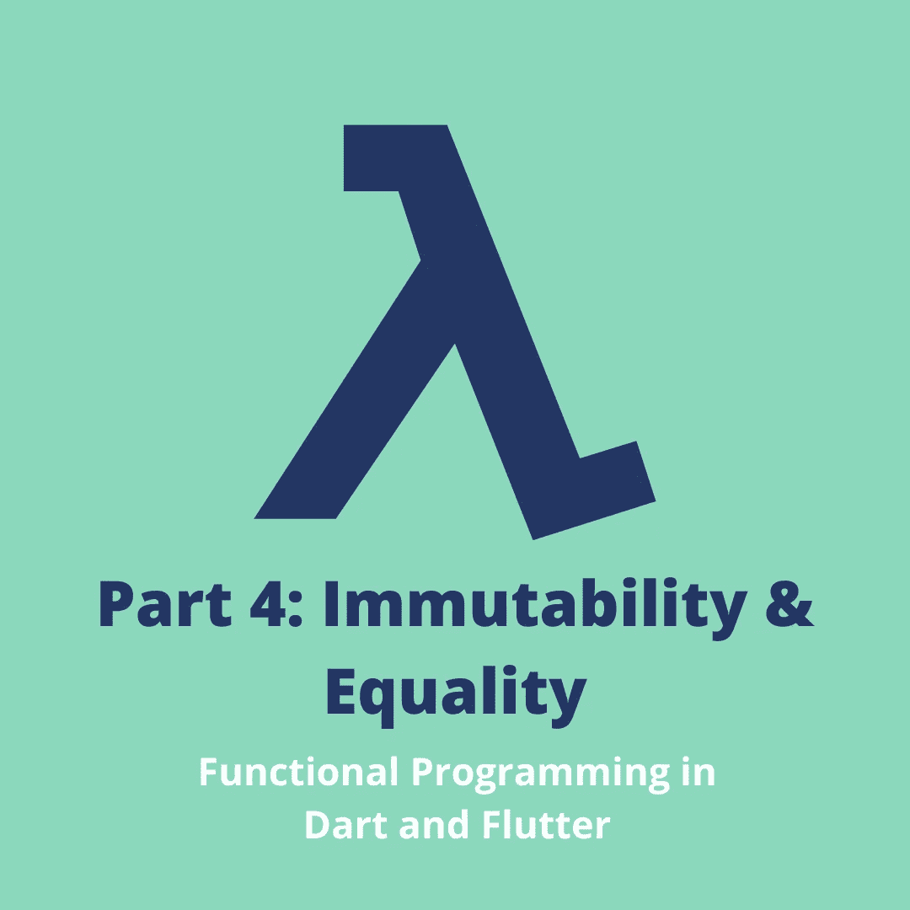
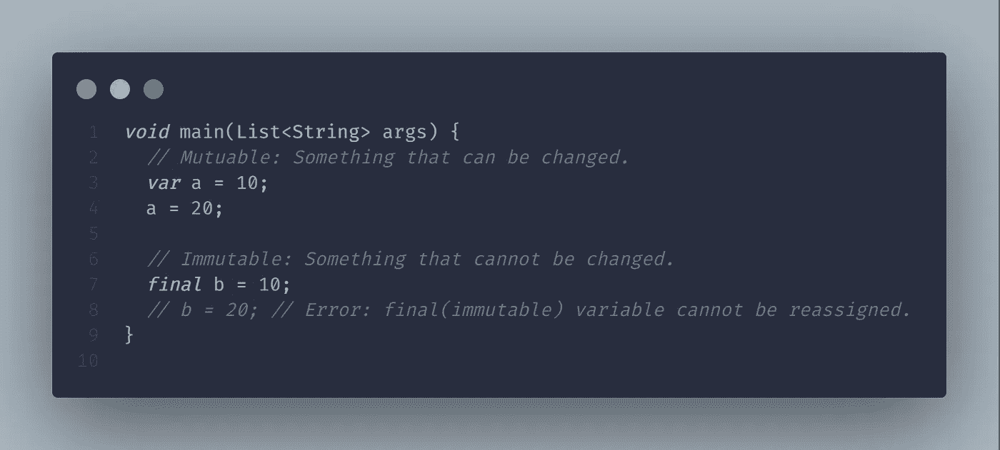
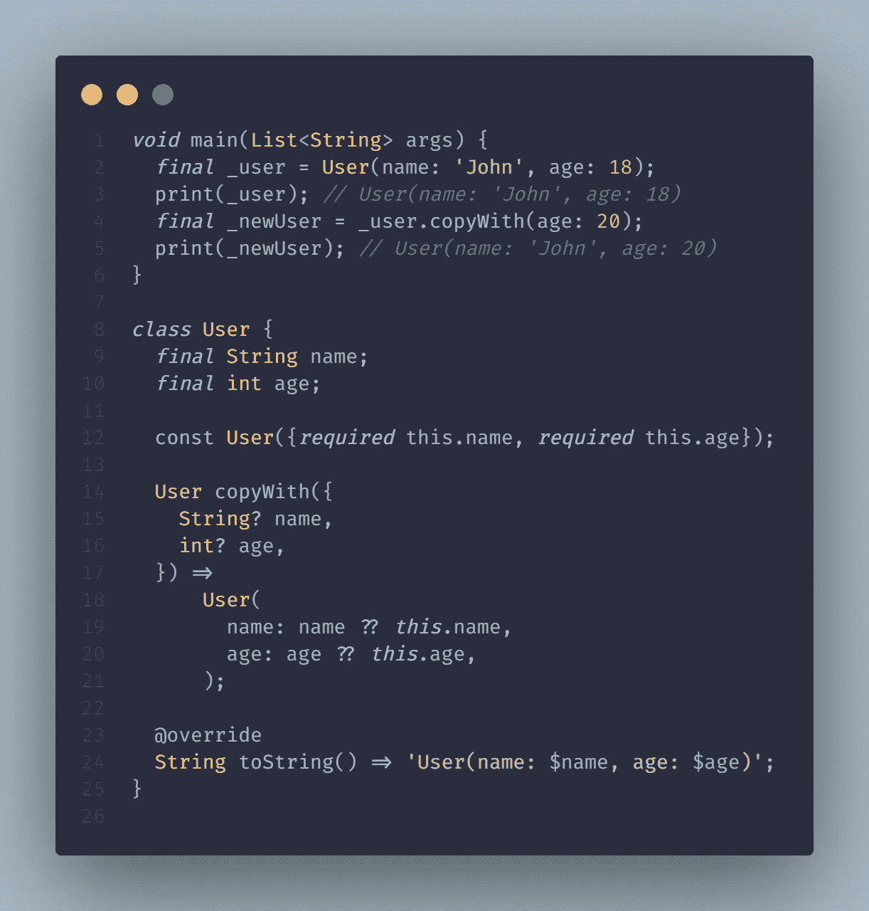
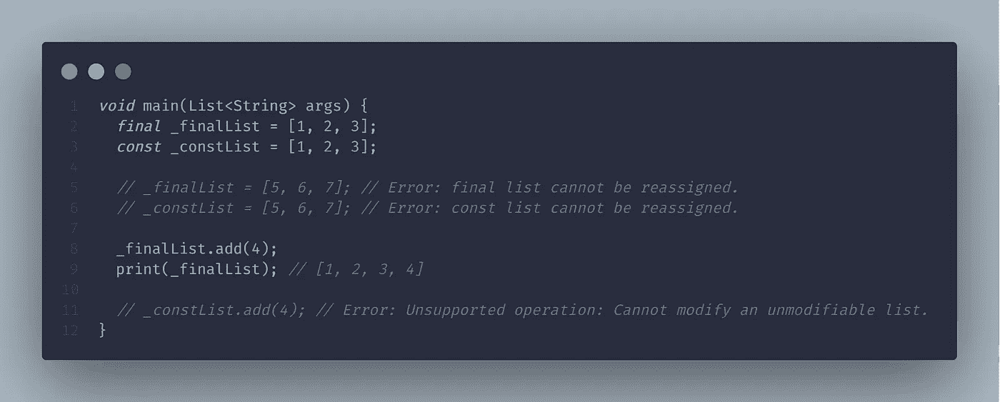
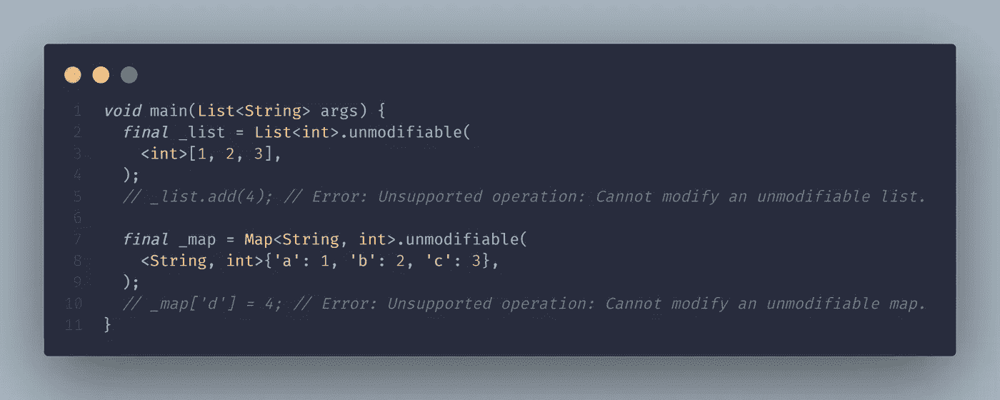
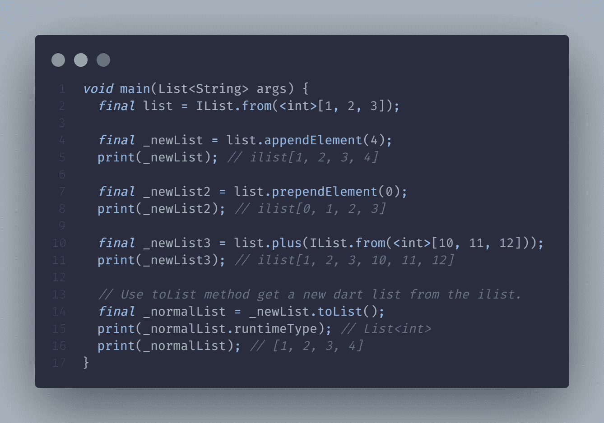
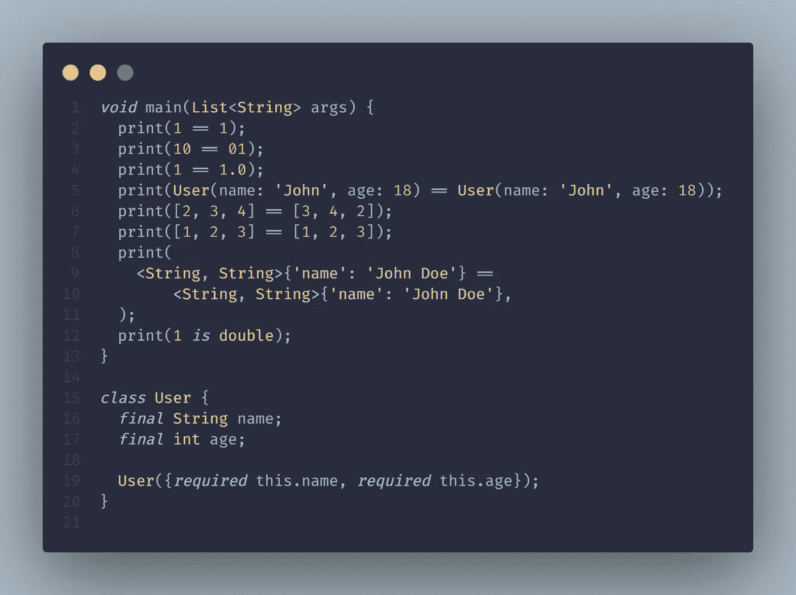
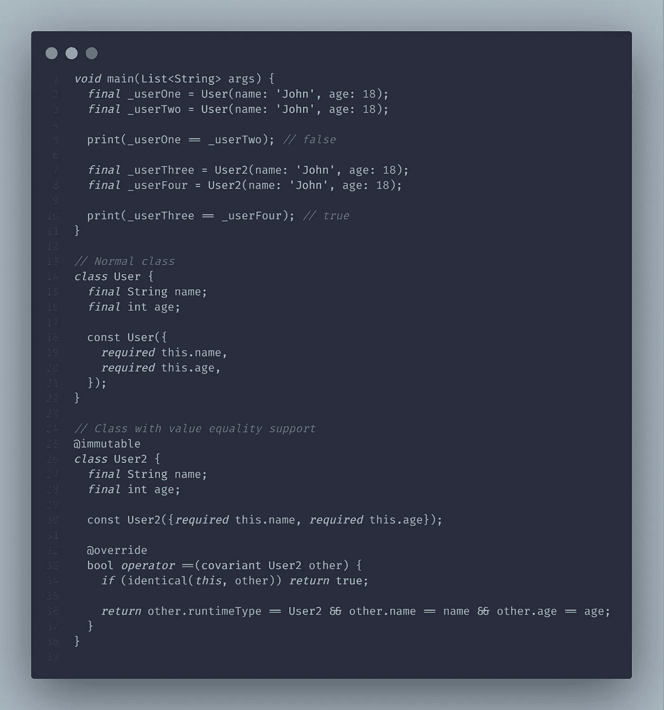
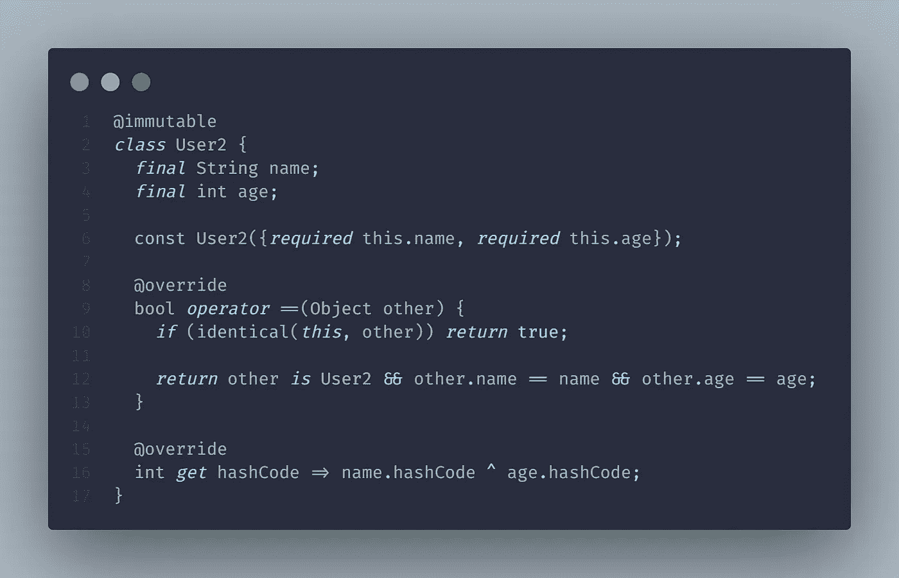
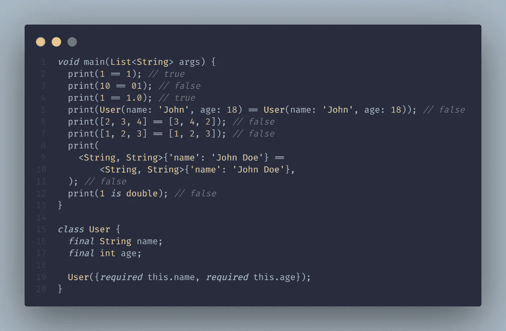

# Flutter 和 Dart 中的不变性和相等性[函数式编程—第 4 部分]

> 原文：<https://levelup.gitconnected.com/immutability-equality-in-flutter-dart-functional-programming-part-4-339a4e9312bb>

## [功能编程](https://medium.com/@yogi-6/list/functional-programming-in-dart-flutter-2f3ac9d7fa39)/不变性&相等

## 使用不可变的数据结构和值相等来最小化 bug 并维护大型应用程序。

之前，我们讨论了如何使用[组合](/composition-in-flutter-dart-functional-programming-part-3-ffba917aee3d)构建模块化和可伸缩的应用程序。本文涵盖 Dart &颤振中的不变性和相等性。

# 目录

*   [**定义不可变的**](#e905)
*   [**最终 vs 常量**](#6135)
*   [**为什么偏爱不变性？**](#5b0f)
*   [**如何更新不可变状态？**](#ee05)
*   [**不可变列表，地图**](#c2f1)
*   [**相等**](#79af)
*   [**相等运算符**](#0c30)
*   [hashCode](#504d)
*   [**列表，贴图，设置等式**](#3659)
*   [**最终想法**](#f657)
*   [**本系列其他文章**](#8c72)

# 不可变？

首先，可变的:可以随时间变化的东西。例如，当我们定义一个变量`int a = 10`时，它很容易改变。`a=20`完全有效。相比之下，我们有不变性。

正如你可能已经猜到的，不变性是无法改变的。当我第一次听到它时，它没有多大意义。一个不改变状态的应用有什么用？现在，我问自己，我怎么没有早点遇到这种情况。

在 Dart 中使用两个关键字可以实现不变性:`final`和`const`。什么时候更喜欢哪个？让我们来了解一下！

# 最终与常量

## 最后的

`final`变量在运行时被求值。如果我们不打算更改值，建议使用 final 而不是 var 关键字，或者指定显式类型(int，String)。Dart 分析器足够智能来推断类型。

## 常数

另一方面，`const`是一个编译时常数，并且是隐式的 final。因此该值在编译时必须是已知的，并且不能被重新分配。

好吧，但是我们为什么要努力实现不可变的数据结构呢？

# 为什么更喜欢不变性？

*   **bug 更少:**就地改变值有破坏代码库的可能。不变性有助于避免意外的重新分配。使用 mutable，有人可以意外地更新我们正在访问的对象，导致难以跟踪的错误。
*   代码变得可预测和易于阅读。
*   当 const 在编译时求值时，编译器预先知道这个值，并把它存储在内存中。在整个应用程序中引用确切的值，而不是每次都创建新的对象。因此，这有助于节省一些内存，并具有较小的性能优势。

在我们的 Flutter 应用程序中，我们有 10 个地方使用了`EdgeInsets.all(8.0)`,作为一个例子。通过使用`const`，我们告诉编译器只创建一个实例，并在需要填充 10 的应用程序中使用同一个实例。

`const`不仅可用于原语，还可用于值不变的类、列表、映射和集合。

好吧，很公平！但是如果我们一直到处使用不可变的数据结构，我们将如何更新状态呢？

# 如何更新不可变状态？

当然，一个不改变，只显示静态内容的应用有多大用处？不多，对吧？那么我们如何更新状态呢？ ***我们不是改变值，而是替换它们*** 。我们创建需要访问和使用的实例的副本。它可以防止意想不到的副作用。

我们可以使用`copyWith`方法让我们的生活变得更容易，但是我们需要首先实施它。

`copwWith`创建实例的副本，并且只更新显式传递的值。

像`int`这样的原语在默认情况下是不可变的。比如一个 8 永远是一个 8；我们不能把它突变成其他数字。在上面的代码片段中，我们看到了如何使一个类不可变。

> 使用 **@immutable** 注释来获得分析器对创建不可变类的支持。

像列表、映射等其他数据结构呢？？让我们来了解一下！

# 不可变的列表、映射

我们可以在列表中使用`final`和`const`，但是有一个警告。

由于两个列表都是`final`或`const`，我们不能分配新列表(参考。第 5 行和第 6 行)。但是，在 final 的情况下，我们仍然可以添加/删除列表中的元素。我们可以利用`unmodifiable`工厂构造函数使这些数据结构完全不可变。

如果我们试图添加/删除元素，我们将在运行时得到以下错误。这当然可行，但是如果我们能在编译时实现这一点不是更好吗？kt_dart 包用不可变的数据结构帮助我们，但是因为我们已经在使用 dartz，我们可以使用`IList`，它提供了一个不可变的列表。

在第 2 行，我们从一个常规列表中创建了一个`IList`实例。这是完全不可改变的。为了添加/删除元素，我们有`appendElement`和`prependElement`，它们分别在最后一个位置和第一个位置添加元素。它不会就地更新元素，而是返回一个新列表。

# 平等

在开始之前，这里有一个有趣的练习。试着猜测下面的输出。

相等是通过使用`==`操作符检查两个对象是否相等的方法。平等有两种类型:指称平等和价值平等。例如，我们有一个包含两个字段的用户类:姓名和年龄。当我们初始化用户类时，对象被创建并存储在内存中。每个对象都有一个唯一的分配给它的内存地址。

**引用相等**当两个对象引用同一个对象时返回 true。对于返回 true 的对象，它们应该指向内存中的同一个对象。

**值相等**当两个对象具有相同的值时，返回 true。对象可以在内存中的不同位置，但是如果它们具有相同的值，则返回 true。

# 等式运算符

默认情况下，Dart 检查引用是否相等。如果我们比较 dart 中任意两个具有相同值的非常数对象，它的计算结果为 false。`==`操作符的默认实现是，如果两个对象相同，换句话说，如果两个对象相同，则返回 true。

为了支持值相等，类需要:

*   **Total:** 它应该总是返回一个布尔值，并且从不抛出错误或返回 null。
*   **反身:** a == a 应该总是返回 true。
*   **对称:** a == b 应该与 b == a 相同，要么两者都应该求值为 true，要么两者都应该求值为 false。如果 a 等于 b，那么 b 应该等于 a。
*   **传递:**如果 a == b 为真，b == c 为真那么 a == c 应该为真。

`User`，常规类，`User2`，值相等的类。当比较两个具有相同值的`User`对象时，它的计算结果为 false，因为它默认使用引用相等。然而，当比较两个具有相似值的`User2`对象时，它评估为 true，因为我们已经实现了值相等。

但是等等，还没完呢！

# 哈希码

在覆盖`==`操作符时，我们需要确保覆盖 hashCode。但是首先，到底什么是 hashCode？

hashCode 的类型是`int`，表示对象的状态。默认实现表示对象的标识。

如果`==`操作符被覆盖，我们也应该覆盖 hashCode 来表示状态；否则，这些对象就不能用在像 Map 这样的基于散列的数据结构中。

> hash_and_equals 将它添加到您的 analysis_options.yaml 中，以获得分析器对 hashCode 的支持。

# 列表、映射、集合等式

比较列表和映射等集合时，会检查引用是否相等。当我们需要检查值是否相等时，像`listEquals`和`mapEquals`这样的方法可以帮助我们。

为了逐个元素地检查，我们需要集合包通过`DeepCollectionEquality`提供的深度相等，这是 Flutter 用作依赖的包之一。它支持两种模式:有序和无序。

如果我们使用的是`IList`，默认情况下我们会得到值相等的支持。

现在是揭晓上述测验答案的好时机。

`print(1 == 1)`和`print(10 == 01)`如您所料分别返回 true 和 false。

第 5 行返回 false，因为默认情况下，dart 检查引用是否相等。为了支持值相等，我们需要覆盖`==`操作符和`hashCode`。

对于第 6–11 行，表达式的计算结果为 false。像`listEquals`和`mapEquals`这样的方法来比较集合包中的值相等或`DeepCollectionEquality`。

对于打印`(1 == 1.0)`和`print(1 is double)`有更多的引擎盖下发生的事情，访问[这篇文章](/why-dividing-by-0-does-not-throw-an-error-in-dart-how-dart-handles-numbers-a17ac8e5630c)了解更多。

# 最后的想法

因此，不变性和相等性将有助于减少意外的错误，并使代码可预测。在开始的时候，这看起来像是很多工作，但在我看来，这是值得努力的。在下一篇文章中，我们将深入探讨高阶函数和递归。

**牛逼！**拍拍自己的背，因为你坚持到了最后。我希望我为你投入的时间增加了一些价值。在 [**GitHub**](https://github.com/Yogi-6/functional_programming_dart) 知识库上找到更多例子，并在 [**Twitter**](https://twitter.com/_yogi_6) 或 [**LinkedIn**](https://www.linkedin.com/in/yogi6/) 上寻求建议/问题或任何你希望我涵盖的主题。你可以鼓掌支持👏，感谢您的阅读:)更多信息请关注😄

下次见，伙计们！

# 本系列的其他文章

*   [基础](https://yogi-6.medium.com/functional-programming-in-dart-foundation-part-0-7e932517b824)
*   [纯功能&副作用](https://yogi-6.medium.com/pure-functions-side-effects-in-dart-functional-programming-part-1-fb931d6c0351)
*   [Arity、Closure、Currying、Partial Application & more。](/arity-closure-currying-partial-application-more-in-dart-functional-programming-part-2-4534a8b7f374)
*   [作文](/composition-in-flutter-dart-functional-programming-part-3-ffba917aee3d)
*   不变性和平等
*   [高阶函数&递归](https://medium.com/flutter-community/higher-order-functions-recursion-in-dart-functional-programming-part-5-4237bc114005)