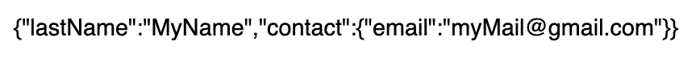

# Redux 和 useSelector 的不变性

> 原文：<https://levelup.gitconnected.com/immutability-with-redux-and-useselector-39e5a91da1e0>

我们最喜欢的两个标志

最近，在看了一个拉请求后，我看到一个同事直接在一个从`useSelector`出来的对象上使用关键字`delete`。

即使在 JS 对象上应用 delete 并不是一个很好的实践，并且经常受到副作用的影响，我们也想知道 redux 存储会受到删除的影响有多坏。

剧透警告:非常糟糕

# 示范

我在 sandbox.io 上创建了一个[新项目来进行测试。我们感兴趣的两个主要文件是主文件(App.js)和用户缩减器(userReducer.js ),其中也包含了用于本文目的的操作。](https://codesandbox.io/s/userselectornonimmutable-cr2qz)

App.js

userReducer.js

App.js 的渲染

因此，我们的`App.js`是一个简单的应用程序，将用户商店显示为字符串，然后显示五个不同的按钮供我们实验。
`userReducer.js`是一个基本的减压器，允许设置姓氏并将存储复位到初始状态。

现在，让我们来看看按钮。`refresh`按钮正在调用函数`updateUserObject`，并将使用减速器将存储器中的`lastName`设置为特定值`MyName`。这样做的目的是触发 react 组件上的刷新，以查看存储是否在正常流程之外被修改。

两个删除按钮(名字和电话)用于从 userSelector 返回的对象中删除一些数据。我们正在测试移除对象根处的原语(测试浅拷贝)和嵌套对象中的原语(深拷贝)

这里的重置按钮用于将存储重置为初始状态。

最后，`print initial state`按钮会在控制台上打印初始状态。

## 实验一:浅层复制

那么，Redux 在调用 useSelector 时有没有做什么浅层复制？我们可以通过点击`remove first name`按钮，然后调用刷新按钮来验证。如果有浅拷贝，我们期望 UI 不要改变。
下面是我们得到的结果:

名字在哪里？？

如你所见，第一个名字不见了！这意味着点击`remove first name`时调用的删除产生了非常不好的副作用！

## 实验二:深度复制

我想你已经知道答案了，但是作为优秀的科学家，我们不能在没有测试的情况下做任何假设。让我们首先刷新以回到初始状态，然后点击`Remove phone`按钮，接着点击`refresh`，看看发生了什么。

手机不见了

如你所料，深度复制并不更成功。JS 不会原谅玩坏对象的人，Redux/React-Redux 也不例外。

## 实验奖金:我可以重置吗？

有两个按钮我们还没有使用。最后两个。

这是我第三个实验的案例。我们删除了名字和电话。然后我们刷新。之后，我们重置到初始状态(不要忘记刷新之前不包括以前的实验)

同样的结果。不应该重置吗？

很奇怪吧？我们期望重置到 reducer 中定义的初始状态。之所以没有发生，是因为到处都在用初态的参考！如果没有 copy，那么我们最终不仅仅是删除存储中的项目，还会删除初始状态中的项目！初始状态的 console.log 证明了这一点(点击`print initial state`，看一下控制台)

具有缺失项目的初始状态对象

## 这些实验的结论

我们很多人都知道`delete`是一种非常危险的做法，应该非常小心地使用。但是在 Redux 环境中，对于应用程序的完整性来说，这可能是灾难性的！这就是为什么我们建议总是复制最大值(使用`{...myObj}`的浅层复制或使用众所周知的`JSON.parse(JSON.stringify(myObj))`(或深层复制库)的深层复制)

# 避免存储外部减速器可变性的解决方案

我将对这篇文章提出两个解决方案。

## 总是（德语词）

 [## 总是（德语词）

### 通过改变当前状态来创建下一个不可变状态

www.npmjs.com](https://www.npmjs.com/package/immer) 

**Immer** 在我看来是最简单的解决方案。这是另一个第三方库，它包装了 reducers 并返回不可变对象。因此，你可以对你的对象使用尽可能多的删除，你不会对存储有任何副作用。你可以看到一个例子，在这个 [sandbox.io 项目](https://codesandbox.io/s/userselectorimmutable-mj055)上试一试。

## redux-工具包

 [## @reduxjs/toolkit

### 官方的、固执己见的、包含电池的高效 Redux 开发工具集(以前称为“Redux Starter…

www.npmjs.com](https://www.npmjs.com/package/@reduxjs/toolkit) 

Redux-Toolkit 更大更耐用，但也包含了更多的特性。这也迫使开发人员尊重使用 redux 的良好实践。引擎盖后面用的是 Immer。

我希望你像我喜欢写这篇文章一样喜欢它。JS 是一种充满惊喜的语言，尝试我们的问题是理解它的最好方式！

下一篇文章再见！
雷米