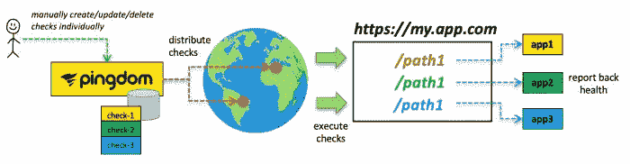
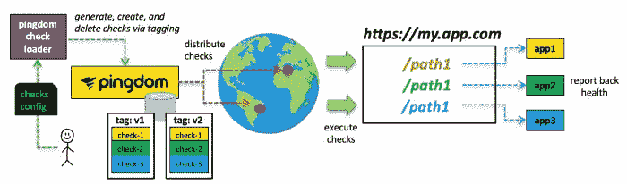
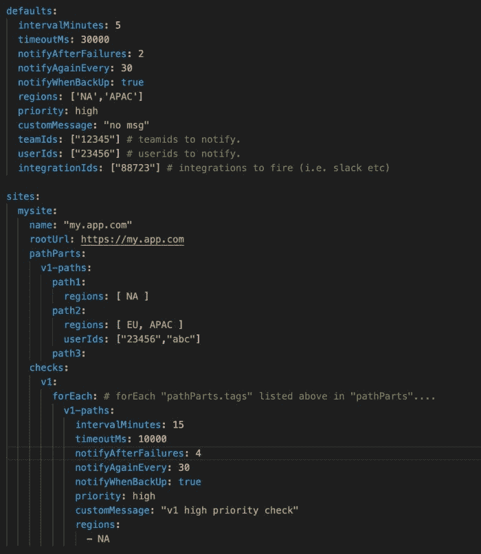

# 不变的健康检查管理

> 原文：<https://levelup.gitconnected.com/immutable-health-check-management-35c6102d4ccc>

如果您曾经必须监控应用程序、端点或网站，您可能会遇到数百种监控服务，它们可以从 N 个全球端点执行简单的基于 HTTP 的检查，然后在达到特定阈值时通知操作员。其中一个广为人知的服务就是 [Pingdom](https://www.pingdom.com/) *。*

在过去的一个项目中，该团队的任务是监控一个由多个底层组件组成的应用程序，每个组件都显示在单个端点 FQDN 之后，其中各种路径实际上由 N 个底层应用程序提供服务，每个应用程序要么公开自己的运行状况检查，要么只需返回一个 200 来指示它们已启动。不幸的是，FQDN 和后台应用程序不在任何为健康检查端点提供最基本的内部设施的云平台或 orchestrator 中。更不用说来自 N 个全球端点。因此，我们不得不利用第三方外部服务；最后变成了 Pingdom。默认情况下，使用 Pingdom，创建和管理这些“开箱即用”的健康检查监视器的过程最终会是这样的:



显然，如果您曾经不得不使用这样的监控服务，这并没有什么突破性的:

*   用户认证进入监控应用程序
*   用户在 GUI 中或通过 API 调用为 N 个端点手动配置一个或多个“检查”
*   监控平台本身存储这些配置，然后将它们分发给所需的全局监控器
*   世界各地的监视器执行检查并向平台报告
*   如果达到阈值，就会发出警报。

手动管理潜在的几十个检查，其中许多共享相似的样板特征是没有吸引力的。

该应用程序的监控需要能够适应新的应用程序迭代部署到生产环境中，并逐步向用户推出(即 canary 版本)。团队不希望在每次需要监控变更或需要监控新版本(在不同的环境中)时都必须手动重新配置(或重新添加)N 次检查。相反，该团队希望找到一种方法来管理一个“集”或“组”监视器，并同样从模板中生成这些监视器。其次，这些监视器配置的“集合”应该是不可变的。*创建一个新的“检查集”,然后在以后停用任何“检查集”配置。*

幸运的是， [Pingdom 提供了一个 API](https://docs.pingdom.com/api/) 和“标记”命名监视器配置的能力。通过“标记”,我们最终可以创建我们想要实现的这些“检查集”的物理表示，并生成新的监视器“集”,并在更高的级别上管理它们…例如，可能更像这样:



# 走向

在与 Pingdom 的 API 进行了一些争论之后，我最终创建了一个小的[实用程序](https://github.com/bitsofinfo/pingdom-check-loader)，它将让一个开发人员[管理一个 YAML 检查配置文件](https://github.com/bitsofinfo/pingdom-check-loader/blob/master/checkconfigs.yaml)，允许创建者定义一些默认的检查行为，然后是一个或多个命名的*“站点”，*，每个站点包含一个 FQDN，然后是一个或多个*“路径部分”；*其中， *"pathPart"* 被简单地定义为 URI 的某个部分，它可以包含一个或多个值，每个值都可以覆盖默认设置中定义的*"检查行为"*。

然后，操作者定义一个*“checks”*部分，该部分定义一个或多个命名的*“checks”*，每个都支持一个“forEach”指令，该指令可以以嵌套的方式用于为给定的*“site”+“path parts”*创建完整的 URI 路径，以生成要检查的唯一 URIs。每个生成的检查都标记有一个共享的时间戳标识符以及每个*“检查”名称、“站点”和“路径部分”的单独标签；*通过标签许可管理。

一个 ultra basic 配置文件看起来像这样，它定义了应该检查“my.app.com”站点的 3 个路径；由此产生了 3 个不同的 Pingdom 检查；每个唯一的“监视器”通过继承的设置来定义其行为。



哪个(在模拟运行中)模式生成一组检查，这些检查将通过其 API 推送到 Pingdom，如下所示:

```
loader.py --checks-config-file config.yaml --dump-generated-checks

2020-08-25 19:05:25,259 - root - DEBUG - generateChecks() initiating run w/ id: 20200825_19052525
2020-08-25 19:05:25,265 - root - DEBUG - Reading sites[mysite]
2020-08-25 19:05:25,266 - root - DEBUG - Reading sites[mysite].checks[v1]
2020-08-25 19:05:25,266 - root - DEBUG - sites[mysite].checks[v1] generated 3 checks.

------------------------------
v1
------------------------------
['NA'] -> https://my.app.com/path1 
    every:15m timeout:10000ms notifyAfter:4 fails, 
    priority:high users:['23456'] teams:['12345'] integrations:['88723'] 
    again:30 intervals, whenBackUp:True 
    tags:['20200825_19052525', 'v1', 'my_app_com', 'priority-high', 'path1']

['NA'] -> https://my.app.com/path2 
    every:15m timeout:10000ms notifyAfter:4 fails, 
    priority:high users:['23456', 'abc'] teams:['12345'] integrations:['88723'] 
    again:30 intervals, whenBackUp:True 
    tags:['20200825_19052525', 'v1', 'my_app_com', 'priority-high', 'path2']

['NA'] -> https://my.app.com/path3 every:15m timeout:10000ms notifyAfter:4 fails, 
    priority:high users:['23456'] teams:['12345'] integrations:['88723'] 
    again:30 intervals, whenBackUp:True 
    tags:['20200825_19052525', 'v1', 'my_app_com', 'priority-high', 'path3']
```

..这些检查一旦被推送到 Pingdom，就可以通过它们的标签作为一个“集合”来管理，例如:

```
./loader.py \
    --checks-config-file config.yaml \
    --delete-tag-qualifiers 20200825_19052525 \
    --delete-in-pingdom \
    --pingdom-api-token-file trial.token
```

一旦定义了配置文件，就可以专门添加新的“站点”,并重新运行以重新生成新的检查集，这些检查集将通过标记机制加载到 Pingdom 中并作为“集”进行管理:

现在的场景看起来更像这样:


# pingdom-检查加载程序

net-net 所开发的东西可以在 pingdom-check-loader 的 [Github 上获得，它的工作方式与描述的差不多。](https://github.com/bitsofinfo/pingdom-check-loader)

该实用程序定义了一个简单的 CLI，允许您在 YAML 文件中声明所需的检查配置状态；CLI 使用该配置，然后生成一个或多个由该配置驱动的检查。有关配置格式的更多文档和细节，请参见示例 [checkconfigs.yaml](https://github.com/bitsofinfo/pingdom-check-loader/blob/master/checkconfigs.yaml) 。

一旦生成检查，就可以针对目标 Pingdom 帐户创建检查。此 CLI 不支持变更以前定义的检查。支票变化本质上是附加的。您可以生成和制作新支票，并且只能删除旧支票。现有的检查(虽然在 Pingdom GUI 中是可编辑的)通过这个 CLI 设计是不可变的。

由该实用程序生成和创建的检查是不可变的；生成的检查被适当地标记，以便通过 Pingdom 的 GUI 和 API 容易地找到。标签是基于 CLI 调用`timestamp`和`pathParts`(参见 YAML)自动创建的，因此所有生成的检查都可以作为一个集合来管理。然后，您可以使用这些标记来删除检查(通过这个 CLI)，当您的需求发生变化时，这些检查可以被它们的更新的迭代所替换。你可以按照你想要的任何顺序做事；例如，创建一个版本的检查，然后交互并生成第二个迭代；在您的第二次迭代按预期运行之后，您可以使用传递第一次迭代标识符`timestamp`的`--delete-tag-qualifers`标志来清理第一次迭代。

【https://github.com/bitsofinfo/pingdom-check-loader 

这里有一些关于 Pingdom API 的关键问题需要注意。特别是 GUI 和 API 针对多重选择处理区域的方式；没有简单的方法通过 UI 或 API 获得用户、团队和集成标识符*(您必须在 Pingdom 的 GUI 中的 HTML 源代码中检查和查找*

*原载于 2020 年 8 月 25 日 http://bitsofinfo.wordpress.com*[](https://bitsofinfo.wordpress.com/2020/08/25/immutable-health-check-monitor-pingdom/)**。**