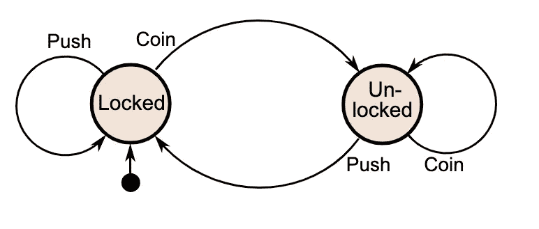
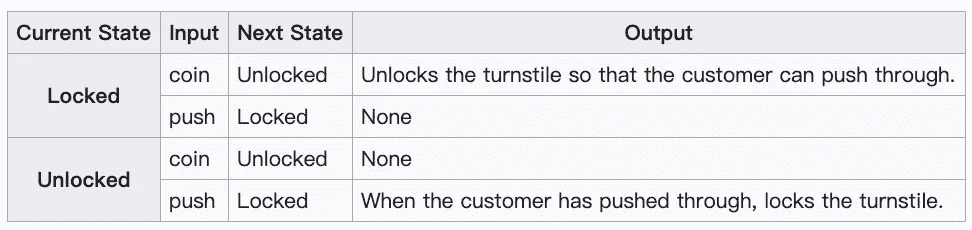
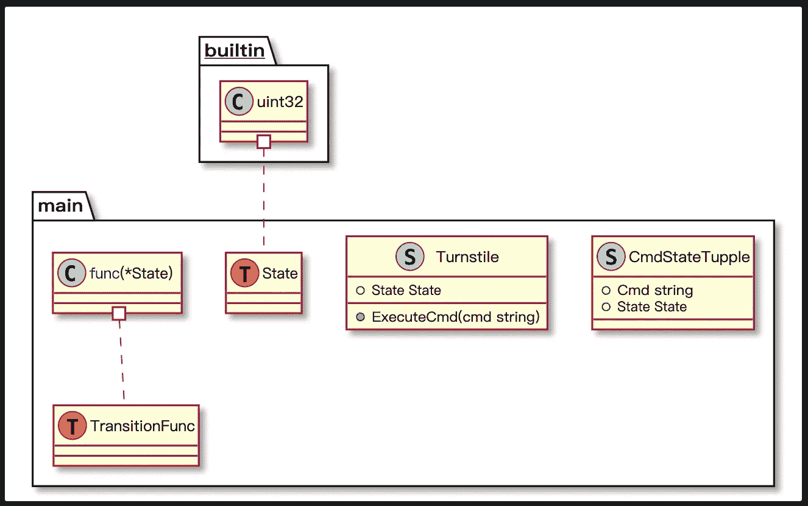

# 用 Golang 实现一个有限状态机

> 原文：<https://levelup.gitconnected.com/implement-a-finite-state-machine-in-golang-f0438b6bc0a8>

有限状态机是计算的一个基本概念。我们可以在现实生活中发现很多 FSM 的行为，比如自动售货机、电梯、红绿灯等等。

基于有限状态机的编程也是一个强大的工具来模拟复杂的状态转换，它可以大大简化我们的程序。

# 什么是有限状态机

> 有限状态机(FSM)或简称为状态机，是计算的数学模型。它是一个抽象的机器，在任何给定的时间都可以处于有限数量的状态中的一个。FSM 可以响应一些输入从一种状态改变到另一种状态；从一种状态到另一种状态的变化称为过渡。
> 
> — [维基百科](https://en.wikipedia.org/wiki/Finite-state_machine)

有限状态机由三个关键元素组成:初始状态、所有可能状态的列表、触发状态转换的输入。

让我们以 turnstile 作为 FSM 建模的一个简单例子。



[维基百科的十字转门状态图](https://upload.wikimedia.org/wikipedia/commons/9/9e/Turnstile_state_machine_colored.svg)

像其他 FSM 一样，十字转门的状态机有三个元素:

*   它的初始状态是“锁定”
*   它有两种可能的状态:“锁定”和“解锁”
*   两个输入将触发状态改变:“推”和“投币”

# 在 Golang 中构建一个基于 FSM 的程序

接下来，我将构建一个模拟 turnstile 行为的命令行程序。

当程序启动时，它会提示用户键入一些命令，然后它会根据输入的命令改变其状态。

## 版本 1，以简单的形式实现 FSM

首先，我们定义了两个状态(`Locked & Unlocked`)和两个有效命令(`CmdCoin & CmdPush`)。

在函数`main`中，我们设置初始状态为`Locked`，打印使用信息给用户。

然后我们开始主循环，从`stdin`中读取命令字符串，根据当前状态处理命令。

您可能会注意到，我们必须为每个状态处理未知命令，这可以通过小的重构来改进。

此外，如果我们将状态转换的逻辑提取到一个函数中，程序将更具表现力。

## 版本 2，重构使代码更加清晰

在实践中，状态机通常由一个[状态转换表](https://en.wikipedia.org/wiki/State-transition_table)来表示，对于我们的十字转门示例，该表看起来像这样:



[维基百科的状态转换表](https://en.wikipedia.org/wiki/Finite-state_machine#Example:_coin-operated_turnstile)

我们可以用状态转移表来实现 FSM。

## 版本 3，引入状态转换表

使用这种方法，所有可能的转换都列在表中。易于维护和理解。如果需要新的转换，只需添加一个表条目。

由于 FSM 是一个抽象机器，我们可以更进一步，用面向对象的方式实现它。

## 版本 4，用一个类对 FSM 建模

引入了一个新的类`Turnstile`，它有一个属性`State`，一个名为`ExecuteCmd`的方法。

触发状态转换的唯一方法是调用方法`ExecuteCmd`。

该关系可以用下面的有向图表示:



把所有的东西放在一起，这是完整的源代码:

## 跑起来

让我们试一试这个程序:

```
$ go run main.go
current state is [Locked], please input command [coin|push]
**foo**
unknown command, try again please
**push**
not allowed, unlock first
**coin**
unlocked, ready for pass through
**coin**
well, don't waste your coin
**push**
pass through, shift back to locked
**push**
not allowed, unlock first
^Csignal: interrupt
$
```

程序启动后，会出现一个提示字符串。

如果我们输入一个无效的命令“foo ”,我们会得到反馈，程序不知道这个命令。

由于初始状态是锁定的，如果我们试图“推”它，旋转门将不会打开。只有“硬币”命令才能解锁。

但是“投币”命令对解锁的十字转门无效。如果我们在这种情况下“推”它，旋转门的状态将恢复到锁定状态。

上面的例子展示了十字转门的所有典型转换。

# 结论

在这个故事中，我们介绍了 FSM 的概念，并构建了一个基于 FSM 的程序。

我们提供了该程序的四个版本。

*   v1，以简单的形式实现 FSM。
*   v2，做一些重构来减少代码重复
*   v3，引入状态转换表
*   v4，用 OOP 重构

在这次旅程之后，我希望你和我有同样的感觉:FSM 是一个简单而强大的工具，我们应该把它添加到我们的编程工具箱中。不是吗？