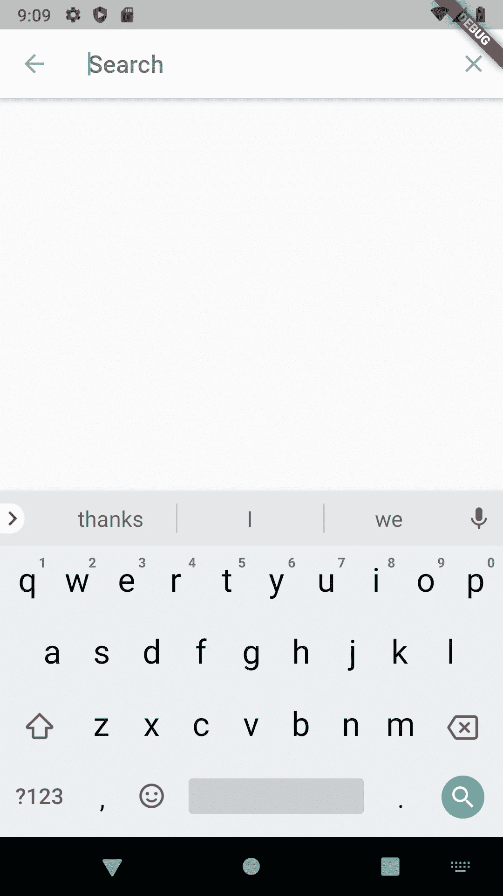

# 在 flutter 中实现搜索和过滤

> 原文：<https://levelup.gitconnected.com/implement-a-search-and-filter-in-flutter-56d046e12c05>

就像在 Android 中一样，有许多 flutter 小部件来实现搜索功能，但有一种更简单的方法来实现这一点，使用 flutter [SearchDelegate](https://api.flutter.dev/flutter/material/SearchDelegate-class.html) 类，它只需 4-5 个简单的步骤就可以提供几乎所有您想要的东西，所以让我们看看我们可以做些什么

颤动搜索

> 在我们开始之前，我们将需要探索两个类

## [SliverAppBar](https://api.flutter.dev/flutter/material/SliverAppBar-class.html)

当我们想要一个动态工具栏，当我们滑动或扩展它时，它会向我们显示内容，我们使用一个叫做 [SliverAppBar](https://api.flutter.dev/flutter/material/SliverAppBar-class.html) 的小部件，它总是 [CustomScrollView](https://api.flutter.dev/flutter/widgets/CustomScrollView-class.html) 的第一个子部件。

这将使一个可爱的应用程序栏有两个图标

接下来，我们将实现搜索功能。

# CustomSearchDelegate

要进行自定义搜索，您需要创建一个新的类来扩展 [SearchDelegate](https://docs.flutter.io/flutter/material/SearchDelegate-class.html) 类。在覆盖了 [SearchDelegate](https://docs.flutter.io/flutter/material/SearchDelegate-class.html) 方法之后，您将拥有这个类

现在让我们构建我们的搜索类，下面将显示一个简单的类

> 现在，我们只需将可爱的搜索应用程序栏与自定义搜索类连接起来

如果你还记得上面银色应用程序栏中的搜索按钮图标，我们只需要添加 showSearch 方法将应用程序连接到 searchClass，剩下的就是神奇的^-^.了

搜索小部件视图

我在示例中添加了一些可选功能，如即时搜索建议和最近搜索建议，源代码可以在这里找到。

[https://github.com/Ezaldeen99/search_demo](https://github.com/Ezaldeen99/search_demo)