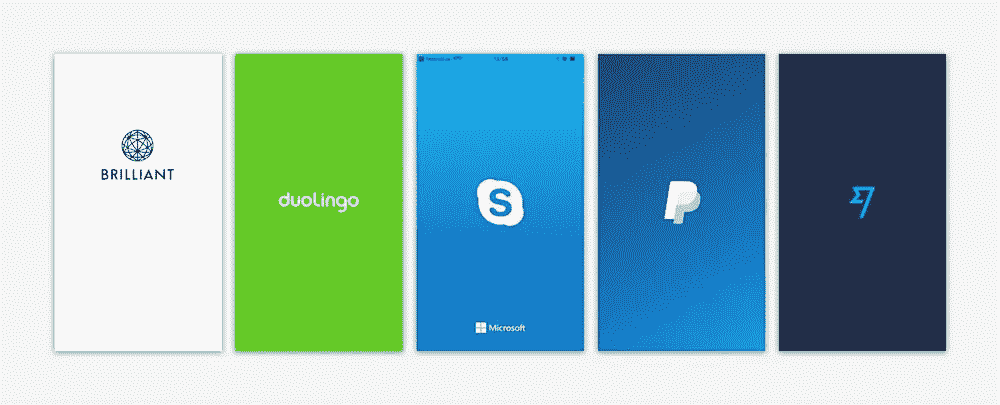
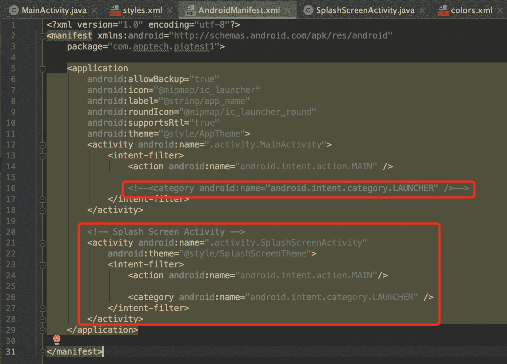

# 在 Android 中实现闪屏

> 原文：<https://levelup.gitconnected.com/implement-a-slash-screen-in-android-6589fa539317>



闪屏(来自谷歌)

在`res/drawable`下的`splash_screen.xml`中创建带有闪屏标志的背景:

```
<?xml version="1.0" encoding="utf-8"?>
<layer-list xmlns:android="http://schemas.android.com/apk/res/android" android:opacity="opaque">

    <item android:drawable="@color/splash_screen_bg_color" />
    <item android:drawable="@drawable/splash_logo" />

</layer-list>
```

在`res/values/styles.xml`中为闪屏创建**样式**:

```
<!-- Splash screen theme -->
<style name="SplashScreenTheme" parent="Theme.AppCompat.NoActionBar">

<item name="android:windowBackground">@color/splash_screen_bg_color</item></style>
```

**注意:**如果我想修改**状态栏**或**底部导航**的样式，修改`res/values/style.xml`文件中的属性([Ref:styles . XML 中的属性](https://blog.csdn.net/qq_34888942/article/details/80363267?utm_medium=distribute.pc_relevant_t0.none-task-blog-BlogCommendFromMachineLearnPai2-1.channel_param&depth_1-utm_source=distribute.pc_relevant_t0.none-task-blog-BlogCommendFromMachineLearnPai2-1.channel_param)):

```
<item name="android:windowFullscreen">true</item>
<item name="android:windowTranslucentNavigation">true</item>
```

在`AndroidManifest.xml`中为`SplashScreenActivity`设置风格为主题:

```
<!-- Splash Screen Activity -->
<activity android:name=".activity.SplashScreenActivity"
    android:theme="@style/SplashScreenTheme">
    <intent-filter>
        <action android:name="android.intent.action.MAIN"/>

        <category android:name="android.intent.category.LAUNCHER" />
    </intent-filter>
</activity>
```



AndroidManifest.xml

注意:确保注释这一行，因为我们希望`SplashScreenThemeActivity`成为`LAUNCHER`。否则会自动加载`MainActivity`。

创建一个`SlashScreenActivity`:

```
public class SplashScreenActivity extends AppCompatActivity { @Override
    protected void onCreate(Bundle savedInstanceState) {
        super.onCreate(savedInstanceState); Intent intent = new Intent(SplashScreenActivity.this, MainActivity.class);
        startActivity(intent); finish();
    }
}
```

**注意:**当我们从清单中加载闪屏时。所以不需要用任何 xml 布局来设置 ContentView()。

## 参考

*   在 Android 中实现闪屏的正确方法(更详细的解释可以在这篇文章中找到。)
*   [Android 中 styles.xml 的属性](https://blog.csdn.net/qq_34888942/article/details/80363267?utm_medium=distribute.pc_relevant_t0.none-task-blog-BlogCommendFromMachineLearnPai2-1.channel_param&depth_1-utm_source=distribute.pc_relevant_t0.none-task-blog-BlogCommendFromMachineLearnPai2-1.channel_param)