# 实现第三人称摄像机，就像《马里奥奥德赛》中的 Unity 一样

> 原文：<https://levelup.gitconnected.com/implement-a-third-person-camera-just-like-mario-odyssey-in-unity-e21744911733>

在这篇文章中，我将讲述我如何使用 unity 的 Cinemachine 和一些额外的代码实现一个像《马里奥奥德赛》中的相机一样移动的第三人称相机。

自从第一款带有自由视角相机的 3D 平台游戏《马里奥 64》发布以来，如何设计一个好的相机系统一直是每个开发人员在创作第三人称视角游戏时的问题。

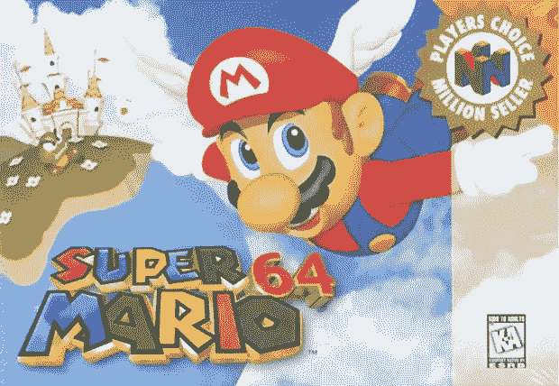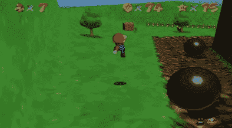

马里奥 64

几周前，我开始着手我的个人项目，目标是做一个 3D 游戏。我在环境上工作了一段时间，玩着色器，渲染&尝试了一些随机的想法。经过数周的实验。我觉得是时候在我的游戏中加入第三人称角色控制器了。

我没有使用 Unity 内置的角色控制器组件，而是选择在资产商店中使用[运动角色控制器](https://assetstore.unity.com/packages/tools/physics/kinematic-character-controller-99131)。该插件基本上为我处理任何与碰撞相关的计算。而且，它让我可以通过编程完全控制输入、动画和速度/旋转处理。我将来可以自由地实现任何一种游戏。听起来非常适合程序员！

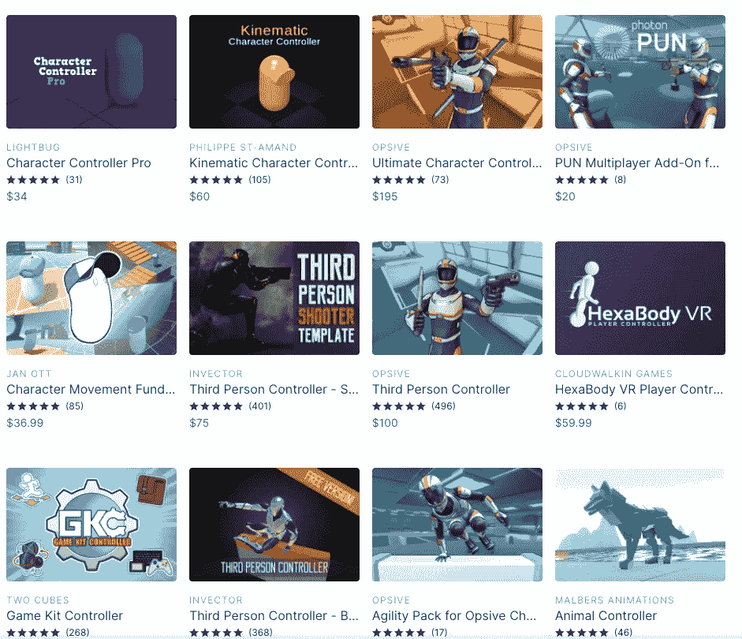

我们可以在 unity 资产商店找到各种各样的角色控制器插件。我更喜欢那些可以给我最大的自由来通过编码定制我的游戏。

随着示例脚本的正确设置，我现在可以移动我的角色和摄像机了。但是样本脚本中当前的轨道摄像机行为对我来说肯定是不够的。我甚至在 unity 编辑器中移动后感到有点恶心！

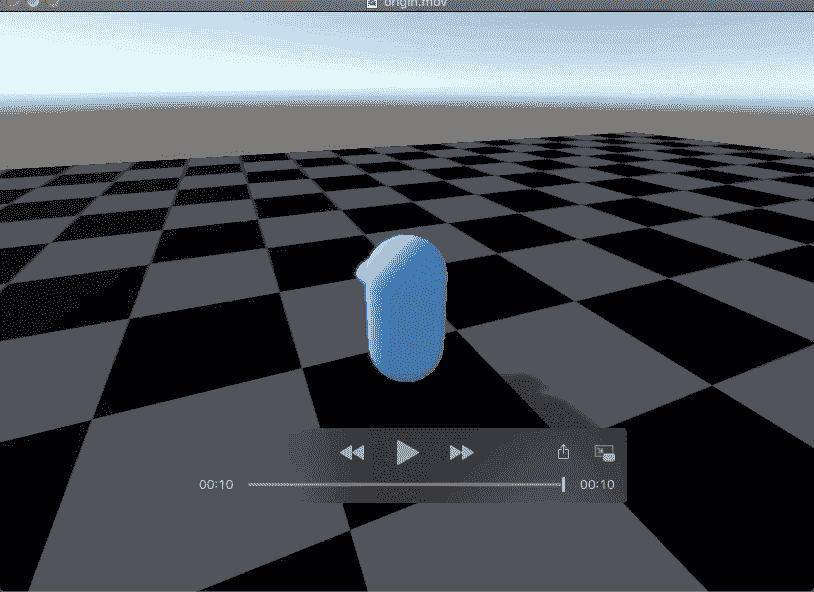

晕动病/恶心一直是视频游戏中的一个问题。如果镜头随着角色移动太精确？人们生病了。
动作太慢还是太快？仍然会引起疾病。真正的解决方案可能是坚持使用固定的摄像机。但是如果我们想要一个可以跟随玩家并且可以自由环视的相机呢？为了克服这个问题。我必须用第三人称相机研究其他游戏。

我使用马里奥奥德赛作为我的主要参考。甚至它可能不是所有游戏的完美解决方案。我认为它有一些伟大的想法，我们可以借鉴。

# 相机行为

让我们移动马里奥，分解它的摄像头的所有行为。

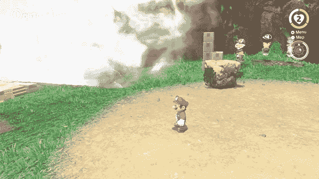

相机将顺利 Marios

一旦马里奥开始奔跑，摄像机就会跟进。下面的运动应该是一个平滑的运动。它使用[线性插值](https://en.wikipedia.org/wiki/Linear_interpolation)不断缩小相机和活动玩家之间的距离。

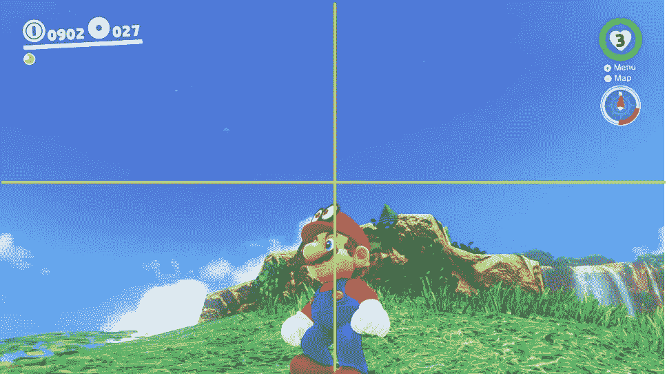

镜头似乎聚焦在马里奥的头顶。原因可能是因为玩家更容易进行平台化。因为玩家可以更多地关注环境。

让我们看看当马里奥表演不同跳跃时会发生什么。

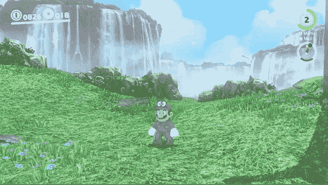

正常跳跃

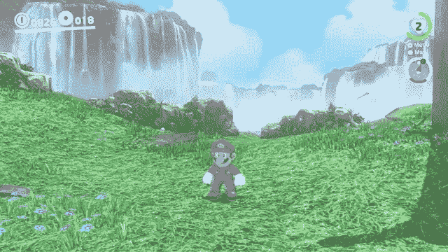

马里奥表演跳胯时，镜头上移。

这里面有什么隐藏的诡计！当执行正常跳跃时，摄像机没有沿着 Y 轴移动。相机将只沿着 XZ 平面移动。但是当玩家执行“**臀降跳**”时。就在马里奥跳出视口空间中一个不可见窗口之前，摄像机向上移动。我们得到了另一个规则:“如果玩家要从一个自定义大小的相机窗口移出，相机可以沿 Y 轴移动”。

以上行为尚未完成。如果马里奥双脚着地移动，摄像机也会更新它的 Y 位置。

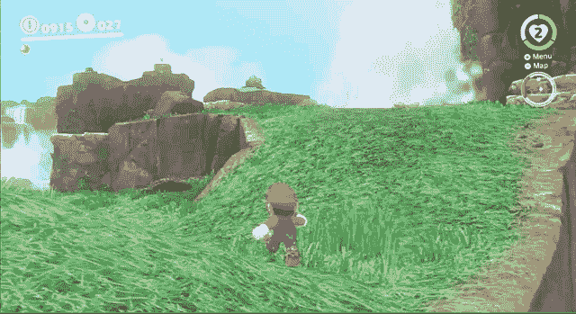

触发相机更新其 Y 位置的最后一件事是降落在不同高度的平台上。[这篇博文](https://www.gamasutra.com/blogs/ItayKeren/20150511/243083/Scroll_Back_The_Theory_and_Practice_of_Cameras_in_SideScrollers.php)称之为平台抢购。一旦玩家降落在另一个平台上，摄像机将捕捉到玩家的当前位置。

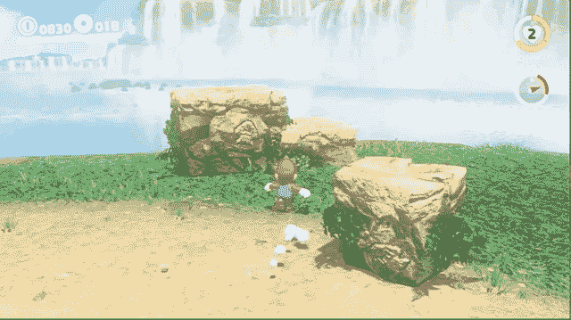

请注意，当马里奥降落在平台上时，摄像机只更新其 Y 位置

让我们总结一下我们发现的所有相机行为。

1.  **焦点在人物的上面**
2.  将玩家留在相机窗口内。
3.  **当玩家降落在不同高度的平台上时，捕捉到角色的位置。**
4.  **如果满足上述所有条件。当玩家在地面上移动时，它只更新摄像机目标的 Y 位置。**
5.  **Lerp 平滑运动。**

下一步是安装我们的摄像机。在这里，我使用 Unity 的 Cinemachine 作为我的游戏的相机系统的基石。Cinemachine 有一些很棒的功能，包括相机混合、碰撞处理、速度阻尼等等。

## 关于电影院

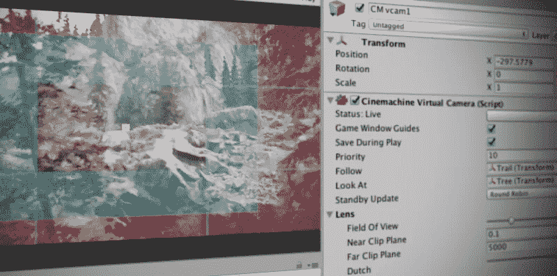

Cinemachine 是一套用于操作 Unity 摄像机的模块。Cinemachine 解决了跟踪目标、构图、混合和镜头间剪切的复杂数学和逻辑。它旨在显著减少开发过程中耗时的手动操作和脚本修改。

# 安装我们的摄像机

在**CinemachineFreeLookCamera**的帮助下。我们可以得到一个强大的第三人轨道摄像机。调整参数后，我们得到如下结果:

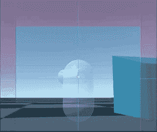

就现在。摄像机将聚焦于 cinemachine 组件中的**注视/跟随**变换集。这是我的角色控制器的网格变换。

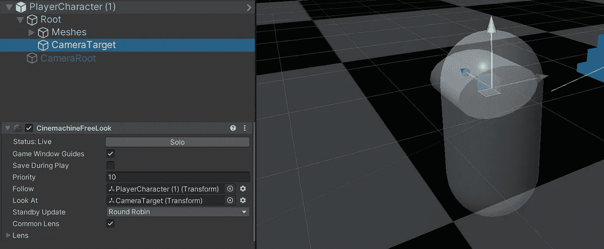

为了实现类似平台捕捉的行为。而不是跟随角色本身。我们必须遵循一个**幽灵**变换。然后，通过脚本更新它的世界位置。

创建一个空变换(重影。我在这里把它命名为 *cameraFollowTarget* 。拖动这个变换到**看**和**跟随**我们的 cinemachine free look 相机的属性。

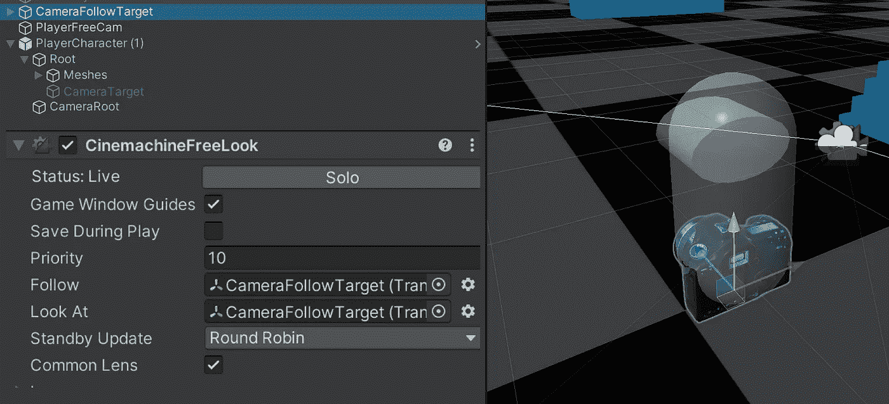

用于调试。我使用一个相机模型作为鬼变换的网格。

接下来，我们在每次调用 **LateUpdate** 时更新幻影转换的位置。

```
LateUpdate()
{
    ghostTransform.position = new *Vector3*(CharacterMesh.position.x,    ghostPositionY, CharacterMesh.position.z}
```

只有在以下情况下**ghostpositionony**变量才会改变:角色试图从视口移出或它满足行为 3 &行为 4。

```
// only invoke when character leaving the ground via jump or fall
void OnLeaveGround()
{
    // update Y for behavior 3
    ghostPositionY = CharacterMesh.position.y;
}LateUpdate()
{
    *Vector3* characterViewPos = cam.WorldToViewportPoint(CharacterMesh.position + characterVelocity * Time.deltaTime);

    // behavior 2
    if (viewPos.y > 0.85f || viewPos.y < 0.3f)
    {
        ghostPositionY = CharacterMesh.position.y;
    }
    // behavior 4
    else if(controller.IsGrounded)
    {
        ghostPositionY = CharacterMesh.position.y;
    }

     // Move the ghost
     ghostTransform.position = new *Vector3*(CharacterMesh.position.x,    ghostPositionY, CharacterMesh.position.z}
```

所有行为都设置好了。结果如下:

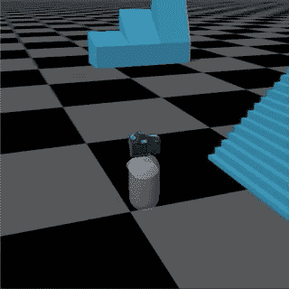

幽灵变身的位置变化看起来很突然。

重影变换看起来缺乏流畅的动作。把它抹平。使用矢量 3。更新幽灵位置时的 SmoothDamp api。

```
var desiredPosition = new *Vector3*(CharacterMesh.position.x, ghostPositionY, CharacterMesh.position.z);ghostTransform.position = Vector3.SmoothDamp(ghostTransform.position, desiredPosition, ref vel, desiredSmoothTime, followSpeed);
```

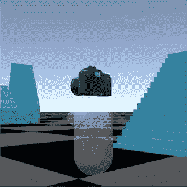

重影变换现在跟随平滑地更新它的位置。

最后，脚本将如下所示:

```
private float ghostPositionY;// only invoke when character leaving the ground via jump or fall
void OnLeaveGround()
{
    // update Y for behavior 3
    ghostPositionY = CharacterMesh.position.y
}LateUpdate()
{
    *Vector3* characterViewPos = cam.WorldToViewportPoint(CharacterMesh.position + characterVelocity * Time.deltaTime);

    // behavior 2
    if (viewPos.y > 0.85f || viewPos.y < 0.3f)
    {
        ghostPositionY = CharacterMesh.position.y;
    }
    // behavior 4
    else if(controller.IsGrounded)
    {
        ghostPositionY = CharacterMesh.position.y;
    } // behavior 5
    var desiredPosition = new *Vector3*(CharacterMesh.position.x, ghostPositionY, CharacterMesh.position.z); ghostTransform.position = Vector3.SmoothDamp(ghostTransform.position, desiredPosition, ref vel, desiredSmoothTime, followSpeed);}
```

行为 1 可以简单地通过设置 **CharacterMesh** 作为我们角色的子对象，并使其位于角色顶部来实现。

需要注意的一点是:上面的代码是为了显示更新相机位置的时间，而不是完整的代码。因为不同角色控制器有不同的冲突处理 api。

# 结论

好吧。要加载很多 gif。有很多功能我还没有谈到。像碰撞器碰撞和马里奥在物体后面时的透明度抖动。或者我们可以在过场动画中使用的大量相机混合。但我认为有很多帖子能比我更好地解释这些特性。

我将使用当前的设置来测试更多的游戏创意。如果我发现任何有趣的分享，我会写更多。

# 一些参考

[游戏中的第三人称视角——记录现代游戏中最常见的问题，从新游戏和复古游戏中获得解决方案](https://www.gamasutra.com/blogs/AndreasBuehler/20191111/353709/Third_Person_Camera_View_in_Games__a_record_of_the_most_common_problems_in_modern_games_solutions_taken_from_new_and_retro_games.php)

[回卷:侧卷相机的理论与实践](https://www.gamasutra.com/blogs/ItayKeren/20150511/243083/Scroll_Back_The_Theory_and_Practice_of_Cameras_in_SideScrollers.php)

[超级角色控制器](https://roystanross.wordpress.com/downloads/)