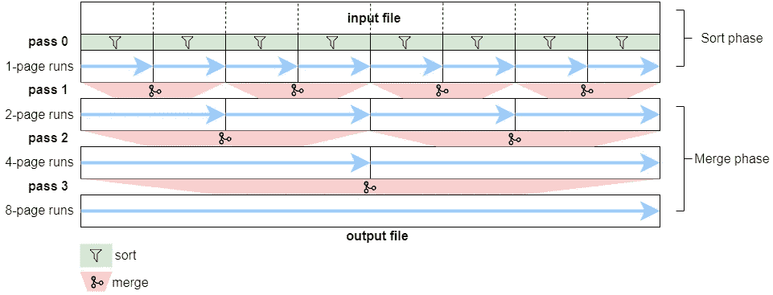
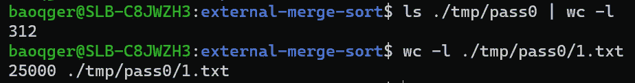
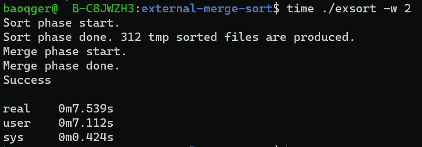
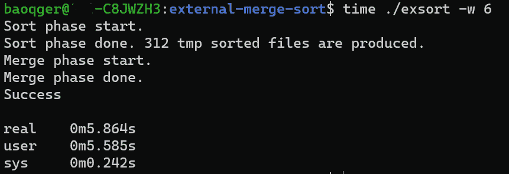

# 实现外部存储器合并排序算法

> 原文：<https://levelup.gitconnected.com/implement-an-external-memory-merge-sort-algorithm-373fada27c93>

# 介绍

这篇文章将检验我在阅读《编程珍珠*这本书时遇到的一个有趣问题。这个问题简单来说是这样的:`How to sort a large disk file? The disk file has so much data that it cannot all fit into the main memory.`这个`algorithm`问题我考虑了一会儿；但是注意到所有经典的排序算法，像`[Quick sort](https://en.wikipedia.org/wiki/Quicksort)`和`[merge sort](https://en.wikipedia.org/wiki/Merge_sort)`，都不能轻松解决。然后我做了一些关于它的研究，我将在这篇文章中分享我所学到的。相信看完这篇文章，你也能解决这个问题。*

# *外部算法的背景*

*传统上，计算机科学家通过计算执行指令的数量来分析算法的运行时间，通常表示为输入大小 n 的函数，就像众所周知的`[Big O notation](https://en.wikipedia.org/wiki/Big_O_notation)`。这种算法复杂性分析基于`Random access machine(RAM)`模型，该模型定义了以下假设:*

*   *有无限可用内存的机器；*
*   *在单位时间内可以访问任何期望的存储位置；*
*   *每条指令花费相同的时间。*

**

*随机存取机器模型*

*当算法需要使用的内存量小于运行该代码的计算机的内存量时，这种模型可以很好地工作。*

*但在现实世界中，一些应用程序需要处理的数据太大，无法一次放入计算机的主内存。而用来解决这类问题的算法叫做`external memory algorithms`或者`disk-based algorithms`；因为输入数据存储在`[external memory](https://en.wikipedia.org/wiki/External_storage)` [存储设备](https://en.wikipedia.org/wiki/External_storage)中。*

*代替`RAM`模型，基于`external memory model`对`external memory algorithm`进行分析。该模型由一个 CPU 处理器和一个连接到无限外部存储器的有限大小的内部存储器组成。一个 I/O 操作包括将一块连续的元素从外部内存移动到内部内存(这称为`[page cache](https://en.wikipedia.org/wiki/Page_cache)`，由内核管理。).*

**

*外部记忆模型*

*与主存储器相比，外部存储器的访问速度要慢[几个数量级](https://en.wikipedia.org/wiki/Memory_hierarchy)，尽管已经采用了`[SSD](https://en.wikipedia.org/wiki/Solid-state_drive)`等现代存储技术。因此，对于外部算法，性能的瓶颈是`disk IO`速度而不是 CPU 周期。*

*在本节中，我们检查了外部存储器算法的计算模型。接下来，让我们回顾一种典型的外部存储算法:外部排序。*

# *外部合并排序*

*类似于传统的内部排序算法，外部排序有几种不同的解决方案。在本文中，我将重点介绍`external mergesort`。*

*外部合并排序是内部合并排序的直接推广。该算法首先将 M 个输入项重复加载到内存中(由于内存缓冲区大小有限，一次只能存储 M 个输入项)，对它们进行排序，然后将它们写回磁盘。该步骤将输入文件分成一些(或者许多，如果输入文件非常大的话)排序的运行，每个运行有 M 个排序的项目。然后，该算法重复合并多个排序运行，直到只剩下一个包含所有输入数据的排序运行。*

*让我们用下面的例子模型来分析这个算法。首先假设内存缓冲区有限，大小为一个`page`。并且输入文件大小为 8 `pages`。外部 mergesort 可以分为两个阶段:`sort phase`和`merge phase`。*

**

*双向外部合并排序*

****排序阶段*** :*

*   *将整个输入文件分成 8 组，每组大小为一页(内存缓冲容量)。*
*   *将每个页面加载到内存中，对内存缓冲区中的项目进行排序(使用内部排序算法)，并将排序后的项目保存在临时子文件中。每个子文件被称为一个`run`。*

*在排序阶段结束时，将创建 8 个临时排序的单页运行。这一步可以标记为 ***通过 0*** 。*

****合并阶段*** :*

*第 0 遍中的 8 个排序运行将被合并到一个排序文件中，再有 3 遍。*

*传递 1:为合并执行 4 次运行。*

*   *运行 1:合并前两个小的 1 页运行到一个大的 2 页运行。该合并步骤如下进行:*
*   *读取前两个排序的子文件(每个文件一个项目)。*
*   *找到较小的项，将其输出到新的子文件中，相应的输入子文件将被推进。重复这个循环，直到输入子文件完成。**该例程的逻辑与内部 mergesort 算法相同。***
*   *运行 2:将接下来的两个 1 页运行合并成一个 2 页运行。*
*   *运行 3 和 4:遵循相同的过程。*
*   *在 ***通道 1*** 结束时，将创建 4 个临时排序的 2 页运行。*

*传递 2:为合并执行 2 次运行。*

*   *在 ***通道 2*** 结束时，将创建 2 个临时排序的 4 页运行。*

*传递 3:为合并执行 1 次运行。*

*   *在 ***通道 3*** 结束时，将创建包含所有排序项目的最终 8 页运行。*

*注意:乍一看，上面的过程似乎很复杂，但是逻辑几乎与内部合并排序相同。唯一的区别是内部合并是基于内存缓冲区的，而外部合并是基于磁盘文件的，需要从磁盘读取项目到内存。*

*由于我们不断将两个小的子文件合并成一个两倍大小的大文件，所以上面的算法可以称为`two-way`外部合并排序。我们可以把这个想法推广到`multi-way`外部合并排序，将 M 个游程合并成一个。*

*接下来，我们来分析一下它的复杂性。假设输入文件有`N`项，每页由`B`项组成。并且`M`表示在合并阶段中使用的路的数量，因此通过的数量应该是: **logM(N/B) + 1** ，其中加 1 表示排序阶段中的第一次通过。并且每一遍，每一项都从磁盘文件中读取和写入一次。所以磁盘 I/O 总数是: **2N*(logM(N/B) + 1)***

*在本节中，我们研究了外部内存算法的抽象计算模型，并分析了外部 mergesort 算法的细节。下一节，让我们实现代码并评估性能。*

*首先，你可以在这个 Github [repo](https://github.com/baoqger/external-merge-sort) 中找到这个实现的所有源代码。*

*[](https://github.com/baoqger/external-merge-sort) [## GitHub-baoqger/外部-合并-排序:外部-排序

### 此时您不能执行该操作。您已使用另一个标签页或窗口登录。您已在另一个选项卡中注销，或者…

github.com](https://github.com/baoqger/external-merge-sort) 

在这个回购中，我实现了`two-way`和`multi-way`两种解决方案，它们在不同的分支中被跟踪，请注意这一点。但是为了简单起见，在本文中我将集中讨论通用的`multi-way` mergesort 解决方案。* 

# *数据准备*

*在深入研究代码之前，让我们先定义一下这里需要解决的问题。我将生成一个包含几百万个七位数随机数的输入文件，从 1，000，000 到 9，999，999。随机数可以复制，每个数字存储在输入文件的一个新行中。输入文件是用下面的 Bash 脚本准备的，该脚本调用 GNU [shuf](https://en.wikipedia.org/wiki/Shuf) :*

```
*#!/usr/bin/bash 

# Author: Chris Bao
# Generate millions of seven digits random integers
# based on shuf utility

shuf -i 1000000-9999999 -n 7777777 > ./input.txt*
```

*生成的输入文件大小大致为`60 MB`。对于现代计算机，它可以很容易地加载到内存中。但是因为我们正在运行外部存储器算法，所以让我们假设我们正在一台只有`100000 Byte`存储器的旧计算机上运行该算法。基于这个假设的限制，我们需要对输入文件中的数字进行排序，并将结果保存在一个新文件中。*

# *履行*

*让我们在这个算法中定义一些全局常数:*

```
*#ifndef CONSTANT_H
#define CONSTANT_H

#define MEMORY_LIMIT 100000
#define RECORD_SIZE 4
#define MULTI_WAY_NUMBER 2

#endif*
```

*`MEMORY_LIMIT`表示`100000 bytes`内存限制；在 C 中，我们可以使用类型`unsigned int`来存储 1，000，000 到 9，999，999 之间的整数。所以`RECORD_SIZE`意味着每条记录(或整数)将占用 4 个字节的内存。*

*默认情况下，算法将使用`two-way`合并，但是用户也可以传递一个参数来运行`multi-way`合并。*

***分拣阶段***

*排序阶段在`separationSort`函数中实现，如下所示:*

```
*/*
 * Goes through a given file and separates that file into sorted 1MB files using (internal) mergeSort algorithm
 * */
void separationSort(FILE *input) {
    FILE *fp;
    unsigned int *buffer = malloc(sizeof(unsigned int)*(MEMORY_LIMIT/RECORD_SIZE));
    char *line = NULL;
    size_t len = 0;
    ssize_t nread;
    int count = 0;
    printf("Sort phase start.\n");
    while((nread = getline(&line, &len, input)) != -1) {
        if (count < MEMORY_LIMIT/RECORD_SIZE) {
            buffer[count++] = (unsigned int)strtoul(line, NULL, 10); 
        } else {
            mergeSort(buffer, count); // sort records

            // output sorted to file
            if (fileNum == 1) { // create the dir
                int status;
                // create tmp directory
                if ((status = mkdir("./tmp", S_IRWXU | S_IRWXU | S_IROTH | S_IXOTH)) == -1) {
                    fprintf(stderr, "Failed to create tmp directory.\n");
                    exit(EXIT_FAILURE);
                }
                // create pass0 directory for sort phase
                if ((status = mkdir("./tmp/pass0", S_IRWXU | S_IRWXU | S_IROTH | S_IXOTH)) == -1) {
                    fprintf(stderr, "Failed to create pass0 directory.\n");
                    exit(EXIT_FAILURE);
                }

            }

            char fileName[20];
            sprintf(fileName, "./tmp/pass0/%d.txt", fileNum);
            if ((fp = fopen(fileName, "w+")) == NULL) {
                fprintf(stderr, "Failed to create file: %s.\n", fileName);
                exit(EXIT_FAILURE);
            }

            outputToFile(buffer, count, fp);

            // Reset memory buffer(zero-out the entire array)
            memset(buffer, 0, sizeof(unsigned int)*(MEMORY_LIMIT/RECORD_SIZE));
            count = 0;
            fileNum++;
            buffer[count++] = (unsigned int)strtoul(line, NULL, 10); // add the current record into new buffer's as first element

        }
    }

    // sort the last and final file
    mergeSort(buffer, count);
    char fileName[20];
    sprintf(fileName, "./tmp/pass0/%d.txt", fileNum);
    if ((fp = fopen(fileName, "w+")) == NULL) {
        fprintf(stderr, "Failed to create file: %s.\n", fileName);
        exit(EXIT_FAILURE);
    }
    outputToFile(buffer, count, fp);

    free(buffer);
    free(line);
    printf("Sort phase done. %d tmp sorted files are produced.\n", fileNum);
}*
```

*逻辑并不难。该函数将输入文件描述符作为参数，并循环读取每一行(通过`getline`方法),直到到达文件末尾。在达到内存限制之前，这些数字将被读入内存缓冲区。当内存缓冲区已满(100000 字节)时，使用功能`mergeSort`对数字进行排序。*

*函数`mergeSort`在文件`[internal_sort.c](https://github.com/baoqger/external-merge-sort/blob/multi-way-with-pass/internal_sort.c)`中定义，它实现了经典的内部`[merge sorting](https://en.wikipedia.org/wiki/Merge_sort)`算法。我不会在本文中涉及它，因为您可以在网上找到许多关于它的文档。如果你不了解，请花点时间了解一下。当然，你也可以用其他排序算法来代替它，比如`[quick sort](https://en.wikipedia.org/wiki/Quicksort)`。我把这个留给读者。*

*排序后，编号保存在`./tmp/pass0`目录下的临时文件中。文件名就是运行编号。*

```
*/*
 * Output sorted record to given file(of)
 * */

void outputToFile(unsigned int *buffer, int size, FILE *of) {
    int i;
    for (i = 0; i < size; i++) {
        fprintf(of, "%u\n", buffer[i]);
    }
    fclose(of);
}*
```

*我们可以验证排序阶段的结果，如下所示:*

**

*您可以看到每个文件包含多达`25000`(等于`MEMORY_LIMIT/RECORD_SIZE`)个数字，并且在 pass0 中创建了 312 个文件。*

*请注意，我不会研究如何创建一个新目录以及如何打开一个新文件进行读写的细节。你可以自己学习这样的 Linux 文件 I/O 概念。*

***合并阶段***

*`exMerge`功能控制从`pass1`开始的合并阶段的走刀。*

```
*void exMerge() {
    /* some code omitted ... */
    int pass = 1;
    while (fileNum > 1) {
        exMergeSort(pass, fileNum);
        int remainer = fileNum % ways;
        fileNum = fileNum / ways;
        if (remainer > 0) {
            fileNum++;
        } 
        pass++;
    }
    /* some code omitted ... */
}*
```

*变量`fileNum`存储每次通过的`run`号。变量`ways`表示多路的数量。因此，下一遍的`run`号应计算为`fileNum / ways`。*

*详细的合并逻辑在函数`exMergeSort`中，它有两个参数。`pass`表示当前的走刀次数(从 1 开始)，而`nums`表示上一次走刀需要合并多少次运行(或子文件)。*

```
*void exMergeSort(int pass, int nums) {
    /* some code omitted ... */
    int inputFileNum = 0; 
    int run = 1;
    for (; inputFileNum < nums;) { 

        // create the dir for current pass
        if (inputFileNum == 0) {
            int status;
            char dirName[20];
            sprintf(dirName, "./tmp/pass%d", pass);
            if ((status = mkdir(dirName, S_IRWXU | S_IRWXU | S_IROTH | S_IXOTH)) == -1) {
                fprintf(stderr, "Failed to create tmp directory %s.\n", dirName);
                exit(EXIT_FAILURE);
            }
        }
        // open new file to merge in each run
        FILE *fm; 
        char mergedFileName[20];
        sprintf(mergedFileName, "./tmp/pass%d/%d.txt", pass, run);
        if ((fm = fopen(mergedFileName, "w+")) == NULL) {
            fprintf(stderr, "%s\n", strerror(errno));
            fprintf(stderr, "merged file %s: can't create or open.\n", mergedFileName);
        }
        run++;
        /* some code omitted ... */
    }

}*
```

*上面的代码为每次传递创建一个临时目录，并为每次运行创建一个临时文件。*

*接下来，我们为每次运行创建一个输入文件数组。输入文件在最后一遍的临时目录中。每次运行在`for`循环中合并多个文件。这里唯一的技巧逻辑是，最后一次运行中剩余的文件可能少于声明的路的数量，我们需要正确地处理这个问题(下面代码块的第 5 行)。*

```
*// Rewind the sorted files in previous pass, each run merge way_numbers numbers of files
// Merge the sorted files with multi ways in N runs. 
// In the first N - 1 runs, each run merge ways numbers of files
// In the last run, merge the remaining files. 
int way_numbers = run * ways <= nums ? ways : nums - inputFileNum;
FILE *fiarr[way_numbers];
for (int i = 0; i < way_numbers; i++) {
   char inputFileName[20];
   inputFileNum++; // start from 0 to nums
   sprintf(inputFileName, "./tmp/pass%d/%d.txt", pass - 1, inputFileNum);
   if ((fiarr[i] = fopen(inputFileName, "r")) == NULL) {
        fprintf(stderr, "%s\n", strerror(errno));
        fprintf(stderr, "input file %s: can't create or open.\n", inputFileName);
   }
   rewind(fiarr[i]);
}*
```

*接下来，我们需要从每个输入文件中读取一个数字，直到只有一个文件没有用完。找到最小的一个并保存在临时输出运行文件中。对于剩下的最后一个文件，记得将剩余的数字也放入输出文件中。*

```
*// get and compare records until files runs out of records
char *records[way_numbers]; 
for (int i = 0; i < way_numbers; i++) {
    records[i] = getRecord(fiarr[i]);
}
// loop until only one file is not run-out
while(validateRecords(records, way_numbers )) {
    int index = getMinRecordIndex(records, way_numbers);
    fprintf(fm, "%s", records[index]); // print record to new merged file
    free(records[index]); // free the memory allocated by getline in getRecord function
    records[index] = getRecord(fiarr[index]); // Get new record from the file
}

// put the rest record in the last remaining file into new file 
int lastIndex = getLastRemainRecordIndex(records, way_numbers);
while(records[lastIndex]) {
    fprintf(fm, "%s", records[lastIndex]);
    free(records[lastIndex]);
    records[lastIndex] = getRecord(fiarr[lastIndex]);
}*
```

*上面的代码块使用了`getRecord`、`validateRecords`、`getMinRecordIndex`、`getLastRemainRecordIndex`等几种方法，这些函数很容易理解。*

```
*/*
 * Returns a copy of the record
 *
 * */
char* getRecord(FILE *ifp) {
    char *line = NULL;
    size_t len = 0;
    ssize_t nread;
    while ((nread = getline(&line, &len, ifp)) != -1) {
        return line;       
    }
    return NULL;
}
/*
 * Validate whether at least two records are non-zero
 * */
bool validateRecords(char **records, int size) {
    int count = 0;
    for (int i = 0; i < size; i++) {
        if (records[i] != NULL) {
            count++;
        }
    }
    return count >= 2;
}

/*
 * Get the min valid record's index
 * */
int getMinRecordIndex(char **records, int size) {
    int index = 0;
    unsigned int min = (int)INFINITY;
    for (int i = 0; i < size; i++) {
        if (records[i] == NULL) { // pass invalid run-out record files
            continue;
        } 
        if (strtoul(records[i], NULL, 10) < min) {
            min = strtoul(records[i], NULL, 10);
            index = i;
        }
    }
    return index;
}
/*
 * Get the last remainer of the records
 * */
int getLastRemainRecordIndex(char **records, int size) {
    for (int i = 0; i < size; i++) {
        if (records[i] != NULL) {
            return i;
        }
    }
}*
```

*详细可以参考这个 [github repo](https://github.com/baoqger/external-merge-sort/blob/multi-way-with-pass/main.c) 的源代码。接下来，让我们通过调整合并方式的数量来评估该算法的性能。*

# *性能赋值*

*我们将使用 Linux `time`实用程序来测量这个算法的运行时间。*

*双向合并排序的结果是:*

**

*而六路合并排序可以用较短的运行时间完成。*

**

# *摘要*

*在本文中，我们通过从头实现一个外部合并排序算法来研究它是如何工作的。*