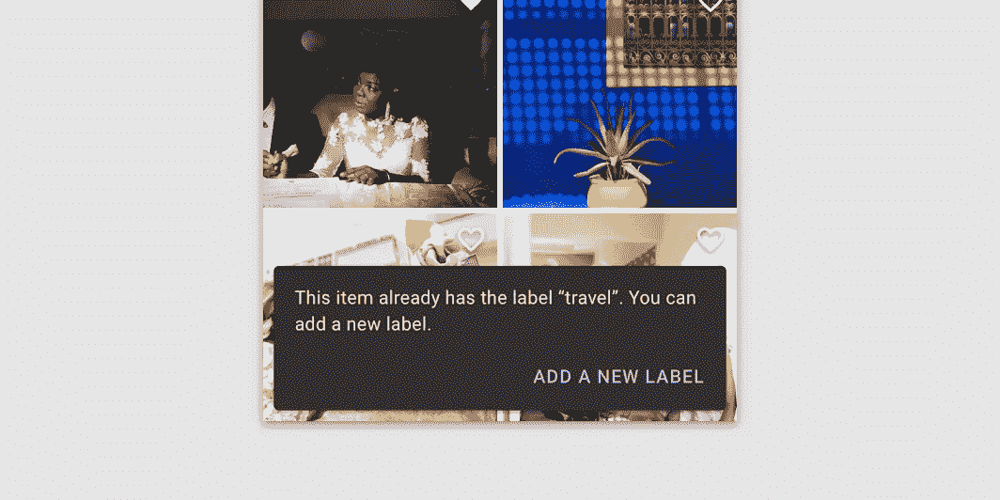
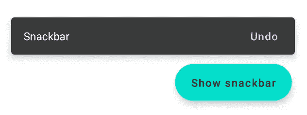

# 在 Jetpack Compose 中实现 Android Snackbar

> 原文：<https://levelup.gitconnected.com/implement-android-snackbar-in-jetpack-compose-d83df5ff5b47>

## 如何使用 Jetpack Compose 创建 Android snackbar

照片由[丹妮尔·麦金尼斯](https://unsplash.com/@dsmacinnes?utm_source=medium&utm_medium=referral)在 [Unsplash](https://unsplash.com?utm_source=medium&utm_medium=referral) 拍摄

[Snackbars](https://developer.android.com/reference/kotlin/androidx/compose/material/package-summary#Snackbar(androidx.compose.ui.Modifier,kotlin.Function0,kotlin.Boolean,androidx.compose.ui.graphics.Shape,androidx.compose.ui.graphics.Color,androidx.compose.ui.graphics.Color,androidx.compose.ui.unit.Dp,kotlin.Function0)) 用于在用户界面的底部，应用程序内容的前面向用户提供快速更新。它们暂时出现在屏幕底部，不会像 dialog 那样阻挡内容或吸引用户的注意力。此外，他们可以显示一个按钮，让用户点击时采取行动。

在本文中，我将解释如何使用 Jetpack Compose 创建 snackbar。

# 1.我们开始吧

我们来看看`[Snackbar](https://developer.android.com/reference/kotlin/androidx/compose/material/package-summary#Snackbar(androidx.compose.ui.Modifier,kotlin.Function0,kotlin.Boolean,androidx.compose.ui.graphics.Shape,androidx.compose.ui.graphics.Color,androidx.compose.ui.graphics.Color,androidx.compose.ui.unit.Dp,kotlin.Function0))`的方法签名。开箱即用，API 为我们提供了许多默认字段，我们只需要关心表示将在 snackbar 中显示的文本的`content`字段。

# 2.带文本的零食条

[https://material . io/archive/guidelines/components/snack bars-toats . html # snack bars-toats-usage](https://material.io/archive/guidelines/components/snackbars-toasts.html#snackbars-toasts-usage)

这是一个简单的 snackbar，里面有一个文本，我们使用了接受另一个可组合函数的`content`字段。遵循材料指南，这是一个文本小部件。

# 3.带有行动项目的零食条

[https://material . io/archive/guidelines/components/snack bars-toats . html # snack bars-toats-usage](https://material.io/archive/guidelines/components/snackbars-toasts.html#snackbars-toasts-usage)

有时，用户想要执行一个动作。`action`字段采用一个可组合的函数，遵循材料指南，一个文本按钮小部件就足够了。

如果一个动作很长，文本按钮小部件可以显示在第三行。

[https://material.io/components/snackbars#anatomy](https://material.io/components/snackbars#anatomy)

我们可以使用`actionOnNewLine`字段并将其设置为 true。

# 4.显示或隐藏零食条

[Scaffold](https://developer.android.com/reference/kotlin/androidx/compose/material/package-summary#Scaffold(androidx.compose.ui.Modifier,androidx.compose.material.ScaffoldState,kotlin.Function0,kotlin.Function0,kotlin.Function1,kotlin.Function0,androidx.compose.material.FabPosition,kotlin.Boolean,kotlin.Function1,kotlin.Boolean,androidx.compose.ui.graphics.Shape,androidx.compose.ui.unit.Dp,androidx.compose.ui.graphics.Color,androidx.compose.ui.graphics.Color,androidx.compose.ui.graphics.Color,androidx.compose.ui.graphics.Color,androidx.compose.ui.graphics.Color,kotlin.Function1)) 带有内置的 snackbar，带有基于材质规格的显示/隐藏动画，因此我们不需要像上面那样创建这些自定义动画。

通过单击浮动按钮，会出现一个带有文本按钮的 snackbar。以下是代码:

让我们深入研究一下`showSnackbar()`函数:

这是一个`suspend`函数，所以我们需要把它放在协程范围内。我们可以传递三个可用的属性:

*   `message`:snack bar 中的文本。
*   `actionLabel`:零食条中的动作标签。
*   `duration`:选择`SnackbarDuration.Short`、`SnackbarDuration.Long`或`SnackbarDuration.Indefinite`。

如果点击了选项动作，则返回`SnackbarResult.ActionPerformed`;如果通过超时或用户取消了 snackbar，则返回`SnackbarResult.Dismissed`。通过捕捉`ActionPerformed`，我们可以处理点击按钮时的动作。

在这篇文章中，我们快速浏览了 Jetpack Compose 中的 Snackbar 组件。非常感谢你阅读我的文章。*如果你喜欢这个故事，请* ***点击*** 👏 ***按钮，分享*** *它来帮助别人！*关注我[中](https://mr-umbrella.medium.com/)获取更多牛逼安卓小技巧。你也可以在 [LinkedIn](https://www.linkedin.com/in/huynh-phong-3649a7131/) 上找到我。祝您愉快！😄

# 继续读 Android 的东西

[如何在 Android 中创建 like 按钮动画](/how-to-create-like-button-animation-in-android-part-1-f99e2792143d)

[在 Android 中使用 MaterialContainerTransform 共享元素](/shared-element-using-materialcontainertransform-in-android-6d420e74b122)

[安卓按钮变形动画](/android-button-morphing-animation-bc3bed740501)

[运动布局——折叠工具栏](/motionlayout-collapsing-toolbar-d0ce8dd874b6)

# Jetpack 撰写

[在 Jetpack Compose 中实现 tab layout](/implement-android-tablayout-in-jetpack-compose-e61c113add79)

[在 Jetpack Compose 中用 ViewPager 实现 talayout](/implement-tablayout-with-viewpager-in-android-jetpack-compose-d509fc6e2d8e)

[在 Jetpack Compose 中创建一个带有变形和 ken burns 效果的自动滚动 viewparager](/create-an-auto-scroll-viewpager-with-transformation-and-ken-burns-effect-in-android-jetpack-compose-efdf46f2e8ed)