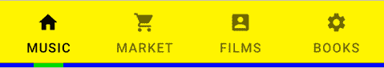

# 在 Jetpack Compose 中实现 Android TabLayout

> 原文：<https://levelup.gitconnected.com/implement-android-tablayout-in-jetpack-compose-e61c113add79>

照片由[达蒙·霍尔](https://unsplash.com/@damodigital?utm_source=medium&utm_medium=referral)在 [Unsplash](https://unsplash.com?utm_source=medium&utm_medium=referral) 上拍摄

## 我们如何使用 Jetpack Compose 创建 Android TabLayout

Google Play 选项卡布局

选项卡允许我们在单个页面中的相关内容之间快速导航，出现在屏幕的顶部。选项卡使用文本、标签或文本和标签来表示单页内容。通常，它用在`TabRow`或`ScrollableTabRow`T20 中。

在本文中，我将解释如何使用 Jetpack Compose 创建一个选项卡。

# 1.我们开始吧。

让我们看看`[Tab](https://developer.android.com/reference/kotlin/androidx/compose/material/package-summary#Snackbar(androidx.compose.ui.Modifier,kotlin.Function0,kotlin.Boolean,androidx.compose.ui.graphics.Shape,androidx.compose.ui.graphics.Color,androidx.compose.ui.graphics.Color,androidx.compose.ui.unit.Dp,kotlin.Function0))`的方法签名。

我们可以看到，有 9 个可用属性可以传递给`Tab`函数:

*   `**selected**`:该页签是否被选中。这是必需的。
*   `**onClick**`:选中该页签时调用的回调。这是必需的
*   `modifier`:应用于选项卡的修饰符。
*   `enabled`:使能状态。
*   `text`:该标签页显示的文本标签。
*   `icon`:该标签页显示的图标。
*   `interactionSource`:可用于改变组件在不同状态下的显示方式，如组件被按下时的效果。
*   `selectedContentColor`:选择时的颜色。
*   `unselectedContentColor`:未选择时的颜色。

记住这些属性，我们可以通过将唯一需要的属性传递给 composable 函数来创建一个最小的选项卡组件，让我向您展示一些选项卡类型。

# 2.文本选项卡

让我们通过使用两个组件`TabRow`(我稍后会谈到)和`Tab`来实现一个固定的选项卡，其中每个选项卡占用相等的空间。我们使用`text`属性在选项卡中创建一个标签。

默认情况下，单击它也会产生涟漪效应。

# 2.图标标签

使用`icon`属性，我们得到一个选项卡组件，它在选项卡中显示一个图标

# 3.组合标签

只要将`text`和`icon`属性结合在一起，我们就有了一个文本上方带有图标的标签。

# 4.自定义选项卡

虽然这在大多数想要显示选项卡的情况下可能已经足够了，但我们有时可能希望显示一个带有自定义大小或填充以及特定设计的自定义选项卡。代码如下:

# 5.标签行

让我们深入研究这个组件的源代码:

到目前为止，在`TabRow`的帮助下，我们已经实现了 4 种类型的选项卡，它只需要 2 个属性:

*   `selectedTabIndex`:选中页签的索引。
*   `tabs`:标签列表。

我们可以传递给`TabRow`函数的其他可用属性:

*   `modifier`:应用于 TabRow 的修饰符。
*   `backgroundColor`:标签页的背景色
*   `contentColor`:用于给文本、图标和指示器着色。
*   `indicator`:表示当前选择了哪个页签。
*   `divider`:显示在表格底部。

记住这些属性，让我们创建一个自定义的 TabRow，其背景色为黄色，内容色为黑色，蓝色分隔线的高度为 5dp，指示器的宽度为 32dp。

听起来很复杂，对吧！为了创建一个固定的宽度指示器，我复制了默认的`Modifier.tabIndicatorOffset`并做了一点修改。指示器在标签的中间，所以我们可以计算它的位置 x 并保存到`targetValue`。

# 6.ScrollableTabRow

TabRow 现在是可滚动的，没有固定的宽度。

属性类似于`TabRow`，不同的是新的`edgePadding`属性。这是从第一个制表符之前的起始边缘开始的填充，默认值是 52 dp。当然我们可以把它改成不同的值。

在这篇文章中，我们快速浏览了 Jetpack Compose 中的 Tab 组件。非常感谢你阅读我的文章。*如果你喜欢这个故事，请* ***点击*** 👏 ***按钮，分享*** *它来帮助别人！*关注我[中](https://mr-umbrella.medium.com/)获取更多牛逼安卓小技巧。你也可以在 [LinkedIn](https://www.linkedin.com/in/huynh-phong-3649a7131/) 上找到我。祝您愉快！😄

# 继续读 Android 的东西

[如何在 Android 中创建 like 按钮动画](/how-to-create-like-button-animation-in-android-part-1-f99e2792143d)

[在 Android 中使用 MaterialContainerTransform 共享元素](/shared-element-using-materialcontainertransform-in-android-6d420e74b122)

[安卓按钮变形动画](/android-button-morphing-animation-bc3bed740501)

[运动布局——折叠工具栏](/motionlayout-collapsing-toolbar-d0ce8dd874b6)

# Jetpack 撰写

[在 Jetpack Compose 中实现 snack bar](/implement-android-snackbar-in-jetpack-compose-d83df5ff5b47)

[在 Jetpack Compose 中用 ViewPager 实现 talayout](/implement-tablayout-with-viewpager-in-android-jetpack-compose-d509fc6e2d8e)

[在 Jetpack Compose 中创建一个带有变形和 ken burns 效果的自动滚动 viewparager](/create-an-auto-scroll-viewpager-with-transformation-and-ken-burns-effect-in-android-jetpack-compose-efdf46f2e8ed)