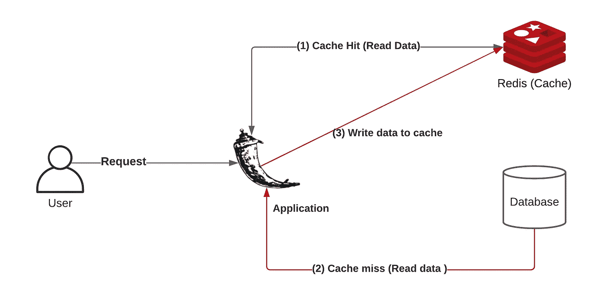
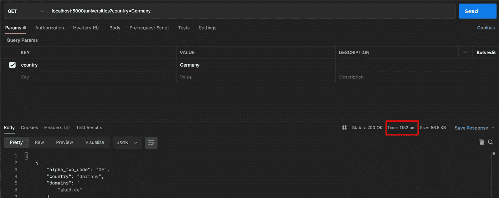
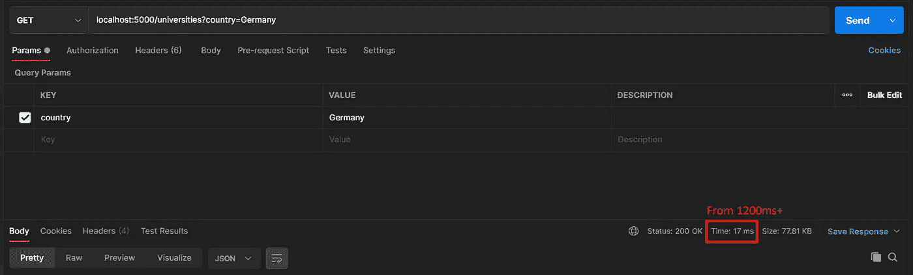
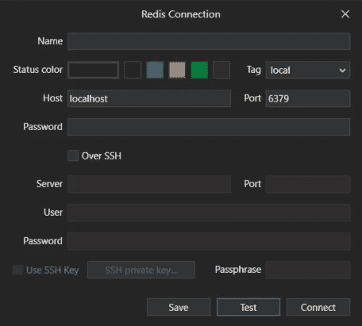
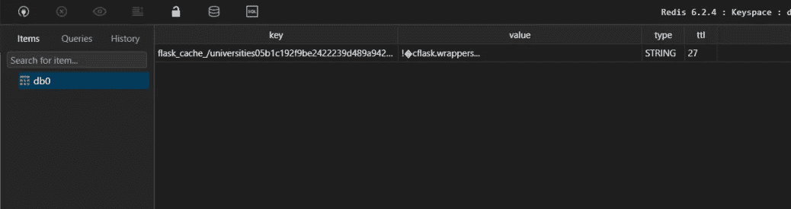

# 使用 Redis、Flask 和 Docker 进行 API 缓存[循序渐进]

> 原文：<https://levelup.gitconnected.com/implement-api-caching-with-redis-flask-and-docker-step-by-step-9139636cef24>


您希望您的 API 更快、更一致，并减少对服务器的请求吗？—这就是缓存发挥作用的地方。在本文中，我将向您展示如何在 Flask 上用 Redis 实现 API 缓存。我在这里以 Flask 为例，但是无论采用何种技术，缓存的概念都是相同的。

*   【2022 年 2 月进行了以下更新——Python 更新至 3.9 并更改了项目结构

# **什么是缓存？**

在我们进入关于使用 Redis 和 Flask 实现缓存的实际部分之前，让我们首先了解什么是缓存的定义，并学习它的概念，这样你就知道用例是什么了。

缓存是将频繁访问的数据的副本存储在请求-响应路径上的几个地方的能力。当消费者请求资源表示时，请求通过一个缓存或一系列缓存(本地缓存、代理缓存或反向代理)到达托管资源的服务。如果请求路径上的任何缓存有所请求的表示的新副本，它将使用该副本来满足请求。如果没有一个缓存能够满足请求，那么请求将被传送到服务(或者正式名称为源服务器)。这可以用两个术语来很好地定义，即缓存未命中和缓存命中。

**缓存命中**—**缓存命中**是指在**缓存**内存中找到组件或应用程序请求处理的数据的状态。这是一种向处理器传送数据的更快方式，因为**缓存**已经包含了所请求的数据。

**高速缓存未命中***—* 高速缓存未命中是指在高速缓存中找不到组件或应用程序请求处理的数据的状态。它要求程序或应用程序从其他缓存级别或主内存中获取数据，从而导致执行延迟。

如上所述，有几种方法可以实现缓存。可以在客户端通过 Web 缓存，在服务器端通过数据缓存(关系数据库、Redis 等)，以及通过安装在应用程序上的插件(例如:WordPress 上的插件)进行应用程序缓存。在本教程中，我们将使用 Redis 来保存来自 API 的响应，然后使用这些响应，而不是向服务器发出获取数据的请求。

## Flask 和 Redis —实现

先决条件:

*   Docker & Docker-撰写
*   瓶
*   Python 3。*+

我们将使用 docker 来隔离我们的服务，然后用`docker-compose`来将这些服务编排在一起(将它们放在同一个网络上，它们之间的通信，环境变量，等等)。如果你不了解 Docker，建议你参考官方文档[这里](https://docs.docker.com/)。



**一般工作流程**

## **项目设置**:

创建 python virtualenv 并安装 flask、Redis、Flask 缓存和请求:

```
$ python -m venv venv
$ source venv/Scripts/activate
$ (venv) pip install Flask redis flask_caching requests
```

我们的应用程序将如下所示:

```
/root
├── app.py                 - Application entrypoint
├── config.py              - Config file for Flask
├── docker-compose.yml     - Docker compose for app and redis
├── Dockerfile             - Dockerfile for Flask API
├── .env                   - Environment variables
```

因此，让我们继续创建此设置所需的文件:

```
$ touch Dockerfile docker-compose.yml .env
$ pip freeze > requirements.txt
$ touch config.py app.py
```

**我们要实施什么？**

我们将创建一个简单的端点，从**hipo labs universities API***中获取大学数据，并基于我们作为查询参数发送的国家，获取指定国家的大学列表。*

*让我们继续，在`app.py`中创建一个 Flask 实例，并使用它创建一个获取大学数据的端点。*

*所以基本上，基于查询参数`country`，它向外部 API 发出请求，并在`JSON format`中取回数据。让我们继续尝试一下:*

```
*$ export FLASK_APP=app.py      # To tell where your flask app lives
$ export FLASK_ENV=development # Set debug mode on
$ flask run*
```

*我将使用 [Postman](https://www.postman.com/) 来发出请求，因为我也想知道处理我的请求所花费的时间。*

**

***用邮递员测试端点；为德国获取所有大学***

*好了，现在我们看到我们有了结果，一切正常。使用红色，您可以看到从该端点获取数据所花费的时间。我们可以尝试多次提出相同的请求，性能不会改变。这是因为我们总是向服务器发出新的请求。我们的目标是尽量减少这种情况，正如开始时解释的那样，减少对服务器的请求。所以让我们开始吧。*

## *添加 Redis 并对应用程序进行归档*

*我们看到它在本地工作得很好，但现在我们想实现缓存，为此，我们将需要`Redis`。这里有几种方法可供您选择:*

*   *安装 Redis(官方兼容 Linux，不兼容 Windows，见[此处](https://redis.io/topics/introduction))*
*   *托管一个 Redis 实例并使用它(例如:Heroku 上的 Redis 实例)*
*   *用 Docker 启动 Redis 实例(我们正在这样做)*

*我们将对应用程序进行 dockerize，并添加 Redis 作为服务，这样我们就可以轻松地从我们的应用程序中进行通信。让我们继续为 Flask 应用程序编写 docker 文件:*

*我们这里没有运行图像的[命令](https://docs.docker.com/engine/reference/builder/#cmd)，因为我将使用 docker-compose 来运行容器。让我们配置`docker-compose`来运行我们的应用程序和 Redis:*

*因此，我们简单地添加两个服务，即我们的应用程序和 Redis。对于应用程序，我们公开端口`5000`的输入和输出，对于 Redis，我们公开`6379`。现在让我们用`docker-compose.`启动服务*

```
*$ docker-compose up -d --build* 
```

*我们的服务应该已经启动并运行了，如果我们再次发出与没有 Docker 的情况下运行应用程序时相同的请求，我们将得到相同的输出。要检查服务是否正在运行，请输入以下命令:*

```
*$ docker ps*
```

*现在让我们配置我们的应用程序，使其与 Redis 实例连接，并在端点中实现缓存。我们可以直接在代码中设置变量，但在这里，我试图向您展示一些使用 Flask 和 Docker 开发时的良好实践。在上述的`docker-compose`中，我们可以看到，对于环境变量，我引用了`.env`文件，然后我使用 config.py 将这些变量映射到 Flask 应用程序。为了让`flask-caching`库工作，我们需要设置一些环境变量，这些变量用于 Redis 连接和缓存类型。根据您想要实现的缓存类型，您可以从库的文档 中了解关于 [**配置的更多信息。**](https://flask-caching.readthedocs.io/en/latest/#configuring-flask-caching)*

```
*# .env file
CACHE_TYPE=redis
CACHE_REDIS_HOST=redis
CACHE_REDIS_PORT=6379
CACHE_REDIS_DB=0
CACHE_REDIS_URL=redis://redis:6379/0
CACHE_DEFAULT_TIMEOUT=500*
```

*在`.env`中，我们设置了一些变量，如缓存类型、主机、数据库等。因为我们已经将这些变量从 docker-compose 挂载到我们的容器中，所以现在我们可以使用`os`模块来获取这些变量。让我们在`config.py`中获取这些变量，稍后我们将使用它们将值映射到我们的 Flask 应用程序。*

*从配置方面来说，我们很好。现在让我们初始化 Flask 上的缓存，并将其与我们的应用程序集成。*

*我们添加了一个新的装饰器`@cache.cached`,然后我们指定一个`timeout`,它是这个响应将被缓存在 Redis 内存中的时间。所以基本上在第一个请求之后，我们会将这个响应存储 30 秒，之后会有一个新的请求，再次更新内存。第二个参数`query_string=True`在这种情况下是有意义的，因为我们希望基于存储的查询字符串而不是静态路径来存储响应。*

*   ***query_string** —默认为假。如果为 True，则使用的缓存键将是对有序查询字符串参数进行哈希运算的结果。这避免了仅仅因为参数以不同的顺序传递而为同一个查询创建不同的缓存。*

*我们已经完成了，让我们再次构建容器，并在缓存就绪的情况下进行实际测试。*

```
*docker-compose up -d --build*
```

*现在让我们再次到 Postman，在大学端点上做同样的请求。*

**

*使用 Redis 实现缓存后的响应时间*

*第一次，我们将拥有与不使用缓存时大致相同的时间，但如果我们再次进行同样的请求，我们将获得显著的改进，这都要感谢 Redis。所以我们要做的是，我们将响应保存到内存数据库中，然后当数据仍然存储在那里时，它们将从那里返回，而不是从服务器发出请求。*

*潜得更深？—让我们通过使用 GUI 工具来查询我们的 Redis 存储，来看看实际情况。为了直观起见，我使用了 [TablePlus](https://tableplus.com/) ，但是您也可以使用 Redis CLI 来查询数据。为了连接到我们的 Redis 实例，我们将主机指定为`localhost`，然后对于端口，我们输入`6379`，就像我们在`docker-compose`中公开的那样。*

**

*。与 Redis 和 Tableplus 的连接*

*之后，我们可以看到存储在 Redis 实例中的数据。当有一个响应被保存时，您可以看到一个`db0`，如果我们寻找更多，我们将看到我们的缓存响应，包括**[key；价值；类型；ttl】。***

**

*我们可以清楚地看到，缓存的响应是`/universities?*`，并且在`ttl`出现的时间内可用。这一部分有点超出了范围，但是知道后台发生了什么是很好的。*

*因此，我们用 Redis 和 Flask 实现了 API 缓存。更多选项请参考`flask-caching`库的[文档](https://flask-caching.readthedocs.io/en/latest/)，它是一个实现不同客户端缓存的包装器。*

## *结论*

*所以我们使用 Redis 实现了 API 缓存。这是一个简单的例子，但是它包含了关于这个主题的很多细节。当您编写应用程序时，缓存非常重要，因为它对性能有很大帮助，如果可能，您应该实现它，但要确保您的目标是正确的用例。*

***您可以在 GitHub 资源库上找到文章的完整源代码，以及说明。***

*[](https://github.com/vjanz/flask-cache-redis) [## vjanz/flask-cache-redis

### 在 GitHub 上创建一个帐户，为 vjanz/flask-cache-redis 的开发做出贡献。

github.com](https://github.com/vjanz/flask-cache-redis) 

如果你觉得它有帮助，请不要忘记鼓掌并在你的社交网络上或与你的朋友分享。

如果你有任何问题，请随时联系我。

**如果你愿意支持我的工作，你可以点击下面的图片给我买杯咖啡😄:**

[](https://www.buymeacoffee.com/valonjanuzaj)

在 [LinkedIn](https://www.linkedin.com/in/valon-januzaj-b02692187/) 、 [GitHub](http://www.github.com/vjanz) 上与我联系

## 参考资料:

[https://www.cloudflare.com/learning/cdn/what-is-caching/](https://www.cloudflare.com/learning/cdn/what-is-caching/)https://redislabs.com
https://docs.docker.com/
https://flask-caching . readthedocs . io
http://universities.hipolabs.com/

## **我在媒体上发表的其他文章**:

[](/asynchronous-tasks-in-python-with-celery-rabbitmq-redis-480f6e506d76) [## 用 Celery + RabbitMQ + Redis 实现 Python 中的异步任务

### 在本文中，我们将使用 Celery、RabbitMQ 和 Redis 来构建一个分布式任务队列。但是什么是…

levelup.gitconnected.com](/asynchronous-tasks-in-python-with-celery-rabbitmq-redis-480f6e506d76) [](/deploy-a-dockerized-fastapi-application-to-aws-cc757830ba1b) [## 将 dockerized FastAPI 应用程序部署到 AWS

### 您已经创建了您的 FastAPI 应用程序，现在您想通过部署它来公开它吗？—不要担心…

levelup.gitconnected.com](/deploy-a-dockerized-fastapi-application-to-aws-cc757830ba1b)*