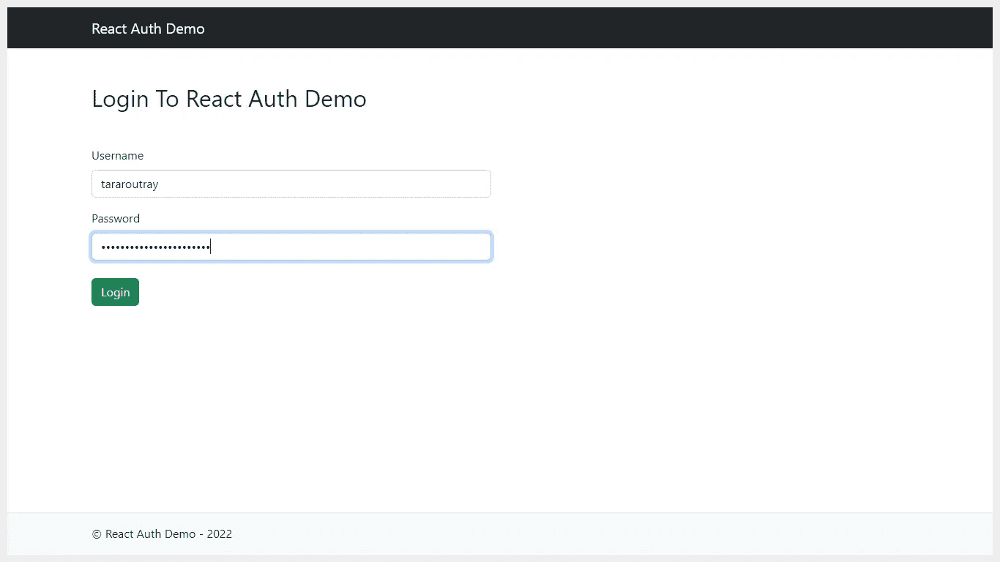
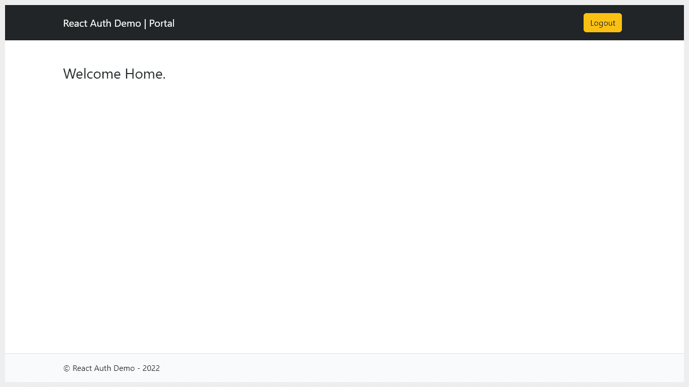

# 在 React 中实现认证和保护路由

> 原文：<https://levelup.gitconnected.com/implement-authentication-and-protect-routes-in-react-135a60b1e16f>

## 学习在 React 应用程序中添加身份验证，并保护路由免受未授权用户的访问。


处理用户认证是应用程序安全性的基础。应该让合适的人进来，把不合适的人挡在外面。这是通过验证寻求访问的人的身份，然后检查该人是否被授权进入来完成的。

在本文中，我将一步一步地介绍如何创建一个登录页面来验证凭据并保护 React 应用程序中的路由。我还将演示如何限制对某些 web 页面的访问，以保护私有数据不被访客访问。

# 通过 9 个简单的步骤添加身份验证并保护路由

1.  启动新的 React 应用程序。
2.  安装 React 路由器。
3.  安装 React 引导 UI 库。
4.  安装 Axios。
5.  创建登录页面。
6.  从登录页面执行 API 调用并存储用户令牌。
7.  创建受保护的路由实用程序。
8.  创建门户主页并保护路由。
9.  注册路由并保护它们。

# 第一步:启动一个新的 React 应用程序

让我们从创建一个新的 React 应用程序开始。为此，导航到您选择的目录，在该路径中打开终端或命令提示符，并执行以下命令。

```
npx create-react-app react-auth-demo
```

# 步骤 2:安装 React 路由器

接下来，我们需要安装一个名为`react-router-dom`的包，用于在应用程序中启用路由。为此，打开一个终端并执行以下命令。

```
npm install react-router-dom
```

# 步骤 3:安装 React 引导 UI 库

接下来，我们需要安装两个名为`react-bootstrap`和`bootstrap`的包，来构建我们的应用程序的布局(UI)。为此，打开一个终端并执行以下命令。

```
npm install react-bootstrap bootstrap
```

现在，打开`index.js`文件，将下面的代码片段添加到文件的开头。

```
import 'bootstrap/dist/css/bootstrap.min.css';
```

# 步骤 4:安装 Axios

接下来，我们需要安装一个名为`axios`的包，从网络浏览器发送`XMLHttpRequests` 。它支持在后台进行 API 调用。为此，打开一个终端并执行以下命令。

```
npm install axios
```

# 步骤 5:创建登录页面

让我们在`src`中创建一个名为`auth`的文件夹。在其中，创建另外三个名为`navbar`、`footer`和`login`的文件夹。并且，创建一个名为`Auth.js`的文件。文件夹结构将如下所示。

```
src
|_auth
  |_navbar
  |_footer
  |_login
  |_Auth.js
```

接下来，在`navbar`文件夹中创建一个名为`AuthNavbar.js`的文件，并添加以下代码片段。

接下来，在`footer`文件夹中创建一个名为`AuthFooter.js`的文件，并添加以下代码片段。

接下来，在`login`文件夹中创建一个名为`Login.js`的文件，并添加以下代码片段。它将创建登录表单的用户界面。在接下来的步骤中，我们将学习如何进行 API 调用来提交登录表单数据并为我们的应用程序接收有效的 JWT 令牌。

接下来，在`auth`文件夹中创建一个名为`Auth.js`的文件。这个文件将定义我们的验证页面的布局，如登录、注册、忘记密码等。向其中添加以下代码片段。

# 步骤 6:从登录页面执行 API 调用并存储用户令牌

接下来，我们需要实现处理登录表单提交的特性。为此，在`Login`函数中，创建另一个名为`submitLoginForm`的函数，并添加一个名为`event`的参数。将下面的代码片段添加到`Login.js`文件中。

> 注意:我正在对一个演示链接进行 API 调用。它仅用于演示目的，所以请确保用您自己的有效 URL 替换它。

在这里，一旦提交了登录表单，我们就捕获表单提交事件并停止它。然后，我们使用 JavaScript 选择登录表单元素，并将表单数据收集为 JSON，并使用 Axios 进行 API 调用，以验证用户提供的登录凭证。

如果提交的数据有效，我们需要在 API 的 JSON 响应中返回一个令牌，并将其存储在 web 浏览器的`localStorage`中。接下来，我们需要将用户重定向到门户主页。在接下来的步骤中，我们将学习如何创建一个只有授权用户才能访问的门户页面。

如果提交的数据无效，那么我们将在屏幕上显示一条错误消息，并停止页面导航。

# 步骤 7:创建受保护的路由实用程序

现在我们将为我们的应用程序创建一个实用程序来保护路由。该实用程序将帮助我们防止未经授权的用户访问。受此实用程序保护的组件或页面将保护我们的数据免受未登录用户的访问。

让我们在`src`中创建一个名为`util`的文件夹，并在其中创建一个名为`ProtectedRoute.js`的文件。文件夹结构将如下所示。

```
src
|_util
  |_ProtectedRoute.js
```

向其中添加以下代码片段。

这里，我们创建一个函数来检查当前用户是否登录。应用程序检查用户令牌在本地存储中是否可用，如果是，则将用户标记为已登录，否则将用户标记为访客。如果用户类型是 guest，那么实用程序返回`null`，否则返回用户定义的路线。此外，它还确保来宾用户不会向前移动，并被重定向到登录页面。

# 步骤 8:创建门户主页

让我们在`src`中创建一个名为`portal`的文件夹。在其中，再创建三个名为`navbar`、`footer`和`home`的文件夹。文件夹结构将如下所示。

```
src
|_portal
  |_navbar
  |_footer
  |_home
```

接下来，在`navbar`文件夹中创建一个名为`PortalNavbar.js`的文件，并添加以下代码片段。

接下来，在`footer`文件夹中创建一个名为`PortalFooter.js`的文件，并添加以下代码片段。

接下来，在`home`文件夹中创建一个名为`Home.js`的文件，并添加以下代码片段。

# 步骤 9:注册路由并保护它们

我们已经完成了登录页面和门户主页的设置。现在，打开`App.js`文件，删除现有代码并添加以下代码片段。

这里，我们只在用户通过身份验证的情况下加载门户模块的导航栏和页脚。

接下来，打开`index.js`文件，将下面的代码片段添加到文件的顶部。这将导入应用程序正在使用的页面和组件。

现在，删除出现在`<React.StrictMode></React.StrictMode>`元素中的`<App />`元素，并添加以下代码片段。

这里，我们定义了路径和为各个路线呈现的元素。路径以`/auth`开头的路线渲染`<Auth />`模块，其余路线渲染`<App />`模块。在其中，我们使用`<ProtectedRoute />`(受保护的路由)实用程序来保护`<Home />`路由免受授权用户的访问。

# 安全提示

为了进一步提高应用程序的安全性，请确保每次进行页面导航时都将令牌发送到服务器进行验证。您可以在发送请求时将令牌添加到身份验证头中，然后在服务器端验证令牌。这样，您可以添加另一层安全性来验证用户。

# 结果



# GitHub 资源库链接

访问下面的 GitHub 库下载文件。

[](https://github.com/tararoutray/react-auth-demo) [## GitHub-tararoutray/react-auth-demo

### 这个项目是用 Create React App 引导的。在项目目录中，您可以运行:在…中运行应用程序

github.com](https://github.com/tararoutray/react-auth-demo) 

太棒了。您已经学习了如何向 React 应用程序添加身份验证，并保护路由免受未授权用户的访问。

> 如果你喜欢阅读这篇文章，并发现它对你有用，那么请鼓掌，与你的朋友分享，并关注我以获得我即将发布的文章的更新。你可以在 [LinkedIn](https://www.linkedin.com/in/tararoutray/) 上和我联系。

# 有用的链接

了解 React-Bootstrap UI 库。

[](/getting-started-with-react-bootstrap-ui-library-7969bb915b1b) [## React-Bootstrap UI 库入门

### 了解如何在 React 项目中正确安装和使用 Bootstrap。

levelup.gitconnected.com](/getting-started-with-react-bootstrap-ui-library-7969bb915b1b) 

了解 Axios 库。

[](/getting-started-with-axios-a-popular-promise-based-http-client-9c4b65a9847a) [## Axios 入门:一个流行的基于 Promise 的 HTTP 客户端

### 了解 Axios 提供的关键特性，以及如何在 web 应用程序中使用它们。

levelup.gitconnected.com](/getting-started-with-axios-a-popular-promise-based-http-client-9c4b65a9847a)