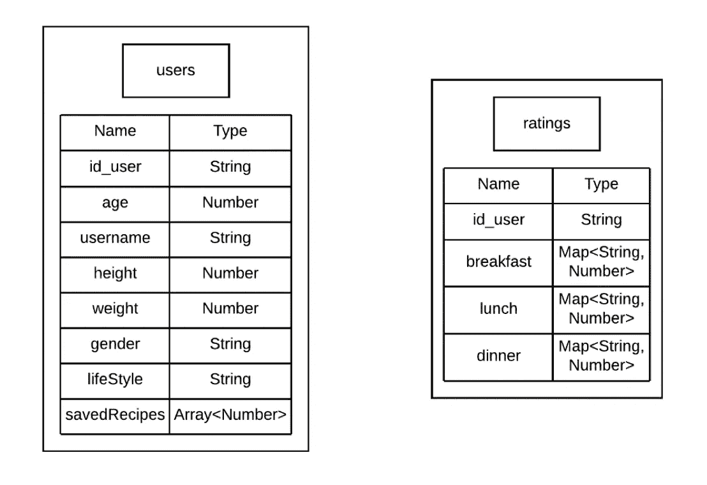

# 在 Android 中使用 Firebase 实现备份功能

> 原文：<https://levelup.gitconnected.com/implement-backup-functionality-using-firebase-in-android-da344d135758>

## 使用 Firebase 构建设备间同步的备份


谷歌云商店

[Firebase](https://firebase.google.com) 已经成为开发移动应用的首选云服务。它有许多功能，一个公平的价格和伟大的文件。

除了 Crashlytics 和认证，我发现最有用的是云存储工具。现在有三种选择。

# 实时数据库

这是 Firebase 中发布的第一种数据库。本质上，数据是按照树形结构存储的，这就像一个 [JSON](https://www.json.org/json-en.html) 文件。

如果你处理小块的数据，它很容易使用，所以对初学者来说很棒。我尝试在一个应用程序中使用过一次，随着数据开始增长，它感觉更难管理，所以我更喜欢使用云 Firestore 作为默认选项。

实时数据库比云 Firestore 有更低的延迟，所以如果您持续进行异步调用，也有它的空间。

# 云 Firestore

这纯粹是一个处理文档和收藏的 NoSQL 数据库。谷歌推荐它通过实时数据库，我同意。它具有强大的查询系统和较好的可扩展性。

当它与集合一起工作时，您可以根据应用程序的要求按照不同的模式组织数据。如果你对这个话题感兴趣，这里有一个[指南](https://firebase.google.com/docs/firestore/data-model)。

这里支持的数据类型[更广](https://firebase.google.com/docs/firestore/manage-data/data-types)，所以这是选择云 Firestore 时要考虑的另一件事。

# 云存储

最后一个选项可以被认为是 Google Drive 或 Dropbox。在这里，您可以存储来自用户的文件，如声音或图像。

考虑到所有这些存储选项，您还可以使用 [Firebase 身份验证](https://firebase.google.com/docs/auth)工具。这样，将为每个用户生成一个 ID(不管他们使用哪种方法注册)，以便您将数据与其用户相关联。

您可以想象使用它进行备份的感觉是很自然的。对于我想分享的代码，我们将使用云 Firestore。

# 文件和收藏

该应用程序示例根据用户的身体数据生成每周菜单，并根据评级系统改进推荐。

为了保存数据，需要两个集合，每个集合中的一个文档将属于一个用户。由于 Firebase 身份验证生成的 ID，我们将知道数据属于谁使用。



数据库结构

您可能认为 ratings 集合可以实现为用户文档中的一个条目，以返回评级文档。问题是 Firebase **将文档大小限制为 1 MB** ，所以为了以防万一，我决定将它保存在单独的集合中。这个决定也不太划算，因为每当我想检查一个评级文档时，我都要多做一次读或写操作。还有一个限制是，一个文档不能包含另一个文档，只能包含另一个集合，用一个集合来存储一个文档是不对的。

# 代码

要做的第一件事，是添加梯度依赖。

```
implementation 'com.google.firebase:firebase-auth:19.3.1'    implementation 'com.firebaseui:firebase-ui-auth:6.2.0'    implementation 'com.google.android.gms:play-services-auth:18.0.0'    implementation 'com.google.firebase:firebase-database:19.3.1'    implementation 'com.google.firebase:firebase-firestore-ktx:21.4.3'
```

与 Firebase 的连接将被封装在 *FirebaseRepository* 类中。这个类将负责初始化对象，让用户验证和存储数据。

1.  **认证**

这段代码初始化了 *FirebaseAuth* 对象，并以一种反应模式公开了身份验证的状态。这里还有一个 ID，我们将使用它将数据与每个用户关联起来，如前所述。

要启用 Google 登录按钮并在 UI 中显示注册和登录过程，您可以遵循 Google 提供的官方[指南](https://firebase.google.com/docs/auth/android/custom-auth)。

2. **Firestore**

为了读写数据，API 为我们提供了两种方法。两者都通过向他们提供我们想要的集合和文档来工作。您可以用传统的侦听器来实现它，但是这里我选择使用协程，以便可以顺序读取代码。

> 如果您想自动化这个备份过程，您可以查看这篇文章[中的](/implement-backup-automation-with-workmanager-in-android-107c3d0cb166)，我在那里展示了如何做。

仅此而已。关于代码，没有太多，很容易使用和理解。需要做更多的工作是理解 NoSQL 数据库，以及如何优化读写以尽可能提高效率。

如果你想阅读更多这样的内容，并支持我，不要忘记检查我的个人资料，或给媒体一个机会，成为会员，以获得我和其他作家的无限故事。这只是 5 美元一个月，如果你使用这个链接，我会得到一小笔佣金。

[](https://medium.com/@molidev8/membership) [## 通过我的推荐链接加入 Medium—Miguel

### 阅读米格尔的每一个故事(以及媒体上成千上万的其他作家)。你的会员费直接支持米盖尔…

medium.com](https://medium.com/@molidev8/membership)