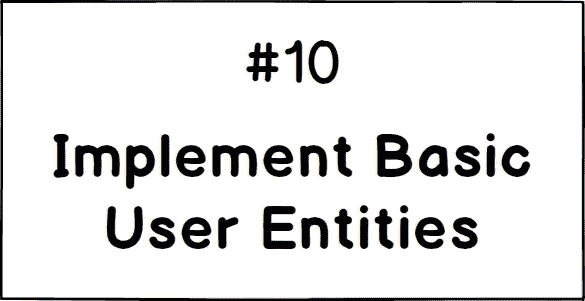

# 在 Go 中实现一个用户实体

> 原文：<https://levelup.gitconnected.com/implement-basic-user-entities-1f3d4aea98e2>

## [安息吧](/go-restful-series-a7addbfef5b1) — #10

## 走向 RESTful——迭代#1

在本文中，我正在实现在[需求](/gorestful-1st-iteration-requirements-and-api-specification-f2b5e40e9571)中指定的*用户实体*以及它们周围的逻辑。

## 简要要求

具有以下属性的`User`模型:

*   `username`:
    ——独一无二。
    -仅允许数字、下划线、破折号、圆点和字母。
    -以下划线或字母开头。
    -最少 1 个字符，最多 32 个字符。
*   `email` :
    -是有效的电子邮件。
    ——独一无二。
*   `fullName` :
    -最少 1 个字符，最多 128 个字符。
*   `bio` :
    -可选。
    -最多 256 个字符。

更多详情，请参考此票证。现在让我们写一些代码！

# 创建``users`'包

按照基于特性的目录结构，我创建了一个包含所有用户相关组件的`users`包和另一个包含应用共享组件的`common`包。

# **声明一个“用户”模型**

让我们在一个`users/entities.go`文件中创建一个表示`User`模型及其属性的结构。

就是简单明了！

注意`users/entities.go`将包含所有用户实体代码。

# 验证“用户”

在创建了`User`模型之后，是时候实现验证规则了。

现在，不需要为每个属性的验证实现单独的函数，我只是简单地写了一个`ValidateUser`来验证整个模型。

`ValidateUser`返回所有验证错误的集合，而不是只返回第一个错误，这是一种更好的做法。对于如何报告错误没有要求，我只是使用了简单的错误类型和一个字符串消息(`errors.New()`)。

我使用正则表达式进行大部分验证。在 Go 中实现正则表达式很简单:

*   使用`regexp.Compile`或`regex.MustCompile`(如果收到无效的表达式，将会出现混乱)预编译正则表达式匹配器。
*   使用编译后的`regex.MatchString`检查字符串是否匹配。

# 在围棋界返回一个错误

`ValidateUser`返回一组验证错误，而不只是第一个错误。虽然这是一个好的实践，但在 Go 中函数返回`[]error`并不是一个好的实践，相反，每个可能失败的函数都应该返回`error`或`nil`。

因此，我正在创建一个新的`error`类型，它封装了一组错误。

在这里！`Errors`封装一组错误并报告其所有子消息。

注意，上面的代码是我在`common/errors.go`中写的。

让我们把它应用到`ValidateUser`函数中。

就是这样。很简单很基础。我们创建一个`User`模型及其验证规则。下一篇文章再见！