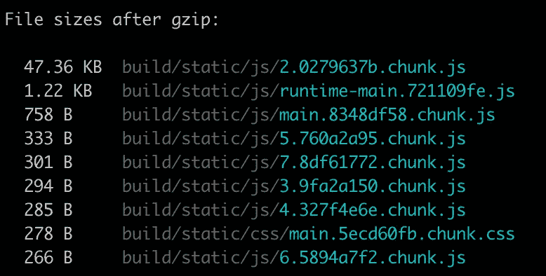

# 在 React 中实现代码拆分

> 原文：<https://levelup.gitconnected.com/implement-code-splitting-in-react-5210d727c49e>

# **了解反应捆绑**

通过使用 *_Webpack_* 或 *_Browserify_* 等工具，将 React 应用进行捆绑。捆绑意味着应用程序中的文件被导入并合并到一个文件中。这样，当您在网页中导入应用程序时，您只需导入一个文件。

假设您有两个文件:

```
// greeting.jsexport *const* greeting = () *=>* {*console*.log(“Hello my friend”);};``````javascript// index.jsimport { greeting } from “./greeting.js”;greeting();
```

包会将这些文件转换成:

```
*const* greeting = () *=>* {*console*.log(“Hello my friend”);};greeting();
```

当然，这是过于简化了，因为捆绑过程中有很多步骤，但你明白了。

# **捆绑发行**

当您的应用程序很小的时候，捆绑是很棒的，但是随着您的应用程序的增长，捆绑也会增长。这意味着，如果用户加载你的 web 应用程序的主页，她仍然需要导入你的整个应用程序包…

这可能会导致性能问题。为了避免这种情况，我们可以实现代码分割。在本文中，我们将根据我们的路线使用代码分割。

**导入()**

代码分割意味着我们将把代码分成更小的部分。然而，我们不需要改变我们的代码编写方式。我们将改变我们进口零部件的方式。我们需要告诉负责捆绑代码的工具何时拆分代码。

如果你使用 create-react-app，它使用 Webpack，你将从使用动态 *_import_* 函数开始。语法如下:

```
import(“./myModule.js”).then((*myModule*) *=>* {myModule.init();});
```

该语法承诺在使用文件内容之前等待 Javascript 文件被加载。

**React.lazy**

React 用 *_React.lazy_* 实现了这种逻辑。它允许您像显示任何其他组件一样显示一个组件，不同之处在于它将被动态导入。

```
import React, { lazy } from “react”;*const* DynamicallyImported = lazy(() *=>* import(“./DynamicallyImported.js”));
```

*_React.lazy_* 采用返回动态导入的函数。这个组件不会像没有实现任何代码分割的应用程序一样与应用程序的其余部分一起导入。React 将仅在首次渲染该组件时导入它。

注意，您动态导入的组件需要是默认导出，当然，它需要导出一个 React 组件。

因此，如果我们基于我们的路线实现代码分割，这意味着如果一个用户检查我们的应用程序并且从来没有到达一个特定的路线，那么这个路线根本不会被导入。这对你的用户来说是一个巨大的好处，因为你只需要强迫她的浏览器导入她需要的东西，仅此而已。

**悬念**

用 *_React.lazy_* 导入的组件必须在*** *悬念**** 组件内部使用。一个*_ suspension _*组件提供回退内容。这些内容表明我们的惰性组件正在加载。

```
import React, { lazy, Suspense } from “react”;*const* DynamicallyImported = lazy(() *=>* import(“./DynamicallyImported.js”));*const* CoolComponent = () *=>* { return ( <div> <*Suspense* fallback={<div>Loading…</div>}> <*DynamicallyImported* /> </*Suspense*> </div> );};
```

这种动态导入的组件不需要被一个悬念组件直接包围。一个暂挂组件还可以 *_handle_* 几个动态导入的组件:

```
import React, { lazy, Suspense } from “react”;*const* DynamicallyImported = lazy(() *=>* import(“./DynamicallyImported.js”));*const* AnotherDynamicallyImported = lazy(() *=>*import(“./AnotherDynamicallyImported.js”));*const* CoolComponent = () *=>* {return ( <div> <*Suspense* fallback={<div>Loading…</div>}> <header> <h1>Hello there</h1> </header> <div>Something else</div> <*DynamicallyImported* /> <p>Divider</p> <*AnotherDynamicallyImported* /> </*Suspense*>  </div>);};
```

**基于我们路线的代码分割**

路由是开始实现代码分割的好地方。从一个页面到另一个页面，用户希望页面作为一个块加载，并等待页面呈现。这是一个很好的起点，同时确保不会改变用户体验。

在这个例子中，我将使用流行的 *_react-router-dom_* 包来路由我的 react 应用程序。当然，它可以用于您喜欢的任何库。

在代码分割之前，您的 *_Router_* 组件可能看起来像这样:

```
import React from “react”;import { Route, Router, Switch } from “react-router-dom”;import Header from “./Header”;import About from “./pages/About”;import Blog from “./pages/Blog”;import Contact from “./pages/Contact”;import Home from “./pages/Home”;import Products from “./pages/Products”;import { createBrowserHistory } from “history”;*const* history = createBrowserHistory();export default () *=>* { return ( <*Router* history={history}> <*Header* /> <*Switch*> <*Route* exact path=”/” component={Home} /> <*Route* path=”/about” component={About} /> <*Route* path=”/products” component={Products} /> <*Route* path=”/blog” component={Blog} /> <*Route* path=”/contact” component={Contact} /> </*Switch*> </*Router*> );};
```

如果你以前用过 *_react-router-dom_* ，这个会比较熟悉。如果没有，这就是使用这个库实现路由的方式。

有了这段代码，每当用户转到一个页面时，整个应用程序代码都会被加载。因为我们只有一捆，不可能有别的办法！这可能很贵。

我们需要做三件事来使代码分割工作并拥有几个包:

1.导入 *_React.lazy_* 和*_ 悬念 _* 。

2.使用 *_React.lazy_* 和 *_import()_* 修改我们导入组件(主页、关于、产品、博客和联系人)的方式，使其动态化

3.使用*_ suspension _*组件在我们的返回函数中提供一个后备。

1.您应该将第一行改为:

```
import React, {lazy, Suspense} from “react”;
```

搞定了。

2.动态导入我们的组件。将第 4 行改为第 8 行，如下所示:

```
*const* About = lazy(() *=>* import(“./pages/About”));*const* Blog = lazy(() *=>* import(“./pages/Blog”));*const* Contact = lazy(() *=>* import(“./pages/Contact”));*const* Home = lazy(() *=>* import(“./pages/Home”));*const* Products = lazy(() *=>* import(“./pages/Products”));
```

厉害！

3.最后，用*_ 悬疑 _* 组件包围动态导入的组件:

```
export default () *=>* { return ( <*Router* history={history}> <*Header* /> <*Suspense* fallback={<div>Loading page…</div>}> <*Switch*> <*Route* exact path=”/” component={Home} /> <*Route* path=”/about” component={About} /> <*Route* path=”/products” component={Products} /> <*Route* path=”/blog” component={Blog} /> <*Route* path=”/contact” component={Contact} /> </*Switch*> </*Suspense*> </*Router*>);};
```

太棒了。您已经成功地在 React 应用程序中实现了代码拆分。您的用户对他们的应用程序的新速度感到满意。庆祝的时间到了！

我用的是 *_create-react-app_* ，用的是 Webpack。如果我在实现代码拆分后运行“npm run build ”,我可以看到 Webpack 现在正在创建不同的包。



更多的文件，但更小的文件。这就是重点。)

希望够清楚。如果没有，一如既往，不要犹豫，在评论中提问。

玩得开心，❤

*_ 来源:_*

*   [React 关于代码拆分的文档](https://reactjs.org/docs/code-splitting.html#code-splitting)