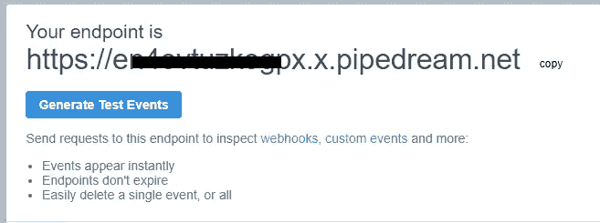

# 用 MongoDB 实现事件源

> 原文：<https://levelup.gitconnected.com/implement-event-sourcing-with-mongodb-1fbf2cc0d155>

## 如何在不影响应用程序代码库的情况下启用事件源模式

事件源方法是一种基于微服务构建新架构的新兴模式。这种方法的优点不胜枚举，但我将尝试分享其中最重要的:

*   解耦系统
*   实时更改(这意味着我不必等待移动数据的计划作业)
*   责任分离

自从我们转向微服务以来，这种方法得到了非常广泛的使用，我们需要一些方法来通知所有架构部分数据的变化。

在本文中，我们将深入了解什么是事件源，以及如何使用 MESS 实现它，MESS 是一个直接连接到 environment:
- NODE_ENV=production
- PORT=5000
- MONGODB_URL=<connection string>
volumes:
- ./config/:/usr/src/app/config/
expose:
- "8081"

下一步是通过在路径`.config/config.js`中创建一个文件来配置它。该文件配置列出哪些数据库和集合。在我们的例子中，我们将通过输入下面的配置列出一个名为`test-db`的数据库以及其中的所有集合:

```
{
  databases:{
    "test-db":{
    }
}}
```

如果您只从一个集合中监听变更，您只需在那个`test-db`节点中添加名字，正如官方文档中解释的那样。

为了测试这个工具，我们可以使用 [RequestBin](https://requestbin.com/) 这个工具可以公开端点并跟踪你发出的所有 HTTP 请求。为此，只需导航到网址“[https://requestbin.com/](https://requestbin.com/)”并点击“**创建一个公共垃圾箱。**”。


创建新的媒体夹

该选项将创建一个不需要身份验证的公共 HTTP 端点。进入下一个窗口，您将看到可以用作请求目的地的 URL。您应该会看到类似下图的内容。



下一步是定义监听管道。事实上，我们可以连接许多操作数据的动作，并将其发送到正确的目的地。作为目的地，我们可以使用 HTTP 调用(webhook)或队列。在这个例子中，我将使用 webhook 和 log 来跟踪数据。配置如下:

```
pipeline: [{
            name:"log"
        },
        {
            name:"http",
            config: 
            {
                "endpoint":"https://<myid>.x.pipedream.net"
            }
        }],
```

现在配置已经完成，我们可以启动应用程序了。在您的终端中键入`docker-compose up`,您会看到 MESS 正在监听端口 3000。

我们只需进入 MongoDB 并编辑一些数据。在下图中，您可以看到数据编辑器


MongoDB 上的数据条目

保存后，事件已经侦听，您可以通过日志看到处理过程，如下图所示。


记录在控制台中的数据

作为最后一步，您可以根据请求检查操作的结果。你会发现类似下图的东西。


请求框捕获的数据

当然，您可以用任何其他 web 服务替换假的 RequestBin URL，这样就设置好了。如果您想要将数据转发到许多系统，您只需在管道中输入更多条目。

# 外卖

事件源对于微服务和复杂架构来说是一个非常有用的模式。可以有很多实现，但是可以考虑通过添加 MESS 来实现。如果您想在不修改架构中现有应用程序的情况下启用这种方法，这种解决方案是不错的。此外，可以对 MESS 进行配置，以定制数据交付的每个部分(也可以通过映射字段或创建定制适配器)，这样您就能够满足未来的任何请求。

喜欢这篇文章吗？成为 [*中等会员*](https://daniele-fontani.medium.com/membership) *继续无限制学习。如果你使用下面的链接，我会收到你的一部分会员费，不需要你额外付费。*

## 参考

*   [GitHub 项目](https://github.com/zeppaman/mongo-event-sourcing)
*   [NPM 套餐](https://www.npmjs.com/package/mongo-event-sourcing)
*   [Docker 图像](https://hub.docker.com/r/zeppaman/mongo-event-sourcing)