# 在 SwiftUI 中实施 MVVM

> 原文：<https://levelup.gitconnected.com/implement-mvvm-in-swiftui-47f76dc28f1a>

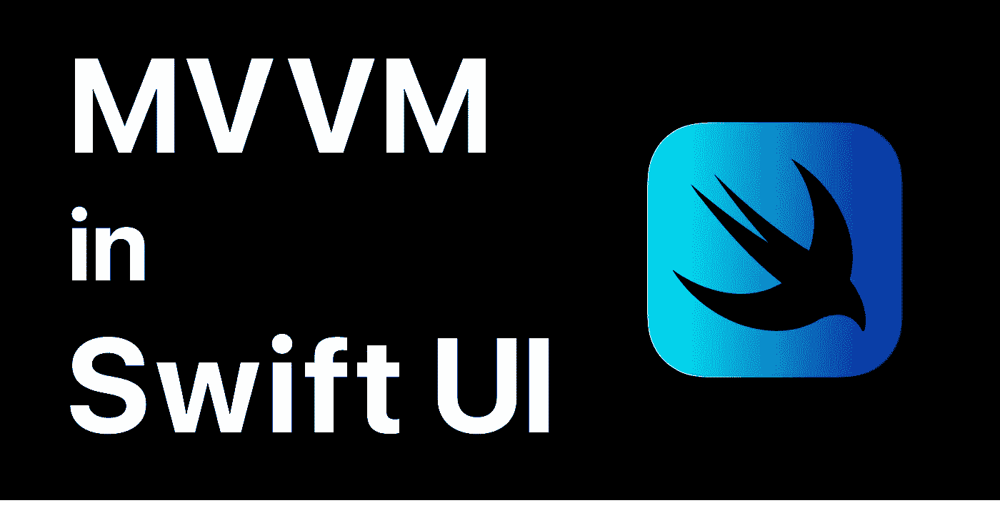

软件架构是开发者的强大武器。

在 iOS 开发中，SwiftUI 出现之前，Cocoa MVC 在大多数情况下是最适合的软件架构。(如果你想了解可可 MVC，参考我的另一篇[文章](https://dev.to/kazuooooo/get-hands-on-with-the-cocoa-mvc-pattern-2fg3))

但是现在，SwiftUI 中的 EnvironmentObject 的数据绑定特性允许轻松实现 MVVM 架构。所以我认为 MVVM 已经成为 iOS 应用(Swift UI)开发中的标准软件架构。

在本文中，我将描述什么是 MVVM，以及如何通过创建一个简单的计数器应用程序在 Swift UI 中实现 MVVM。

仅仅通过阅读很难在实际应用中使用软件架构。

所以，让我们自己来实现，用心去了解 mvvm

# 什么是 MVVM？

MVVM 是约翰·戈斯曼在 2005 年发明的一种软件架构。

MVVM 有三个组成部分**M**odel-**V**view-**V**view**M**odel

请注意，视图和视图模型通过数据绑定连接，以共享视图模型状态。

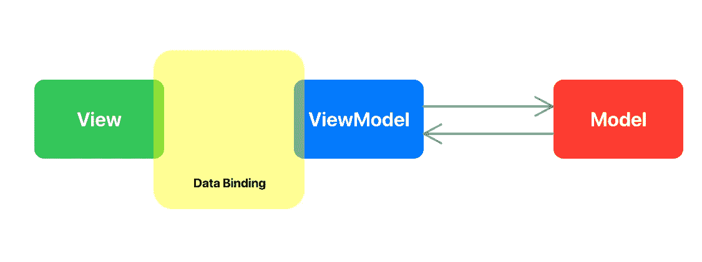

## 模型

模型具有与 UI 无关的域逻辑及其数据。模型与 MVC、MVP 等其他软件架构中的模型是一样的。

例如，访问数据库、控制设备、计算价格等——所有与 UI 无关的逻辑都包含在模型中

重要的是，模型完全独立于视图和视图模型，它必须能够单独构建。

## 视角

视图是接受用户输入并呈现用户界面以供显示的组件。视图有一个状态**使用数据绑定**与视图模型状态连接，并在视图模型状态因用户输入而改变时更新其视图。

## 视图模型

ViewModel 充当了模型和视图之间的桥梁。

ViewModel 有三个职责

*   为视图存储数据。
*   接受来自视图的事件并调用模型函数。
*   接受来自视图的事件并更新状态。然后视图状态通过数据绑定自动更新。

使用这些组件，MVVM 的基本数据流程图如下。

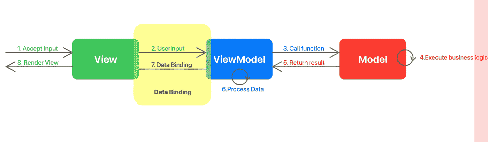

MVVM 的基本流程

1.  视图接受用户输入。
2.  视图将用户输入传递给视图模型。
3.  ViewModel 调用模型函数处理数据。
4.  模型执行一些业务逻辑。
5.  模型将函数的结果返回给视图模型。
6.  ViewModel 用结果更新其状态。
7.  视图模型状态通过数据绑定传播到视图。
8.  视图将更新的视图模型状态反映到它的视图中。

耶！我们快速浏览了一下 MVVM。

没关系，如果你还不明白。
我们将在自己实施 MVVM 后再次回顾此流程。

让我们在下一章使用 MVVM 创建一个简单的应用程序。

# 在 MVVM 实施简单的柜台应用程序

我们将创建如下非常简单的计数器应用程序。

用户可以通过点击加减按钮来上下计数。

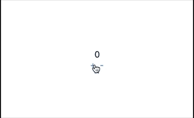

我已经准备好包括开始和完成应用程序的存储库。您可以从 Starter 目录开始，也可以自己创建新项目。

[https://github.com/kazuooooo/SwiftUIMVVMFromScratch](https://github.com/kazuooooo/SwiftUIMVVMFromScratch)

## 反模型

首先，我们实现了 MVVM 的 M，反模型。

它具有非常简单的业务逻辑，从参数中增加和减少值。

## 对抗模型

其次，实现 MVVM VM，对抗模型。

反视图模型有三个职责

*   存储计数(存储数据以供查看。)
*   具有视图的向上计数和向下计数方法(从视图接受事件)
*   调用 CounterModel 方法来递增和递减计数，并用返回值更新其计数(调用模型方法并更新其状态)

## 反对意见

最后，实施 MVVM V，提出对策。

查看代码也很简单。
请注意，视图具有使用 EnvironmentObject 的 CounterViewModel 对象。环境对象允许结构使用与可观察对象的数据绑定。

*(️NOTE:只想着这个简单的应用，你最好用@ObservedObject。但这段代码旨在用简单的代码解释如何在一个嵌套视图更深、更复杂的应用程序中实现 MVVM。所以，我这里用@EnvironmentObject。谢谢*@梵持 M *)*

仅此而已！请检查计数器是否正常工作

# 查看带源代码的 MVVM 流程

最后，让我们用刚刚编写的源代码来回顾一下 MVVM 数据流！
通过重新回顾实现后的流程，我们可以比仅仅写代码更深刻地理解 MVVM。

## 1.查看接受用户输入

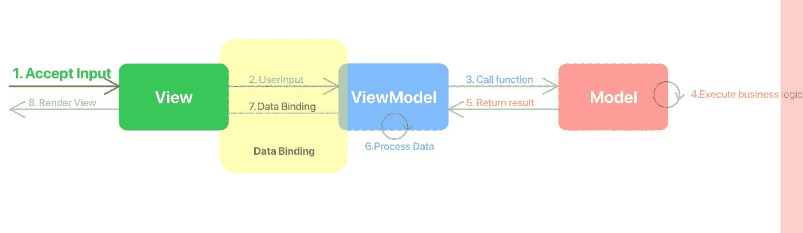

通过+和-按钮接受用户输入

## 2.视图将用户输入传递给视图模型

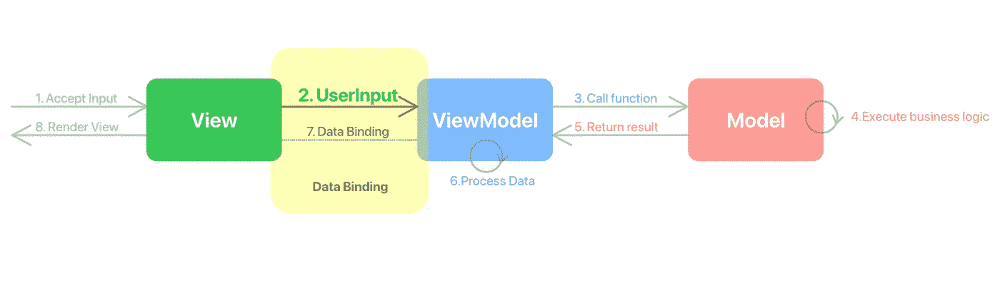

视图调用视图模型向上计数方法。

## 3.ViewModel 调用模型函数处理数据。

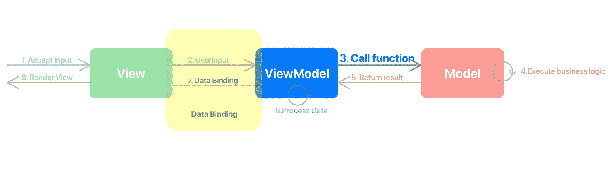

CounterViewModel 调用 CounterModel increment 方法，将当前计数作为参数。

## 4.模型执行一些业务逻辑

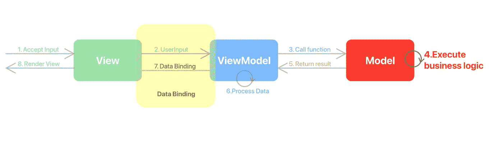

CounterModel 将计数增加到 ViewModel 中的参数计数。

## 5.模型将函数的结果返回给视图模型。

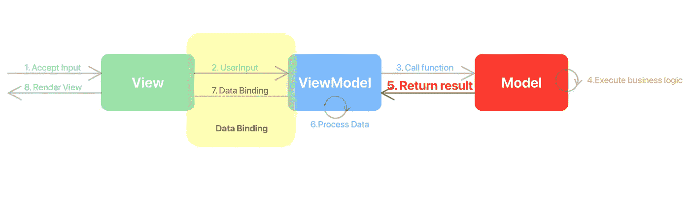

然后 Model 将结果返回给 ViewModel。

## 6.ViewModel 用结果更新其状态。

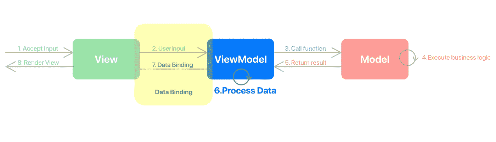

计数器视图模型接收结果并更新其计数

## 7.视图模型状态通过数据绑定传播到视图

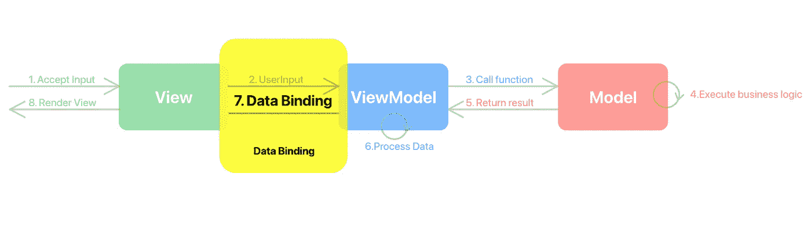

在 ViewModel 值更改时，更新的计数值会通过环境对象数据绑定立即传播到 CounterView。

(此处无代码)

## 8.视图将更新的视图模型状态反映到它的视图中。

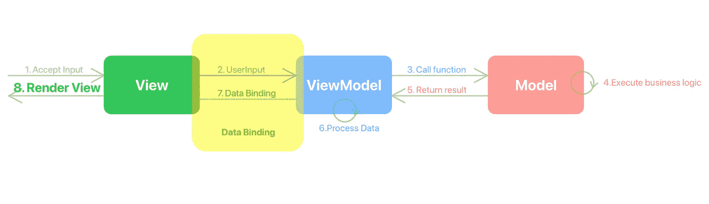

最后，视图将更新后的计数呈现给标签。

## 摘要

MVVM 架构必须是 SwiftUI iOS 应用开发的强大工具。值得花时间去学习！
感谢阅读！