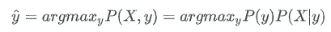
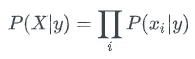
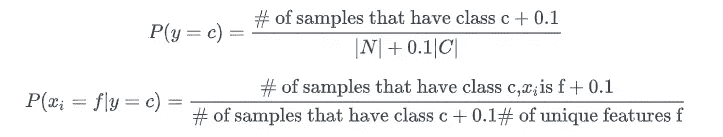
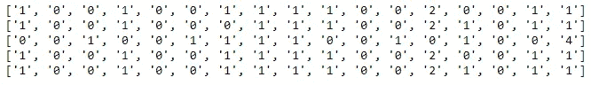
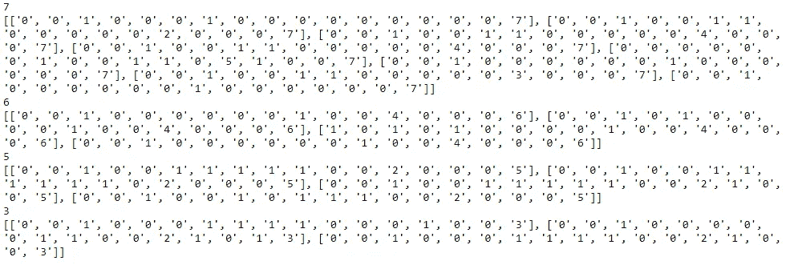
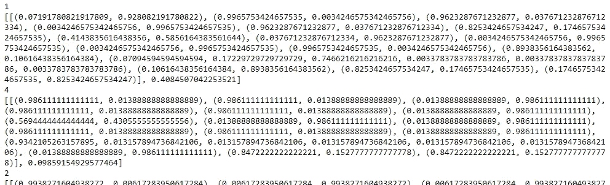
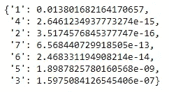

# 使用 Python 从头实现朴素贝叶斯分类器

> 原文：<https://levelup.gitconnected.com/implement-naive-bayes-classifier-from-scratch-using-python-11f0ad137600>

这篇文章的灵感来自于 MCS-DS 项目(来自 UIUC)的课程作业(CS412:数据挖掘导论)。此外，感谢杰森·布朗利关于机器学习掌握的[帖子](https://machinelearningmastery.com/naive-bayes-classifier-scratch-python/)。

用于演示的数据集是来自 UCI 机器学习[数据集](https://archive.ics.uci.edu/ml/datasets/Zoo)的动物园动物分类数据集，这是分类数据。在 Jason 的文章中，他使用了著名的鸢尾花物种数据集，其中包含连续值数据。但是概念非常相似，两个帖子使用的唯一库是 Random(用于分割训练和测试数据)。

## 朴素贝叶斯分类器

首先，让我们了解朴素贝叶斯分类的基础知识。

让我们将特征表示为 X，将标注表示为 y。作为生成模型，朴素贝叶斯分类器基于联合概率 P(X，y)的估计进行预测。

对于每个示例，预测标签由下式确定:



在朴素贝叶斯分类器中，我们假设给定类别标签，所有特征都是独立的。这意味着:



为了进行预测，我们需要跟踪 P(y)和 P(Xi|y)。

## 缓和

由于一些数据组合没有出现在我们的数据集中，我们平滑的概率和拉普拉斯校正。具体来说，由于动物园动物数据集很小，我们用伪计数 0.1 来平滑概率。

也就是说，



## 动物园动物分类数据集

动物园数据库是由理查德·福赛思在 1990 年创建的。这是一个简单的数据库，包含来自动物园的 101 只动物。有 16 个不同特征的变量来描述动物。这 7 类类型是:哺乳动物、鸟类、爬行动物、鱼类、两栖动物、昆虫和无脊椎动物。“类型”属性似乎是类属性。以下是哪种动物属于哪种类型的分类:

类别# —动物组:

= = = = = = = = = = = = = = = = = = = = = = = = = = = = = = = = = = = = =
1—(41)土豚、羚羊、熊、野猪、水牛、小牛、豚鼠、猎豹、鹿、海豚、大象、果蝠、长颈鹿、女孩、山羊、大猩猩、仓鼠、野兔、豹、狮子、猞猁、水貂、鼹鼠、猫鼬、负鼠、大羚羊、鸭嘴兽、矮种马、鼠海豚、美洲狮、猫、浣熊、驯鹿、海豹、海狮、松鼠、吸血鬼、田鼠、小袋鼠 大蜥蜴
4 — (13)鲈鱼、鲤鱼、鲶鱼、鲢鱼、狗鱼、黑线鳕、鲱鱼、狗鱼、食人鱼、海马、鳎鱼、黄貂鱼、金枪鱼
5 — (4)青蛙、青蛙、蝾螈、蟾蜍
6 — (8)跳蚤、昆虫、蜜蜂、家蝇、瓢虫、蛾、白蚁、黄蜂
7 — (10)蛤蜊、螃蟹、小龙虾、章鱼、蝎子、海黄蜂、蛞蝓、海星、蠕虫

属性信息:

1.动物名称:每个实例的唯一名称
2。头发:布尔
3。羽毛:布尔
4。彩蛋:布尔
5。牛奶:布尔
6。空降:布尔
7。水生:布尔
8。捕食者:布尔
9。有齿:布尔
10。主干:布尔
11。呼吸:布尔型
12。剧毒:布尔
13。鳍:布尔型
14。腿:数字(一组值:{0，2，4，5，6，8})
15。tail:布尔型
16。国产:布尔
17。catsize: Boolean
18。类型:数值(范围[1，7]内的整数值)

显然这是一个多类分类任务。动物的名字不应该被用来预测。15 个属性是布尔值(0 或 1)。“腿”属性有数值(0，2，4，5，6，8)。在我们的代码中，我们将把它们分别翻译成(0，1，2，3，4，5)。

现在让我们深入到编码部分。

## 加载库

```
import random
```

如前所述，random 是我们唯一需要的库，用于拆分训练和测试数据。

## 加载数据和数据清理

在这里，我们假设您已经从[这里](https://archive.ics.uci.edu/ml/machine-learning-databases/zoo/zoo.data)下载了数据，并将其保存在与 python 代码或 Jupyter 笔记本相同的目录下。

```
# read in the file
file = open('zoo.data', 'r')# create a list to include all the lines in the text file
data = []
for line in file:
    data.append(line)

# close file
file.close()# remove /n from end of each line
data = [i.strip() for i in data]
```

我们使用列表来存储数据，列表的长度是 101，因为数据库中有 101 只动物。现在我们显示数据中的前 5 条记录。

```
data[0:5]
['aardvark,1,0,0,1,0,0,1,1,1,1,0,0,4,0,0,1,1',
 'antelope,1,0,0,1,0,0,0,1,1,1,0,0,4,1,0,1,1',
 'bass,0,0,1,0,0,1,1,1,1,0,0,1,0,1,0,0,4',
 'bear,1,0,0,1,0,0,1,1,1,1,0,0,4,0,0,1,1',
 'boar,1,0,0,1,0,0,1,1,1,1,0,0,4,1,0,1,1']
```

我们现在用“，”分割每条记录，并将每条记录从字符串转换为列表。然后我们去掉动物的名字，因为它对预测没有用。最后，我们使用一个定义的函数，将 legs 属性值转换为(0，1，2，3，4，5)。这样做的原因是更容易进行后续计算，因为我们可以直接使用属性值作为索引来从模型中检索可能性。代码如下:

```
split_data = [d.split(",") for d in data]animal_names = []
for row in split_data:
    name = row.pop(0)
    animal_names.append(name)# define a function to convert legs attribute to 0 - 5
def convert_legs_value(data):
    value_list = ['0', '2', '4', '5', '6', '8']
    convert_list = ['0', '1', '2', '3', '4', '5']
    for row in data:
        row[12] = convert_list[value_list.index(row[12])]
    return datasplit_data = convert_legs_value(split_data)
```

现在，我们再来看一下数据。

```
for i in range(5):
    print(split_data[i])
```



记住每条记录的最后一个元素是标签。我们成功地翻译了“腿”值(属性 13)。例如，对于前两个动物，原始值是 4，现在是 2。

## 分割训练和测试数据

首先，我们定义一个数据分割函数。实际上对于 test_size 参数，我们可以输入样本数(int)或百分比(float)。函数可以处理这两种情况。

```
def train_test_split(data, test_size):

    if isinstance(test_size, float):
        test_size = round(test_size * len(data)) test_indices = random.sample(range(len(data)), k=test_size)
    train_indices = [i for i in range(len(data)) if i not in test_indices]

    test_df = []
    for index in test_indices:
        test_d = data[index]
        test_df.append(test_d)

    train_df = []
    for index in train_indices:
        train_d = data[index]
        train_df.append(train_d)

    return train_df, test_df
```

然后我们可以使用这个函数，将数据随机分成训练数据(71)和测试数据(30)。行 random.seed(0)有助于确保每次运行代码时都能得到相同的结果。

```
random.seed(0)
train_data, test_data = train_test_split(split_data, test_size = 30)train_sample_num = len(train_data)
attr_num = len(train_data[0])-1
```

我们还分配了两个全局变量:train_sample_num 和 attr_num，它们将用于后面的计算。attr_num 有一个“-1”，因为每个动物的最后一个值是标签，而不是属性。

最后，我们完成了数据准备部分，现在我们可以转移到朴素贝叶斯模型训练和测试。

## 按类分隔数据

第一步，我们定义一个函数来按类分离训练数据。这里我们使用字典来存储数据。字典键是显示在训练数据集中的类，而字典值是属于每个类的记录。这很重要，因为稍后我们将依赖分离的数据来计算 P(y)和 P(Xi|y)。

代码如下:

```
# Split the dataset by class values, returns a dictionary
def separate_by_class(dataset):
    separated = dict()
    for i in range(len(dataset)):
        vector = dataset[i]
        class_value = vector[-1]
        if (class_value not in separated):
            separated[class_value] = list()
        separated[class_value].append(vector)
    return separatedseparated = separate_by_class(train_data)
```

让我们看一下分离出来的部分数据，你就明白了。

```
for key, value in separated.items():
    print(key)
    print(value)
```



## 通过计算可能性训练模型

我们在这里定义的第一个辅助函数用于计算 P(y)。这真的很简单。

```
def calculate_class_py(label):
    count = len(label)
    py = count/train_sample_num
    return py
```

下一个辅助函数是用来计算 P(Xi|y)的。这部分有点棘手，因为“腿”属性不同于所有其他属性，它有 6 个不同的独特功能。所以，我们用不同的方式处理了这件事。此外，当计算 P(Xi|y)时，我们向每个分子添加 0.1，并向分母添加 0.1 * #的独特特征。这是平滑的，因为我们不希望一个单一的 0 可能性值破坏整个计算。

```
def calculate_pxy(label):
    pxy = []
    for i in range(attr_num):
        if i != 12:
            count0 = 0
            count1 = 0
            for row in label:
                if row[i] == '0':
                    count0 += 1
                else:
                    count1 += 1
            cal = ((count0 + 0.1)/(len(label) + 0.2), (count1 + 0.1)/(len(label) + 0.2))
            pxy.append(cal)
        else:
            count0 = 0
            count1 = 0
            count2 = 0
            count3 = 0
            count4 = 0
            count5 = 0
            for row in label:
                if row[i] == '0':
                    count0 += 1
                elif row[i] == '1':
                    count1 += 1
                elif row[i] == '2':
                    count2 += 1
                elif row[i] == '3':
                    count3 += 1
                elif row[i] == '4':
                    count4 += 1
                else:
                    count5 += 1
            cal = ((count0 + 0.1)/(len(label) + 0.6), (count1 + 0.1)/(len(label) + 0.6), (count2 + 0.1)/(len(label) + 0.6),
                   (count3 + 0.1)/(len(label) + 0.6), (count4 + 0.1)/(len(label) + 0.6), (count5 + 0.1)/(len(label) + 0.6))
            pxy.append(cal)

    return pxy
```

然后，我们可以使用这两个辅助函数来构建我们的模型，并将其存储到字典中。代码如下:

```
def summarize_by_class(separated):
    model = dict()
    for class_value, rows in separated.items():
        pxy = calculate_pxy(rows)
        py = calculate_class_py(rows)
        model[class_value] = [pxy, py]
    return modelmodel = summarize_by_class(separated)
```

让我们打印模型并展示部分结果，让您对模型有所了解。

```
for key, possibilities in model.items():
    print(key)
    print(possibilities)
```



从上面你可以看到，我们将 P(Xi|y)作为元组存储在每个类下。一个独特特征的一种可能性。这使得下面的预测很容易，因为我们可以根据要预测的数据直接选择我们需要的可能性。

## 进行预测和模型评估

使用训练模型预测的想法很简单，我们计算每个类别(在我们的例子中是 7 个类别)的可能性，并选择具有最高可能性值的一个作为我们的获胜者。

这里我们还需要一个辅助函数来计算类的可能性。请向上滚动到背景部分，在此处检查计算公式:

```
def calculate_class_probabilities(model, sample):
    probabilities = dict()
    for class_value, class_summaries in model.items():
        probabilities[class_value] = class_summaries[1]
        for i in range(attr_num):
            probabilities[class_value] *= class_summaries[0][i][int(sample[i])]
    return probabilities
```

我们可以用一个测试样本来检查函数，看看结果如何:

```
calculate_class_probabilities(model, test_data[0])
```



计算出的可能性表明，从测试数据来看，这种动物属于 1 类，这是正确的。

下面这个函数叫做预测。基本上，它使用上述函数的结果，为我们选择最佳的标签(类)。

```
# Predict the class for a given sample
def predict(model, sample):
    probabilities = calculate_class_probabilities(model, sample)
    best_label, best_prob = None, -1
    for class_value, probability in probabilities.items():
        if best_label is None or probability > best_prob:
            best_prob = probability
            best_label = class_value
    return best_label
```

最后，让我们对测试数据中的所有动物进行预测，并通过计算整体准确性来评估我们的模型。

```
# get all the predictions
predictions = []
for row in test_data:
    best_label = predict(model, row)
    predictions.append(best_label)# get all the real labels
actual = []
for row in test_data:
    real_label = row[-1]
    actual.append(real_label)

# Calculate accuracy percentage
def accuracy_metric(actual, predicted):
    correct = 0
    for i in range(len(actual)):
        if actual[i] == predicted[i]:
            correct += 1
    return correct / float(len(actual)) * 100.0accuracy = accuracy_metric(actual, predictions)
print("The accuracy of predcition is: %.2f percent!" %accuracy )
```

96.67%我们成功了！

我相信几乎所有的机器学习爱好者，像我一样，以前都使用过朴素贝叶斯分类器。我们都知道，对于垃圾邮件过滤等许多应用来说，这是一个很好的模型。但是通常我们直接使用 scikit-learn 这样的库，大多数时候我们并不关心，也不真正知道模型的底层是什么。

通过完成这个作业，我学到了很多东西，对模型有了更好的理解。通过写这篇文章，我想记录我的经历，同时与任何需要的人分享这些知识。

作为一个拥有 4 年多编码经验的数据科学家，我仍然认为自己是一个初学者。所以我上面列出的代码离完美还差得很远。即使对于朴素贝叶斯模型本身，也有很多东西可以改进:

首先，它不能处理连续值的特征。

其次，除了我们使用的动物园动物数据集之外，它还不足以处理其他数据集。

无论如何，如果你有任何建议或问题，请随时留下评论。如果您对 UIUC 的数据科学硕士项目有任何疑问，也请告诉我。