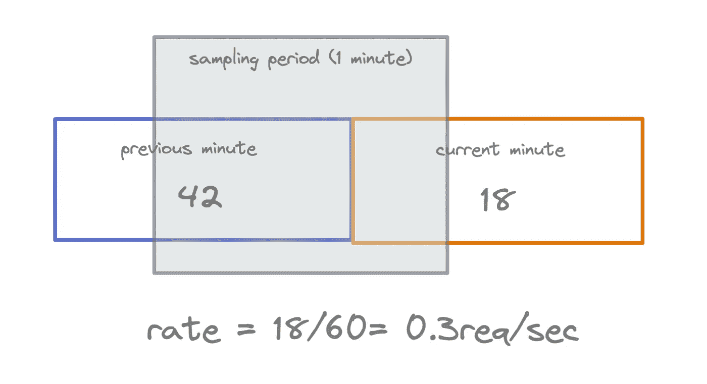
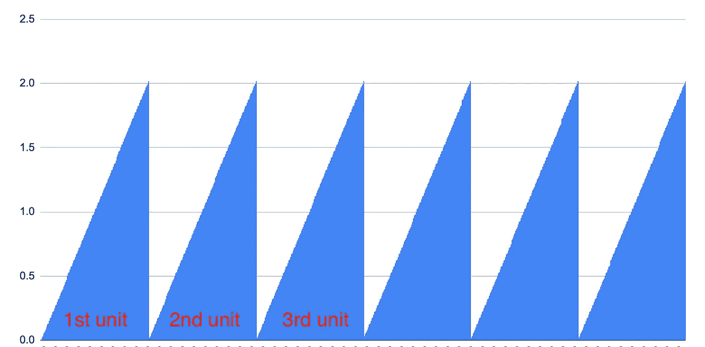
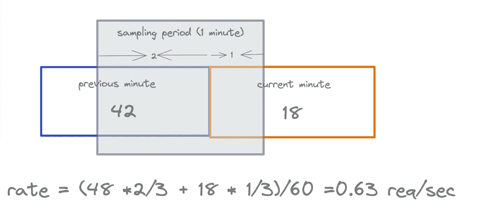
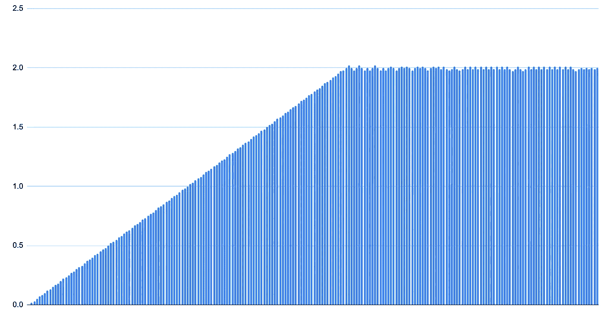

# 在 Python 中实现速率限制

> 原文：<https://levelup.gitconnected.com/implement-rate-limiting-in-python-d4f86b09259f>

速率限制是一种在特定时间段内限制请求数量的方法。当你有很多请求，想减轻负荷的时候，它是超级有用的。

这篇文章将向你展示在 Python 中从头开始实现速率限制的两种不同算法。

# 朴素固定窗口算法

进行速率限制的最直接的算法是**固定窗口算法**。



朴素的固定窗口算法做速率限制

该窗口是计数器计数的**采样周期**。每次收到请求时，我们都会增加计数器的值，每次新的采样周期开始时，我们都会重置计数器的值。

例如，在上面的图像中，采样周期是 60 秒。一旦进入当前分钟，我们就将计数器重置为零，并从零开始对请求进行计数。

## 如何定义费率？

它是当前采样周期内每秒的请求数，不包括前一分钟。

## 履行

下面是实现固定窗口算法的代码。

这种速率限制并不十分精确，因为计数器会定期任意重置，从而允许定期的流量峰值通过速率限制器。



速率(每秒请求数)与时间段的关系

# 滑动窗口算法

让我们对算法做一些调整，使它更准确。滑动窗口算法来了。

天真的固定窗口算法并没有那么糟糕:我们必须解决每当采样周期开始时完全重置计数器的问题。

我们可以使用来自**先前计数器的信息来推断请求速率的近似值。**



滑动窗口算法做速率限制

在这个例子中，我在 20 秒前开始的当前一分钟内发出了 18 个请求，在之前的一分钟内发出了 42 个请求。基于此信息，速率近似值的计算如下:

```
rate = (48 * 2/3 + 18 * 1/3)/60 = 0.63 seq/sec
```

这是代码。

这种速率限制对于大多数情况来说已经足够好了。它消除了固定窗口方法存在的流量峰值问题。



当然，我们可以改进算法，但它在实践中证明足够好。

# 集成示例

我们来举一个整合上述算法的例子。

我们创建一个名为`Throttle`的类来实现固定/滑动窗口算法。当当前速率超过阈值时，我们会休眠一段时间。

代码如下:

我希望你喜欢读这篇文章。如果你愿意支持我成为一名作家，可以考虑注册[成为](https://jerryan.medium.com/membership)中的一员。你还可以无限制地访问媒体上的每个故事。