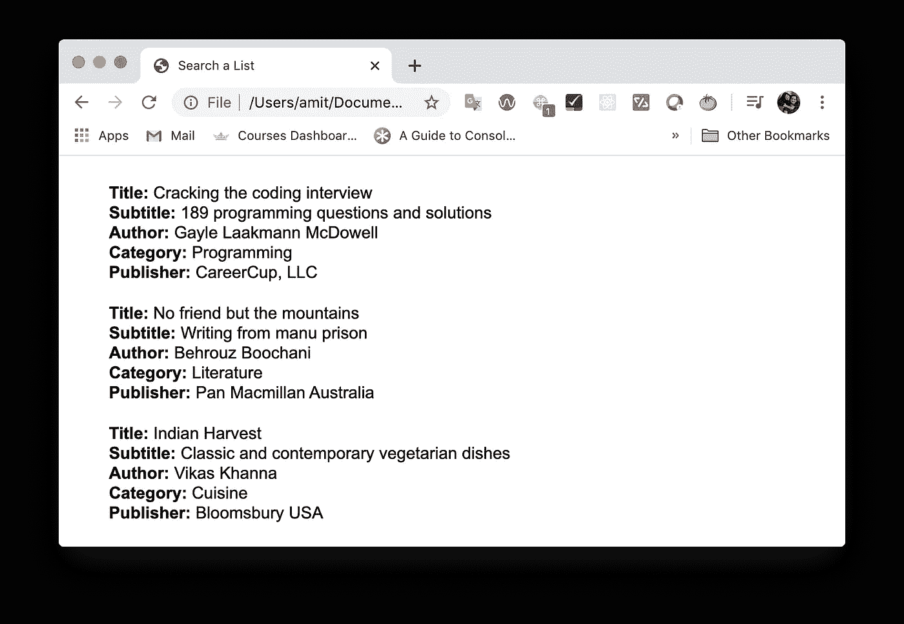

# 用普通 JavaScript 在网页上实现搜索功能

> 原文：<https://levelup.gitconnected.com/implement-search-feature-on-a-web-page-in-plain-javascript-adad27e48>


照片由[新闻社跟随](https://unsplash.com/@olloweb?utm_source=medium&utm_medium=referral)在 [Unsplash](https://unsplash.com?utm_source=medium&utm_medium=referral) 拍摄

本文描述了如何在 JSON 对象数组中搜索给定的关键字，并在 web 页面上显示结果。

我们将搜索书单。每个 book 对象包含一个标题、副标题、作者、类别和出版商。我们希望能够搜索一组搜索词的所有字段，并在网页上显示结果。

我们将从在网页上显示图书列表开始。

`The render()`函数将 JSON 对象数组作为其参数。然后它映射数组来创建一个 HTML 图书列表，并在`<div id="app"></div>`中显示该列表



图书清单

## 搜索字段

这将在网页上创建一个搜索字段


搜索字段

## 事件监听器

在`<script>`块中添加一个事件监听器来监听“提交”事件

```
<script>
...
var handleSearch = function(event) {
// to be implemented
}document.addEventListener('submit',handleSearch);
</script>
```

## 实施搜索

让我们详细看看代码

`event.preventDefault()`提交后停止页面重新加载。

```
// Get the search terms from the input field
var searchTerm = event.target.elements['search'].value;
```

`searchTerm`保存用户在搜索框中输入的搜索字符串。

```
// Tokenize the search terms and remove empty spaces
var tokens = searchTerm
             .toLowerCase()
             .split(' ')
             .filter(function(*token*){
                return token.trim() !== '';
             });
```

我们将搜索字符串分割成单独的标记，并删除任何空白。

```
//Example
searchTerm = "Cracking the Coding Interview"
tokens = ["cracking","the","coding","interview"]
```

`var searchTermRegex = **new** *RegExp*(tokens.join(‘|’), ‘gim’)`创建包含所有标记的正则表达式

```
//Example
searchTermRegex = /cracking|the|coding|interview/gim
```

以下代码创建了一个包含`book`对象中所有值的字符串，并将其赋给`bookString`变量。

```
// Create a string of all object values
var bookString = '';
for(var key in book) {
  if(book.hasOwnProperty(key) && book[key] !== '') {
    bookString += book[key].toString().toLowerCase().trim() + ' ';
  }
}//Example
book = {
  "title": "Cracking the coding interview",
  "subtitle":"189 programming questions and solutions",
  "author":"Gayle Laakmann McDowell",
  "category":"Programming",
  "publisher":"CareerCup, LLC"
}bookString = "cracking the coding interview 189 programming questions and solutions gayle laakmann mcdowell programming careercup, llc"
```

接下来，我们通过返回匹配`searchTermRegex`的对象来过滤`books`。

```
var filteredList = books.filter(function(*book*){ // ... Code to convert book object to a string ... // Return book objects where a match is found
  return bookString.match(searchTermRegex);
});// Render the search results
render(filteredList);
```

如果任何搜索项出现在`bookString`中，那么我们将那个`book`对象存储在`filteredList`中。我们通过调用`render()`函数并将`filteredList`传递给它来呈现搜索结果。

## 重置列表

我们用`type="reset"`创建了一个重置按钮。点击此按钮时，会触发“重置”事件。我们监听“reset”事件，并通过调用`render()`函数并将原始的`books`数组传递给它来呈现原始列表。

```
document.addEventListener('reset', function(*event*){
  event.preventDefault();
  render(books);
});
```

## 摘要

以下是实施搜索功能的总体步骤总结:

1.  将搜索字符串标记化
2.  创建令牌的正则表达式
3.  将书本对象字符串化
4.  在字符串化的 book 对象中查找搜索标记，并创建一个匹配的 book 对象列表。
5.  呈现搜索结果

[链接到代码](https://gist.github.com/amitgupta15/2240838e112ba073c24877583043fa34)