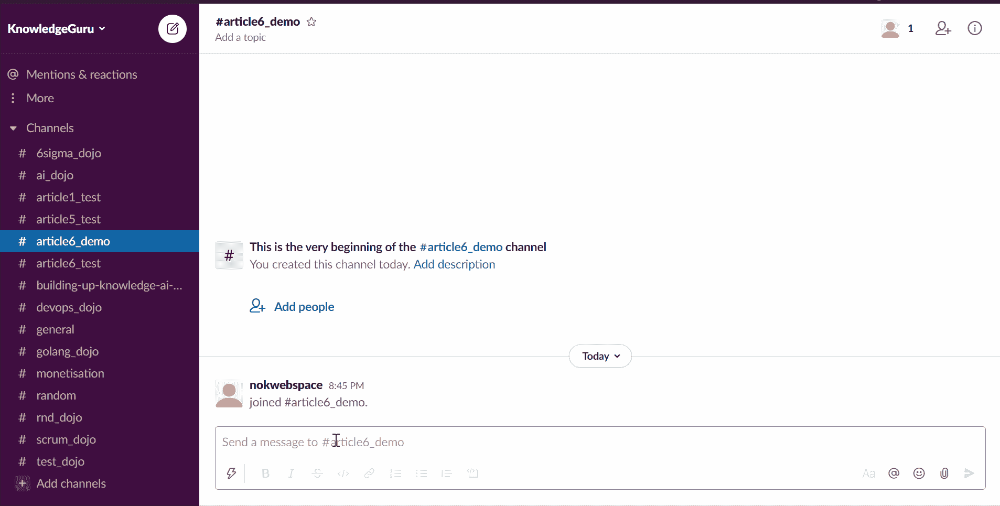
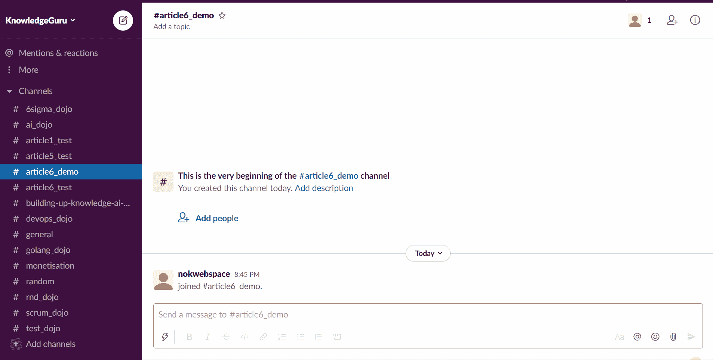
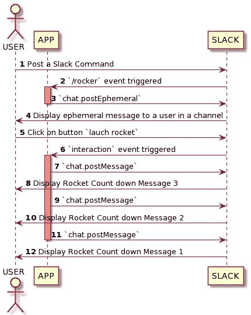

# 使用套接字模式在 Golang 中实现 Slack Slash 命令

> 原文：<https://levelup.gitconnected.com/implement-slack-slash-command-in-golang-using-socket-mode-ac693e38148c>

## GOLANG SLACKBOT 教程

## 为您的用户提供便捷的快捷方式


照片由 [Jean-Philippe Delberghe](https://unsplash.com/@jipy32?utm_source=medium&utm_medium=referral) 在 [Unsplash](https://unsplash.com?utm_source=medium&utm_medium=referral) 拍摄，Gopher 由 [Egon Elbre](https://github.com/egonelbre) 拍摄。

斜杠命令是您在对话框中键入的消息，以`"/"`开头。它们可以让你轻松地扩展 Slack 的功能，并且实现起来非常简单。我认为它们是通过从 Slack 通道进行编写来与您的生态系统进行交互的方式，然后您的 Slack 应用程序是幕后的指挥者，将您的用户请求重定向到正确的系统。简而言之，我想把它们描述为可以从 Slack 远程触发的功能。因此，无论您是想添加简单的实用程序，还是想将您的工作区变成一个功能齐全的 ChatOps 总部，**斜杠命令是 Slack 应用程序中的必备工具。**

这篇文章对 slash 命令进行了快速介绍，并详细解释了如何使用 Socket 模式开始使用 Golang。演示的关键 Slack API 概念是 Slack Slash 命令、短暂消息和交互式消息。

# 使用斜杠命令可以实现什么？

您可能熟悉 Slack 内置命令。如果没有，第一次进入任何对话类型`"/"`，然后第二次进入`"/"`，你将在你的工作区看到所有可用的命令👍。

Slack 允许您为应用程序创建类似命令。您首先通过 slack 应用程序后端进行订阅。然后，您会听到用户发出的命令，并最终开始与他们交互。这是一个很好的方式来创建容易提醒快捷方式，让您的用户行动起来。我的工作区中最流行的 Slack Slash 命令之一绝对是`/giphy`。



示例/giphy 命令

斜杠命令由两个元素组成。例如，当你输入`/rocket count=5`时，信息会被 Slack 分成两部分:

*   命令`/rocket`
*   正文`count=5`

命令段帮助您将用户请求分派给正确的服务或控制器，并且需要对文本部分进行解析，以便您的应用程序能够理解它。如果你写一个传统的命令行界面，你可能会期待`key=value`参数。但是要小心；您的用户可以在命令后输入任何内容，因此每当命令行的参数不正确时，总是要提供一条帮助消息来解释命令行是如何工作的。好消息是松散的交互性；当一个命令出错时，你还可以发送一条交互消息或打开一个模态来收集所需的信息。我发现第二种方法更加用户友好🤗。

这是您将在本教程中创建的命令的概述:



本教程的 Slack 命令示例

# 教程步骤 1 至 3:准备就绪

我已经写了几篇关于创建 Slack Bot 的文章，这几个基本步骤(1 到 3)最终是相同的😓。因此，我将向您简要介绍需要做哪些准备。如果您有任何疑问，请阅读专用文章。

[](https://medium.com/geekculture/build-slack-application-in-golang-using-socket-mode-setting-up-57f454e63c0a) [## 使用套接字模式在 Golang 中构建松弛应用程序—设置

### 每个 Slack 应用程序都是从几个简单的步骤开始的。

medium.com](https://medium.com/geekculture/build-slack-application-in-golang-using-socket-mode-setting-up-57f454e63c0a) 

## 第一步

1.  创建您的[新应用](https://api.slack.com/apps)
2.  在适当的部分激活套接字模式
3.  注册您需要的 OAuth 范围(chat:write —让您在通道中发布消息)
4.  注册一个斜杠命令

这个 gif 演示了如何注册一个新的 Slask 命令。对于这个例子，我将其命名为`/rocket`。

## 第二步

创建项目结构。后面的每一节都将关注这些文件中的一个。

```
+ controllers
|`- slashCommandController.go
+ drivers
|`- Slack.go
+ views
|`+ slackCommandAssets
| | `- rocket.json
|`- slashCommandView.go
+ main.go
```

## 第三步

1.  创建 driver/slack.go(或者从[这里](https://github.com/xNok/slack-go-demo-socketmode/blob/main/drivers/slack.go)复制)
2.  创建 main.go(或从这里的[复制](https://github.com/xNok/slack-go-demo-socketmode/blob/main/main.go))

# 教程步骤 4:创建控制器-> slashCommandController.go

以下流程图描述了控制器的行为:

*   接收一个松弛命令`/rocket`然后发送一个短暂的交互消息
*   如果用户同意，更新消息以显示火箭发射倒计时。



## 设置控制器

我们首先创建一个初始化构造函数。这个方法使用`*socketmode.SocketmodeHandler`来注册我们想要接收的事件以及哪个函数将处理它们。在这种情况下，我们听到两个事件:

*   将由`c.launchRocketAnnoncement`处理的斜线命令“/火箭”
*   与我们消息的`approved`按钮的交互将由`c.launchRocket`处理。这个按钮是“交互块”的一部分，由常量`views.RocketAnnoncementActionID`代表的 ActionID 唯一标识。我在这里使用一个常量，因为我想确保我监听的`ActionID`与用户调用`/rocket`命令后我们发送的消息中定义的相同。

## 用一条短暂的消息回应`rocket`

编写该函数的关键点如下:

1.  您需要将收到的泛型`socketmode.Event`转换为`slack.SlashCommand`
2.  您需要确认您收到了该事件。(Slack 希望您在 3s 内回复)
3.  您需要创建将要发送的消息。我将在后面用函数`views.LaunchRocketAnnoncement`讲述这一部分。
4.  你需要通过 Slack API 发送你的消息。此操作有两个选项。首先是标准 API `chat.postmessage`的使用。第二种是使用 Slash 命令中提供的响应 URL。(下一节将详细介绍响应 URL)

## 对用户在“批准”按钮上的操作做出反应

该方法的结构类似于前一种方法。如果你能编码一个，你也能编码这个😇。

参见 slashCommandController.go 完整代码[此处](https://github.com/xNok/slack-go-demo-socketmode/blob/main/controllers/slashCommandController.go)。

# 关于响应 URL 的更多信息

响应 URL 基本上是一个 webhook，让您在 30 分钟内与频道互动多达 5 次。每当触发斜杠命令或交互消息时，Slack 都会提供响应 URL。

使用响应 URL 时，您有两种选择:

*   回应频道，让每个人都能看到机器人的回应`Slack.ResponseTypeInChannel`
*   用一个短暂的消息响应，只有触发命令的用户才能看到它`slack.ResponseTypeEphemeral`

在这种情况下，我们将一个`MsgOption`添加到我们的`PostMessage`调用中:

有必要提及的是，响应 URL 允许您在频道中发布消息，即使您的 Bot 尚未添加到频道中。实际上 [chat.postMessage](https://api.slack.com/methods/chat.postMessage) 只允许你向你的机器人已经加入的频道发布消息；否则，您会收到错误`not_in_channel`。换句话说，响应 URL 允许您与用户进行交互，而不考虑通常的权限规则(当然，为了安全起见，次数是有限的)。

创建命令时要考虑的其他选项:

*   安排一条消息(如果你的应用程序创建了某种提醒)
*   在[应用主页](https://api.slack.com/start/overview#app_home)发送消息。与短暂的消息相比，我更喜欢这种方法，因为它在一个地方留下了您与应用程序的所有交互的痕迹。
*   使用`slack.SlashCommand`中提供的`trigger_id`打开一个模态。这是 Slack 的一个迷人的特性。我更喜欢在命令行中解析参数的方法；对于非开发人员来说，它更加用户友好。

# 教程步骤 5:创建视图> slashCommandView.go

最后但同样重要的是，我们需要学习如何生成松弛信息。Slack 推出了 [Block-kit](https://api.slack.com/block-kit) 来帮助我们不用试错就能创建我们的信息。我处理 slack 消息的方法是将 Block-kit 有效负载保存为 JSON 文件，然后使用 [Go 模板](https://golang.org/pkg/text/template/)来呈现我的视图并注入变量。

我写了一篇关于这个主题的专门文章，以进行更深入的解释:

[](https://couedeloalexandre.medium.com/manage-static-assets-with-embed-golang-1-16-75c89c3eea39) [## 管理 Golang 中的静态资产

### 使用 Golang 1.16 新包“嵌入”的新方法

couedeloalexandre.medium.com](https://couedeloalexandre.medium.com/manage-static-assets-with-embed-golang-1-16-75c89c3eea39) 

您可以在这里微调 Block-kit [中的信息。将有效负载保存为一个名为。`slackCommandAssets/annoncement.json`。](https://app.slack.com/block-kit-builder/T0B5XJYR2#%7B%22blocks%22:%5B%7B%22type%22:%22section%22,%22text%22:%7B%22type%22:%22mrkdwn%22,%22text%22:%22*You%20are%20about%20to%20lauch%20a%20new%20rocket*%22%7D%7D,%7B%22type%22:%22section%22,%22fields%22:%5B%7B%22type%22:%22mrkdwn%22,%22text%22:%22*Rocket:*%5CnFalcon%209%22%7D,%7B%22type%22:%22mrkdwn%22,%22text%22:%22*When:*%5Cn3s%20count%20down%22%7D%5D%7D,%7B%22type%22:%22actions%22,%22elements%22:%5B%7B%22type%22:%22button%22,%22text%22:%7B%22type%22:%22plain_text%22,%22emoji%22:true,%22text%22:%22Approve%22%7D,%22style%22:%22primary%22,%22value%22:%22click_me_123%22%7D,%7B%22type%22:%22button%22,%22text%22:%7B%22type%22:%22plain_text%22,%22emoji%22:true,%22text%22:%22Deny%22%7D,%22style%22:%22danger%22,%22value%22:%22click_me_123%22%7D%5D%7D%5D%7D)

创建此视图的要点是:

1.  Render 模板将用户名注入消息中。我创建了一个小的实用函数来做这件事，因为我在每个视图中都重用它。 [views/utils.go](https://github.com/xNok/slack-go-demo-socketmode/blob/main/views/utils.go) 。模板中使用的参数有:倒计时的秒数`{{ .Number }}`，我们在创建控制器`{{ .ActionID }}`时讨论过的批准按钮的唯一标识符，
2.  将生成的消息解组为一个 Slack 消息。

见 slashCommandView.go 完整代码[此处](https://github.com/xNok/slack-go-demo-socketmode/tree/main/views)。

# 后续步骤

## 尝试此应用程序

成功完成教程后💪，您可以运行您的应用程序:

```
go run ./main.go
```

也可以直接克隆[我的库](https://github.com/xNok/slack-go-demo-socketmode)提前试一试。

## 能改善吗？

一旦完成了本教程，您就为所有后续的 Slack 命令打下了坚实的基础。您不仅学习了斜杠命令，还学习了发送消息(定期的和短暂的)、使用 Block-kit 和创建交互式消息。但是你还记得我提到过模态是通过命令行参数收集用户输入的首选方式吗？这是一个很好的后续挑战:

*   向临时消息添加一个按钮(例如，配置 rocket 类型)
*   打开一个模式以提供可配置的选项(例如，使倒计时可配置)

# 参考

*   [https://api.slack.com/interactivity/slash-commands](https://api.slack.com/interactivity/slash-commands)
*   [https://api.slack.com/legacy/interactive-messages](https://api.slack.com/legacy/interactive-messages)