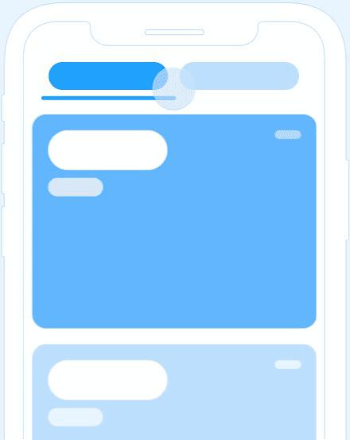
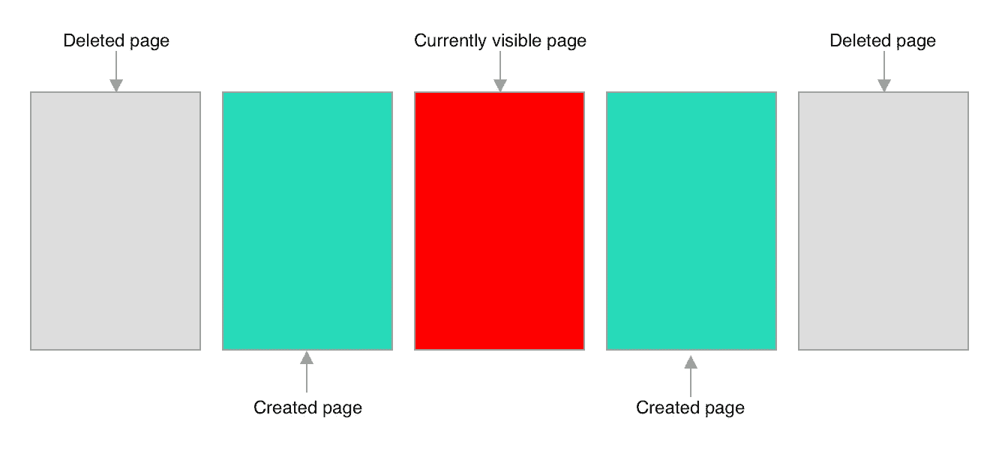
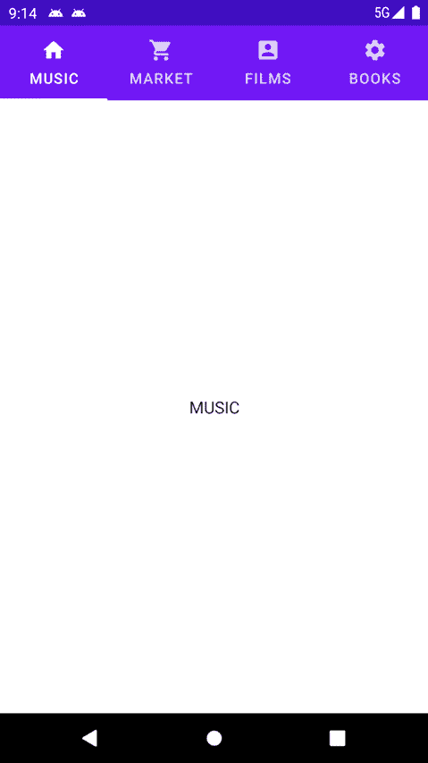

# 在 Android Jetpack Compose 中用 ViewPager 实现 TabLayout

> 原文：<https://levelup.gitconnected.com/implement-tablayout-with-viewpager-in-android-jetpack-compose-d509fc6e2d8e>

## 我们如何使用带有标签页的分页器，以流畅的动画和良好的无限循环效果在页面间滑动。



[https://dribbble.com/shots/5369346-UI-Tabs-Animation](https://dribbble.com/shots/5369346-UI-Tabs-Animation)

# 介绍

页面之间的滑动在诸如 onboarding、设置向导等 ui 中很常见…我想你已经知道如何使用`ViewPager`进行页面滑动。如果你正在寻找 Compose 中的`ViewPager`的替代品，我建议你看看这个`Pager`库。

这个库目前是实验性的。所有的 API 都标记为`@ExperimentalPagerApi`，但是它很好地处理了核心分页功能。

在这篇文章中，让我们来看看如何使用带有标签的分页器在页面间滑动，并具有流畅的动画和良好的无限循环效果。

我们开始吧！🥰

# 步骤 1:项目设置

首先请查看[传呼机网站](https://github.com/google/accompanist/tree/main/pager)获取最新版本。

然后将以下内容添加到您的应用程序的`build.gradle`:

```
dependencies {
    implementation "com.google.accompanist:accompanist-pager:0.12.0"
}
```

# 第二步:横向页面

为了实现选项卡，我们将使用两个组件`HorizontalPager`和`PagerState`。

`HorizontalPager`是一个在编写环境中的 ViewPager，允许用户在页面之间水平滑动。没有必要一次创建所有的页面，因为这样做会占用大量的内存，用户也不会浏览所有的页面。默认情况下，`HorizontalPager`仅创建当前页面以及当前页面左侧和右侧的离屏页面。超出此限制的页面将被删除。



这个问题的解决方法是什么？

耶有:`PagerState`

这是`HorizontalPager` 的一种状态，我们希望跨构图*保持。*让我们来看看`PagerState`的方法签名:

我们可以看到，有 5 个可用属性可以传递给`rememberPagerState`函数:

*   `**pageCount**`:页数。这是必需的。
*   `initialPage`:初始页面，默认值为 0。
*   `initialPageOffset`:初始页面偏移量。
*   `initialOffscreenLimit`:定义当前页面两侧应保留的页数。该值至少需要 1 个屏幕外页面。您需要密切关注内存管理。如果有很多像图像和动画这样的项目，如果你缓存所有的项目，这可能会导致一个 *OutOfMemoryError。*
*   `infiniteLoop`:得心应手的属性。如果为真，您只需一步即可从第一页滑动到最后一页。

记住这些属性，我们可以创建一个`PagerState`，并将其传递给`HorizontalPager` **。**

让我们来看看`HorizontalPager:`的方法签名

我们可以看到，有 9 个可用属性可以传递给`HorizontalPager`函数:

*   `**state**`:我们上面创建的`PagerState`。这是必需的。
*   `modifier`:应用于页面的修饰符。
*   `reverseLayout`:当真项从结束到开始合成时。
*   `itemSpacing`:项目间添加的水平间距。
*   `dragEnabled`:为 false 时，用户不能在页面间滑动。
*   `flingBehavior`:描述投掷行为的逻辑。
*   `verticalAlignment`、`horizontalAlignment`:帮助对齐布局的子项。
*   `content`:使用另一个可组合函数创建页面。

# 步骤 3:与选项卡集成

你可以查看这个[链接](https://mr-umbrella.medium.com/implement-tab-in-jetpack-compose-ac0d6fe2dc83)来看看我的文章如何在 jetpack compose 中实现 tab。

[](https://mr-umbrella.medium.com/implement-tablayout-with-viewpager-in-jetpack-compose-88e56fab3cd6) [## 在 Jetpack Compose 中用 ViewPager 实现 TabLayout

### 介绍

mr-umbrella.medium.com](https://mr-umbrella.medium.com/implement-tablayout-with-viewpager-in-jetpack-compose-88e56fab3cd6) 

让我们创建一个包含 4 个选项卡和一个指向它们的页面链接的屏幕。我已经将离屏设置为 2，打开无限循环，初始页面在第二页。当选项卡被点击时，会有一个动画将页面滑动到该选项卡。以下是代码:



我使用`animateScrollToPage()`根据用户按下的标签动画跳转到相应的页面。改为使用`scrollToPage()`即时跳转，不看其他页面。这两个方法都是挂起函数，所以被包装到一个协同作用域中。

如果您在执行代码片段时发现问题，请查看 GitHub repo [Tab-Compose](https://github.com/PhongHuynh93/Tab-Compose) 获取帮助。

[](https://github.com/PhongHuynh93/Tab-Compose) [## phonghuynh 93/Tab-撰写

### 通过 jetpack compose 实现带有寻呼机的选项卡。在 GitHub 上创建一个帐户，为 PhongHuynh93/Tab-Compose 开发做贡献。

github.com](https://github.com/PhongHuynh93/Tab-Compose) 

在这篇文章中，我们快速浏览了 Jetpack Compose 的页面组件。非常感谢你阅读我的文章。*如果你喜欢这个故事，请点击**👏 ***按钮和*** *分享它来帮助别人吧！*关注我的 [Medium](https://mr-umbrella.medium.com/) *获取更多牛逼安卓小技巧*。你也可以在 [LinkedIn](https://www.linkedin.com/in/huynh-phong-3649a7131/) 上找到我。祝您愉快！😄*

# *参考*

*[在 Jetpack Compose 中实现 tab layout](/implement-android-tablayout-in-jetpack-compose-e61c113add79)*

# *继续读 Android 的东西*

*[如何在 Android 中创建 like 按钮动画](/how-to-create-like-button-animation-in-android-part-1-f99e2792143d)*

*[Android 中使用 MaterialContainerTransform 的共享元素](/shared-element-using-materialcontainertransform-in-android-6d420e74b122)*

*[安卓按钮变形动画](/android-button-morphing-animation-bc3bed740501)*

*[运动布局——折叠工具栏](/motionlayout-collapsing-toolbar-d0ce8dd874b6)*

# *Jetpack 撰写*

*[在 Jetpack Compose 中实现 snack bar](/implement-android-snackbar-in-jetpack-compose-d83df5ff5b47)*

*[在 Jetpack Compose 中创建一个带有变形和 ken burns 效果的自动滚动浏览器](/create-an-auto-scroll-viewpager-with-transformation-and-ken-burns-effect-in-android-jetpack-compose-efdf46f2e8ed)*