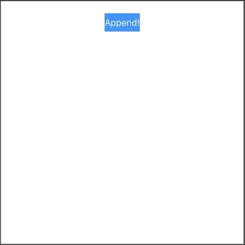

# 在 Swift 5 中实施键值观察

> 原文：<https://levelup.gitconnected.com/implement-the-key-value-observation-in-swift-5-e6f24638a26f>

## 轻松地将模型绑定到视图

照片由[卢卡·布拉沃](https://unsplash.com/@lucabravo?utm_source=unsplash&utm_medium=referral&utm_content=creditCopyText)在 [Unsplash](https://unsplash.com/s/photos/macbook?utm_source=unsplash&utm_medium=referral&utm_content=creditCopyText) 上拍摄

在本文中，我们将学习 Swift 中的键值观察(KVO ),并查看它在一个简单的 Xcode Playgrounds 示例中的实现。

简而言之，键值观察允许我们观察属性的变化并做出反应。当我们想要在`UIView`子类上即时显示来自`Model`层的变化时，这尤其有用。

该项目的源代码可以在文章的底部找到。

# 我们开始吧

考虑下面的`Counter`类:

为了使`Counter`符合键值观察的条件，我们必须从`NSObject`继承，并将我们要观察的属性标记为`@objc dynamic`。在我们的例子中，这个属性是`value`。

我们的模型已经准备好了，现在让我们创建一个`UIView`:

`CounterView`在中间显示一个`UILabel`，在顶部有一个“追加”`UIButton`。我们希望在点击按钮时增加`Counter`的值，并将其绑定到标签上。

我们可以看到我们添加了一个`counter`(标记为 Objective-C 成员)和一个`observation`属性。在初始化器内部，我们观察到`Counter`的 value 属性发生了如下变化:

因此，`currentCountLabel`会随着值的变化而立即更新:

# 资源

项目的完整源代码:

# 包扎

对 Swift 更多鲜为人知的功能感兴趣？请随意查看我的其他相关文章:

*   [Swift 中的类和静态有什么区别？](https://medium.com/better-programming/what-is-the-difference-between-class-and-static-in-swift-3493848ed831)
*   [Swift 中的~=运算符是什么？](https://medium.com/better-programming/what-is-the-operator-in-swift-7f6bc7623023)
*   [Swift 中的 vDSP 框架是什么？](https://medium.com/better-programming/what-is-the-vdsp-framework-in-swift-fe2539693e9a)
*   [Swift 的价值绑定模式是什么？](https://medium.com/better-programming/what-is-the-value-binding-pattern-in-swift-a644be3e0597)
*   [Swift 中的 CustomStringConvertible 协议是什么？](https://medium.com/better-programming/what-is-the-customstringconvertible-protocol-in-swift-4b7ddbc5785b)

感谢阅读！