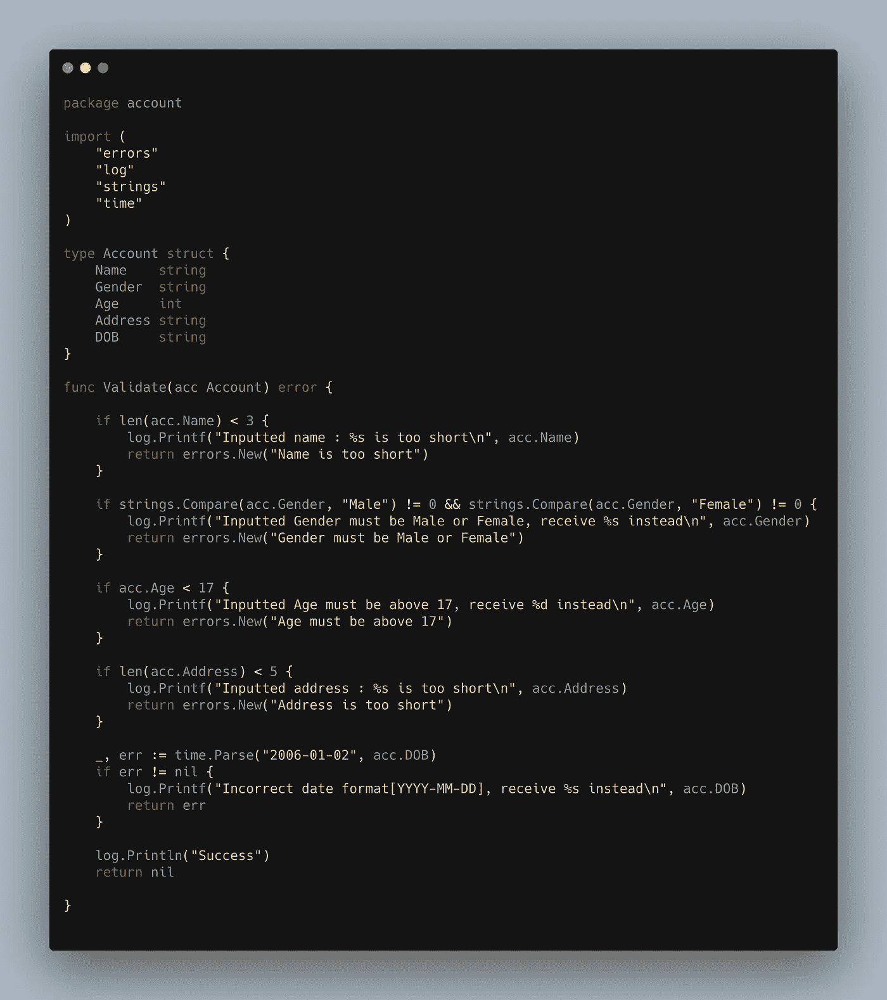
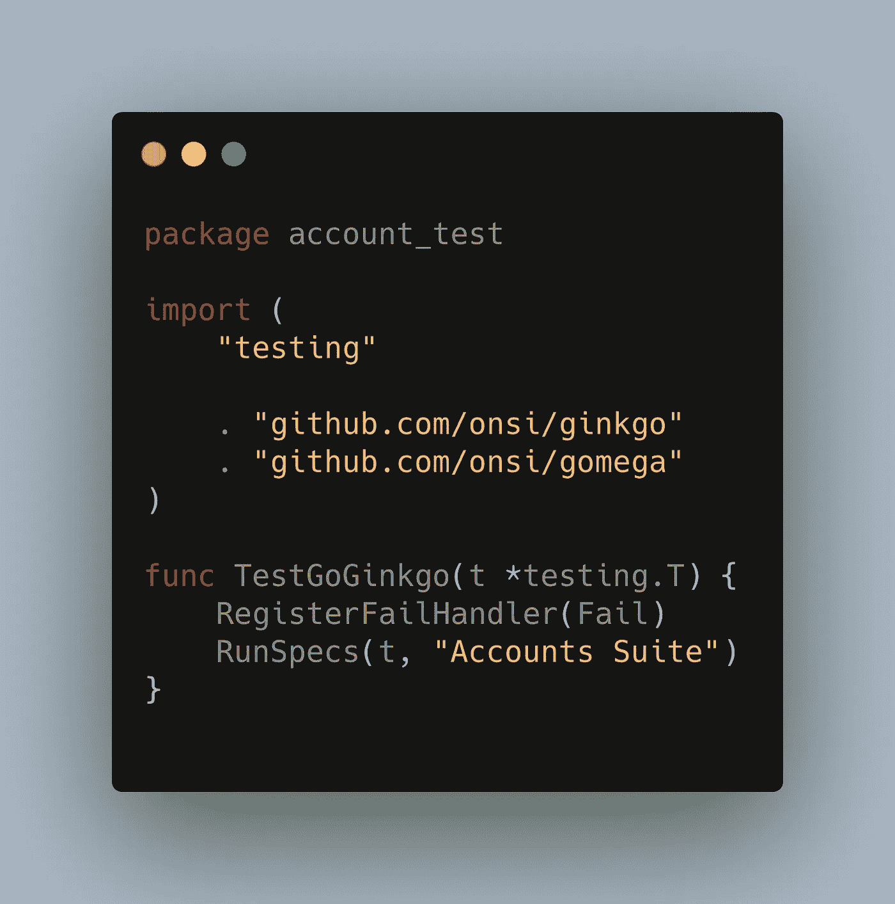
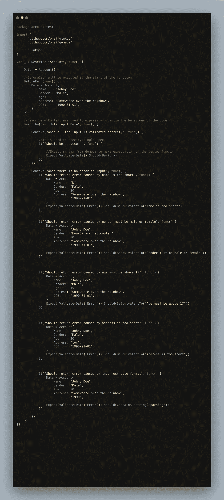
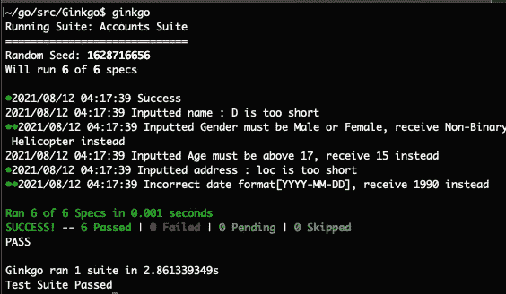

# 使用 Golang 实现行为驱动开发(BDD)风格测试

> 原文：<https://levelup.gitconnected.com/implementation-of-behavioral-driven-development-bdd-using-golang-d33073243722>


> “有效的团队合作始于沟通，止于沟通”——迈克·沙舍夫斯基

“那不是我真正想要的！”在这个关于 SDLC 中沟通失败的想象和地狱般的场景中，开发了一个巨大而复杂的功能大约一个月后，产品经理对工程团队喊道。

简单地说，上面的场景就是我们想要使用行为驱动开发(BDD)来解决的。

SDLC 中的大多数问题都是由于技术和非技术利益相关者之间缺乏理解而发生的。需求解释的模糊性导致双方的结果相差甚远。
工程团队是否不了解情况，
产品团队是否不了解技术能力。

BDD 可以成为连接双方差异的桥梁。

# 1.什么是行为驱动开发(BDD)？

行为驱动开发(BDD)是敏捷开发中的一种测试方法，它鼓励开发人员、测试人员和客户代表之间的合作。它产生于测试驱动开发(TDD)。原则上，它是基于技术和非技术人员应该如何管理软件开发。
BDD 通常使用*的*方法*来创建测试用例，例如*:

*   假设用户已经输入了不正确的值
*   当用户点击提交按钮时
*   然后显示一条错误消息，指出输入的值不正确

正如我们所看到的，它使用简单易懂的英语来帮助每个人在开发过程中承担责任并理解特性行为。

# 2.履行

让我们尝试使用 Go-Language 和 BDD 框架之一——Ginkgo 来实现。Ginkgo 是一个 go 测试框架，旨在帮助您使用行为驱动开发(“BDD”)风格高效地编写表达性和综合性的测试。

*   制作一个要测试的基本围棋方法



*   去拿银杏和戈美加。
    Gomega 是一个匹配器/断言库。它最好与银杏 BDD 测试框架配对，但也可以适用于其他环境。

```
go get github.com/onsi/ginkgo/ginkgo
go get github.com/onsi/gomega/…
```

*   引导一个银杏测试套件
    它会自动生成*Go _ Ginkgo _ Suite _ Test . Go*

```
cd path/to/package/account
ginkgo bootstrap
```



*   为套件生成一个规范。这将创建一个名为 *account_test.go* 的文件

`ginkgo generate account`

*   根据需要完成所有规格



*   使用命令运行测试

```
ginkgo
```

它将显示测试结果



# 3.利弊

没有十全十美的方法，总会有利弊，以及该方法对问题的适合程度。依我拙见:

## 赞成的意见

*   统一的单一理解来源
    BDD 确保所有的利益相关者一起合作，以确保他们总是在同一页上，以避免条件的模糊性，并尽可能早地防止缺陷。这也将确保所有的“三个朋友”将密切合作。
*   代码形式的文档
    随着业务需求或文档的变化，测试用例也会根据需要进行调整。这将使测试用例成为开发人员的良好文档，并将增加开发人员在重构或做某事时的信心。BDD 方法也使得测试很少过时。
*   划分
    BDD 鼓励我们以更小和更易管理的单元来定义规范。由于测试是在代码开发之前编写的，这将创建一个更清晰的项目范围，从而也增加了项目评估的准确性。

## 骗局

*   耗时费力
    创建和维护所有场景需要投入大量的时间和精力。如果我们是为大项目做多次迭代，而不是只为一个小项目做，这是非常值得的。
*   需要所有“三个朋友”同等程度的承诺
    如果“三个朋友”中有一个不够合作，这个项目肯定会受到影响。我们需要来自开发人员、测试人员和客户代表的所有参与来创建一个完整的共享理解
*   提前编写测试
    在开发特性时提前编写测试并不容易。特征做好之后就更容易写了。随着应用程序的增长，BDD 方法需要更多的工作来发展这些测试。

# 4.最后

依我拙见，行为驱动开发(BDD)是一个好主意，但是在正确的 BDD 惯例下很难执行，尤其是在以下几点:

*   所有“三个朋友”创建 BDD 规范文件
*   根据 BDD 创建者的可读和正确的小黄瓜语法
*   创建和维护所有文件和自动化的工作量很大，增加了复杂性

BDD 想要解决的大部分好处和问题都可以通过各方的良好合作轻松解决。

但是它仍然是适用的，并且可以有益地用作开发大型项目的方法。

像往常一样，我们在东京有一个空缺。
我们是一家印度尼西亚科技公司，以通过技术实现商业民主化为使命，帮助每个人实现更大成就。与我们一起在东京找到你梦想的工作！
[https://www.tokopedia.com/careers/](https://www.tokopedia.com/careers/)

[https://en.wikipedia.org/wiki/Behavior-driven_development](https://en.wikipedia.org/wiki/Behavior-driven_development)
[https://www.browserstack.com/guide/tdd-vs-bdd-vs-atdd](https://www.browserstack.com/guide/tdd-vs-bdd-vs-atdd)
[https://github.com/onsi/ginkgo](https://github.com/onsi/ginkgo)
[https://onsi.github.io/gomega/](https://onsi.github.io/gomega/)
[https://onsi.github.io/ginkgo/](https://onsi.github.io/ginkgo/)
[http://www.automated-testing.com/bdd/bdd-pros-and-cons/](http://www.automated-testing.com/bdd/bdd-pros-and-cons/)
[https://saucelabs . com/blog/is-BDD-automation-actually-killing-your-project](https://saucelabs.com/blog/is-bdd-automation-actually-killing-your-project)