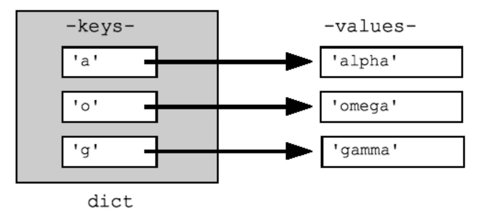

# 线程安全字典数据结构在 Golang 中的实现

> 原文：<https://levelup.gitconnected.com/implementation-of-thread-safe-dictionary-data-structure-in-golang-2bcb235fd9e4>

图片来自[unsplash.com](http://unsplash.com)

上周，我在做一个需要处理 Golang 并发的作业。我正在处理一些被并发用户请求修改的内存数据。我需要控制这些内存数据的读写操作。

这里我解释一下我是如何使用 **RWMutex** 来处理这个问题的。我举了一个实现内存字典数据结构的例子来阐明这个概念。

**注意:***我希望你们对 golang 语法和原始类型有一个初级的理解，以理解源代码。*

字典与一组关键字相关联，每个关键字都有一个相关联的值。当提供一个键时，字典将简单地返回相关的值。Go 通过其内置的 ***映射*** 类型提供了一个非常方便的字典实现。

字典结构

我设计了以下结构来表示本文中所有代码片段的字典对象。

清单 1.1

它保存一个名为 ***条目*** 的*映射*来保存所有的**键值**对数据。定义 *IKey* 和 *IValue* 类型的目的是使其通用。 ***锁定 ***类型的*** 同步。RWMutex*** 与 *struct* 关联，控制字典上的读写操作。 ***RWMutex*** 公开了读者使用的两个方法( *RLock* 和 *RUnlock* )和两个专用编写器( *Lock* 和 *Unlock* )。

**Lock():** 通过获取锁，一次只能有一个 goroutine 读/写。

**RLock()** :通过获取锁，多个 goroutines 可以一次读(不写)。

下面的操作说明了在字典数据结构上实现操作时这些方法的使用。

## 向字典中添加一个键值对。

清单 1.2

在**项目中插入新项目之前，字典对象使用***dict . lock . lock()***获取其锁。**避免脏读操作。成功插入**项目**后*锁*被释放。锁定释放是通过 ***defer dict.lock.Unlock()实现的。***

如果一个请求已经获得了*，那么另一个请求想要获得 ***RLock()*** 就必须等到第一个请求释放 lock (Unlock())*

## ***从字典中删除键值对***

*清单 1.3*

*在从字典**中删除一个条目之前，字典对象使用***dict . lock . lock()***获取其锁。**避免脏读操作。成功删除按键指定的项目后，*锁*被释放。解锁是通过 ***defer dict.lock.Unlock()实现的。****

*从字典中删除一个条目被认为是写操作，因此用***Lock()*&*Unlock()实现。****

## *通过关键字从字典中获取一个条目。*

*清单 1.4*

*需要强调的是，如果您同时做的唯一事情是读取共享数据，那么数据竞争就不是问题。为了获得用于写入的 ***锁()*** ，必须等到 ***运行锁()。****

## *检查字典中是否有关键字。*

*清单 1.5*

*检查该项是否存在于字典中被认为是读取操作，因此用 ***RLock() & RUnlock()实现。****

## ***从字典中删除所有元素。***

*清单 1.6*

*从字典中删除所有条目被认为是写操作，因此用***Lock()&Unlock()***实现*

## ***获取字典的大小。***

*清单 1.7*

*获取字典的长度被认为是读取操作，因此用 ***RLock() & RUnlock()实现。****

## *获取字典中所有键的一部分。*

*清单 1.8*

*检索字典中存在的所有键的片段被认为是读取操作，因此用 ***RLock() & RUnlock()实现。****

## *获取字典中所有值的一部分。*

*清单 1.9*

*检索字典中存在的所有值的片段被认为是读取操作，因此用 ***RLock() & RUnlock()实现。****

*点击 [**此处**](https://play.golang.org/p/MGaKZCLGLv7) 复习&在 golang 操场上运行以上代码。*

## ***结论***

*   *字典与一组关键字相关联，每个关键字都有一个相关联的值。当提供一个键时，字典将简单地返回相关的值。*
*   *Go 通过其内置的 *map* 类型提供了一个非常方便的字典实现。默认情况下，映射不是线程安全的。*
*   *使用*映射*可以轻松实现字典数据结构，使用 **RWMutex** 可以实现同步。*

*这都是为了现在…感谢您的阅读…..*

*@快乐编码……:)*