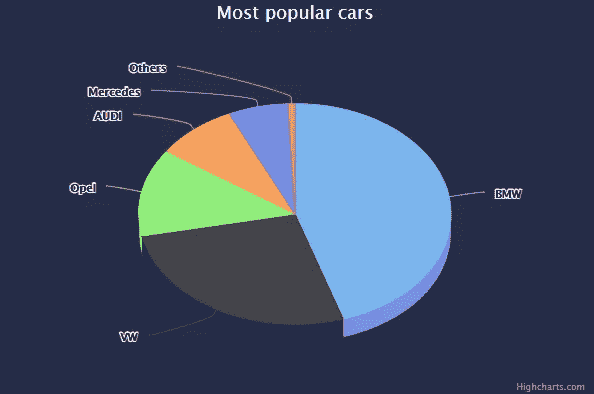
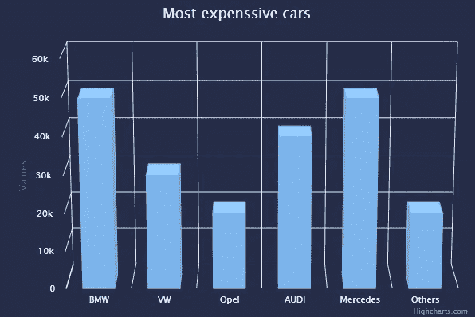

# 在角度应用程序中实现三维图表

> 原文：<https://levelup.gitconnected.com/implementing-3d-charts-in-angular-application-c6894425f1c2>


有几个库可以帮助我们创建 3D 图表，如 Plotly.js、ZingChart，我们也可以使用 Three.js 或 d3 和 x3dom 库的组合，但这会有点复杂。在这里，我想展示如何在角度应用程序中快速简单地制作 3D 图表。我将重点介绍饼图和条形图的实现。

为此，我选择了 highchart.js，它允许构建像折线图、条形图、饼图、散点图、气泡图这样的图表，对于我们的例子来说，最重要的是它支持 3D 图表。

首先，我们需要使用以下命令创建一个 angular 应用程序。

```
ng new graphs
```

现在我们可以安装 highchart 库了，顺便说一下，值得一提的是它有一个官方的 Angular 的[包装器](https://github.com/highcharts/highcharts-angular)，我们也需要安装它。

```
npm install highcharts --save
npm install highcharts-angular --save
```

安装完成后，我们需要将库模块导入 app.module.ts

我决定将我的饼图和条形图分成不同的部分。所以，我们先从实现开始。但是在此之前，我们不应该忘记将图表库导入到我们的组件中。

图表如下所示:



如你所见，实现这样一个图表非常容易。我们只需要设置配置对象并将其传递给库组件。

让我们概述一下 config 对象的一些部分。其中一个重要部分是 options3d，我们在这里定义了接下来的内容:

**启用**:启用 3D 功能；
**alpha** :图表的两个旋转角度之一；
**beta** :图表的两个旋转角度之一。

代码的其余部分非常简单，不言自明。现在让我们来看看条形图的实现。



如你所见，它有点类似于饼状图。在条形图中，我们应该提到 options3d 的额外选项。

**深度**:图表的总深度；
**查看距离**:定义查看者站在图表前的距离，该设置对于计算柱形图和散点图中的透视效果很重要。它不用于三维饼图；

**总结**

这两个图表都没有花太多时间来实现，以您喜欢的方式配置它们非常容易。此外，我上面提到的图表类型，你可以看一下其他可用的图表，如堆积图或散点图。你可以在 high charts[demo](https://www.highcharts.com/demo)中找到它们。此外，您可以尝试改进我自己制作的图表，添加在鼠标移动时旋转图表的功能。这可以通过动态更改 options3d 中的值来实现。图表的源代码可以在我的 [Github](https://github.com/MaksymM92/3d-charts) 中找到。

就是这样。希望对你有帮助。