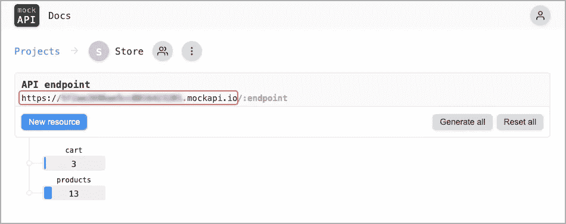
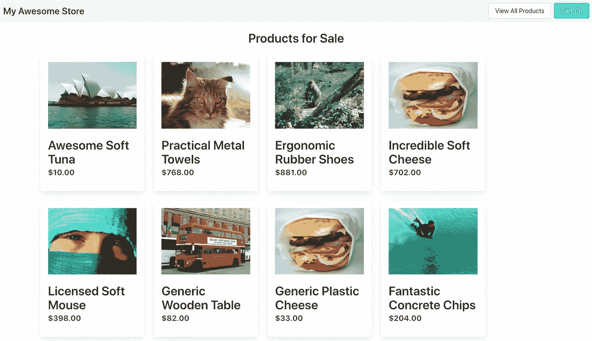
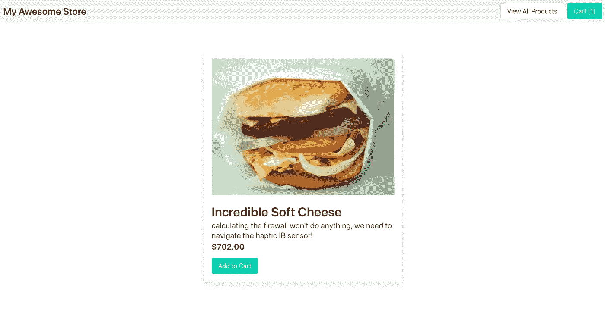
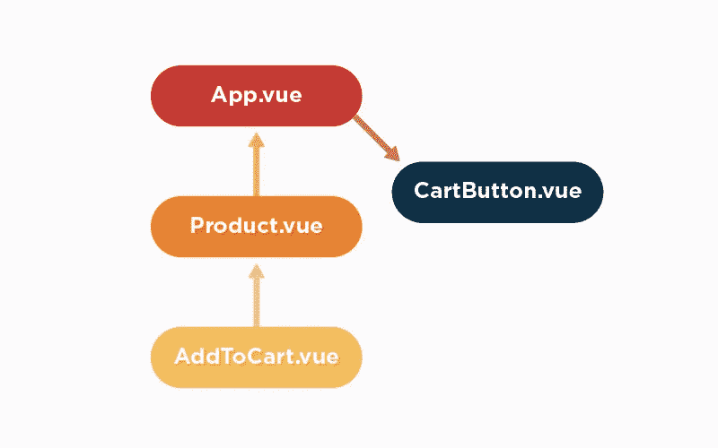
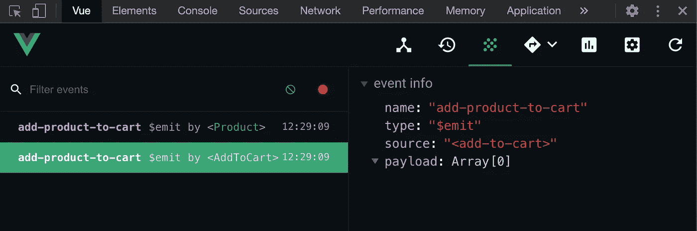
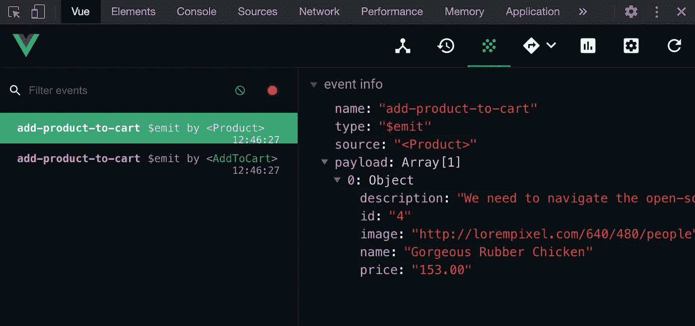
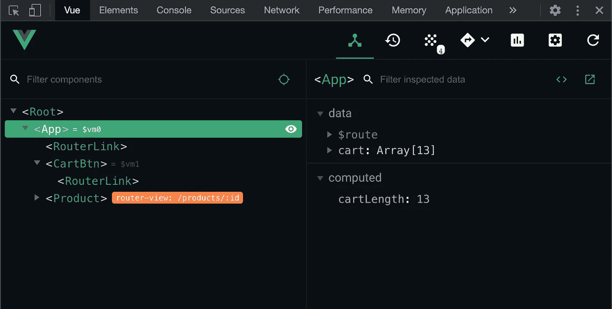
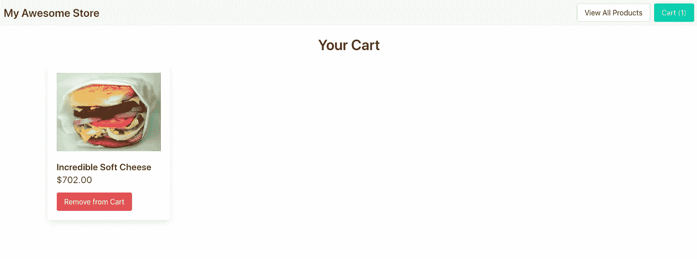

# 使用和不使用 Vuex 实现基本的电子商务购物车

> 原文：<https://levelup.gitconnected.com/implementing-a-basic-e-commerce-cart-with-and-without-vuex-79a68a612157>

## 一步一步的指南揭示了在没有状态管理的情况下出现的复杂性。

# 概观

本文提供了与 Vue 应用程序相关的状态管理的初级知识。我们将实现一个没有全局状态管理的基本购物车示例；这应该揭示出阻碍长期可维护性的复杂性所在。我们将介绍 Vuex 的结构并实现一个基本的设置。最后，我们将重构我们的购物车实现，以利用 Vuex。

# 资源和设置

## Vue.js Devtools Chrome 扩展

如果你还没有，一定要下载 Vue.js devtools chrome 扩展。它为任何 Vue 项目提供了必要的可见性；今天我们将使用它来观看我们的活动和 vuex 状态。

[](https://chrome.google.com/webstore/detail/vuejs-devtools/nhdogjmejiglipccpnnnanhbledajbpd) [## Vue.js 开发工具

### 用于调试 Vue.js 应用程序的 Chrome 和 Firefox DevTools 扩展。

chrome.google.com](https://chrome.google.com/webstore/detail/vuejs-devtools/nhdogjmejiglipccpnnnanhbledajbpd) 

## Github 回购

[https://github . com/KevinBigelow/state-mgmt-w-vuex/tree/starting point](https://github.com/KevinBigelow/state-mgmt-w-vuex/tree/startingPoint)

从上面的 repo 中克隆或下载 startingPoint 分支。这个分支包含一些非常基本的功能，用于在用户购物车中添加和删除商品。

## [Mockapi.io](https://www.mockapi.io/)

我们使用 mockapi.io 来复制一个基本的 api。我已经创建了一个包含购物车和产品端点的项目；你必须克隆它。

1.  在这里注册一个免费账户。
2.  登录后，通过访问以下链接克隆我的项目[https://mockapi.io/clone/5f21f583daa42f0016666158](https://mockapi.io/clone/5f21f583daa42f0016666158)

## [Axios](https://www.npmjs.com/package/axios)

我们使用 Axios 库来处理我们的 api 调用。我们需要将“baseUrl”设置为您的 mockapi 项目的端点。

1.  从您的 mockapi 项目中复制 api 端点



2.打开 *src/axios/index.js* 并将您的端点 url 粘贴为 baseUrl 的值。

```
import Axios from 'axios'const axios = Axios.create({
    baseUrl: 'https://YOUR-ENDPOINT-ID.mockapi.io'
});export default axios
```

## 运行项目

打开一个终端窗口，导航到您克隆项目的位置，使用以下命令开始运行开发服务器

```
npm run serve
```

然后您应该能够访问 [http://localhost:8080/](http://localhost:8080/) 来查看项目的运行情况。您应该会看到产品列表。点击其中一个查看产品页面。该页面上的“添加到购物车”按钮确实如您所想。点击标题中的购物车按钮查看您的购物车。



太好了！您已经设置完毕，可以开始了。

# 第 1 部分:没有国家管理。

在我们进入 Vuex 之前，让我们看看如何在没有任何状态管理的情况下处理一个简单的问题。



您可能已经注意到，单击“添加到购物车”按钮不会影响标题中“购物车”按钮的数量。请放心，产品已经添加到购物车中，您可以查看购物车页面进行确认。让我们看看当一个产品被添加到购物车时，如何增加计数。

*CartButton.vue* 是需要更新数据的组件。

```
<template>
  <router-link :to="{name: 'Cart'}" class="button is-primary">
    Cart (**{{count}}**)
  </router-link>
</template>

<script>
export default {
  props: {
    count: **Number**}
}
</script>
```

看看它如何接收计数作为道具，然后用花括号语法`{{count}}`在模板中打印计数

你会发现 *CartButton.vue* 包含在 *App.vue* 中，它将[计算属性](https://vuejs.org/v2/guide/computed.html#Basic-Example) `cartLength`绑定到`count`属性。

```
<cart-btn :count="cartLength" class="level-right"></cart-btn>
```

在创建的[生命周期挂钩](https://vuejs.org/v2/guide/instance.html#Lifecycle-Diagram)(仍在 *App.vue* 中)上，我们使用 Axios 调用获取购物车。然后，我们将`this.cart`更新为响应。计算的属性`cartLength`返回`this.cart`的长度

```
<script>
import cartBtn from '@/components/CartButton.vue'
import axios from '@/axios'

export default {
    data () {
        return {
            cart: []
        }
    },
    computed: {
        cartLength () {
            return this.cart.length
        }
    },
    components: {
        'cart-btn': cartBtn
    },
    methods: {
        async getCart() {
            await axios.get(`cart`).then(response => {
                this.cart = response.data
            })
        }
    },
    created() {
        this.getCart()
    }
}
</script>
```

为了传达购物车中的更改，我们需要将事件从 *AddToCart.vue* 组件一直传递到 *CartButton.vue* 组件。由于子组件只能[向其直接父组件发出事件](https://vuejs.org/v2/guide/components.html#Listening-to-Child-Components-Events)，因此 *AddToCart.vue* 和 *CartButton.vue* 之间的每个子组件都需要发出一个事件。见下图。



要发出第一个事件，打开`AddToCart.vue`组件并更新`addToCart()`方法。在向 api 的 post 成功之后触发事件是有意义的。

```
addToCart () {
    axios.post('cart', this.product)**.then(() => {
        this.$emit('add-product-to-cart')
    })**
},
```

现在让我们跳到 *Product.vue* 组件，这是包含 *AddToCart.vue* 组件的地方。找到`<add-to-cart>`包含在模板中的位置，并将其更新为以下内容。

```
<add-to-cart :product="product" **v-on:add-product-to-cart="$emit('add-product-to-cart')"**></add-to-cart>
```

这是如何分解的:

`v-on`监听来自该组件实例的事件，在本例中我们监听的是`add-product-to-cart`。因为在访问 *CartButton.vue* 组件之前，我们还要遍历另一个组件级别，所以需要发出另一个事件。为了简单起见，我们给它起了同样的名字`$emit(‘add-product-to-cart’)`

导航到产品页面，打开 Vue devtools 面板上的 events 选项卡。当您点击**添加到购物车**按钮时，您应该会看到两个事件。



请参见事件信息中的有效负载属性？我们可以用事件传递数据。由于`cartLength`计算了`this.cart`中的商品数量，我们希望将产品添加到 *App.vue.* 中的`this.cart`中。为了完成这一点，让我们将产品添加到 *Product.vue* 组件的有效负载中。

```
<add-to-cart :product="product" v-on:add-product-to-cart="$emit('add-product-to-cart'**, product**)"></add-to-cart>
```

现在刷新产品页面，再次点击**添加到购物车**按钮。在由 *Product.vue* 组件触发的事件中，您应该会看到作为有效负载返回的产品。



太好了，让我们跳进*app . vue*；我们将在`<router-view/>`上添加一个监听器——将监听器添加到路由器视图并不理想，但对于我们的基本示例来说是可行的。

```
<router-view **v-on:add-product-to-cart="onAddProductToCart"**/>
```

这一次我们将调用方法`onAddProductToCart`，它将把产品从有效载荷添加到`this.cart` —让我们把这个方法添加到 *App.vue* 。

```
onAddProductToCart (product) {
    this.cart.unshift(product)
}
```

太棒了，现在让我们看看我们的计数是否更新。

打开产品页面，再次点击**添加到购物车**按钮；您应该会看到计数增加了 1。

您还可以打开 Vue devtools 扩展中的 components 选项卡，观察购物车阵列随着您添加产品而增长。现在我们知道计数正确地反映了购物车的大小。



## 有用！

是的，它有效。但是您能看到在生产级应用程序中事情会变得复杂吗？

看一下购物车页面。当您点击**从购物车中移除**时，没有任何变化。这是一个类似的问题，需要将带有项目 id 的事件从 *RemoveFromCart.vue* 组件传递到 *Cart.vue* 组件。在那里，您可以过滤 cart，排除 id 与您传递的 id 相同的商品。



自己试一试，或者从 repo 下载 [propsWithEvents](https://github.com/KevinBigelow/state-mgmt-w-vuex/tree/propsWithEvents) 分支，或者只看一下[提交差异](https://github.com/KevinBigelow/state-mgmt-w-vuex/commit/eaad889409405e6c99bfb2887801bde7f9f98ae5)。

# 第 2 部分:用 Vuex 设置状态管理

我们将重构到目前为止我们所写的代码。

[状态管理](https://vuejs.org/v2/guide/state-management.html)是围绕一个应用程序中只有一个真实来源的概念构建的。当多个组件依赖于同一组数据时，按照本文第一部分的方式管理数据是没有意义的。

当谈到状态管理时，有许多选项，我们将通过 Vuex 的镜头来看它。无论你使用什么技术，这个概念都是一样的。

首先你需要安装 Vuex。打开一个终端窗口，导航到您的项目目录，运行以下程序。

```
npm install vuex
```

现在，在 *src/* 下创建一个名为 *store* 的新目录

然后，在*存储*目录下创建一个 *index.js* 文件

要创建 Vuex 商店，将以下内容添加到新的 *index.js* 文件中。

```
import Vue from 'vue'
import *Vuex*from 'vuex'
Vue.use(*Vuex*);

export default new *Vuex*.Store({
    state: {},
    getters: {},
    actions: {},
    mutations: {}
})
```

最后一步是在 Vue 实例中包含这个商店。打开 *main.js* 文件，`import store from ‘@/store’`并将`store`添加到实例中。

```
import Vue from 'vue'
import App from './App.vue'
**import store from '@/store'**
import *router*from './router'

Vue.config.productionTip = false

new Vue({
  *router*,
 **store,**
  render: h => h(App)
}).$mount('#app')
```

太好了！您的项目现在已经用 Vuex 设置好了。

## Vuex 商店解剖基本概述

状态:这是我们存储数据的地方。例如，当 api 返回产品列表时，我们将把它们保存在这里。

**Getters:** 当访问**状态**时，我们在组件中使用 Getters。在我看来，方法式访问是 getters 真正展示其威力的地方。

**突变:**突变用于更新我们**状态**中的数据。比如向购物车中添加产品。

**动作:**我们对异步操作使用动作，比如进行 api 调用。动作几乎总是提交**突变**。当产品的 api 响应时，我们将提交一个将 state.products 设置为响应的变异。

## 设置状态和 getters

让我们从向状态添加一个 cart 数组开始。

```
import Vue from 'vue'
import *Vuex*from 'vuex'
Vue.use(*Vuex*);

export default new *Vuex*.Store({
    state: {
        **cart: []**
    },
    getters: {},
    actions: {},
    mutations: {}
})
```

我们将使用 getter 访问我们的 *Cart.vue* 和 *CartButton.vue* 组件中的 state.cart。现在让我们添加吸气剂。

```
import Vue from 'vue'
import *Vuex*from 'vuex'
Vue.use(*Vuex*);

export default new *Vuex*.Store({
    state: {
        cart: []
    },
    getters: {
        **getCart: state => state.cart**
    },
    actions: {},
    mutations: {}
})
```

我们也可以使用一个 getter 来返回购物车的长度，让我们把它也加上。在这种情况下，我们可以利用 getCart getter。参见[属性样式访问](https://vuex.vuejs.org/guide/getters.html#property-style-access)的文档

```
import Vue from 'vue'
import *Vuex*from 'vuex'
Vue.use(***Vuex***);

export default new *Vuex*.Store({
    state: {
        cart: []
    },
    getters: {
        getCart: state => state.cart,
        getCartLength: (state, getters) => {
            return getters.getCart.length
        }
    },
    actions: {},
    mutations: {}
})
```

现在让我们利用我们的 *CartButton.vue* 组件中的`getCartLength` getter。

我们将使用一个计算属性来利用`getCartLength` getter，而不是将计数作为一个属性来传递。打开 *CartButton.vue* 并更新如下。

```
<template>
  <router-link :to="{name: 'Cart'}" class="button is-primary">
    Cart ({{*count*}})
  </router-link>
</template>

<script>
**import { *mapGetters* } from 'vuex'**

export default {
 **computed: {
    ...*mapGetters*({
      count: 'getCartLength'
    })
  }**
}
</script>
```

我们正在使用[地图获取器助手](https://vuex.vuejs.org/guide/getters.html#the-mapgetters-helper)，还有其他方法可以访问你的获取器，你可以在这里阅读它们[。](https://vuex.vuejs.org/guide/getters.html)

注意，我们将`‘getCartLength’`映射到了`count`，这正是我们的模板所期望的。

在浏览器中重新打开您的项目。购物车按钮应该表明没有添加任何商品(即使您添加了商品)。这是因为我们还没有更新我们的状态。

## 设置动作和突变

看一下 *App.vue.* 中的`getCart()`方法

```
async getCart() {
    await axios.get(`cart`).then(response => {
        this.cart = response.data
    })
},
```

我们将做一些与我们的动作非常相似的事情，但是我们将运行一个将`state.cart`设置为`response.data`的突变，而不是`this.cart = response.data`

继续从 *App.vue.* 中的脚本标签中删除除以下内容之外的所有内容

```
<script>
import cartBtn from '@/components/CartButton.vue'

export default {
    components: {
        'cart-btn': cartBtn
    },
    methods: {
        onAddProductToCart (product) {
            this.cart.unshift(product)
        }
    }
}
</script>
```

您还应该从 *App.vue* 模板的`cart-btn`中移除`:count`数据绑定。应该是这样的`<cart-btn class=”level-right”></cart-btn>`

打开 *store/index.js* 添加如下动作和变异。

```
import Vue from 'vue'
import *Vuex*from 'vuex'
**import axios from '@/axios'**
Vue.use(*Vuex*);

export default new ***Vuex***.Store({
    state: {
        cart: []
    },
    getters: {
        getCart: state => state.cart,
        getCartLength: state => state.cart.length
    },
    actions: {
 **async fetchCart() {
            await axios.get(`cart`)
        },**
    },
    mutations: {
 **setCart: (state, cart) => (state.cart = cart)**
    }
})
```

该动作将获取购物车，变异将把`state.cart`设置为传入的任何内容。让我们在 get 请求成功后，通过提交`setCart`变异将它们联系在一起。

```
export default new *Vuex*.Store({
    state: {
        cart: []
    },
    getters: {
        getCart: state => state.cart,
        getCartLength: state => state.cart.length
    },
    actions: {
        async fetchCart(**{ commit }**) {
            await axios.get(`cart`)**.then(response => {
                commit('setCart', response.data)
            })**
        },
    },
    mutations: {
        setCart: (state, cart) => (state.cart = cart)
    }
})
```

现在我们需要调度`fetchCart`动作。让我们在 *CartButton.vue* 中创建的生命周期钩子中处理它。所以一旦创建了 *CartButton.vue* 组件的实例，就会调用`fetchCart`。

```
<template>
  <router-link :to="{name: 'Cart'}" class="button is-primary">
    Cart ({{count}})
  </router-link>
</template>

<script>
import { *mapGetters*, ***mapActions*** } from 'vuex'

export default {
  computed: {
    ...*mapGetters*({
      count: 'getCartLength'
    })
  },
 **methods: {
    ...*mapActions*({
      fetchCart: 'fetchCart'
    })
  },
  created () {
    this.fetchCart()
  }**
}
</script>
```

此时，我们正在获取购物车，保存对`state.cart`的响应，并用`getCartLength` getter 打印`{{count}}`。

当 *CartButton.vue* 组件被创建时，您应该看到购物车计数反映了购物车中的商品数量，但是当一个商品被添加到购物车时，计数不会增加。让我们接下来处理那个。

## 向`state.cart`添加产品

在本文的第 1 部分中，为了更新购物车，我们传递了事件。

有了 Vuex，我们只需在产品成功添加到购物车后运行一次突变。

让我们创建`addToCart`动作和`addProductToCart`变异。

```
export default new *Vuex*.Store({
    state: {
        cart: []
    },
    getters: {
        getCart: state => state.cart,
        getCartLength: state => state.cart.length
    },
    actions: {
        async fetchCart({ commit }) {
            await axios.get(`cart`).then(response => {
                commit('setCart', response.data)
            })
        },
 **async addToCart ({ commit }, product) {
            axios.post('cart', product).then(() => {
                commit('addProductToCart', product)
            })
        },**
    },
    mutations: {
        setCart: (state, cart) => (state.cart = cart),
 **addProductToCart: (state, product) => (state.cart.unshift(product))**
    }
})
```

现在，让我们从 *AddToCart.vue，*中删除旧的`addToCart()`方法，并用我们的操作替换它。

```
<template>
    <button @click="addToCart(**product**)" class="button is-primary">Add to Cart</button>
</template>

<script>
**import { *mapActions* } from 'vuex'**

export default {
    props: {
        product: {
            type: *Object*,
            required: true
        }
    },
    methods: {
 **...*mapActions*({
            addToCart: 'addToCart'
        })**
        a̶d̶d̶T̶o̶C̶a̶r̶t̶ ̶(̶)̶ ̶{̶
̶ ̶ ̶ ̶ ̶ ̶ ̶ ̶ ̶ ̶ ̶ ̶ ̶a̶x̶i̶o̶s̶.̶p̶o̶s̶t̶(̶'̶c̶a̶r̶t̶'̶,̶ ̶t̶h̶i̶s̶.̶p̶r̶o̶d̶u̶c̶t̶)̶.̶t̶h̶e̶n̶(̶(̶)̶ ̶=̶>̶ ̶{̶
̶ ̶ ̶ ̶ ̶ ̶ ̶ ̶ ̶ ̶ ̶ ̶ ̶ ̶ ̶ ̶ ̶t̶h̶i̶s̶.̶$̶e̶m̶i̶t̶(̶'̶a̶d̶d̶-̶p̶r̶o̶d̶u̶c̶t̶-̶t̶o̶-̶c̶a̶r̶t̶'̶)̶
̶ ̶ ̶ ̶ ̶ ̶ ̶ ̶ ̶ ̶ ̶ ̶ ̶}̶)̶
̶ ̶ ̶ ̶ ̶ ̶ ̶ ̶ ̶}̶
    }
}
</script>
```

我们可以删除*Product.vue/App.vue*中的事件监听器

```
<add-to-cart :product="product" ̶v̶-̶o̶n̶:̶a̶d̶d̶-̶p̶r̶o̶d̶u̶c̶t̶-̶t̶o̶-̶c̶a̶r̶t̶=̶"̶$̶e̶m̶i̶t̶(̶'̶a̶d̶d̶-̶p̶r̶o̶d̶u̶c̶t̶-̶t̶o̶-̶c̶a̶r̶t̶'̶,̶ ̶p̶r̶o̶d̶u̶c̶t̶)̶"̶></add-to-cart><router-view  ̶v̶-̶o̶n̶:̶a̶d̶d̶-̶p̶r̶o̶d̶u̶c̶t̶-̶t̶o̶-̶c̶a̶r̶t̶=̶"̶o̶n̶A̶d̶d̶P̶r̶o̶d̶u̶c̶t̶T̶o̶C̶a̶r̶t̶"̶/>
```

太好了！现在，一旦 post 成功，单击**添加到购物车**按钮将更新`state.cart`。我们还可以在 *CartButton.vue* 组件上看到计数更新。

## 在 Cart.vue 组件上实现我们的 getters 和 actions

现在 Cart.vue 文件应该是这样的。

我们在创建的生命周期钩子中使用我们的`fetchCart`动作，然后我们的`getCart` getter 作为计算属性打印出模板中的项目。

```
<script>
**import { *mapGetters*, *mapActions* } from 'vuex'**
import removeFromCart from '@/components/RemoveFromCart'

export default {
 **computed: {
        ...*mapGetters*({
            cart: 'getCart'
        })
    },**
    components: {
        'remove-from-cart': removeFromCart
    },
    methods: {
 **...*mapActions*({
            fetchCart: 'fetchCart'
        }),**
        onRemoveFromCart (productId) {
            this.cart = this.cart.filter(product => product.id !== productId)
        }
    },
 **created () {
        this.fetchCart()
    }**
}
</script>
```

从购物车中移除商品时，我们仍然需要使用 Vuex。以下是剩余的任务:

1.  将 *RemoveFromCart.vue* 组件中的`removeFromCart`方法转换为一个动作。
2.  将 *Cart.vue* 中的`onRemoveFromCart`方法转换为变异
3.  当`removeFromCart`动作成功时，提交`onRemoveFromCart`变异。

看看你自己能不能做到，或者从我的 repo 下载 [vuex](https://github.com/KevinBigelow/state-mgmt-w-vuex/tree/vuex) 分支，或者[查看这个 commit](https://github.com/KevinBigelow/state-mgmt-w-vuex/commit/fad3c7146bcdddc5577a6719f91222be09925ed7) 看看我是怎么做到的。

# 结论

希望本教程能帮助你理解 Vuex 状态管理的用处。如果你有问题，不要犹豫发表评论。🖖