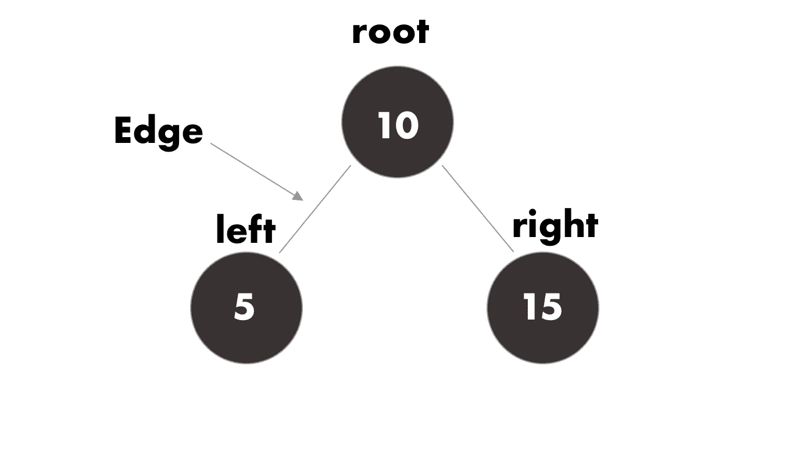
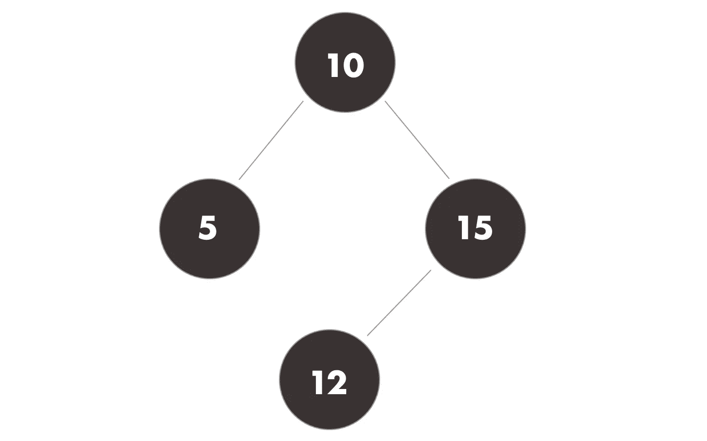
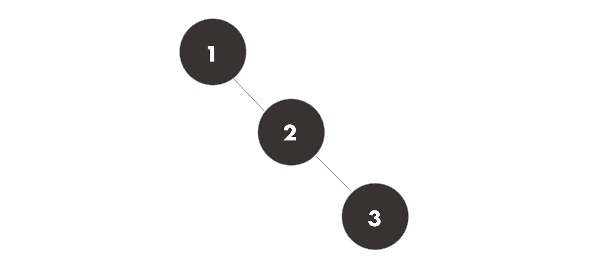
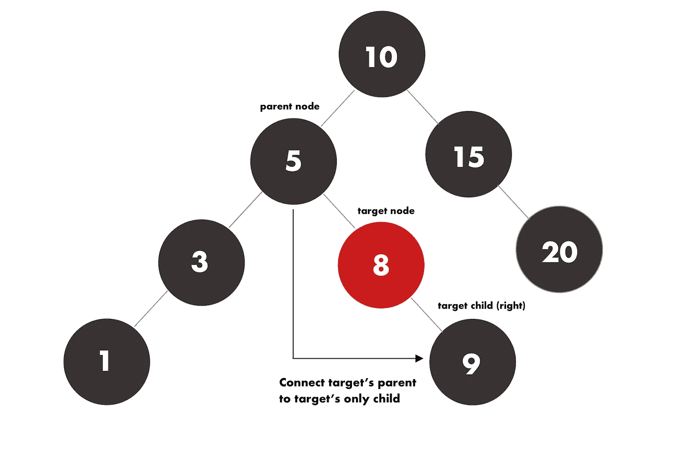
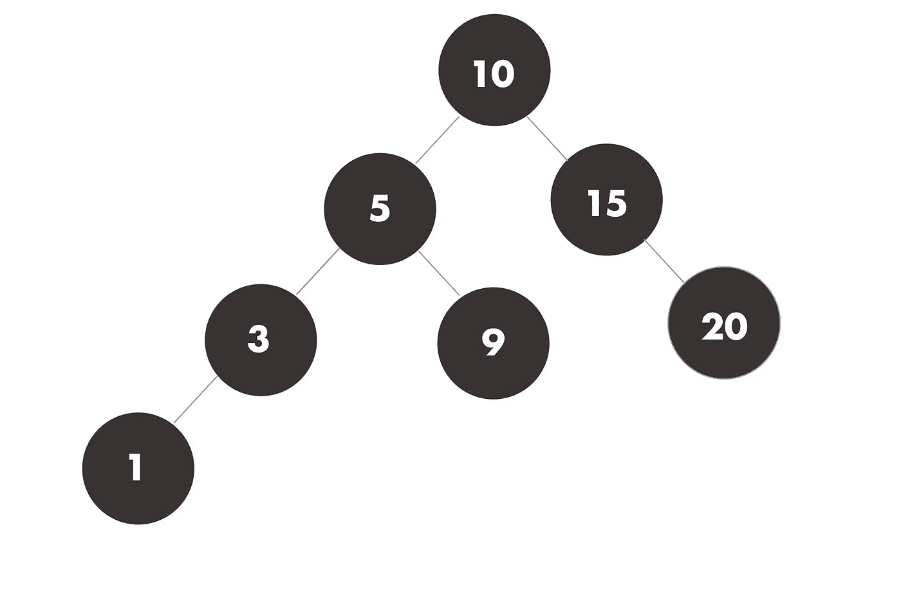
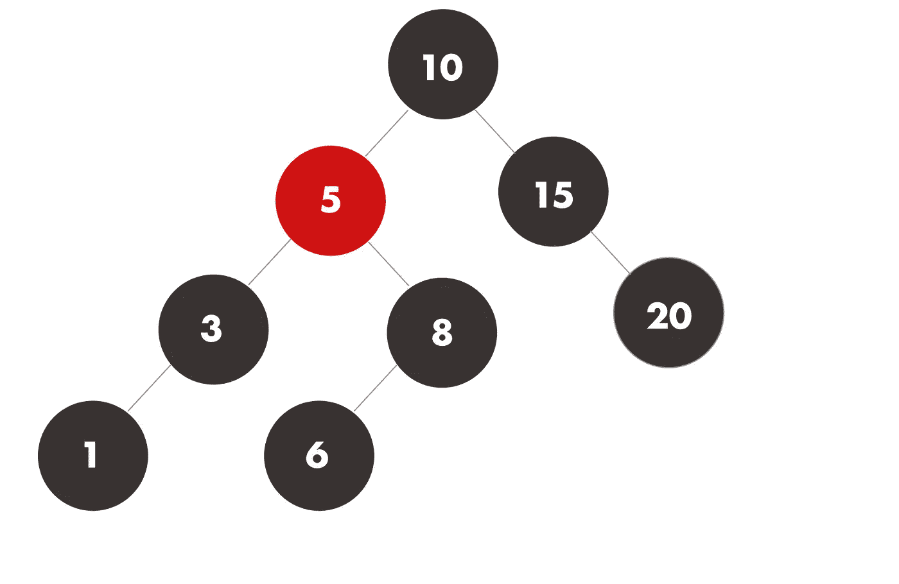
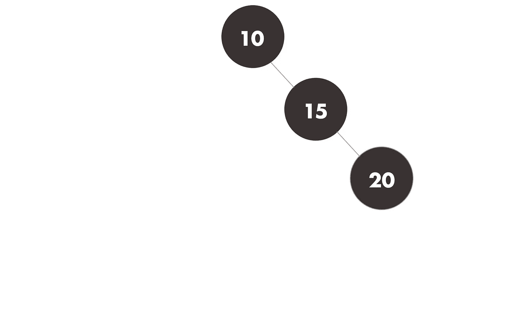
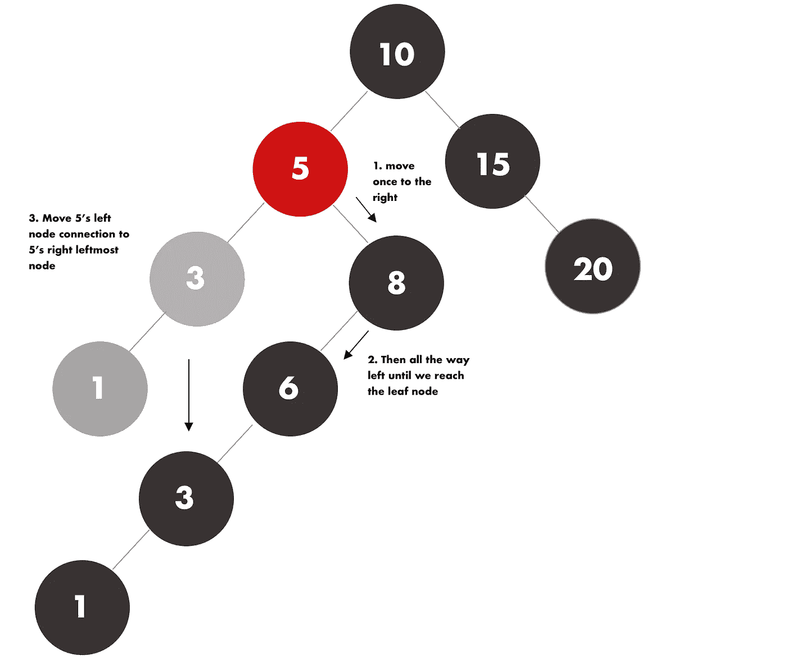
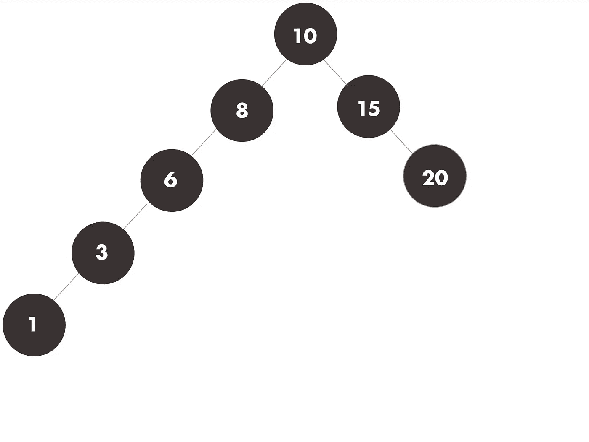
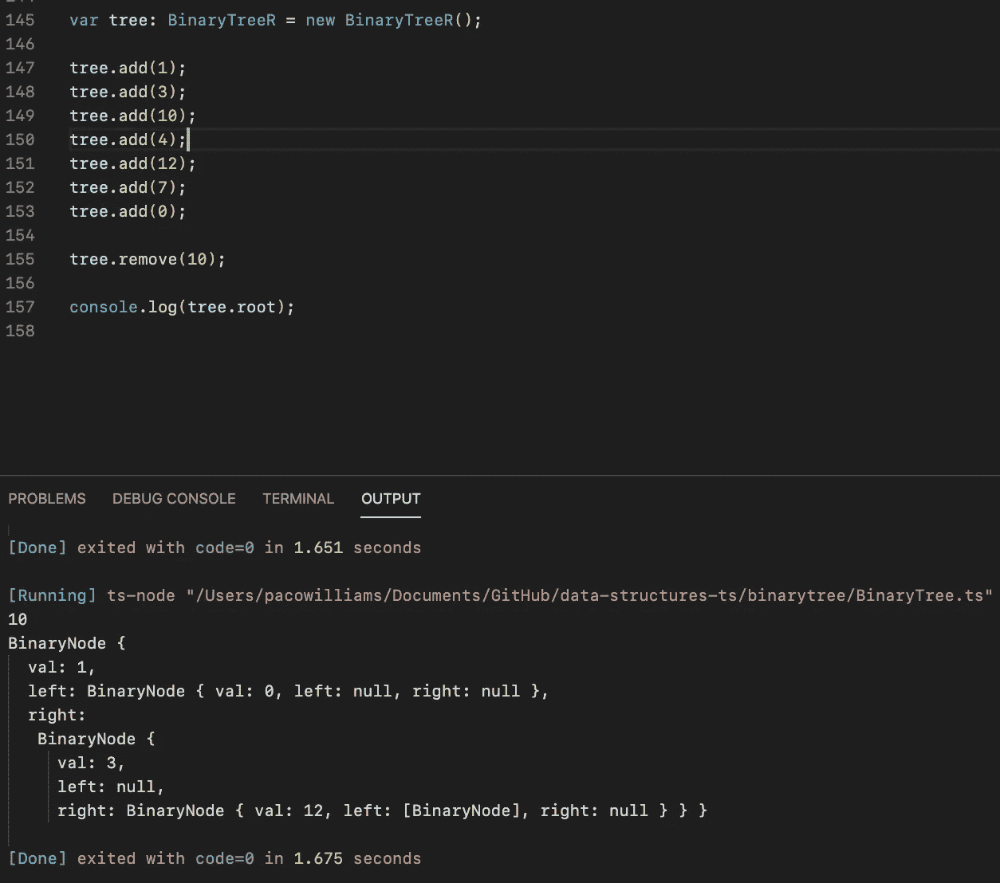

# 用 Javascript 实现二叉查找树

> 原文：<https://levelup.gitconnected.com/implementing-a-binary-search-tree-in-javascript-78a2f28d0493>


马克斯·尼尔森在 [Unsplash](https://unsplash.com/s/photos/code-tree?utm_source=unsplash&utm_medium=referral&utm_content=creditCopyText) 上拍摄的照片

今天，我们将创建自己的二叉查找树实现，但在编写一行代码之前，最好先了解一下基本原理。

# 二叉树到底是什么？

二叉树是一种数据结构，类似于链表，由节点组成。

节点是存储数据的容器。在这个特殊的例子中，它存储了一个值和两个指针，*，因此是 binary (2)* 。每个指针将引用另一个节点，一个向左，另一个向右，依此类推，如下图所示。



所有图片都是由您真实创作的

所有的树都以根**开始**。这是第一个节点。此节点没有任何父节点。

# 下面是一些使用树时感兴趣的有用术语。

**边**:两个节点之间的连接。(上图中的线)

**级别**:找到一个节点的深度。从根开始，从 1 开始，在每个边沿之后增加。

**叶**:没有子节点的节点。

**树的高度:**树的高度是树中从根到最低节点的边数。

**完美树**:每一层节点数量相同的树。在现实世界的应用中，树很少是完美的。

> 二叉树中的每个节点可以有两个子节点**(左和右)、**一个**(左或右)或**无**(叶)。**

# **为什么要使用二叉查找树**

**树中的值需要花费 **O(h)** 时间才能找到。其中 **h** 是树的高度？虽然这仍然比链表快，但我们可以做得更好。**

****二分搜索法树**比数组、链表等线性数据结构有一大优势，甚至比**正则树** s. A **BST** 都可以在 **log(n)** time 中搜索到。**

# **它是怎么工作的？**

**在常规二叉树中，任何值都可以向左或向右。但是在 BST 中，**值必须按**排序。当引入一个新值时，我们从比较根的值和将要插入的值开始。**

**如果新值小于根节点的值，它将移动到左侧节点，否则它将移动到右侧。如果它们相等，它可以向任何方向移动，但这取决于程序员来实现它。**

**这是递归地*完成的*,直到到达一个叶节点。然后，根据最后一次比较，从左或右插入该值。**

**例如，值 **12** 将被添加到先前的树中。我们来分析一下。**

1.  ****12** 大于 **10** ，→ **右移****
2.  ****12** 小于 **15** ，a **15** 是**叶节点**，→ **左移**加 12**

****

**现在您应该开始理解为什么在 BST 中搜索值比在任何线性数据结构中搜索要快得多。**

# **可能的缺点**

**如果我们按顺序插入值会怎么样？如果我们的树是空的，我们想按顺序插入 1、2 和 3，我们的 BST 将退化为一个美化的链表，使得搜索时间为 O(n) 。(如下图所示)**

****

**从某个角度看，它有点像一个链表**

**[](https://medium.com/javascript-in-plain-english/implementing-a-hash-table-in-javascript-29aca1edfe2b) [## 用 JavaScript 实现哈希表

### 今天我们将在 JavaScript/TypeScript 中创建我们自己的散列表数据结构。

medium.com](https://medium.com/javascript-in-plain-english/implementing-a-hash-table-in-javascript-29aca1edfe2b) 

## 开始之前，请注意以下几点

> typescript 和 javascript 的唯一区别是变量类型的声明。在下面的代码片段中，代码是用 typescript 编写的，但是通过删除类型定义，可以很容易地将其转换成 javascript。

例如

```
**//in typescript**
var addOne(num: number): number {
     return num++;
}**//in javascript**
var addOne(num) {
     return num++;
}
```

不是说我们已经得到了我们的方式，让我们挖！

# 是时候把手弄脏了

让我们首先创建一个类作为我们的节点。

我们可以看到一个节点有三个属性。节点的值和左右两个指针属于同一类型。

默认情况下，一个节点没有子节点，因此两个指针都是空值。

# 创建树类

我们可以看到这个类只有一个同类型 ***BinaryNode*** 的**根**属性。该属性将保存我们树中的第一个节点。

你也可以注意到它叫做 **BinaryTreeR** 。 ***R 代表递归*** ，因为这是我们实现这个数据结构的方式。

# 插入值

插入值时有两种可能的情况。

在递归方法中，我们开始沿着树向下移动(从根开始),根据我们想要插入的值选择向左或向右移动。

此外，在此之前，我们必须检查我们的根不是空的，因为这意味着我们的树是空的。如果是这种情况，我们简单地用新值给树的根属性分配一个节点。

这里我们可以看到，我们的递归函数需要一个节点和一个值，节点值将根据我们正在移动的节点而变化。

当函数在自身内部被调用时，它会更新节点参数，这样它就可以在树中移动。

# 搜索节点

在我们实现删除方法之前，(*提示:这是最难的部分*)，让我们通过实现一个检查值是否存在的方法来检查我们的插入代码是否工作。

这个方法非常简单。首先，它检查值，将其与作为参数给出的节点进行比较，并相应地移动。如果找到了值，它将返回该节点。

# 最终老板:删除价值观

在我们实现这段代码之前，花点时间想一想为什么很难从树中删除一个节点。T2 应该很容易，对吗？我们可以搜索它，然后删除它。

> 如果我们想删除一个有子节点的节点，而这个子节点又有更多的子节点呢？

删除包含子节点的节点而不容纳它们也将导致它们被删除。

> 如果 5 个人挂在悬崖上的一根绳子上，第一个人割断了他下面的绳子，其余的人就会掉下悬崖。

删除节点时，我们必须考虑三种情况。

## 当节点是叶子时

这是所有方法中最简单的一种，因为我们可以简单地删除节点并完成它。

## 当节点有一个子节点时

**我们必须在目标节点的子节点和父节点之间创建一个链接**。



# 结果



删除带有一个子节点的目标节点后得到的树

## 当节点有两个子节点时

因为我们想要删除一个有两个子节点的节点，我们必须采取额外的步骤来确保我们的结构保持有序。为此，我们必须向右移动一次，找到该节点左侧的最小值。然后，我们必须将目标节点左边的节点连接到树右边最小的节点。

我知道，这听起来确实令人困惑，但这里有一些插图，使它更容易消化。

假设我们想要删除这个示例树中的节点 5。

5 是我们的目标节点(我们想要删除的节点)



如果我们只是删除它，我们的树的一些数据会受到损害。它看起来会像这样。



相反，我们希望实现一些额外的步骤来确保我们的树保持有序。首先，我们移动到目标节点(5)的右边。然后我们一直向左走，直到到达一个叶节点。


现在我们已经找到了 5 右边最左边的节点(6 ),我们需要将 5 的左边节点移到 6 之后，就像这样。



最终的结果不会是一个理想的树，它开始看起来更像一个链表，但我们的搜索树仍然是正确排序的。

# 结果



现在已经清楚了删除算法的工作原理，让我们把它翻译成代码(困难的部分)。

哇！代码太多了。花点时间仔细通读所有内容，并尝试将它与我们刚刚学到的视觉内容联系起来。

我们还可以看到，如果我们要删除的节点是树的根，那么会有一种特殊情况。

同样，在最后一种情况下，调用一个名为 *goLeft* 的方法。这个方法将从任何给定的节点开始返回最左边的值。

# 重构方法

最后，让我们创建新的方法，这样用户在插入或删除节点时就不必接触任何东西。用户应该能够输入一个值并添加或删除它，而不必担心从哪个节点开始或任何事情如何工作。

我们使用一个虚拟变量来访问根，因为我们从来不想直接访问或修改它。如果我们搞砸了，我们可能会删除或修改对它的引用，基本上是在内存中丢失了整棵树。



# 最后的结果

今天到此为止。

敬请关注即将到来的图表故事！** 

# **分级编码**

**感谢您成为我们社区的一员！在你离开之前:**

*   **👏为故事鼓掌，跟着作者走👉**
*   **📰更多内容请查看[升级编码刊物](https://levelup.gitconnected.com/?utm_source=pub&utm_medium=post)**
*   **🔔关注我们:[推特](https://twitter.com/gitconnected) | [LinkedIn](https://www.linkedin.com/company/gitconnected) | [时事通讯](https://newsletter.levelup.dev)**

**🚀👉 [**加入升级人才集体，找到一份神奇的工作**](https://jobs.levelup.dev/talent/welcome?referral=true)**