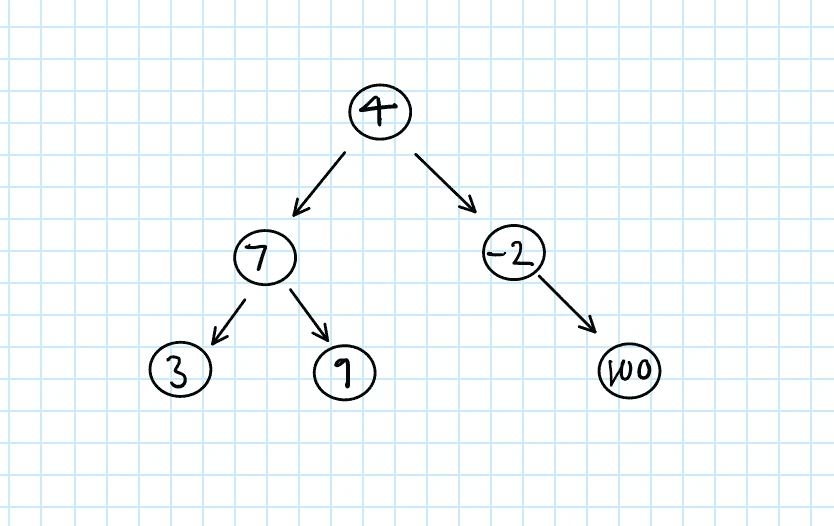
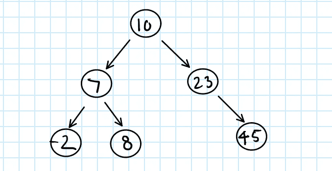
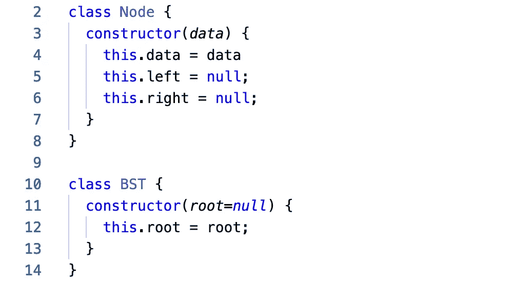
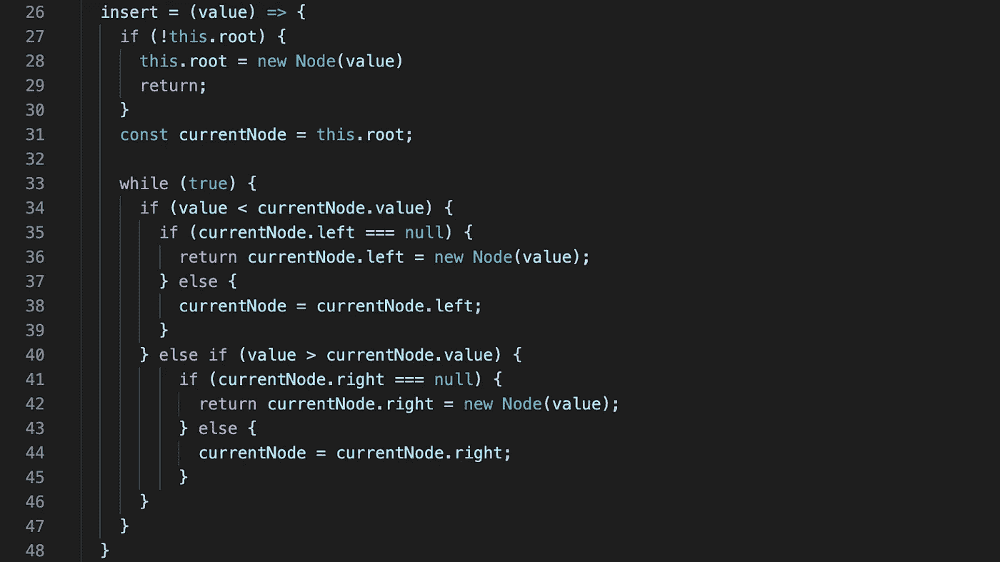
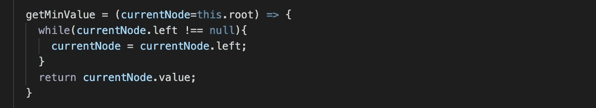
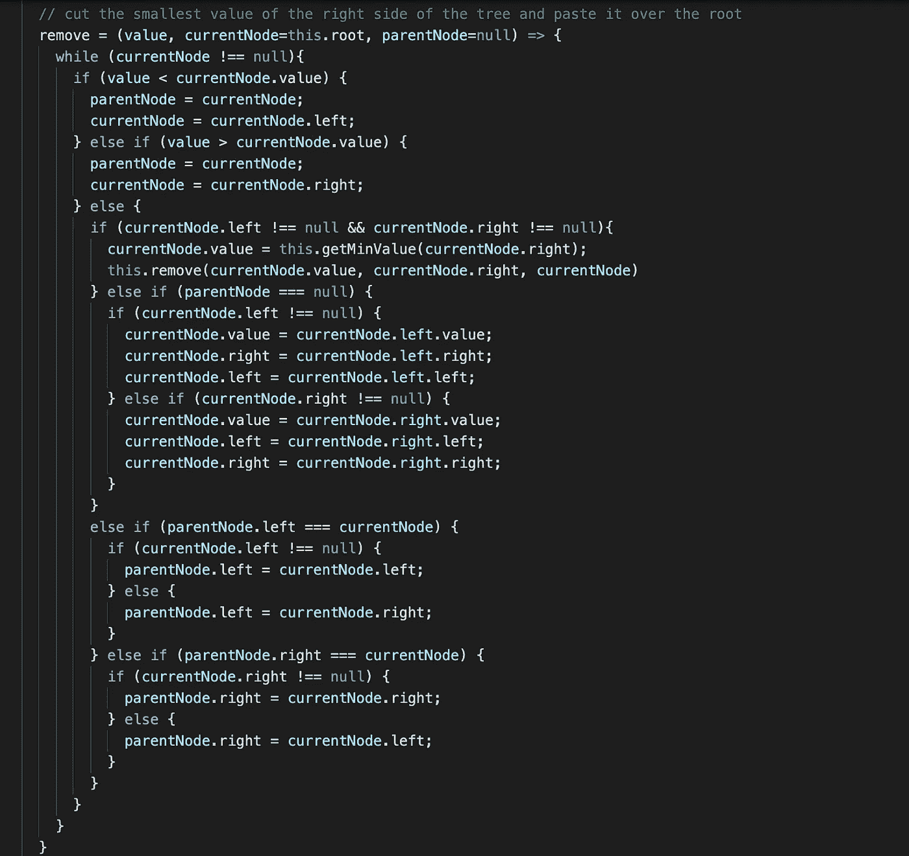

# 用 JavaScript 实现 BST

> 原文：<https://levelup.gitconnected.com/implementing-a-bst-in-javascript-dc818ba50633>

我们将实现一个 BST，并复习一些有用的定义和描述

## BST 到底是什么来着？

***二叉查找树*** 或***BST***是某种类型的 ***二叉树*** ，二叉树只是一个数据结构，它有一个指向子节点集合的根节点。每个节点都有一个值(在本例中是一个整数值)，每个节点最多有 2 个子节点(leftNode 和 rightNode)。

未排序、不平衡的二叉树

普通的二进制树没有排序或平衡约束，这使得查找时间非常短。在最坏的情况下，您必须触摸每个节点 **O(N)** 。

平衡，有序，二叉查找树

我们可以通过向集合中添加一个简单的属性来提高对**O(log(N)】**的查找速度:

*一个节点的值必须* ***大于其左侧的所有值****；一个节点的值必须* ***小于其右侧的所有值。***

*换句话说，当我们调用`currentNode.left`时，我们应该期望得到一个小于 `currentNode.data`的值*

*同样，当我们称`currentNode.right`时，我们应该期望得到一个大于 `currentNode.data`的值*

*您可能想知道……我们如何处理重复项？答案是…这取决于您自己，以及什么对您的实现有意义！有些人认为副本不属于一棵树，有些人会将它们分配到左边，有些人甚至会将它们放在该节点的数组中，或者在该节点上添加一个`dupeCount`变量来跟踪它们；你挑吧！*

## *履行*

*让我们言归正传吧，宝贝！我们将使用 **ES2015** 引入的语法；`class`关键字。这是一点语法糖，它抽象出了 JavaScript 现有的基于原型的继承模型。*

**

*我们需要两个类来为我们的 BST 建模*

*我们需要一个`Node`和一个`BST`类来构建我们的树。我们将要构建的`BST`将包含帮助我们与树交互的方法，而`Node`类将保存数据并跟踪它的两个子类。*

*我们还将使用两种不同的方法:`insert()`和`delete()`，我们将在下面跳到这两种方法。您可以使用 while 循环遍历节点，也可以使用递归。在每一个例子中，我都选择使用迭代，因为在我看来它更容易阅读和理解。*

## *插入(新节点):*

*当将一个节点插入 BST 时，我们将像往常一样从根节点开始并询问:“我们插入的值是大于当前节点的值还是小于当前节点的值？”如果值*大于*，我们继续向下通过`currentNode.right`，否则如果值*小于*，我们继续向下通过`currentNode.left`。如果子节点的值是`null`，那么我们已经找到了 BST 上需要覆盖的节点位置。*

**

*BST 的 insert()方法的实现*

## *删除(旧节点):*

*当从 BST 中删除一个节点时，我们将从根节点重新开始，并询问:“我们删除的值是大于当前节点的值还是小于当前节点的值？”如果值*大于*，我们向下遍历`currentNode.right`，否则如果值*小于*，我们向下遍历`currentNode.left`。然而，一旦我们找到了想要删除的值，事情就有点棘手了。首先，我们必须跟踪`prevNode` ，例如`parentNode`，一旦我们到达差异节点，就会有很多`if/else`案例的**和**，所以让我们浏览一下:*

***我们到达那里，节点的两个子节点都是空的(它没有子节点):**这是一个比较简单的情况——在这种情况下，您只需将`parentNode`设置为`null`并返回。*

***我们到达那里，只有一个节点的子节点不为空(它有一个子节点):**这将是另一个简单的情况——这里您可以用任何不是`null`的`childNode`来覆盖`parentNode`。*

***我们到达那里，节点的两个子节点都不为空(它有两个子节点):**在这种情况下，我们需要在`parentNode`的**右子树**中寻找**最小的** **值**，然后我们将取这个最小值节点并用这个最小的右子树值覆盖`parentNode`的值。*

**

*remove()的 helper 方法*

**

*remove()方法的实现*

*我希望这是对 BST 实现的一个很好的概述。我的目标是在另一篇文章中扩展这个实现，也许以后还会处理一棵时髦的红黑树！在那之前，保重！*

* [## 编写面试问题

### 编码面试课程

技术开发](https://skilled.dev)*