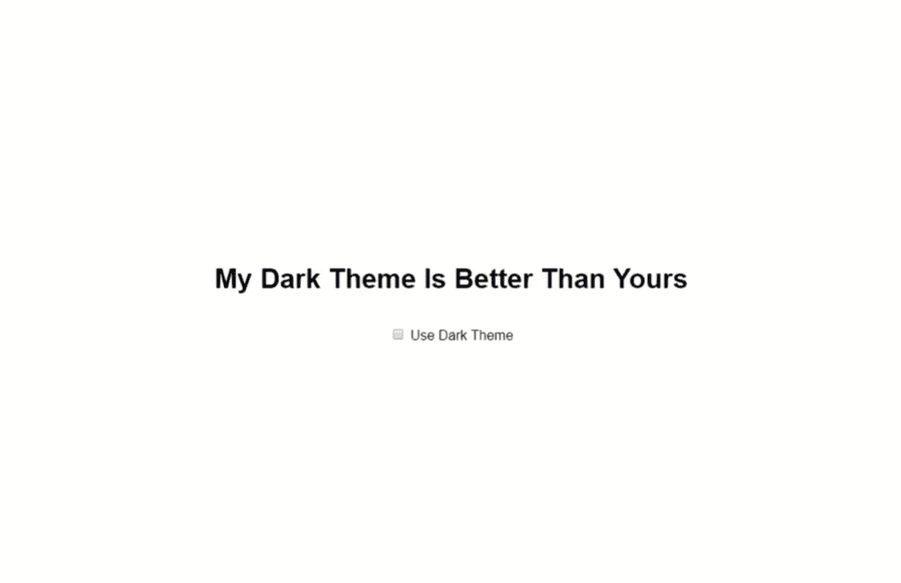
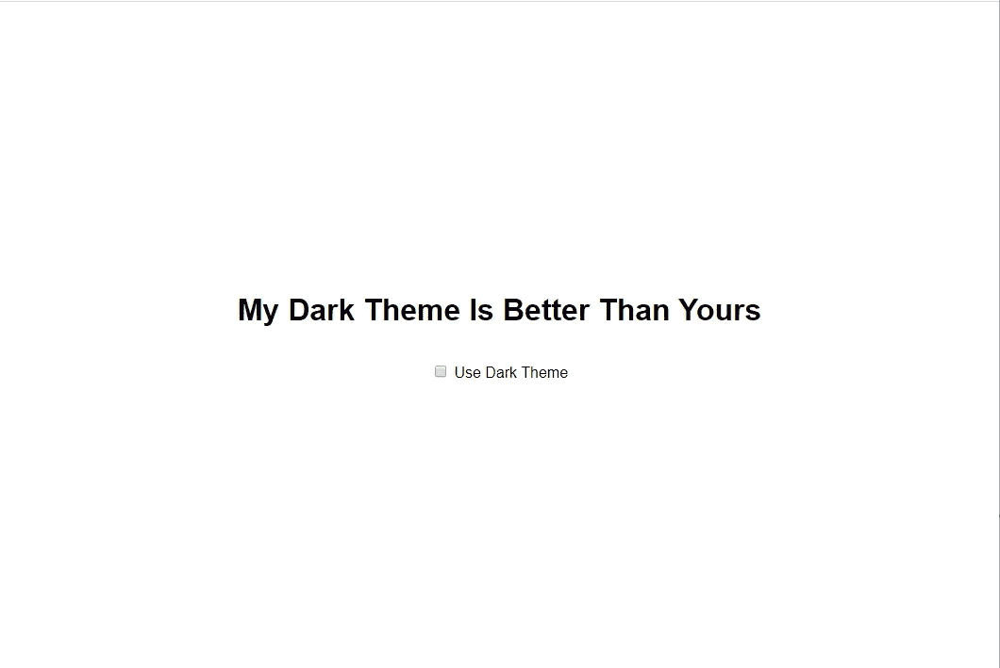
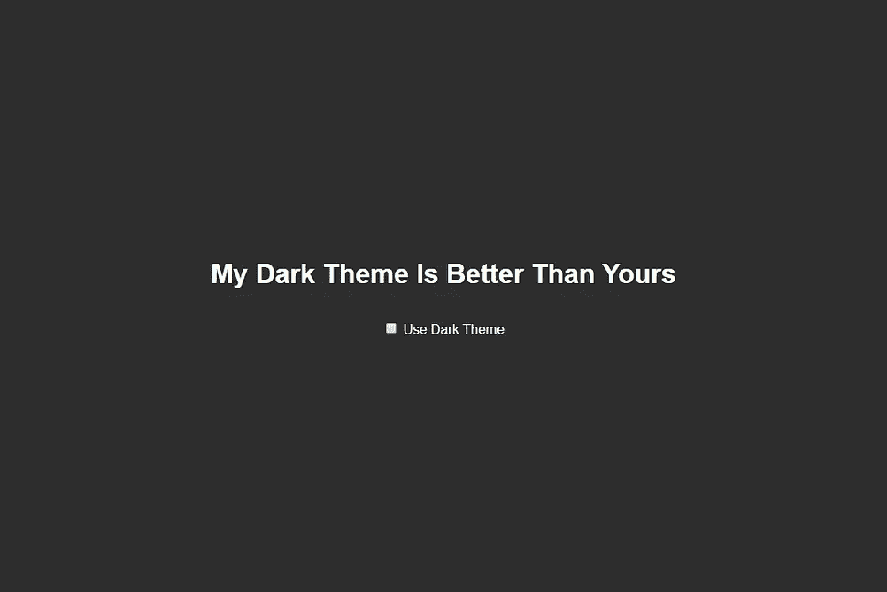

# 用 react-redux 和 styled-components 实现深色主题切换💅

> 原文：<https://levelup.gitconnected.com/implementing-a-dark-theme-toggle-with-react-redux-and-styled-components-e637c4d41e2f>

快速的谷歌搜索显示，已经有很多很多关于这个话题的帖子。然而，为了磨练我的技能，我决定自己从头开始构建它。

以下是我们将构建的内容:



## 创建-反应-应用

为了保持简单明了，我们将从`npx create-react-app dark-toggle`开始。当我们在命令行中时，让我们也把 npm 包拿出来:

`npm install styled-components styled-theming redux react-redux`

1.  **styled-components** :我们将使用这个库来创建封装了它们自己样式的独立组件
2.  样式化主题化:这个库提供了一个非常干净的 API 来处理你的样式化组件中的多个主题
3.  **redux** 和 **react-redux** 将承担状态管理的重任

这是我们`App.js`的初稿，显示了标题和一个复选框:



太神奇了。

## 现在，提供一个主题

我们需要告诉我们的组件如何根据当前的主题来设计自己的风格。

幸运的是，styled-components 有[内置的主题支持](https://gist.github.com/btodts/4142f03e6808a90aa1bcc77e4f99888e)。你只需用一个`ThemeProvider`组件包装你的组件，一个`theme`道具就可供所有人使用。

这就是我们更新后的`App.js`的样子:

注意到奇怪的事情了吗？我们传递给`ThemeProvider`的`theme`道具的对象看起来不像主题。这就是**风格化主题**的用武之地。这里我们没有传递整个主题对象，而是传递给提供者一个带有“主题”属性的对象。在我们的例子中，可能的主题是`light`和`dark`。

尽管这个对象是任意的。例如，在一个多品牌的应用程序中，您可以传递一个带有属性`brand`的对象，或者甚至将两者结合起来(以支持每个品牌的亮/暗模式)。让我们在应用程序中实现这两个主题:

我完全没有从 StackOverflow 的黑暗主题里偷深色🙊

花点时间欣赏一下**风格化主题**提供的`theme` -api 的整洁:

```
export const backgroundColor = theme("theme", {  
  light: "#eff2f9",  
  dark: "#2d2d2d",
});const Container = styled.div`
  ...
  background-color: ${backgroundColor};
`;
```

这个 api 使得组件可以非常容易地根据当前活动的主题改变它们的样式。再次使用我们的多品牌示例，这样维护您的不同风格要容易得多(另外，它仍然完全由组件自己决定样式)。

更改您传递给`ThemeProvider`的主题以查看不同的风格:



{主题:"光明" }对{主题:"黑暗" }

很好，我们的`ThemeProvider`只是将一个外延(一个我们可以按照自己认为合适的方式构造的对象)传递给我们的组件，告诉它们当前什么样式是活动的。

通过一个非常简洁的`theme` api，我们的组件根据`ThemeProvider`传递的对象决定应用什么样式。现在，对复选框！

## 输入 react-redux

为了实现切换功能，我们需要一个地方来存储当前选择的主题和切换它的方法。理想情况下，这应该在我们的应用程序中可用。这就是 **react-redux** 发挥作用的地方。

诚然，对于我们的简单应用程序，redux 是非常大材小用。然而，我计划在这个应用程序的后面使用 redux 进行状态管理，所以现在就让我们开始吧。

我们需要三样东西:

1.  一个真正的`store`来守住这个州
2.  派遣意图的行动
3.  一个减速器来处理这个意图

这很简单:

在真实的应用程序中，你可能不应该把所有的 reducers 放在一个文件中。

要使用这个商店，只需用来自`react-redux`的`Provider`包装您的`App`组件:

## DarkThemeProdiver

我们需要某种方式将 redux 商店中的状态连接到应用程序中的`ThemeProvider`。为了清楚起见，我决定引入一个单独的提供者来处理这个问题。

让我们仔细看看:

1.  我们使用`useSelector`钩子通过选择器函数从我们的存储中获取状态
2.  我们返回我们的`ThemeProvider`,并根据 redux 存储中的状态为它提供一个主题

让我们更新`App.js`，以便它使用我们新实现的`DarkThemeProvider`:

## 让我们切换

太好了！现在剩下的就是每当复选框被点击时调度`TOGGLE_DARKTHEME`动作。为此，我将复选框重构为一个单独的组件:

`DarkThemeToggle`组件从我们的存储中提取所需的状态，同样使用`useSelector`钩子。我们还使用了来自 **react-redux** 的另一个名为`useDispatch`的钩子。每当我们的复选框改变时，我们用它来调度`TOGGLE_DARKTHEME`动作。

最后，这是应用程序的外观:


## 还有一点

这里还有最后一个问题，这是一个 UX 问题。每当我离开页面，它就会“忘记”我喜欢的主题。

有很多方法可以解决这个问题，但是我决定将选择的`theme`存储在`localStorage`中，并在应用程序启动时使用它重新合并 redux 存储。

神奇的事情发生在`store.js`文件中:

1.  当构建我们商店的初始状态时，我们检查`localStorage`是否有任何存储的主题
2.  每当偏好发生变化时，我们使用一个 redux `subscriber`来更新`localStorage`。

全部完成！

感谢阅读！👏