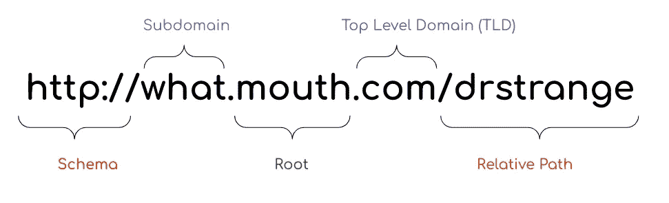
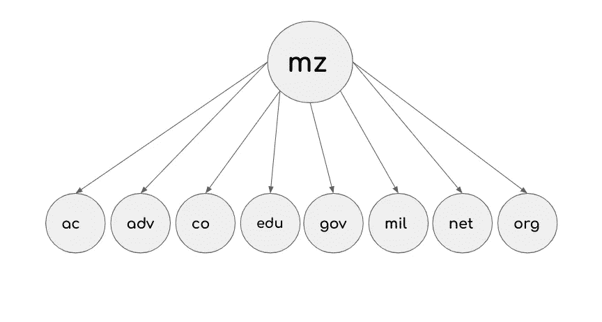

# 使用 Golang 实现领域解析器

> 原文：<https://levelup.gitconnected.com/implementing-a-domain-parser-using-golang-f88f83f56517>

与 IP 地址不同，域名被设计成可读和可记忆的，但这并不是它们的全部。域名由多个部分组成:



在这里，我将用 Golang 实现一个简单的域解析器，使用公共后缀列表[。](https://publicsuffix.org/list/public_suffix_list.dat)

> **最终的 Golang 模块在我的**[**Github**](https://github.com/mehrdadep/dex)**上有。**

## 步骤 1:下载并解析列表

公共后缀列表包括两个主要部分。ICANN 和私有域名。ICANN 部分以`// ===BEGIN ICANN DOMAINS===`开头，以`// ===END ICANN DOMAINS===`结尾。同样的规则也适用于私有域，它们的部分以`// ===BEGIN PRIVATE DOMAINS===`开始，以`// ===END PRIVATE DOMAINS===`结束。我们在解析列表和创建 TLD 树时需要考虑这一点。

我决定给解析后的文件添加一个`mode`，并将其缓存在文件系统中的某个地方。`mode=1`表示 TLD 属于 ICANN 部门,`mode=2`表示私有域名。最终解析的文件如下所示

```
.
.
.travelersinsurance,1
trust,1
trv,1
tube,1
tui,1
.
.
.ui.nabu.casa,2
pony.club,2
of.fashion,2
.
.
.
```

这些对于创建 TLD 树来说很方便。我已经给每个节点添加了`isPrivate`和`isIcann`。

```
for _, line := range lines {
   line = strings.TrimSpace(line)
   if line != "" && strings.HasPrefix(line, "// ===BEGIN ICANN DOMAINS===") {
      mode = "1"
   }
   if line != "" && strings.HasPrefix(line, "// ===BEGIN PRIVATE DOMAINS===") {
      mode = "2"
   }
   if line != "" && !strings.HasPrefix(line, "//") {
      buffer.WriteString(line + "," + mode)
      buffer.WriteString("\n")
   }
}
```

## 步骤 2:使用正则表达式提取不同的部分

我们需要去掉 URL 的模式部分。regex 将为我们做这件事。

提取 TLD 后，我们需要确保根域的格式是有效的。`^[a-z0–9-\p{L}]{1,63}$`检查 URL 上根部分的有效性。

提取 URL 的子域部分很容易。我们只需要用`dot`分离器将`subdomain+root`部分分开。

```
func extractSubdomain(d string) (string, string) {
   ps := strings.Split(d, ".")
   l := *len*(ps)
   if l == 1 {
      return "", d
   }
   return strings.Join(ps[0:l-1], "."), ps[l-1]
}
```

如果提取的 TLD 为空，我们需要检查 URL 是否是有效的 IPv4/IPv6。在使用`regex`匹配 IPv4 格式之前，我们可以使用内置的`net.ParseIP(url)`，然后只检查 IPv4(跳过 IPv6 的 regex)

## 第三步:Trie 特里

我们使用 Trie 来构成 TLD。以这部分清单为例

```
// mz : http://www.uem.mz/
// Submitted by registry <antonio@uem.mz>
mz
ac.mz
adv.mz
co.mz
edu.mz
gov.mz
mil.mz
net.mz
org.mz
```

这将像这样成为 Trei 的一部分



树的每个节点都包括一些关于该节点的信息，例如:

*   无论是私有域名还是 ICANN
*   这是有效的 TLD 吗
*   是否是例外规则(以`!`开头的规则)

## 第四步:就这样，没有更多的步骤

使用 go 模块安装`dex`。

```
go get github.com/mehrdadep/dex
```

像这样使用它

```
package main

import (
"fmt"
"github.com/mehrdadep/dex"
)

func main() {

    cache := "/tmp/list.cache" extract, _ := dex.New(cache) result:=extract.Parse("[https://mehrdadep.medium.com](https://mehrdadep.medium.com)") fmt.Printf("%+v\n",result)}
```

这将输出

```
&{IsIcann:true IsIpV4:false IsIpV6:false IsPrivate:false Subdomain:mehrdadep Root:medium Tld:com}
```