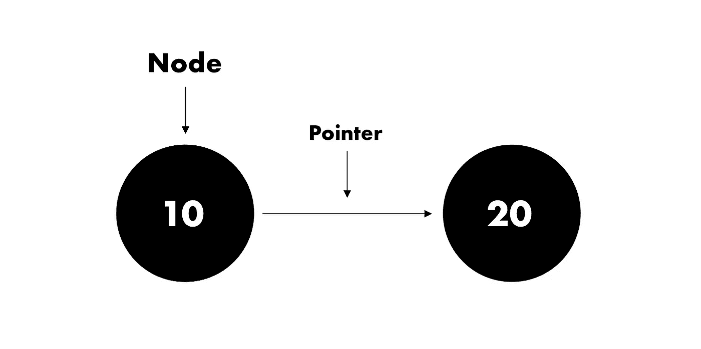
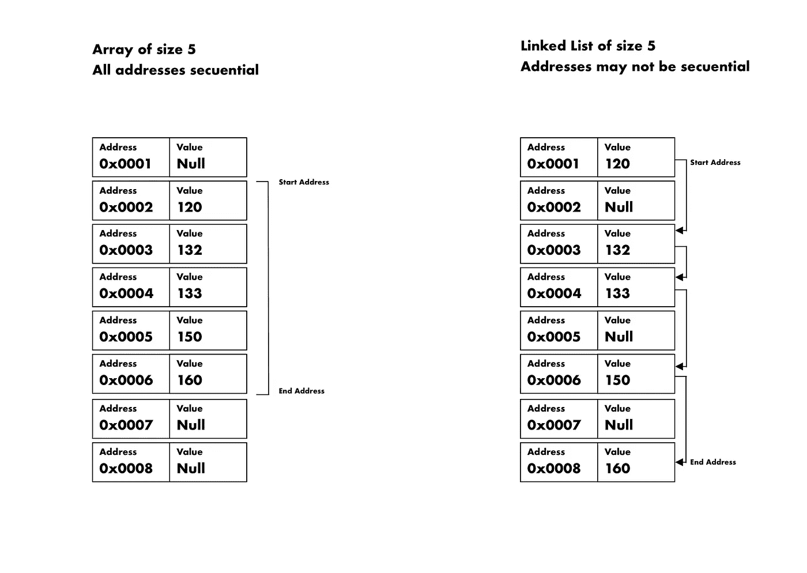
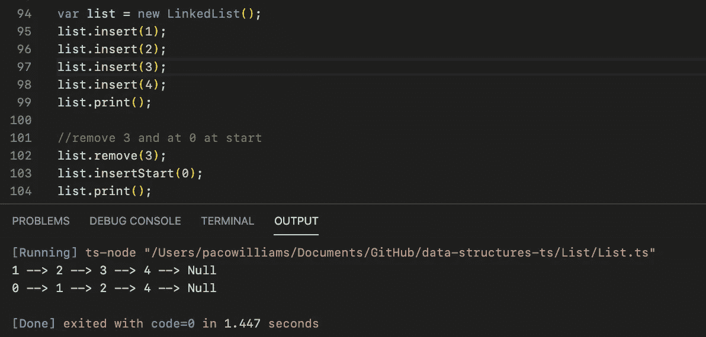

# 用 JavaScript 实现一个链表

> 原文：<https://levelup.gitconnected.com/implementing-a-linked-list-in-javascript-717d2ab5d9a9>


照片由 [JJ 英](https://unsplash.com/@jjying?utm_source=unsplash&utm_medium=referral&utm_content=creditCopyText)在 [Unsplash](https://unsplash.com/s/photos/chain?utm_source=unsplash&utm_medium=referral&utm_content=creditCopyText)

链表在实现其他数据结构时非常有用。使用链表比使用线性链表更容易实现队列和堆栈。

# 什么是链表？

链表是一种动态分配的数据结构，其功能类似于数组。不像他，虽然，它不必处理调整 BS 的大小，并为此紧张不安。

这个数据结构是由节点组成的，节点很酷好吗？

节点是存储数据的容器。在这个特殊的例子中，它存储一个值和一个指针。指针将引用另一个节点，列表中的下一个节点，依此类推。

无异议！



# 动态分配是什么意思？

## 为什么它很酷？

为了理解这一点，我们必须首先深入研究计算机内存，以及数据是如何存储的。



数组与链表

[](https://medium.com/javascript-in-plain-english/implementing-a-hash-table-in-javascript-29aca1edfe2b) [## 用 JavaScript 实现哈希表

### 今天我们将在 JavaScript/TypeScript 中创建我们自己的散列表数据结构。

medium.com](https://medium.com/javascript-in-plain-english/implementing-a-hash-table-in-javascript-29aca1edfe2b) 

# 数组是如何存储的

例如，具有 5 个值的数组必须在计算机内存上保留 5 个连续的地址槽来存储这些值。老式的方法。

如果他需要添加另一个值，而下一个地址被另一个程序使用，他会抱怨说“嗯，我需要更多的空间，因为我变胖了”。( ***阵中呐喊)*** 。反过来，计算机的操作系统，每一次都变得更加恼火，将不得不寻找另一个位置来连续排列数据。

# 链表是如何存储的

相比之下，酷家伙不必将其值存储在连续的槽中。他可以从一个槽开始，然后指向更远的另一个槽。为什么？因为他觉得很远的地方很酷。这就是原因。

换句话说，链表使用**指针作为锚**来查找列表中的下一个值。由于内存具有恒定的时间访问，将节点存储在不同的位置而不是连续的顺序确实会使链表比数组慢。*酷又赢了*。

# 开始之前

*注意:TypeScript 和 JavaScript 的唯一区别是变量类型的声明。在下面的代码片段中，代码是用 TypeScript 编写的，但是通过删除类型定义，可以很容易地将其转换成 JavaScript。*

例如

```
**//in typescript**
var addOne(num: number): number {
     return num++;
}**//in javascript**
var addOne(num) {
     return num++;
}
```

不是说我们已经得到了我们的方式，让我们挖掘！

# 为节点创建一个类

我们班有两个性质。节点将保存的值，以及同一类型的指针 ListNode 调用 next。 **N *ext*** 将在我们的列表中持有*下一个*节点。没有双关的意思。

默认情况下，一个节点在创建时不会指向任何其他节点，因此下一个 的 ***被赋予空值***。他还不酷。

# 创建链接列表类

该类只包含一个属性。 **Head** ，它将引用我们列表中的第一个节点。因为我们的列表是空的，所以默认情况下它将为 null。这个类不需要构造函数。

[](https://medium.com/swlh/implementing-a-binary-search-tree-in-javascript-78a2f28d0493) [## 用 Javascript 实现二叉查找树

### 今天我们将用 javascript 实现一个二叉查找树。如果你觉得没有准备好或者有困难…

medium.com](https://medium.com/swlh/implementing-a-binary-search-tree-in-javascript-78a2f28d0493) 

# 插入值

为了插入值，酷哥必须总是检查列表是否为空。如果是，那么他只需创建一个新节点，并将其分配给**头**。负责人很乐意服从。如果不是，他必须考虑三种情况。

# 在头部前插入

有时酷哥会对头像发火，通过在它前面加一个新的，把它降级到普通节点。我们必须考虑到这一点，节点有时会非常引人注目。

1.  首先，我们用想要插入的值创建一个新节点。

2.在我们用新值(0)创建节点后，我们需要设置它的 **next** 属性以指向当前头(1)。

3.之后，我们可以简单地将新节点(0)作为新的**头**，因为我们已经将它连接到列表的其余部分。

# 在中间插入

## 在两个节点之间插入也非常简单。我们更新 prevNode 和 newNode 的指针。

有时候酷的家伙有两个合不来的朋友，所以他必须在他们之间推一个额外的酷节点，让他们冷静下来。

1.  我们创建一个新的 ***列表节点***
2.  ***prevNode*** 现在会指向 ***newNode*** 。
3.  ***newNode*** 现在将指向

# 插入到末尾

## 要在列表的最后一个节点后插入，我们必须先遍历整个列表。

现在酷哥实在不喜欢某个节点的时候，往往会发在列表的后面。

为此，他创建了一个 while 循环并遍历列表，直到到达最后一个节点。

# 搜索值

为了跟踪他所有的节点伙伴，酷哥经常会进行搜索以确保节点仍然存在。

要搜索一个值，他只需在列表中移动，并向每个节点询问其 id，直到找到他想要的那个。

# 移除值

删除值是最困难的部分，因为它需要最长的时间。必须根据节点在列表中的社会地位采取行动。也因为他删除了一个节点，酷家伙一定很生气。

此外，他还必须检查三种可能的情况。

## 我们要删除的值是头部

这个很容易检查。我们只需要比较当前节点是否等于头部。

头一直在前面，微笑着拍照，俯视着较小的节点。

## 该值位于列表的末尾(最后一个节点)

他检查想要删除的节点是否指向 null。如果是这样，说明他找到了列表中的最后一个节点。

## 该值介于其他节点之间

如果值既不是 head，又指向另一个非 null 的节点，他必须确保将前一个节点连接到下一个节点(我们要删除的节点之后的节点)。

# 一种方法来统治他们

他现在可以使用我们创建的所有方法来创建一个函数 remove 方法，该方法只需要将要删除的值。

我们可以看到这个酷酷的家伙在列表中循环，直到找到我们需要删除的节点。

然后他根据情况选择行动方案。

# 测试我们的列表



我们可以看到，从列表中删除了 3 个，成功添加了 0 个。

# 最后的结果

# 结束了！

# 分级编码

感谢您成为我们社区的一员！在你离开之前:

*   👏为故事鼓掌，跟着作者走👉
*   📰查看[级编码出版物](https://levelup.gitconnected.com/?utm_source=pub&utm_medium=post)中的更多内容
*   🔔关注我们:[推特](https://twitter.com/gitconnected) | [LinkedIn](https://www.linkedin.com/company/gitconnected) | [时事通讯](https://newsletter.levelup.dev)

🚀👉 [**加入升级人才集体，找到一份惊艳的工作**](https://jobs.levelup.dev/talent/welcome?referral=true)