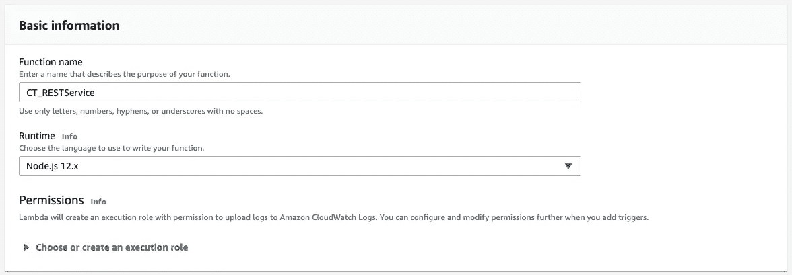
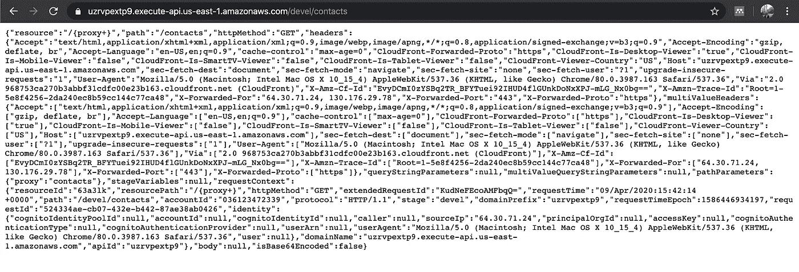

# 用 AWS 实现 REST API(API Gateway、Lambda 和 DynamoDB)

> 原文：<https://levelup.gitconnected.com/implementing-a-rest-api-with-aws-api-gateway-lambda-and-dynamodb-c62b8a1f6182>

这只是一个关于如何实现 REST API 的简短教程，它使用 AWS API Gateway 将请求路由到可以查询数据库(DynamoDB)的 Lambda 函数(NodeJS)。这是我第一次使用所有这些 AWS 服务，所以我确信有“更好的”方法来实现它，但作为一名黑客，我选择了阻力最小的方法。当然欢迎反馈。

**1。登录你的 AWS 账户并导航到 DynamoDB**

**2。在 Dynamo 中创建一个表**

所以我们现在可以把所有的信息存储在一个表中。点击**创建表格**，然后使用这些设置:


您可以使用 ***下的 ***默认设置页面的*** 部分。***

**3。向我们创建的表中添加一条记录**

在 Dynamo 中创建表后，您将进入表管理页面。选择**项目页签** 然后点击**创建项目** *。用户界面包含了我们用来创建表的分区键。切换到左上角的 ***文本*** 模式并创建该对象可能更容易:*

{
"UserId": "id_12345 "，
"FirstName": "Chris "，
"LastName": "Spirito"
}

点击**保存**，您将在表格中看到新项目。这只是放在这里，这样一旦我们编写了示例代码，我们就有了查询的对象。

**4。创建一个 Lambda 函数**

这是 AWS 将为我们运行的代码段。每当我们要求它。我们要做的是创建一个 REST API 端点，它调用 Lambda 函数来返回从 DynamoDB 查询的数据。点击左上角的 **AWS** 图标，然后从服务列表中找到 **Lambda** 并选择它。这将把你带到 **Lambda Functions** 视图，但是如果它不只是从左边的选项中选择**函数**。点击**创建功能**并从头开始使用 ***作者*** 选项。基本信息应该是这样的:



我们将分别更新权限，因此您可以暂时保留该部分。一旦你点击**创建功能**，你将进入 Lambda 功能的 ***配置*** 部分。你应该在 ***功能代码*** 窗口看到一些看起来有点大眼熟的代码。这是我们将更新的代码，以处理我们的请求。

**5。在 IAM 中创建一个角色**

我们需要创建一个 AWS 角色，它将允许 **Lambda 函数**与 **DynamoDB** 进行对话，并被允许运行。让我们创建一个具有这些权限的角色。再次点击 **AWS** 图标，这次从 AWS 服务列表中搜索 **IAM** 并选择它。从左侧选项中选择**角色**。点击 ***创建角色*** ，确保顶部的 ***AWS 服务*** 被选中。选择***λ***作为用例，然后点击 ***下一步:权限*** 。现在，我们有机会附加一些策略，规定允许哪个服务做什么以及它们可以与谁对话。我们需要添加两个服务:***awslambdabasiceexecutionrole***和***AmazonDynamoDBFullAccess*。**搜索这些角色，并勾选左侧的复选框。完成后，点击 ***下一步:标签。*** 我们不会添加任何标签，因此您可以单击 ***下一步:查看。***

给角色起个名字。我选择了 ***CT_AWS_Role*** 作为 ***Rolle 名称*** 。你应该看到我们添加的两个 ***政策*** 。


新角色现在应该在您的列表中:


**6。将角色应用于 Lambda 函数**

通过 AWS 控制台切换回**λ**，然后选择 ***权限*** 选项卡，在这里定义 ***执行角色*** 。当你创建λ函数时，AWS 会自动为你创建一个角色，因此有了这个有趣的名字。这个角色允许 Lambda 函数将日志条目写入到 ***CloudWatch*** 中，这是我们以后可以考虑做的事情。将 ***执行角色*** 更改为我们刚刚创建的角色 ***CT_AWS_Role*** ，这样我们就可以调用 **DynamoDB** 。点击**编辑**，然后在**现有角色** *下选择您创建的角色。*


点击**保存**，你将回到**配置**选项卡。

**7。测试 Lambda 函数，看看它是否能与 DynamoDB** 对话

终于我们可以写一些代码了！用这段代码替换 index.js 的内容。需要检查的一件事是您所连接的 AWS 区域。如果您查看 AWS 浏览器窗口的右上角，您会看到您所在的地区:


在代码的区域属性中使用相应的区域名称(例如 us-east-1 ):

```
const AWS = require (‘aws-sdk’);
const TABLE = “CT_Contacts”const dynamoDb = new AWS.DynamoDB.DocumentClient({
  region: ‘us-east-1’
});exports.handler = async (event) => {

 const _id = “id_12345”;

 const params = {
   TableName: TABLE,
   Key: {
     “UserId”: _id
   }
 };

 const data = await dynamoDb.get(params).promise(); const response = {
   isBase64Encoded: false,
   headers: {“Content-Type”: “application/json”}
 };

 if ((typeof data) === “object”) {
   response.statusCode = 200;
   response.body = JSON.stringify(data);
 } else {
   response.statusCode = 500;
 } return response;
};
```

**按下**保存**按钮保存**你的代码，然后让我们运行一个测试看看它是否工作。点击**测试**下拉箭头，选择 ***配置事件*** 。给事件起一个名字，如 ***TestEvent*** 并保持输入不变，或者您可以完全删除输入并保持{}:


点击**创建**，将返回代码编辑窗口。接下来点击**测试**，你会在 ***执行结果*** 窗口中看到以下内容:


如果你看到来自 **DynamoDB** 的数据，万岁！否则，我们需要进行一些故障诊断，找出问题所在。

8。现在让我们创建一个 REST 端点，我们可以用它来调用 Lambda 函数

导航到 AWS -> ***API 网关*** ，这样我们就可以创建我们的端点了。它应该会让你进入**API***配置屏幕，但是如果它没有从左侧栏中选择**API***。**

**点击**创建 API** 按钮。**

**向下滚动并找到 **REST API** 并点击**构建**。使用以下设置(确保选择 ***边缘优化*** )作为端点类型。这并不重要，但由于我们的应用程序是通过 CloudFlare 部署的，我们还可以使用边缘优化:**

****

**点击**创建 API** ，您将进入 **API** 方法部分。**

**点击**动作**，然后**创建资源**，这将允许您创建一个*新子资源* **:****

**使用以下设置:**

****

**点击**创建资源****

**这将使你进入资源设置的**部分。这是定义被调用的 Lambda 函数的地方。****

****

**当您点击**保存**时，您必须确认您正在添加一个连接到 API 的 Lambda 函数的权限:**

****

**这将使您进入我们创建的资源，并向您显示 ***方法执行*** :**

****

**现在我们必须**部署 API** ，它将创建我们可以调用的端点来测试这个。点击**动作**，然后**部署 API** 。您将不得不创建一个新的 ***部署阶段。*** 现在使用以下设置:**

****

**点击**部署****

**现在我们有了 URL 端点:**

****

**现在我们不需要设置这个 API 的任何其他属性。让我们来测试一下。在浏览器中打开 URL:**

****

**哦不！不是我们所期待的！我希望能看到我们 Lambda 的数据。但这没什么大不了的，因为我们在创建资源时就被警告过，如果我们想让根/资源进行路由，我们就必须为此创建一个单独的资源。只需在 url 末尾添加任何内容，您就会看到我们所期待的内容:**

****

**非常刺激！所以现在我们的 **API** 正在传递给我们的 **Lambda** 函数，该函数然后调用 **DynamoDB** 来获取数据。我们现在正在巡航。**

**9。了解 API URL:**

```
****https://** [**uzrvpextp9.execute-api.us-east-1.amazonaws.com**](http://uzrvpextp9.execute-api.us-east-1.amazonaws.com/) **/devel /contacts****
```

**https:// :这就是所谓的方案，所以在网络浏览器中通常是 http://或 https://取决于你是否安全。**

****uzrvpept 9 . execute-API . us-east-1。:**子域。**

**[](http://amazonaws.com/)**:二级和顶级域名。****

******/devel** :这是我们在上一节中部署的 API 阶段。这允许我们有不同的阶段，以防我们想在推向生产或另一个用例(有很多)之前在开发中执行测试****

******/contacts** :这是我们在上一节中设置的{proxy+}，它将所有变量传递给我们的 **Lambda** 函数供我们使用。另一个选择是将 GET/PUT/DELETE/… API 调用分别映射到不同的 lambda 函数，如果我们的应用程序更复杂，这可能是有意义的，但考虑到我们要完成的任务，这应该足够了。****

****此处有记录:[https://docs . AWS . Amazon . com/API gateway/latest/developer guide/API-gateway-set-up-simple-proxy . html](https://docs.aws.amazon.com/apigateway/latest/developerguide/api-gateway-set-up-simple-proxy.html)****

******10。对通过**传递的代理变量做一些事情****

****这就是我们不得不戴上黑客开发者帽子的地方，因为文档对我来说不是很清楚，所以我做了以下事情。既然 **Lambda** 函数正在工作，并且 **API** 网关也正在工作，让我们回到 Lambda 代码并做两处修改:****

```
******Change export.hanlder to:**exports.handler = async (event, context, callback) => {**Add this line just before the return:**response.body = JSON.stringify(event);****
```

****这将允许我们看到什么被传递到 Lambda 中，这样我们就知道如何获取我们需要的东西。我们通常会使用 console.log 消息来做到这一点，但这需要我们转到 **CloudWatch** 日志，这是一种更简单的黑客方式。重新加载页面，您将看到以下内容:****

********

****这是一个很好的信息，对不对？但是格式是垃圾。所以只要在**网络**标签下打开这个，选择 ***联系人？id=blah* 从**名称**列，然后**预览。**这将为您提供以下观点:******

********

****更容易处理，对吗？****

****因此，让我们在 lambda 中实现一个 GET to /contacts，如果用户传入一个 Id，我们将在数据库中搜索它并返回结果。****

****所以把你的网址改成:****

```
****https://<your_url>/devel/contacts?id=blah****
```

****如你所见，我在**中添加了？**表示其余的 URL 都是以***variable _ name = value***的形式传递的查询参数。我在上面使用 ***blah*** 的原因是为了让我可以在结果中轻松找到它。如果我选择 id=1 或 id=a，考虑到重叠部分，可能会有点棘手。查看结果，我发现我们感兴趣的是:****

****我们将对其进行测试，以确保它等于“GET”****

****pathParameters.proxy 将从 URL 中给我们提供/xxx****

******query string parameters . id**它将给出我们应该搜索的 Id。****

****让我们确保我们能正确地提取这些。在 **Lambda** 函数中，将以下行添加到返回中:****

```
******add this line:**var _myValues = `${event.httpMethod} — ${event.pathParameters.proxy} — ${event.queryStringParameters.id}`;**update this line:**response.body = _myValues;****
```

****刷新页面，您应该会看到:****

****这是一个挑战，下面是一个解决方案。将 Lambda 函数重写为:****

*   ****接受传入 id 变量的 **/contacts** 的 **GET** 请求。**举例**:/联系人？id=id_12345****
*   ****返回状态码 ***200 OK*******
*   ****从主体中的数据库返回对象****
*   ****如果路径不是**/触点**返回状态码 ***404 未找到*******
*   ****如果路径是**/触点**但方法不是**得到**返回状态码 ***405 方法不允许*******
*   ****如果有数据库错误(从数据库返回的数据不是 object 类型)，则返回状态代码 ***500 内部服务器错误*******

******一个解决方案:******

```
****const AWS = require ('aws-sdk');
const TABLE = "CT_Contacts"

const dynamoDb = new AWS.DynamoDB.DocumentClient({
    region: 'us-east-1'
});

// Reference for HTTP Response Codes
// https://developer.mozilla.org/en-US/docs/Web/HTTP/Status

exports.handler = async (event, context, callback) => {

    // Set variables
    var _httpMethod = event.httpMethod;
    var _proxyPath = event.pathParameters.proxy;
    var _queryStringParameters = event.queryStringParameters == null ? {} : event.queryStringParameters;

    // Required format for data that is returned via a AWS API Proxy
    // The four fields required are:
    //   isBase64Encoded, headers, statusCode, body

    const response = {
        isBase64Encoded: false,
        headers: {"Content-Type": "application/json"},
        body: ""
    };

    // If _proxyPath is contacts proceed, else return 404 Not Found

    if (_proxyPath == "contacts") {
        // Right now we only allow GET Requests for contacts path
        // If the request is good return 200 OK
        // If the request not a GET, return 405 Method not Allowed
        if (_httpMethod == "GET") {
            // Grab the Id
            var _id = _queryStringParameters.hasOwnProperty("id") ? _queryStringParameters.id : "";

            // Setup the DynamoDB Input Variables
            const params = {
                TableName: TABLE,
                Key: {
                    "UserId": _id
                }
            };

            // Make the call to DynamoDB using await for the promise 
            // since the usual approach never executes for some      
            // reason

            const data = await dynamoDb.get(params).promise();

            // Check to see that the DB returned something useful

            if ((typeof data) === "object") {
                response.statusCode = 200;
                response.body = JSON.stringify(data);
            } else {
                response.statusCode = 500;
            }
        } else {
            response.statusCode = 405;
        }
    } else {
        response.statusCode = 404;
    }

    return response;
};****
```