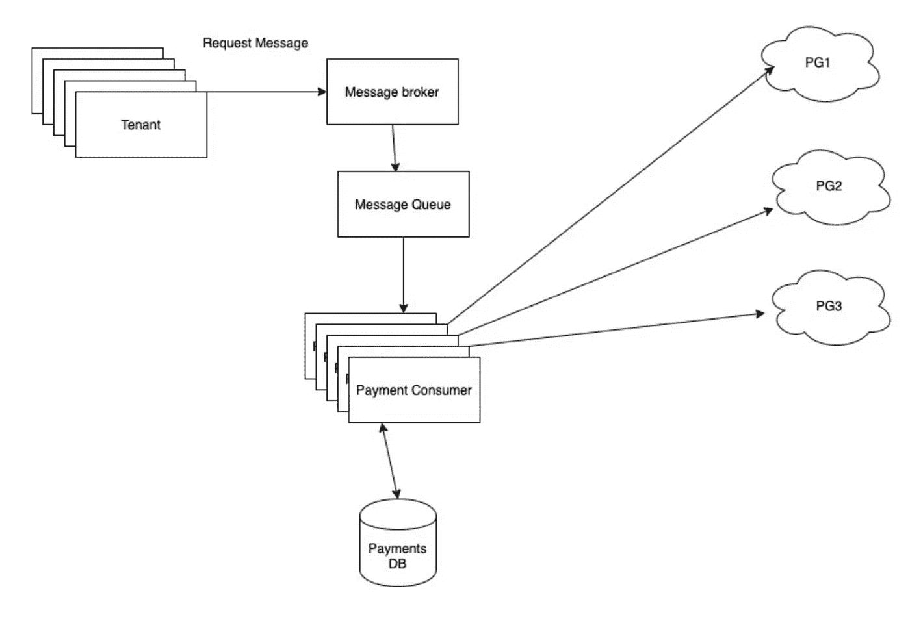

# 用 Redis 和 Golang 实现滑动对数速率限制器

> 原文：<https://levelup.gitconnected.com/implementing-a-sliding-log-rate-limiter-with-redis-and-golang-79db8a297b9e>

# 介绍

我开发了一个与多个支付提供商通信的应用程序。每个提供商对我们都有自己的费率限制。我们不想用尽任何支付提供商的费率限制，同时也要充分利用我们被允许的限制。我们可以将对支付提供商的请求延迟一小段时间，因为批量支付是作为异步作业离线处理的。

在一个普通的记账日，我们会在短时间内进行大量的支付。我们是否突破了支付处理器的费率限制？我们应该对此做些什么吗？我听说过一种叫做限速器的东西。

什么是限速器？速率限制器限制发送方在特定时间窗口内可以发出的请求数量。一旦达到限制，它就会阻止请求。

通常，速率限制器组件位于接收系统中，但是由于我们非常依赖第三方处理器，所以适应提供商的速率限制和控制出站请求也是有意义的，以便不会获得太多的请求，或者乐观地说，甚至是单个请求。

我们开始设计限速器时考虑到了这些要求:

1.  它应该限制在给定时间段内对特定支付提供商的请求数量
2.  由于我们的系统运行在一个集群上(而不是一台服务器上)，速率限制应该应用于请求总数，而不是每个应用程序进程。
3.  我们的后期限制逻辑应该是原子性的，即使多个请求同时到达我们的系统也不会失败

# 系统结构

在我们深入研究限速器设计之前，先来看看我们的异步支付处理系统:



任何到达支付消费者队列的消息都会被支付消费者处理。支付消费者从永久数据库中提取一些数据，以便向相应的支付处理器(以下称为 PG)发出请求

业界有几种用于速率限制的标准算法，如漏桶、固定窗口和滑动日志。没有进入决策的细节，我选择了滑动日志，因为它适合我们的需要，并且易于实现。

# 该算法

假设对于一个 PG pg1，我们被允许每秒进行 100 次 API 调用。每次我们进行 API 调用时，我们都会将 API 调用的时间戳(以纳秒为单位)添加到列表中。

```
timestamps << Time.now
```

当我们要在我们的消费者中进行 API 调用时，我们需要检查是否允许我们这样做:

```
calls_already_made = timestamps.count {|t| t > now - 1.second }
```

允许的剩余 API 调用:

```
allowed = max_calls_per_second - calls_already_made
```

其中每分钟最大呼叫数来自支付网关配置。

```
if allowed > 0
  // do magic
else
  // Oops! Rate limit breached, please try later!
end
```

简单吧？

# 存储滑动日志

我们需要某种数据库来存储按支付网关分组的时间戳列表。让我们从我们已经有的东西中选择。我们可以使用 MySQL 或 MongoDB 吗？是的，我们可以，但是我们需要一个定期删除过期时间戳的系统，因为 MySQL 和 MongoDB 都不允许我们在一行上设置 TTL。Redis 呢？Redis 是一个键/值存储库，支持列表、集合、排序集合等等。我们可以使用一个有序的集合来保存我们的时间戳！

由于我们的一个关键需求是我们的窗口是自动填充的，我们可以使用 [redis 事务](https://redis.io/topics/transactions)或者编写 lua 脚本并 [eval](https://redis.io/commands/EVAL) 它。

# 深入 redis

下面是一个交易的样子

```
// start the transaction
MULTI//  remove all values to the left of the start of the window
ZREMRANGEBYSCORE <pgName> 0 <windowStartTimestamp>// Count the values in the window
ZCARD <pgName>// Add current timestamp
ZADD <pgName> <currentTimestamp> <currentTimestamp>// expire the whole set after the window size
EXPIRE <pgName> <windowSize>// execute the transaction
EXEC
```

注意我们是如何执行 ZADD 的，不管是否达到了限制。这意味着我们的滑动日志将被失败的请求淹没，我们将无法满足合法的请求。

相反，我们只想在执行请求时添加当前时间戳。

因此，事务不是一个明智的选择，因为我们需要 1 命令( [ZCARD](https://redis.io/commands/zcard) )的输出来决定是否运行后续命令( [ZADD](https://redis.io/commands/ZADD) )。

因此需要“评估”lua 脚本——它允许我们在执行后续命令之前使用一个命令的输出，包括允许我们编写 if 条件。

```
// Set variables from arguments
local pgname = KEYS[1]
local now = tonumber(ARGV[1])
local window = tonumber(ARGV[2])
local limit = tonumber(ARGV[3])// Remove keys older than now - window
local clearBefore = now - window
redis.call('ZREMRANGEBYSCORE', pgname, 0, clearBefore)// Get already sent count
local already_sent = redis.call('ZCARD', pgname)
if already_sent < limit then // if allowed, then add to sorted set
redis.call('ZADD', pgname, now, now)
end// for cleanup, expire the whole set in <window> secs
redis.call('EXPIRE', pgname, window)// return the remaining amount of requests. If >= 0 then request is // allowed
return limit - already_sent
```

因为我们所有的支付消费者都连接到同一个 redis 集群，所以滑动日志是共享的。lua 脚本的返回值大于 0 意味着允许进行更多的 API 调用。

下面是我们如何在 redis-cli 中运行它:(只需评估所有命令，用分号分隔)

```
eval "local pgname = KEYS[1]; local now = tonumber(ARGV[1]); local window = tonumber(ARGV[2]); local limit = tonumber(ARGV[3]); local clearBefore = now - window; redis.call('ZREMRANGEBYSCORE', pgname, 0, clearBefore); local amount = redis.call('ZCARD', pgname); if amount < limit then redis.call('ZADD', pgname, now, now) end; redis.call('EXPIRE', pgname, window); return limit - amount" 1 <pgname> <timestamp_secs> <window_size_secs> <rate>
```

这是我们将它嵌入 golang 计划的方式:

```
rdb := redis.NewClient(...)now := time.Now().UnixNano()
windowSize := int64(time.Second) // 1000000000 NanoSeconds
rateLimit := 1000 // can get from config
luaScript := `
  local pgname = KEYS[1]
  local now = tonumber(ARGV[1])
  local window = tonumber(ARGV[2])
  local limit = tonumber(ARGV[3])
  local clearBefore = now - window
  redis.call('ZREMRANGEBYSCORE', pgname, 0, clearBefore)
  local amount = redis.call('ZCARD', pgname)
  if amount < limit then
  redis.call('ZADD', pgname, now, now)
  end
  redis.call('EXPIRE', pgname, window)
  return limit - amount
`vals, err := rdb.Eval(
  luaScript,            // script
  1,                    // number of keys
  []string{pgName},     // KEYS
  now,                  // ARGV[1]
  windowSize,           // ARGV[2]
  rateLimit,            // ARGV[3]
).Result()
```

好了，这个管用。但是我不想用内联 lua 脚本污染我整洁的 go 文件。肯定有办法把它保持为另一种。lua 文件并从那里加载它

```
filename := "/some/path/ratelimiter.lua"
content, err := ioutil.ReadFile(filename)
if err != nil {
  // handle error
  log.Errorf(err, "Could not read file %s", filename)
}
luaScript := string(content)
vals, err := rdb.Eval(
  luaScript,            // script
  1,                    // number of keys
  []string{pgName},     // KEYS
  now,                  // ARGV[1]
  windowSize,           // ARGV[2]
  rateLimit,            // ARGV[3]
).Result()
```

…我们完成了！

# 奖金部分:基准测试

那么，我们如何知道我们的限制器实际上能够达到什么速率呢？我们试图做一些基准测试。

在总共运行 2，236，110 次之后，检查速率限制的平均操作耗时 55.37 微秒。使用本地 redis 实例，55.37 相当于我的本地系统每秒发出超过 18，000 个请求。

我从我的本地系统到我们的测试(远程)redis 设置尝试了相同的基准测试，结果令人震惊。每个操作需要超过 10 毫秒。

因此，这意味着大部分时间被 redis 连接占用。然后，我们对执行简单的 redis 命令——SET & GET——的时间进行了基准测试，在我的本地设置中为 34.01 微秒，在本地-远程设置中又超过了 10 毫秒。

可以肯定地说，与简单的 redis SET 操作相比，速率限制器要多花大约 21 微秒的时间。在不久的将来，这不会成为我们支付系统的瓶颈。我们只需要确保我们的服务器到 redis 的连接足够快。

希望这篇文章是有用的，请随时寻求问题或反馈！

# 附录

## 替代实现

[纯围棋，记忆基础](https://github.com/RussellLuo/slidingwindow/blob/master/slidingwindow.go)
Redis&Lua，GCRA 基础

## 资源