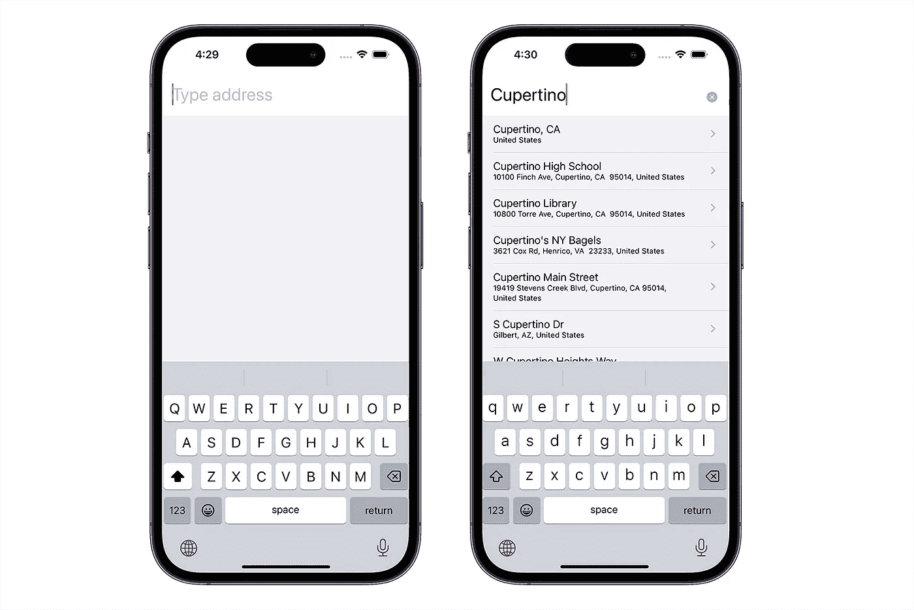

# 使用 SwiftUI 和 MapKit 实现地址自动完成

> 原文：<https://levelup.gitconnected.com/implementing-address-autocomplete-using-swiftui-and-mapkit-c094d08cda24>


令我自己惊讶的是，我意识到我从来没有只用苹果技术实现过地址自动补全。之前，我只体验过 [Google Places SDK](https://developers.google.com/maps/documentation/places/ios-sdk/autocomplete) ，甚至还有不太知名的欧洲[地理数据中心](http://geodatahub.eu)。我觉得很好奇——想知道我们如何限制自己只使用 SwiftUI 和 MapKit 来解决类似的问题。

# TL；速度三角形定位法(dead reckoning)

[](https://github.com/maxkalik/address-autocomplete-swiftui) [## GitHub-maxkalik/Address-autocomplete-swiftui:地址自动完成的 swift ui 解决方案

### 此时您不能执行该操作。您已使用另一个标签页或窗口登录。您已在另一个选项卡中注销，或者…

github.com](https://github.com/maxkalik/address-autocomplete-swiftui) 

# 地图工具包

在开始之前，让我们简单描述一下 map kit——苹果发明的一个强大的框架。[参见文档](https://developer.apple.com/documentation/mapkit/):

> 在应用程序中显示地图或卫星影像，调出兴趣点，并确定地图坐标的地标信息。

这个框架包括了一堆有用的东西。我将只列出我们将要使用的:地图本身(`MapView`for swift ui)；`MKCoordinateRegion` —该模型将允许在地图上显示特定区域；MK annotation——另一个带有坐标和其他数据的模型，用于在地图上显示`MapMarker`,以及`MKLocalSearch`引擎，我们将使用该引擎从可搜索的地址获取完成列表。为了实现这一点，我们需要使用`MKLocalSearchCompleterDelegate`和`MKLocalSearchCompleter`来获得结果——可能的地址。

# 项目概述

完成的任务应该如下所示:


带有地址完成和地图屏幕的 iOS 应用程序

我们不会要求用户获取设备的当前位置，因此我们根本不会触及`plist`配置，我试图尽可能简化项目。让我们从几个模型开始。目标是看看我们需要为这个简单的应用程序实现多少东西。

所以结构如下，MVVM 有两个屏幕:内容和地图。


# 模型

先说几款:`AddressResult`和`Annotation`。两者都应该符合`Identifiable`协议，因为我们将在集合中使用它们。

```
struct AddressResult: Identifiable {
    let id = UUID()
    let title: String
    let subtitle: String
}
```

```
struct AnnotationItem: Identifiable {
    let id = UUID()
    let latitude: Double
    let longitude: Double
    var coordinate: CLLocationCoordinate2D {
        CLLocationCoordinate2D(latitude: latitude, longitude: longitude)
    }
}
```

`AddressResult`模型将在结果列表中使用。`AnnotationItem`我们将在地图组件中设置正确的集合。但是在深入研究之前，让我们先建立视图模型。

# 内容视图模型

我们的 iOS 应用程序从`ContentView`开始，因为我们使用 SwiftUI，因此，我们需要准备我们的第一个视图模型:`ContentViewModel`。`ContentViewModel`将是可观察到的，因为需要发布两件事——来自 textfield(可搜索文本)的值和`AddressResult`模型的结果数组。

```
class ContentViewModel: NSObject, ObservableObject {

    @Published private(set) var results: Array<AddressResult> = []
    @Published var searchableText = ""

    private lazy var localSearchCompleter: MKLocalSearchCompleter = {
        let completer = MKLocalSearchCompleter()
        completer.delegate = self
        return completer
    }()

    func searchAddress(_ searchableText: String) {
        guard searchableText.isEmpty == false else { return }
        localSearchCompleter.queryFragment = searchableText
    }
}
```

你们中的一些人可能会注意到`searchableText`没有被标记为`private(set)`。这是因为这个值将被绑定。同样，正如你所看到的，这里有一个初始化的`MKLocalSearchCompleter`。这个完成器将有助于使用`queryFragment`获得结果。为此，我们需要符合`MKLocalSearchCompleterDelegate`:

```
extension ContentViewModel: MKLocalSearchCompleterDelegate {
    func completerDidUpdateResults(_ completer: MKLocalSearchCompleter) {
        Task { @MainActor in
            results = completer.results.map {
                AddressResult(title: $0.title, subtitle: $0.subtitle)
            }
        }
    }

    func completer(_ completer: MKLocalSearchCompleter, didFailWithError error: Error) {
        print(error)
    }
}
```

我们现在不打算处理错误，所以让我跳过这一部分，我们可以只打印一条消息。方法`completerDidUpdateResults`从完成器的结果中设置结果。由于我们的结果是公开的，所以我们需要主线程来避免这个警告:

```
[SwiftUI] Publishing changes from within view updates is not allowed, this will cause undefined behavior
```

# 地图视图模型

此项目中的视图模型是独立的。我们将使用`@StateObject`观察它们。`MapViewModel`非常简单:两个发布的变量和一个方法:

```
class MapViewModel: ObservableObject {

    @Published var region = MKCoordinateRegion()
    @Published private(set) var annotationItems: [AnnotationItem] = []

    func getPlace(from address: AddressResult) {
        let request = MKLocalSearch.Request()
        let title = address.title
        let subTitle = address.subtitle

        request.naturalLanguageQuery = subTitle.contains(title)
        ? subTitle : title + ", " + subTitle

        Task {
            let response = try await MKLocalSearch(request: request).start()
            await MainActor.run {
                self.annotationItems = response.mapItems.map {
                    AnnotationItem(
                        latitude: $0.placemark.coordinate.latitude,
                        longitude: $0.placemark.coordinate.longitude
                    )
                }

                self.region = response.boundingRegion
            }
        }
    }
}
```

区域值`MKCoordinateRegion`将与视图绑定，而`AnnotationItem`集合将由地图视图本身使用。

最有趣的部分是这个参数为`AddressResult`的`getPlace`方法。简而言之，该方法使用`MKLocalSearch`请求将我们的行地址数据转换成坐标！

我们的地址由标题和副标题组成。在某些情况下，subtitle 可以包含标题，所以我们需要先检查这部分来准备`naturalLanguageQuery`。接下来，这将是一个带有`MKLocalSearch`工具的任务。从响应中我们需要两样东西:`MapItem`集合和`MKCoordinateRegion`。从第一部开始，我们就准备`AnnotationItem`合集。第二个是一个包含返回的搜索结果的地图区域。

# 内容视图

我真的很喜欢 SwiftUI，因为你不需要花那么多时间来构建用户界面。这意味着您将花费大约 10 分钟的时间来实现所有功能，包括一张地图在内的两个屏幕。

我们的任务很简单，我们只需要为查询和结果列表准备一个带有`TextField`的`NavigationView`。让我们来看看:



地址自动完成屏幕

第一个屏幕是当应用程序刚刚启动，文本字段立即集中出现。此外，我忍不住给文本字段添加了一个清除按钮。所以，让我们实现所有这些观点。

```
struct ContentView: View {

    @StateObject var viewModel: ContentViewModel
    @FocusState private var isFocusedTextField: Bool

    var body: some View {
        NavigationView {
            VStack(alignment: .leading, spacing: 0) {

                TextField("Type address", text: $viewModel.searchableText)
                    .padding()
                    .autocorrectionDisabled()
                    .focused($isFocusedTextField)
                    .font(.title)
                    .onReceive(
                        viewModel.$searchableText.debounce(
                            for: .seconds(1),
                            scheduler: DispatchQueue.main
                        )
                    ) {
                        viewModel.searchAddress($0)
                    }
                    .background(Color.init(uiColor: .systemBackground))
                    .overlay {
                        ClearButton(text: $viewModel.searchableText)
                            .padding(.trailing)
                            .padding(.top, 8)
                    }
                    .onAppear {
                        isFocusedTextField = true
                    }

                List(self.viewModel.results) { address in
                    AddressRow(address: address)
                        .listRowBackground(backgroundColor)
                }
                .listStyle(.plain)
                .scrollContentBackground(.hidden)
            }
            .background(backgroundColor)
            .edgesIgnoringSafeArea(.bottom)
        }
    }

    var backgroundColor: Color = Color.init(uiColor: .systemGray6)
}
```

我不会一行一行地看，因为在我看来，这段代码非常简单。我只是想引起你对某些部分的注意。

*   `FocusState`用于在出现时聚焦`TextView`。
*   在`TextView`中接收值时，除了查询每个字母之外，至少需要等待 1 秒钟才能获得可搜索的文本。
*   列表视图。我测试了仅在 iOS16 中有效的`.scrollContentBackground(.hidden)`——它有助于隐藏内容背景。
*   使用`TextField`中的`overlay`,我们可以添加带有绑定可搜索文本的`ClearButton`( 1。为了检查此文本是否不为空，将呈现清除按钮；2.用于从`ClearButton`组件中清除文本)。

```
struct ClearButton: View {

    @Binding var text: String

    var body: some View {
        if text.isEmpty == false {
            HStack {
                Spacer()
                Button {
                    text = ""
                } label: {
                    Image(systemName: "multiply.circle.fill")
                        .foregroundColor(Color(red: 0.7, green: 0.7, blue: 0.7))
                }
                .foregroundColor(.secondary)
            }
        } else {
            EmptyView()
        }
    }
}
```

地址行由`NavigationLink`包装，目的地在`MapView`。

```
struct AddressRow: View {

    let address: AddressResult

    var body: some View {
        NavigationLink {
            MapView(address: address)
        } label: {
            VStack(alignment: .leading) {
                Text(address.title)
                Text(address.subtitle)
                    .font(.caption)
            }
        }
        .padding(.bottom, 2)
    }
}
```

# 地图视图

第二个屏幕是一个地图本身，这个视图应该显示搜索结果的正确位置。


地图视图

它将只有一个视图:地图视图。正如你所记得的`getPlace`方法将地址转换成坐标，所以当视图出现时我们需要更新坐标:区域和注释项。最终，在注释内容中，我们可以准备`MapMarker`。用`coordinateRegion`、`annotationItems,`和`annotationContent`参数配置的地图视图。当视图模型中的所有数据准备就绪时，地图视图将被更新。可以看到`coordinateRegion`参数应用了一个绑定值。`annotationItems`可以只是`identifiable`，里面有坐标变量(经纬度)——用于闭包的`annotationContent`项。

```
struct MapView: View {

    @StateObject private var viewModel = MapViewModel()

    private let address: AddressResult

    init(address: AddressResult) {
        self.address = address
    }

    var body: some View {
        Map(
            coordinateRegion: $viewModel.region,
            annotationItems: viewModel.annotationItems,
            annotationContent: { item in
                MapMarker(coordinate: item.coordinate)
            }
        )
        .onAppear {
            self.viewModel.getPlace(from: address)
        }
        .edgesIgnoringSafeArea(.bottom)
    }
}
```

顺便说一句，当您构建项目时，您可能会看到一些 SwiftUI 警告:**不允许在视图更新中发布更改…—** ,这意味着您可能在视图渲染期间更新了坐标。如果你认为你做的完全正确，你的状态从`onAppear`开始更新，所以这可能是地图内部的一个问题。你可以查看唐尼·瓦尔斯关于这个问题的这篇文章。

# 包扎

无数应用使用地图。但是仍然很少有人使用 SwiftUI 和 MapKit 的组合。我很好奇如果只使用苹果技术，我们能造出什么。实现这个有用的特性需要多少行代码。每年在 WWDC，你都会注意到苹果的工程师们严格地更新地图工具包，增加新的功能，尤其是 SwiftUI。我只使用了 SwiftUI building Address 和自动完成功能，因为我真的相信这个框架是我们最接近的未来，UIKit 很快就会成为次要技术。

**想要连接？**
不要犹豫，在 [Twitter](http://twitter.com/maxkalik) 上关注我。我感谢任何关于我的研究和文章的建议或评论。