# 使用 Amazon SES 实现电子邮件服务。

> 原文：<https://levelup.gitconnected.com/implementing-an-e-mail-service-using-amazon-ses-7219440821de>


## 介绍

Amazon [SES](https://aws.amazon.com/ses/) 或简单电子邮件服务是一种基于云的电子邮件服务，主要由开发人员和数字营销人员用于发送电子邮件以进行营销、交易和通知。在本文中，我们将介绍在 Amazon SES 上构建电子邮件服务来发送电子邮件通知的过程。

## 使用 SES 的先决条件

*   AWS 帐户
*   SES 验证的发件人电子邮件地址

## 过程

应用程序将触发队列，该队列将向 lambda 函数发送消息。这个 lambda 函数将触发 SES，SES 将向接收者发送一封邮件。我们将上传一个压缩文件到 lambda 函数中。在本文中，我们将使用控制台和 CFT 创建资源。资源包括一个[λ](https://aws.amazon.com/lambda/)和一个 [SQS](https://aws.amazon.com/sqs/) 。

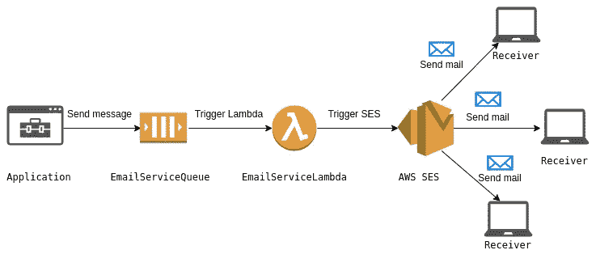

## 最佳实践

在开始设置和实现之前，让我们看一下在构建服务组件时应该遵循的一些最佳实践。我想强调的编程原则之一是 DRY，它代表不要重复自己。这可以用来维护一个干净的代码库，以便更好地维护，最重要的是避免错误。

想象一个场景，您在五个组件中实现了相同的代码功能。现在，当需要改变这个功能的行为时，您必须改变所有五个组件中的代码。如果您错过了至少一个组件，要么整个系统会崩溃，要么相同的功能在未更改的组件中会有不同的行为。有几种方法可以维护遵循 DRY 原则的代码库。下一节解释了电子邮件服务实现遵循 DRY 原则的几种方式。更多其他方式的细节可以在[这里](https://metova.com/dry-programming-practices/)找到。

1.  **抽象**——这样做的目的是将代码分解成可重用的部分，从而避免代码重复。换句话说，构建包含公共逻辑的模块或组件应该被隔离，以便在必要时重用。该服务的另一个重要因素是，实现的复杂性对使用该组件的开发人员来说是隐藏的。要利用这一点，只需将消息推送到队列的主体。关于这一点的进一步解释可以在文章的[这一](#e480)部分找到。
2.  [**分离关注点**](https://medium.com/machine-words/separation-of-concerns-1d735b703a60)——维护和分离各个层并确保它们是松散耦合的，这一点很重要。一个组件应该负责一个动作。这将使重构、错误处理和维护更加简单。在这种情况下，电子邮件组件单独负责发送电子邮件。多个组件可以使用这个电子邮件服务，而不必重复 SES 代码。事实上，这可以被认为是一个微服务，因为这是一个松散耦合的组件，可以独立部署，也可以单独维护和测试。如果要添加任何增强功能，甚至完全从 SES 转移到另一个服务，也不会有任何麻烦，因为应用程序中断的可能性非常低。

## 建立基础设施

基础设施可以通过多种方式建立。我使用了 AWS 管理控制台和 CFT 来创建资源。你可以在这里找到 CFT。

**使用 AWS 管理控制台**

在 SQS 创建一个队列。

**步骤 1** :从 AWS 服务中选择简单队列服务(SQS)，输入队列名称，并选择 FIFO 队列选项。

*   为此，我使用了一个 FIFO 队列，以确保消息发送和接收的顺序一致，并确保队列中不包含任何重复项。因为我们使用的是 FIFO 队列，所以名称必须以后缀*结尾。fifo* 。

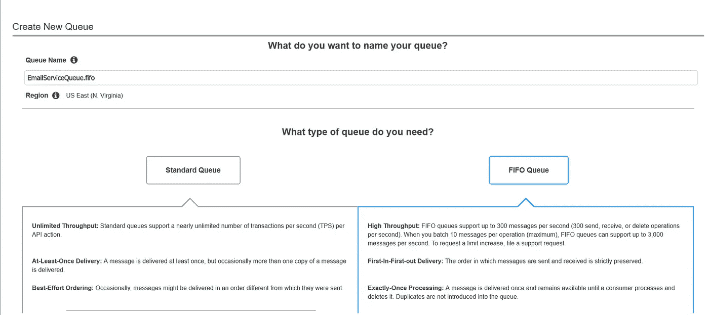

单击配置队列继续执行步骤 2。

**第二步**:设置队列属性。

*   **Visibility timeout** 是我们的应用程序从队列中处理和删除消息所花费的最长时间。
*   **基于内容的重复数据删除**可确保在重复数据删除间隔期间，SQS 会将内容相同的消息视为重复消息，并且仅提供该消息的一份副本。

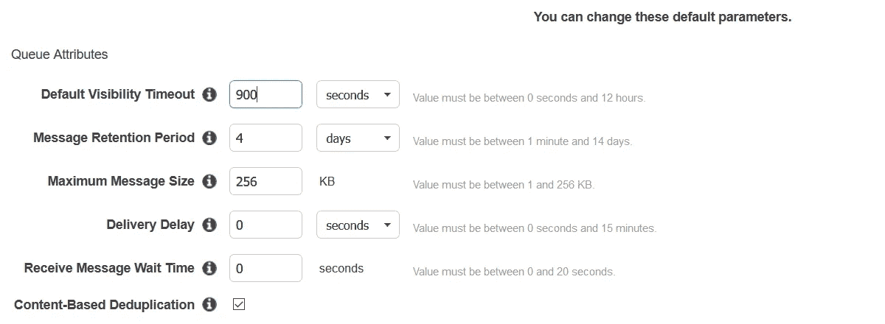

在创建队列之后，您将会看到这一点。

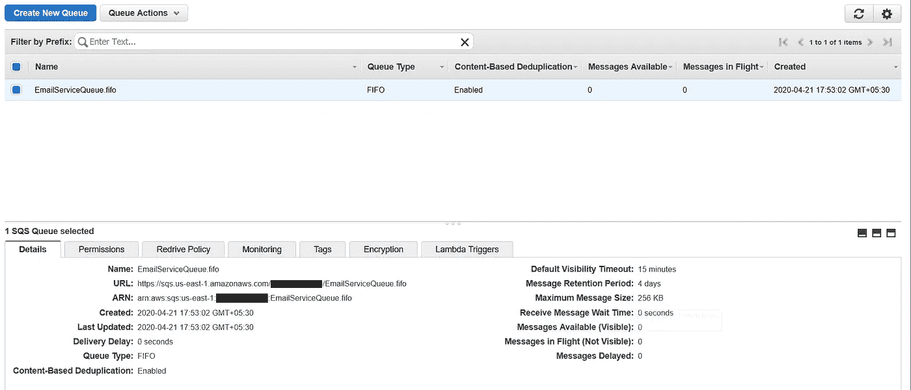

二。创建 IAM 角色。

大多数 AWS 服务需要角色来允许服务代表我们访问其他服务中的资源。这称为服务角色。更多细节可以在[这里](https://docs.aws.amazon.com/IAM/latest/UserGuide/id_roles_create_for-service.html)找到。

**步骤 1** :从 AWS 服务中选择身份和访问管理(IAM)。选择角色>创建角色。如下所示，从列表中选择 AWS 服务和 Lambda。

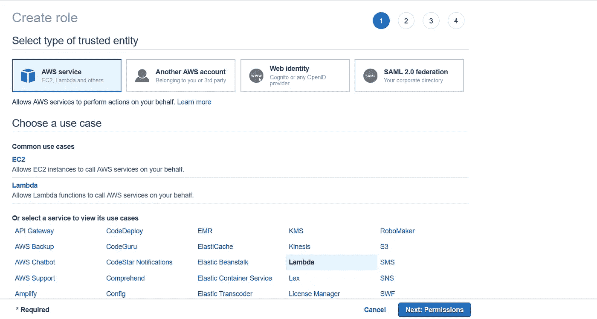

**第二步:**从策略列表中选择**awslambdabasiceexecutionrole**。

*   该策略允许 lambda 将日志上传到 [CloudWatch](https://aws.amazon.com/cloudwatch/) 。

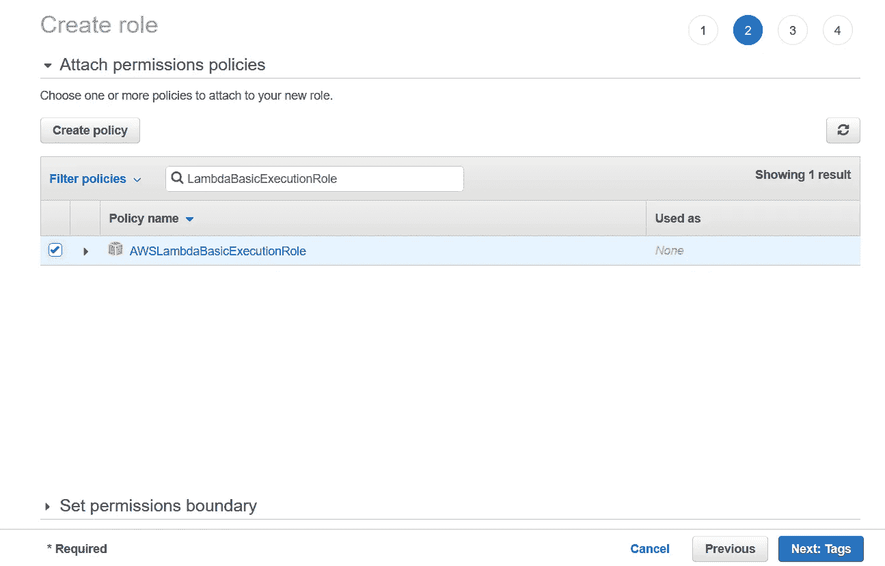

该角色需要访问其他 AWS 服务(如 SQS 和 SES)的权限。为此，必须创建另一个策略。

**步骤 3:** 创建另一个策略

1.  我首先附加了 SES 权限。

*   动作:我已经在“写”类别中提供了对下面显示的动作的访问。
*   资源:提供对所有资源的访问

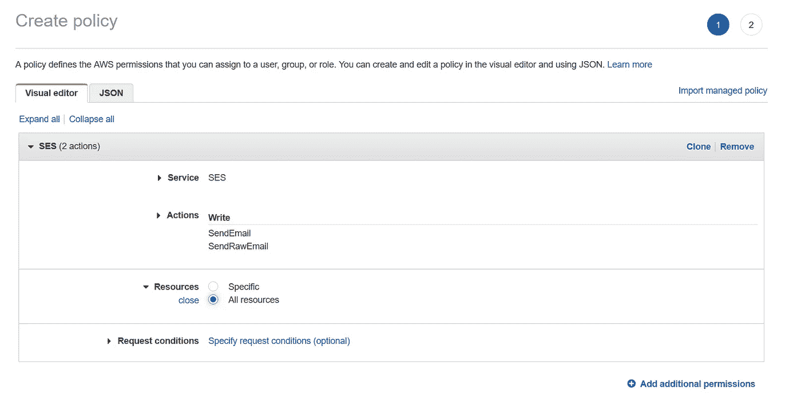

2.接下来，我们将附加 SQS 权限。

*   动作:我提供了对下面“读取”和“写入”类别中显示的动作的访问。
*   资源:提供我们创建的特定队列。从我们之前创建的队列中添加亚马逊资源名称( [ARN](https://docs.aws.amazon.com/general/latest/gr/aws-arns-and-namespaces.html) )。(创建队列后，可以在“详细信息”选项卡中找到)。

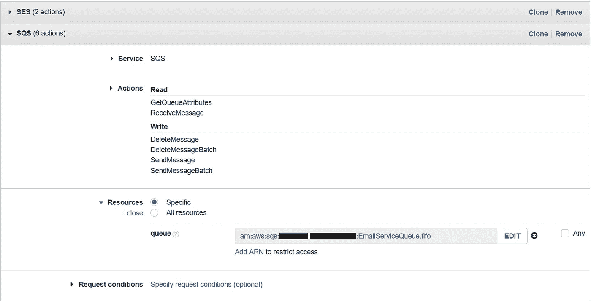

3.通过输入策略的名称和描述(非强制性)来查看和创建策略。

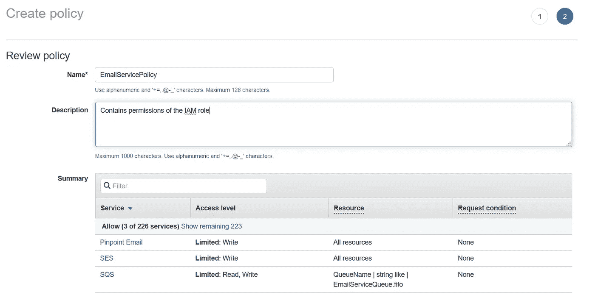

**第 4 步:**将我们在上面创建的策略附加到角色，输入名称和描述(不是强制的)并创建角色。

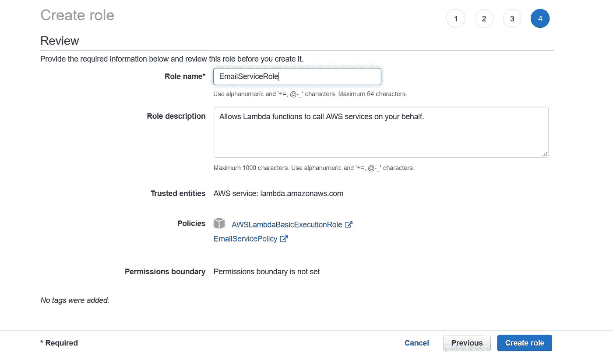

三。创建 Lambda 函数。

AWS 中的 Lambda 允许您在不提供或管理服务器的情况下运行代码。更多细节可以在[这里](https://aws.amazon.com/lambda/)找到。

**步骤 1** :从 AWS 服务>创建函数中选择 Lambda

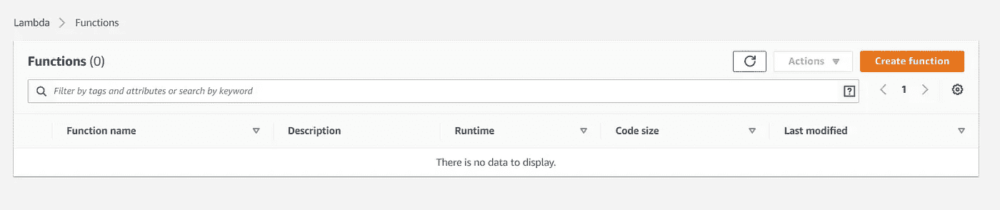

**第二步**:提供 Lambda 的基本信息。我已经使用 Node.js 12 x 作为运行时。附加我们之前创建的角色。

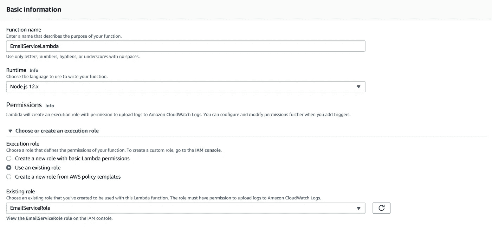

最后一步，我们需要配置队列来触发 lambda。导航到队列>配置 Lambda 函数的触发器>选择 Lambda 函数的名称>单击保存。

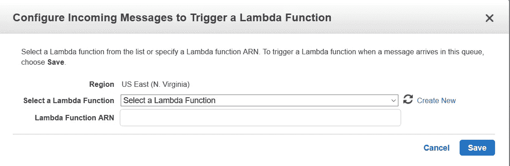

现在我们已经连接了我们所有的 AWS 资源。这整个过程也可以通过运行 CloudFormationTemplate 来完成。我在本文的最后加入了自动创建资源的 CFT。

## 履行

电子邮件可以通过三种方式发送。

1.  SES 控制台
2.  SES 简单邮件传输协议(SMTP)接口。
3.  SES API。

API 可以通过其他三种方式调用。我在这篇文章中使用了 AWS SDK。关于其他方式的更多细节可以在[这里](https://docs.aws.amazon.com/ses/latest/DeveloperGuide/send-email-api.html)找到。在本文中，我使用了 SDK 和 NodeJs。该实现需要以下格式的对象。

```
{
    "recipientAddress":"recipient@example.com",
    "subject":"Email subject",
    "body":"Email body"
}
```

为了向任何收件人地址发送电子邮件，应该将 AWS 帐户移出沙箱。默认情况下，每个账户都放在亚马逊沙箱中。AWS 对沙箱中的帐户应用某些限制。这里的文档[解释了如何将帐户移出沙箱的步骤。但是，要使用此服务，必须在 ses 上验证源、发送方和返回路径地址。](https://docs.aws.amazon.com/ses/latest/DeveloperGuide/request-production-access.html)

下面的代码需要一个如上所述的带有收件人地址、主题和正文的对象。根据收件人的电子邮件客户端，正文可以以三种格式发送。

*   如果电子邮件客户端可以解释 HTML，正文可以包含格式化文本和超链接。
*   如果电子邮件客户端是基于文本的，确保用文本替换 HTML。文本格式不应包含任何不可打印的字符。
*   如果邮件发给一群人，用两种格式发送相同的内容是有意义的。电子邮件客户端根据其功能决定显示哪种格式。

这个文件包含 Lambda 函数的 handler 方法。Lambda 函数中的这个方法处理事件。变量' *emailInput'* 包含作为 JSON 对象从队列发送的消息体。

要在本地测试该功能，请编辑 *email_lambda.js* ，如下所示。为收件人地址、主题和正文分配适当的值。

```
const sesClient = require(‘./EmailNotifications’);const emailInput = {
    "recipientAddress":"recipient@example.com",
    "subject":"Email subject",
    "body":"Email body"
}sesClient.sendEmail(emailInput);
```

运行下面给出的命令。

```
node fileName.js
```

压缩文件代码可以通过两种方式添加到 lambda 中。通过将 zip 文件直接上传到 lambda 函数，或者通过将 zip 文件移动到 S3 桶中，并将 [S3](https://aws.amazon.com/s3/) 桶的 URL 提供给 lambda 函数。

*   重要的是，zip 文件直接包含文件，而不是包含文件的文件夹

正确的格式

```
email_lambda.zip > email_lambda.js
                   EmailNotifications.js
                   package.json
                   package-lock.json
                   node_modules
```

1.  通过直接将 zip 文件上传到 lambda 函数。

处理程序名应该是代码中包含处理程序方法的文件的名称，后跟后缀*。处理器*。

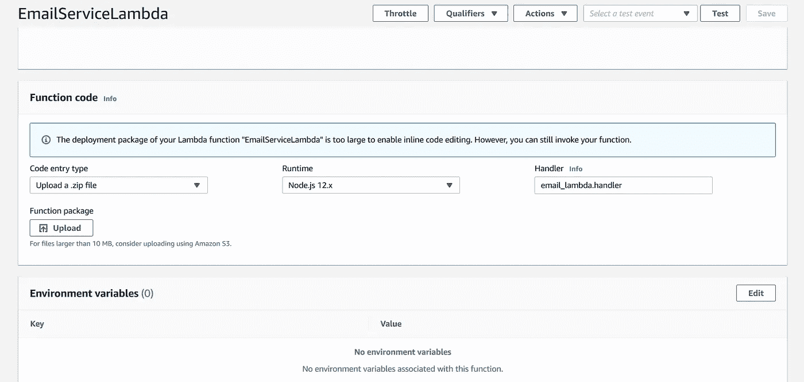

现在，要测试代码是否工作，导航到队列>队列操作>发送消息。添加以下内容作为消息正文。用有效的电子邮件地址替换收件人地址，并添加消息组 id。

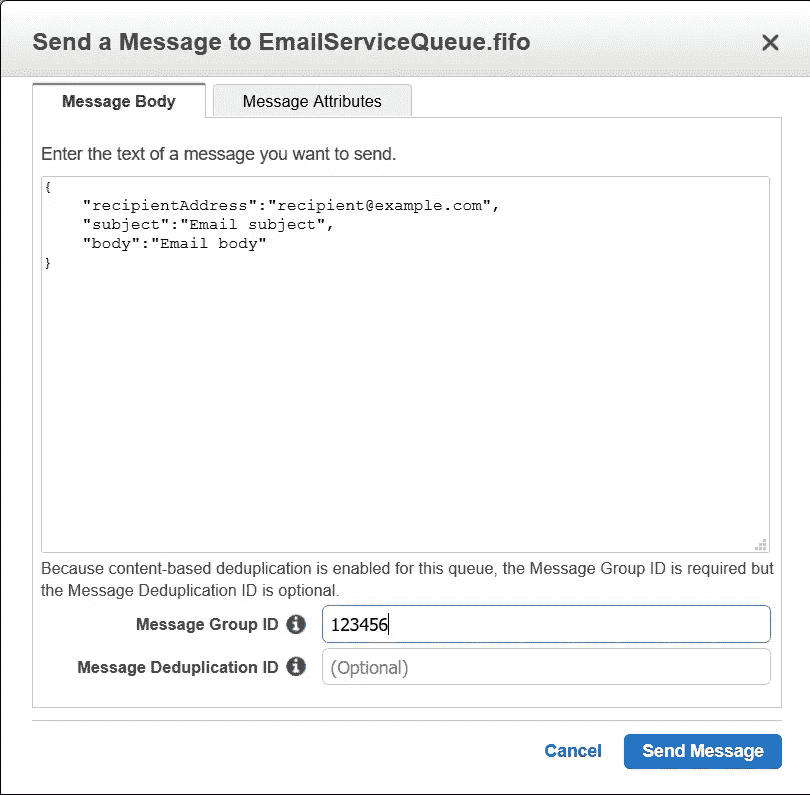

当你点击*发送消息，*你应该会收到一封邮件。

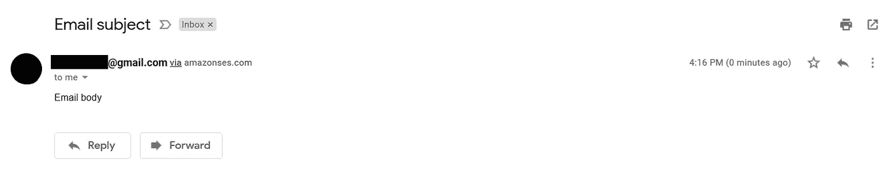

## CFT

在运行 CFT 之前，用您自己的替换以下内容。

*   S3 桶名
*   帐户 ID
*   地区