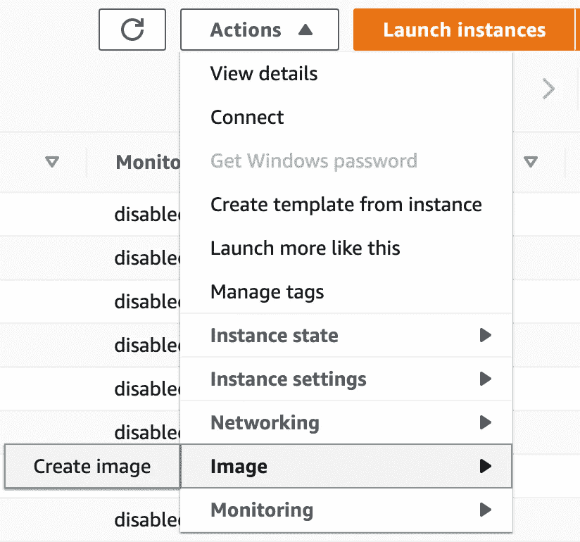

# 亚马逊 AWS EC2 自动缩放

> 原文：<https://levelup.gitconnected.com/implementing-and-testing-aws-ec2-auto-scaling-13db17be1161>

## 在 Amazon AWS 中实现和测试 EC2 自动缩放


使用云基础设施的好处之一是能够非常轻松地部署和扩展。 [AWS EC2](http://console.aws.amazon.com/ec2) 中的自动扩展允许您根据需求灵活配置基础设施。您还可以在 [AWS CloudFormation](https://docs.aws.amazon.com/AWSCloudFormation/latest/UserGuide/AWS_AutoScaling.html) 模板中包含自动缩放组。

本教程将带你了解自动缩放的配置，并测试它是否真的有效。虽然配置自动缩放是相当简单的，一旦你知道如何做，有一系列的步骤，你需要做的顺序，我会涵盖这些了。

# **步骤 1:** 构建一个 EC2 实例并创建一个 Amazon 机器映像(AMI)

我想为本教程创建一个非常快速的实例和图像。如果你要和我一起遵循这些步骤，这是你需要做的…

*   点击**启动实例**
*   在步骤 1:选择“ **Ubuntu Server 20.04 LTS (HVM)，SSD 卷类型**
*   在步骤 2:选择 **t2.micro** (自由层)
*   在步骤 3:确保“**自动分配公共 IP** ”设置为“**启用**
*   在步骤 3:在“**高级详细信息**”和“**用户数据**”下包含此预配脚本:

```
#!/bin/bashapt-get update -y
apt-get upgrade -y
apt-get install apache2 stress -y
systemctl start apache2
systemctl enable --now apache2
```

安装“压力”对本教程很重要，但通常你不会包括它。它将允许您对实例施加压力，以允许触发自动缩放。

虽然我自己没有用过，但我知道网飞有他们自己的压力测试工具，叫做“ [**混沌猴**](https://netflix.github.io/chaosmonkey/) ”。它看起来很有趣，值得一试。

*   步骤 4 和 5: **保留默认值**
*   步骤 6:使用相同的描述创建一个名为“ **acl-web-in** ”的安全组。保留默认的 SSH 规则以允许您访问您的实例，但是也添加一个 HTTP 规则。


*   第七步:**发射**
*   **选择一个现有的密钥对或创建一个密钥对**(您也可以访问)。

所以现在的问题是，一旦我们登录到我们的实例，我们如何知道我们的“**用户数据**”脚本何时结束运行？

```
ubuntu@ip-172-31-40-74:~$ ls -la
total 28
drwxr-xr-x 4 ubuntu ubuntu 4096 Oct 13 08:43 .
drwxr-xr-x 3 root   root   4096 Oct 13 08:42 ..
-rw-r--r-- 1 ubuntu ubuntu  220 Feb 25  2020 .bash_logout
-rw-r--r-- 1 ubuntu ubuntu 3771 Feb 25  2020 .bashrc
drwx------ 2 ubuntu ubuntu 4096 Oct 13 08:43 .cache
-rw-r--r-- 1 ubuntu ubuntu  807 Feb 25  2020 .profile
drwx------ 2 ubuntu ubuntu 4096 Oct 13 08:42 .ssh
-rw-r--r-- 1 ubuntu ubuntu    0 Oct 13 08:43 **.sudo_as_admin_successful**
```

那个“**。一旦预配脚本完成，将在“ **ubuntu** ”用户主目录中创建 sudo_as_admin_successful** ”隐藏文件。

我们还可以确认我们的 Apache web 服务器运行在 [http://localhost](http://localhost) 上，并提供默认的“【index.html】T2”页面，我们将使用该页面进行测试。

```
ubuntu@ip-172-31-40-74:~$ **curl -s http://localhost | head -n 3**<!DOCTYPE html PUBLIC "-//W3C//DTD XHTML 1.0 Transitional//EN" "http://www.w3.org/TR/xhtml1/DTD/xhtml1-transitional.dtd">
<html >
```

我们还可以通过在浏览器中打开“http:// **PUBLIC_IP** ”来测试我们的 web 服务器是否正常工作。通过在控制台中单击 AWS EC2 实例，可以找到“**公共 IPv4 地址**”。

# 步骤 2:创建一个 Amazon 机器映像(AMI)

一旦我们构建了模板 EC2 实例，我们现在需要为它创建一个图像。在 EC2 控制台中选择您的实例，点击" **Actions** "菜单，点击" **Image** "选项，然后" **Create image** "。



给你的图像起一个合适的名字(*我称我的为“Apache-we b-server”*)，然后点击“**创建图像**”。我们将使用这个 AMI 图像作为我们的缩放图像，但是如果您以前没有使用过这些图像，您也可以在“ **Launch instance** ”中使用它们。如果你正在启动一个新的实例，你会在左边看到“**我的朋友**”。如果您选择您的映像，您将能够使用 Apache 提供一个 Ubuntu 服务器实例。

# **第三步**:创建一个“启动模板”

实际上有两种方法可以做到这一点。您可以点击 EC2 控制台中实例下的“**启动模板**”菜单选项。然后点击**创建启动模板**。


或者您可以选择您将用作模板的实例，点击“**操作**”菜单，然后转到“**从实例**创建模板”。


这两种方式都会将您引导到同一个位置，即“**创建启动模板**”配置页面。


这里没有什么复杂的…只是给你的模板一个名称和描述，我喜欢添加一个“项目”标签，但这是可选的，并选择您在第 3 步创建的 AMI 图像。


我将实例类型保持为" **t2.micro** "，为我的"**密钥对**"赋值，选择" **EC2-Classic** "，并附加我的"**安全组**"以允许 HTTP 连接入站。我在本教程中使用了“ **EC2-Classic** ”，但是如果你想在 VPC 中配置它，这里就是你要做的地方。


可选设置，根据需要进行配置。

然后点击**创建启动模板**。

现在，您应该可以看到您的启动模板。


# 步骤 3:创建一个“目标群体”

在加载过程中灵活使用基础设施固然很好，但是仅仅添加额外的实例并不意味着它们会被使用。这就是负载平衡器发挥作用的地方。我不打算在这里讨论部署负载平衡器。重要的部分是负载平衡器将使用的目标组。当在自动扩展期间添加或删除实例时，我们希望将它们添加到目标组或从目标组中删除，负载平衡器将处理其余的工作。

点击 EC2 控制台中“**负载均衡**下的“**目标组**，然后点击“**创建目标组**”。


选择“**实例**作为“**目标类型**”，并将您的“**目标组命名为**。


您可以将这些选项保留为默认选项，然后单击“**下一步”**。


在“ **Register targets** ”页面上，您将看到我们正在运行的实例。您需要选择它，然后单击“**在**下面包含为待定”，将其添加到“**目标**”中。


您将看到我的实例是如何"**待定**并被注册为"**目标**"的。点击**创建目标组**。


# 步骤 4:创建一个“启动配置”

在 EC2 控制台中的“**自动缩放**下，您会看到一个名为“**启动配置**的菜单选项。点击它，然后点击“**创建启动配置**”。下面的所有选项应该是不言自明的。


完成后，点击“**创建启动配置**”。


# 步骤 5:创建“自动缩放组”

所有的构建模块都完成了，现在来配置我们的自动缩放组。在 EC2 控制台的“**自动缩放**菜单选项下，选择“**自动缩放组**”。然后点击**创建自动缩放组**。

在步骤 1 中，给你的自动缩放组命名，并选择“**启动模板**”。版本应该是“**默认(1)** ”如果你正在遵循这个教程。然后点击**下一个**。


在步骤 2 中，选择“**坚持启动模板**”。然后单击将在其中创建实例的 VPC 和子网。它应该位于部署模板实例的同一个 VPC 和子网中。


在第 3 步中，您需要"**启用负载平衡**，并选择"**应用负载平衡器或网络负载平衡器**"。这是我们添加之前创建的目标群体的重要部分。


在第 4 步中，您将在这里设置“**期望容量**”、“**最小容量**和“**最大容量**”。对于本教程，我将从 1 开始作为最小值，并允许在需要时创建一个额外的实例。

您还可以在这里配置您的扩展策略。您需要选择“**目标跟踪比例策略**”。有几个选项可以触发自动扩展，例如 CPU、吞吐量、请求等。我真的不认为 CPU 是一个在现实世界中使用的好指标。请求数量可能更合理，但是我在这里使用 CPU，因为我能够"**强调**"我们的实例并触发自动缩放。


在第 5 步，您可以使用 [AWS 简单通知服务](http://console.aws.amazon.com/sns) ( [SNS](http://console.aws.amazon.com/sns) )配置电子邮件通知。这是本教程的范围，但在现实世界中实现这一点是个好主意。


在步骤 6 中，您可以选择配置标签。我通常喜欢包含一个“**项目**”标签，它可以让你在计费时正确地识别它，但是我现在不包含它。


在第 7 步，您将检查您的所有配置，并单击“**创建自动缩放组**”。

# 第六步:尝试一下…

现在你可能会觉得这很奇怪…为什么一个实例已经启动了，而我们只要求它以 10%以上的 CPU 创建 1 并扩展到 2？在创建自动缩放组后的 5 分钟内，也不应该添加额外的实例。原因是我们在开始时为 AMI 创建的初始模板实例不包括在自动缩放管理中。AWS auto scaling 现在正在提供第一个受管实例。这意味着我们可以终止我们创建的第一个实例，因为它不在自动缩放范围内。就 AWS 自动缩放而言，这是我们最小的第一个实例。


如果我们看看我们的目标组，它将由我们提供的负载平衡器配置(不在本教程中)，我们可以看到新的自动伸缩实例被自动添加到目标组。我们还可以在那里看到我们的初始模板实例。因此，这证明了当一个实例被启动时，它将被自动添加到目标组或从目标组中删除。


如果我们看看我们的自动缩放组，有两个主要的兴趣点。“**实例**”显示它已经提供了 2 个实例中的 1 个。“**活动史**进一步证实了这一点。


你可能已经注意到在本教程的开始，我在我的 Ubuntu 实例中安装了“ **stress** ”。这将允许我加载实例来触发自动缩放。这是一个非常简单的工具。我只是运行“**压力-c 50** ”然后等待。**请注意，在自动缩放组创建后的前 5 分钟，它不会添加额外的实例**。

确实，在运行我的实例超过 50%的 CPU 5 分钟后，我能够确认自动伸缩启动了我的新实例。你会在下面看到“**实例**现在是 2。如果您在 5 分钟后停止在实例上运行“ **stress** ”，该实例将被删除。


# 迈克尔·惠特尔

*   ***如果你喜欢这个，请*** [***跟我上媒***](https://whittle.medium.com/)
*   ***更多有趣的文章，请*** [***关注我的刊物***](https://medium.com/trading-data-analysis)
*   ***有兴趣合作吗？*** [***我们来连线 LinkedIn 上的***](https://www.linkedin.com/in/miwhittle/)
*   ***支持我和其他媒体作者*** [***在此报名***](https://whittle.medium.com/membership)
*   ***请别忘了为文章鼓掌:)←谢谢！***